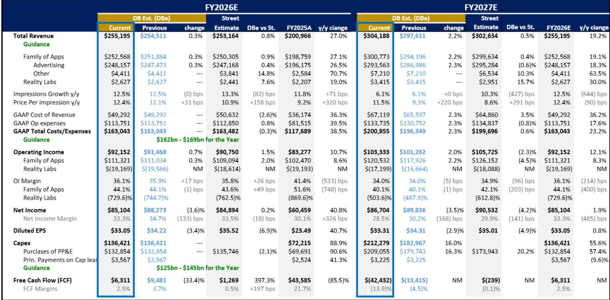
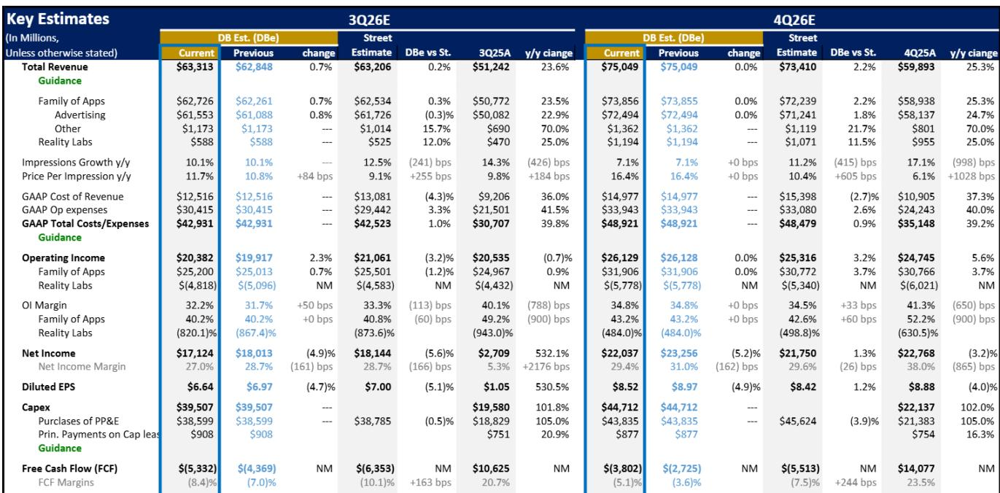
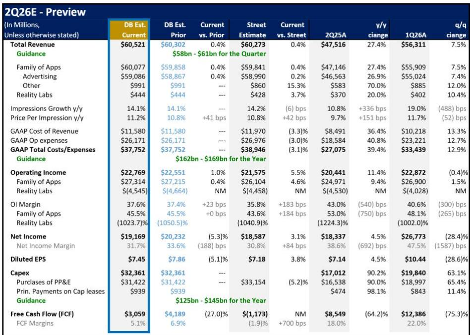

# Meta的广告引擎正为其AI布局提供资金——关键在于基础设施回报中有多少将直接体现

Meta Platforms即将发布下一份财报，这家公司目前具备大多数大型科技公司难以同时维持的几项特征：广告业务正在加速而非成熟，产品迭代周期明显快于一年前，以及多条新兴路径可将其最大资本投入直接而非间接变现。当前讨论的焦点并非Meta能否负担其AI基础设施——它完全可以——而是市场是否正确定价了该基础设施将产生自身回报流的程度，而非仅仅依赖广告的交叉收益。

该公司预计第二季度营收约为605亿美元，接近其580亿至610亿美元指引区间的上沿，同比增长约27%。市场预期已向610亿美元区间的高端移动，反映出广告投放检查持续显示广告支出回报率改善、转化表现增强，以及广告主越来越愿意将增量预算分配给Meta平台。宏观环境相比最初展望中的疲软也有所改善，尤其是与伊朗冲突相关的需求疲软——该冲突最初集中在中东，后来扩展到其他地区和垂直行业。情况从4月开始好转，这一复苏势头得以保持，GLP-1和肽类相关广告等新兴垂直领域表现强劲。

更广泛的含义很明确：Meta的核心业务正在产生足够的增长，为其不断扩大的AI雄心提供资金，同时保持可观的盈利能力。区分良好与卓越投资结果的关键在于，该公司能否将其基础设施布局转化为可直接产生收入的流，使读者能够独立于广告表现对其进行评估。

## 更好的模型和更快的产品周期正在将AI发布转变为持续催化剂而非孤立事件

Meta超级智能实验室在最初九到十个月里重建了公司的AI组织、训练基础设施和后训练堆栈，同时开发了Muse Spark模型。随着这一基础现已到位，发布节奏已从不定期的重大更新转变为更快、更可预测的节奏。Muse Spark奠定了新的模型基础。Muse Image扩展了图像生成能力，不过该产品后来已被撤回。Muse Spark 1.1增加了代理编码功能。下一代模型已在训练中，Meta的目标是在年底前重返前沿性能。

这种更快的迭代之所以重要，是因为它扩大了Meta AI能够同时应对的用例范围：广告创意生成、Meta AI助手能力、编码自动化、商业代理工作流、可穿戴设备集成以及消费者内容生成。每次发布都可能成为参与度增长、广告主表现改善或直接变现的催化剂。累积效应是，AI发布不再是需要市场重新评估公司技术地位的离散事件——它们正在成为运营日历中的常规特征。

这些模型已经以广告数据中可见的方式惠及Meta的核心业务。Meta使用大语言模型来理解和标记跨主题和语气的新内容，改善输入推荐系统的信号。随着时间的推移，该公司打算过渡到基于LLM的原生推荐架构，该架构可以生成标记并将其与自然内容和广告库存进行匹配。同样的扩展动态也适用于Gem、Andromeda和Meta的自适应广告排序模型，在这些模型中，更大的系统和更多的训练数据持续推动转化率提升。因此，投资回报首先在现有广告业务内部产生，然后扩展到新的收入流。

## 订阅服务创建了直接变现层，补充广告业务而不蚕食它

Meta正在其消费者应用、AI产品以及创作者和商业生态系统中推出订阅服务。当前框架包括针对Instagram、Facebook和WhatsApp的应用特定计划，每月7.99美元和19.99美元的AI订阅，以及每月14.99美元和49.99美元的创作者和商业产品。消费者功能包括个性化、增强反应和洞察，而AI计划则为推理和图像或视频生成等计算密集型活动提供更大容量。

短期收入影响相对于广告仍将温和，但战略意义与金额不成比例。订阅服务建立了针对AI使用的直接收入，并在更强大模型出现之前创建了容量管理机制。它们还表明，Meta可以通过经常性收入实现AI变现，此外还有通过广告定位、创意自动化和参与度流动的嵌入式收益。Meta AI的使用量在Muse Spark发布后加速增长，该公司现在正在为需要更深层功能或消耗更多标记的用户铺设商业轨道。

在适度的渗透率假设下，综合订阅组合可能在2027财年产生45亿至156亿美元的收入，以及约1.30至4.60美元的增量GAAP每股收益。这些仍然是情景估计而非预测变化，但它们说明了Meta庞大分发基础上的小转化率如何能创造可观的收入流。商业代理提供了另一个中期机会。Meta正在其消息平台上促进用户与商业AI之间每周约1000万次对话，自年初以来增长了十倍。这些产品目前仍免费使用，但该公司可能会建立一个长期变现框架，可能结合订阅和基于使用量的定价。这主要是一个2027年的机会，并有可能将付费商业消息扩展到此前因劳动力成本而限制采用的市场。

## 云基础设施业务将改变读者评估资本支出轨迹的方式

报道显示，Meta正在考虑一项云基础设施业务，该业务可能提供原始计算能力和AI模型的托管访问。类似Bedrock的产品将允许开发者通过API使用Meta托管的模型，而类似新云的产品则可以直接变现过剩的计算能力。据报道，Anthropic正在与Meta进行早期谈判，以租赁计算能力，潜在价值约为100亿美元。虽然尚未正式宣布云销售，但其战略逻辑日益清晰。

Meta可以在变现非战略性容量的同时，保持其前沿模型雄心。该公司可以将其最新的Rubin时代基础设施保留用于内部训练，同时出售对较旧Nvidia系统、推理集群或暂时未充分利用容量的访问。第三方市场仍然供应受限，这为Meta提供了以有吸引力的价格获得利用率保障的潜力。这一动态最好地体现在Alphabet的公告中，该公司表示将继续利用第三方桥接容量，这表明即使在最大的超大规模云服务商中，对外部计算的需求仍然强劲。

原始容量销售将降低搁浅资产风险，并提供高增量利润，因为相关的资本支出、折旧、租赁、电力和基础设施费用大部分已在读者预测中。托管模型API层将更具战略价值，创造基于使用量的经常性收入，并增加Meta专有模型的价值。Meta需要建立企业销售、支持、计费、安全和开发者工具，这表明最初将专注于双边计算合同，然后扩展到更广泛的平台。

中期机会可能达到150亿至360亿美元的年化第三方收入，在纳入报道的2027年14吉瓦容量后，基准情况约为240亿美元。这些情景取决于可用容量、利用率、定价和客户需求，并未包含在当前估计中。然而，它们说明了为什么更大的基础设施布局可以在资本需求之外增加收入选择。

## 2027年资本支出数字看似令人生畏，但净经济负担可能低于原始数字所暗示的水平

报道称Meta可能从2026年约7吉瓦容量扩展到2027年的14吉瓦，这已将市场预期推至2000亿至2500亿美元区间。对7吉瓦增量容量应用简单的每吉瓦350亿美元假设，将产生约2450亿美元的投资。这个数字可能夸大了Meta将直接资助的金额。

Hyperion可能通过合作伙伴资助的结构贡献约1.0至1.5吉瓦，将直接资助的增量容量减少到约5.5吉瓦。Meta内部的Iris和MTIA路线图也可能降低每单位计算能力的混合成本。服务器占数据中心成本的大部分，将选定的推理和推荐工作负载从成本较高的商用GPU转移，应能随着时间的推移改善经济效益。在混合内部芯片和商用GPU框架下，每吉瓦成本可能接近约300亿美元，这意味着5.5吉瓦的直接资助投资约为1650亿美元。

这些计算存在相当大的不确定性，但含义很明确：2027年资本支出可能会大幅上升，尽管经济负担可能低于7吉瓦的原始计算。云收入流将通过为部分资产基础附加直接收入，进一步改善净回报状况。对读者而言，关键问题是市场是否会继续仅通过广告收益的视角来评估基础设施投资，还是将开始对直接变现选择权进行定价。

## 评估Meta AI回报概况的决策框架

对于试图评估Meta当前估值是否充分反映公司轨迹的读者，分析可以围绕三个不同的回报渠道进行构建，每个渠道具有不同的可见性、时间跨度和市场定价特征。

第一个渠道是广告回报，它已经可见且可衡量。改善的转化表现、不断增长的广告主ROI以及持续的参与度增长，正在产生收入加速，为当前的资本支出计划提供资金。市场对这一渠道理解充分，这也是Meta尽管增长更优，但交易价格仍比整体市场略有折让的主要原因。该渠道的风险不在于回报未能实现——它们已经在实现——而在于市场将其视为周期性而非结构性。

第二个渠道是订阅和商业代理回报，它处于早期部署阶段，可见性中等。在适度的渗透率假设下，订阅组合有潜力在2027财年产生45亿至156亿美元的收入。商业代理的使用量正在快速增长，但尚未建立变现框架。这一渠道尚未被纳入共识预期，但随着Meta推出分层计划并测试定价结构，其可见性正在增加。风险在于执行和采用，而非战略意图。

第三个渠道是基础设施回报，它具有最大的潜在收入机会，但可见性最低。销售原始计算和托管模型访问的云业务可能产生150亿至360亿美元的年化收入，具体取决于容量、利用率和定价。这一渠道未被计入当前估计，并且仍取决于Meta是否愿意建立企业销售、支持和安全基础设施。风险在于Meta选择不追求这条路径，或者执行挑战将收入流推迟到投资视野之外。

因此，决策框架取决于读者认为哪些回报渠道会实现，以及在什么时间范围内。仅广告渠道就足以证明当前估值的合理性。订阅渠道增加了上行选择权。基础设施渠道如果实现，将从根本上改变公司历史上最大资本承诺的回报概况。

*仅供参考。部分内容可能基于源材料通过AI辅助生成、翻译、总结或编辑，可能包含遗漏或错误。请独立核实。这不是投资、法律、税务、会计或其他专业建议。*

仅供参考。部分内容可能基于源材料通过AI辅助生成、翻译、总结或编辑，可能包含遗漏或错误。请独立核实。这不是投资、法律、税务、会计或其他专业建议。

