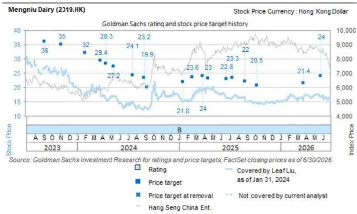

# GS：研究主题与行业变化观察

一份来自GS的报告指出，现代牧业发布的正面盈利预警及其对中国圣牧的收购要约，可能为蒙牛带来积极信号。现代牧业预计2026年上半年净利润不低于4300万元人民币，而去年同期为亏损9.72亿元。这一扭亏主要源于奶牛公允价值损失减少、原奶毛利率稳定以及成本持续优化。基于现代牧业约49%的持股比例，该净利润可能为蒙牛贡献约2100万元的联营公司收益，已接近GS对蒙牛2026年全年2500万元联营收益的预测。

报告同时关注到现代牧业对中国圣牧的强制性现金要约已全面生效。截至7月21日，现代牧业持有中国圣牧约81.17%的股份。一旦交易完成，蒙牛通过其持有的现代牧业股份，对中国圣牧的间接敞口将进一步扩大。

## 1. 现代牧业盈利改善驱动因素明确

现代牧业的盈利预警显示，2026年上半年净利润不低于4300万元，较去年同期9.72亿元的亏损出现显著反转。报告将这一改善归因于三个具体因素：淘汰牛数量下降及淘汰牛售价上升带来的奶牛公允价值损失减少；原奶毛利率保持稳定且毛利额提升；以及持续的降本增效措施。这些因素共同作用，使现代牧业在行业周期中率先实现盈利修复。

> **KC评论：** 现代牧业的扭亏并非依赖单一因素，而是成本端（淘汰牛损失减少）与运营端（毛利率稳定、效率提升）同时改善的结果。这种双轮驱动模式比单纯依赖奶价回升更具可持续性。

## 2. 收购中国圣牧将扩大蒙牛优质原奶资源敞口

现代牧业对中国圣牧的强制性现金要约已于7月20日全面生效，要约期持续至8月3日。截至7月21日，现代牧业已持有中国圣牧约81.17%的股份，其中包括蒙牛此前持有的29.99%股份。中国圣牧作为中国领先的有机乳业公司，拥有34个牧场、约14.4万头奶牛，日均鲜奶产量约2169吨。报告认为，这一收购将为现代牧业带来运营协同效应，并使蒙牛通过其约49%的持股比例，获得更大的优质原奶资源基础。

## 3. 联营收益贡献已接近全年预期

GS测算显示，现代牧业2026年上半年4300万元以上的净利润，可能为蒙牛带来约2100万元的联营公司收益。这一数字已接近GS对蒙牛2026年全年2500万元联营收益的预测。报告此前对蒙牛2026年上半年联营亏损的预期为1.69亿元，这意味着现代牧业的盈利改善可能使蒙牛联营收益出现超预期表现。这一变化对蒙牛整体盈利结构的影响值得持续跟踪。

## 4. 行业周期拐点信号与竞争格局变化

现代牧业的盈利预警并非孤立事件，它可能反映了中国原奶行业供需关系的边际改善。淘汰牛数量下降和售价上升，暗示行业产能出清正在加速；原奶毛利率稳定则表明下游需求对上游价格的支撑正在形成。对于蒙牛这样的下游乳企而言，上游原奶资源的整合与成本优化，将直接影响其产品定价能力和利润空间。报告认为，现代牧业对中国圣牧的收购，可能进一步巩固蒙牛在优质原奶资源上的竞争优势。

For informational purposes only. Portions may be generated,translated,summarized,or edited with AI assistance based on source materials and may contain omissions or errors. Please verify independently. This is not investment,legal,tax,accounting,or other professional advice.

For informational purposes only. Portions may be generated,translated,summarized,or edited with AI assistance based on source materials and may contain omissions or errors. Please verify independently. This is not investment,legal,tax,accounting,or other professional advice.

