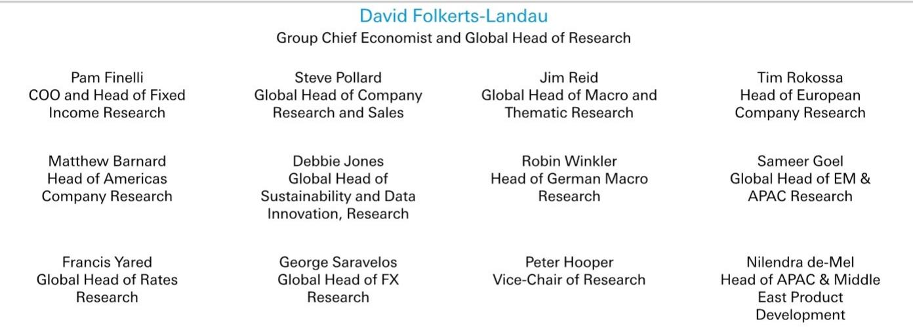
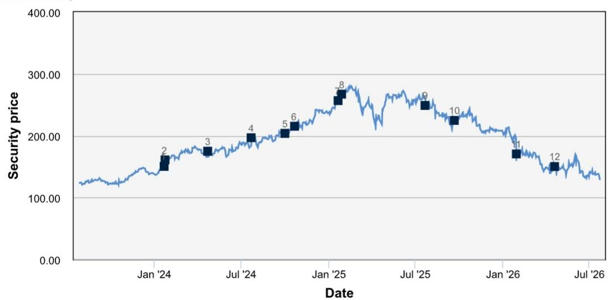
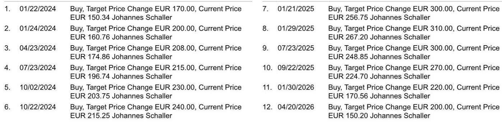

# SAP's Current Cloud Backlog Is Signaling a 2027 Growth Acceleration That the Market Is Underpricing

SAP reported a second-quarter 2026 current cloud backlog (CCB) growth of 26% year-on-year in constant currency, exceeding the analyst estimate of 25% and the Bloomberg consensus of 24%. This is not merely a quarterly beat. The CCB, which represents contracted but not yet recognized cloud revenue, is now growing faster than both SAP's reported cloud revenue and the midpoint of its own fiscal year 2026 constant-currency cloud growth guidance. That gap is the single most important leading indicator in the company's financial profile today.

The implication is structural, not cyclical. When a company's backlog growth outpaces its revenue growth and its near-term guidance, it signals that the pipeline of future revenue is building at a rate that current reported results do not yet capture. For SAP, this means the group's constant-currency revenue growth should accelerate from approximately 10.5% this year to roughly 12% in fiscal year 2027. The market, which has driven SAP's shares down 49% over the past twelve months against a rising European index, appears to have priced in an AI disruption thesis that the operating data does not support.

The timing matters. SAP has just launched its most ambitious AI product cycle at the Sapphire conference, and early customer response has been strong. Beta programs for the new Autonomous Suite platform and Joule Work were oversubscribed, with close to 50 assistants and over 400 autonomous suite agents scheduled for release by year-end. The company reports no impact from AI on the pricing of its traditional SaaS business, and its pricing power remains robust. The disconnect between the narrative of disruption and the evidence of acceleration creates a strategic entry point for observers who are willing to look past near-term noise.

## The CCB-to-Revenue Gap Provides a Quantifiable Lead Indicator for a 2027 Inflection

The current cloud backlog is the most reliable predictor of SAP's near-term cloud revenue trajectory because it captures signed contracts that have not yet converted to recognized revenue. In Q2 2026, CCB grew 26% year-on-year in constant currency, while cloud revenue grew 24% and the company's fiscal year 2026 cloud revenue guidance midpoint implies roughly 24% growth. This means the backlog is expanding faster than the revenue it will eventually produce, and faster than management's own expectations for the current year.

The math is straightforward. If CCB growth remains at or near 26% through the remainder of fiscal 2026, the revenue that will be recognized from that backlog in fiscal 2027 will be meaningfully higher than the revenue being recognized from the current backlog today. The report explicitly notes that CCB is expected to see a slight decline throughout fiscal 2026 but significantly less than the roughly 4 percentage point decline seen in fiscal 2025, implying an exit rate around 23% for this year. Even at that lower exit rate, the roll-forward effect on 2027 revenue is substantial.

This pattern is not hypothetical. During SAP's cloud transition several years ago, a re-acceleration in group growth marked the turning point for investor sentiment and the stock. The same dynamic is now in play, but the market is treating it as if the opposite is true. The 7% free cash flow yield at current valuation levels, combined with a likely growth acceleration next year, creates a setup where the margin of safety is unusually wide for a company of SAP's quality.

## Strategic Investments in AI Are Temporarily Suppressing Margins but Strengthening the Competitive Moat

Operating profit in Q2 came in slightly below expectations for the first time in several quarters, and management marginally lowered its full-year profitability outlook. The cause is not operational weakness but deliberate investment. SAP is spending on headcount, research and development including AI token costs for model usage, and sales and marketing for the new AI offering launched at Sapphire. The acquisitions of Reltio, Dremio, and Prior Labs, all of which are currently in investment mode, added more than 100 million euros in dilution to the operating profit guidance.

These investments should be evaluated as strategic capital allocation, not as cost overruns. SAP is building an AI product stack that includes the Autonomous Suite, Joule Work, and ERP migration assistants that promise 30% lower costs and faster time to value for customers. The company is also transforming its own operations into an autonomous enterprise, with an internal AI factory staffed by 3,000 consultants, agent delivery cycles under three weeks, and a 30% increase in developer productivity. The goal is not merely to offer AI products but to become the reference case for them.

The profitability trajectory is expected to improve in the second half of fiscal 2026 as the focus returns to operational efficiency across hiring, travel costs, and AI token usage, where strict monitoring tools are already in place. Management has also stated that headcount, which grew slightly to 112,000 from 109,000 a year ago, will not increase further in the next twelve months as AI-driven productivity gains of an average 30% begin to compound. The 80% to 90% cost growth as a percentage of revenue growth framework that SAP previously provided remains intact. The margin compression is a timing issue, not a structural deterioration.

## The Partner Ecosystem Transformation Is Creating a Scalable Go-to-Machine That Reduces Execution Risk

A less visible but equally important development is the transformation of SAP's go-to-market model. During the Q2 conference call, management noted that indirect channel order entry significantly outpaced direct channels, reflecting the effects of a two-year transformation of the partner ecosystem. This is not a minor operational detail. It means SAP is building a distribution engine that can scale without proportional increases in sales headcount, which directly supports the margin recovery thesis.

The partner ecosystem matters for the AI product cycle specifically. The new Autonomous Suite and Joule Work offerings are complex, multi-agent platforms that require implementation support, customization, and ongoing management. If SAP had to rely solely on its direct sales force and consulting arm to deliver these products, the cost of customer acquisition and deployment would be substantially higher. The partner channel absorbs that cost while extending SAP's reach into accounts that would otherwise be uneconomical to serve directly.

The early results support this logic. Key RISE wins announced during the quarter included Shell, MS, Samsonite, Vonovia, and Eli Lilly. These are large, complex, global accounts, exactly the type of customer where partner-led implementation is most valuable. The fact that the partner channel is outperforming the direct channel on order entry suggests that the ecosystem is not just participating but leading the growth.

## A Decision Framework for Evaluating SAP at Current Valuation Levels

For institutional observers considering a position in SAP, the current environment presents a classic tension between price and narrative. The stock has declined 49% over the past twelve months, the free cash flow yield stands at 7%, and the forward price-to-earnings multiple on 2027 estimated earnings is roughly 16 times. The narrative driving the sell-off is that AI will disrupt SAP's business model by enabling customers to bypass traditional ERP systems or by commoditizing the software layer that SAP controls.

The evidence from Q2 2026 does not support that narrative. The CCB is accelerating. Cloud revenue growth remains robust at 24%. The new AI products are generating oversubscribed beta programs and strong customer interest. Pricing power in the traditional SaaS business is intact. The acquisitions, while dilutive in the short term, are adding capabilities in data management and AI that strengthen the platform. The partner ecosystem is scaling. The internal AI transformation is improving productivity.

The framework for a decision should rest on three questions. First, does the CCB trajectory support a 2027 growth acceleration? The answer is yes, based on the gap between CCB growth and current revenue growth. Second, are the margin pressures temporary and strategic, or permanent and structural? The answer is temporary, supported by management's stated headcount plans, the cost growth framework, and the expected improvement in H2 2026. Third, is the AI disruption thesis visible in the operating data? The answer is no, as evidenced by the absence of pricing pressure, the strong customer uptake of AI products, and the lack of any negative inflection in cloud growth rates.

When the data contradicts the narrative, the disciplined response is to trust the data. SAP's current valuation reflects a worst-case scenario that the company's own leading indicators are actively disproving. The 2027 acceleration is not a hope. It is a mathematical consequence of the backlog that is already booked.

*For informational purposes only. Portions may be generated, translated, summarized, or edited with AI assistance based on source materials and may contain omissions or errors. Please verify independently. This is not investment, legal, tax, accounting, or other professional advice.*

For informational purposes only. Portions may be generated, translated, summarized, or edited with AI assistance based on source materials and may contain omissions or errors. Please verify independently. This is not investment, legal, tax, accounting, or other professional advice.

