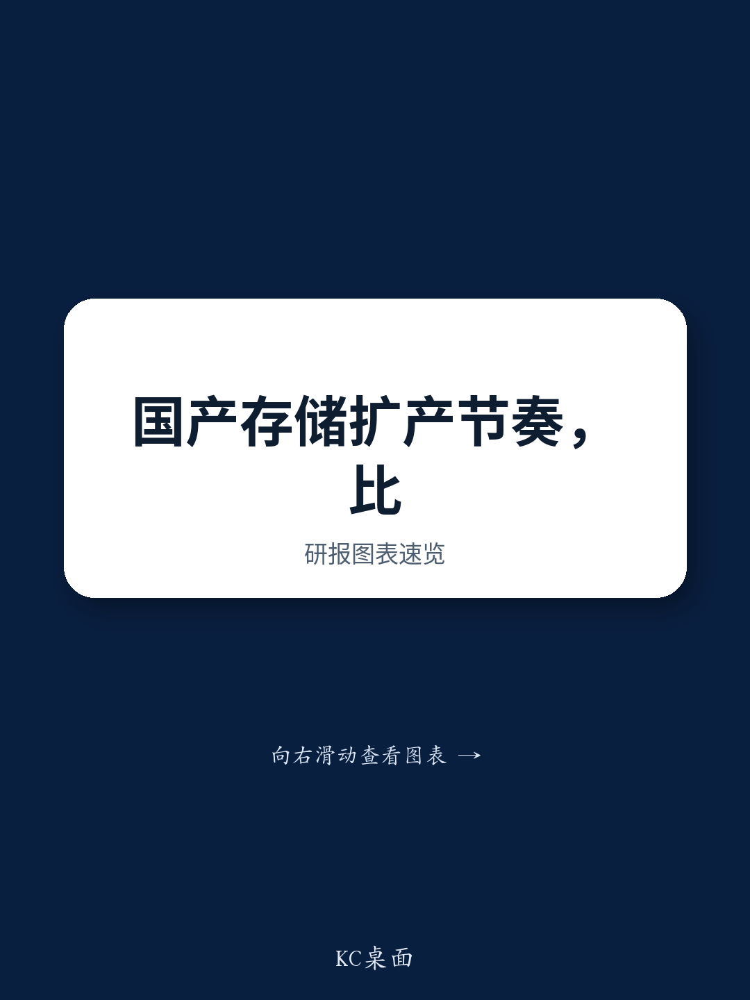

# 中国DRAM产能扩张重塑半导体设备市场——本土供应商成为主要受益者

中国本土DRAM产能预计到2030年将实现弹性较高以上增长，这对半导体资本设备需求的影响远不止于简单的数量增长。根据近期一家全球投行组织的专家电话会议，合肥、上海和北京多个制造基地正在进行的扩张——预计全部在2028年前实现全面运营——并非现有晶圆厂的简单复制。2028年后上线的一个大型基地将维持这一增长轨迹。本轮周期与此前建设周期在结构上的不同之处在于，本土半导体工艺设备供应商的采用正在加速。这些供应商不再仅仅是非关键层的次要选择，而是正在成为整个工厂的主要工具供应商，光刻等高端设备除外。对于观察者而言，这将中国半导体设备主题从周期性产能故事转变为结构性市场份额故事。问题不在于中国存储产出是否会增长，而在于设备供应链将如何在此过程中重新配置。

时机至关重要。存储行业正从一段谨慎的资本支出时期中复苏，人工智能驱动的需求激增正在创造支持持续投入的定价环境。中国的DRAM供应商并非简单追赶——他们在设备受限的情况下跨越工艺代际，这种情况对于现有厂商来说是不可想象的。专家电话会议透露，尽管无法获得极紫外光刻设备，本土DRAM领军企业仍计划在2026年前实现HBM3和HBM3E的生产。这不是一个微小的调整；它需要根本不同的制造方法，包括更深度依赖深紫外多重图形化技术以及探索3D DRAM架构。这对设备的影响是深远的。本土半导体设备供应商被要求提供全球同行用数十年开发的工艺解决方案，而时间被压缩到几年内。

这一论点并非推测。专家确认，尽管良率较低，本土DRAM供应商的定价已与全球级供应商持平。这表明，当调整良率后，成本结构仍能支持有竞争力的定价，因为设备成本基础较低——这是本土半导体设备采用的直接结果。随着良率随工艺成熟度提升，成本优势将进一步扩大。中国存储自给自足的战略要务不再仅仅是关于产量；而是关于构建一个能够支撑独立技术迁移的并行设备生态系统。

## 产能扩张并非线性——而是多站点、多阶段，为本土半导体设备创造持续需求

专家对产能扩张的描述揭示了一种深思熟虑的分阶段策略，避免了早期建设中的单点故障风险。合肥、上海和北京的三个站点计划在2028年前达到全面运营状态，每个站点都有不同的工艺重点。这种地理和时间上的多样化意味着设备采购不是一次性事件，而是跨越多年的滚动订单浪潮。对于本土半导体设备供应商而言，这转化为多年收入可见性，这在半导体资本设备行业中是罕见的，因为该行业的订单周期通常不规律且与单个晶圆厂投产相关。

更重要的是专家的观察：其中一些新工厂将本土半导体设备作为主要工具集，而不仅仅是补充。这是一个结构性转变。在之前的产能增加中，本土设备用于非关键或要求较低的层，而全球供应商提供核心工艺工具。当前周期不同：对于某些工厂，默认假设是本土采购，只有在没有国内替代品的设备（如光刻）时才例外。这为中微公司、北方华创、盛美上海和珂玛科技等公司创造了可寻址市场的阶跃变化。专家的观点暗示，在这些新工厂中，本土半导体设备在某些工艺类别中的份额可能超过50%，而早期世代可能只有10-20%。

预计在2028年后贡献产能的大型基地增加了另一层意义。这表明扩张周期并非前期集中；设备需求曲线延伸至下一个十年。对于观察者而言，关键指标不仅仅是总产能数字，而是设备采购的构成。在产能弹性较高的情况下，本土半导体设备份额每增加一个百分点，对国内供应商来说都代表着不成比例的收入机会，因为基础在扩大，份额同时在上升。

## 设备受限下的产品迁移推动创新，使具备工艺集成能力的本土半导体设备受益

专家确认，本土DRAM领军企业计划在2026年前实现HBM3和HBM3E的生产，这一目标即使在一年前看来也显得激进。实现这一目标的路径受到缺乏极紫外光刻设备的限制，全球领先企业使用该设备用于先进DRAM节点的关键层。专家评估认为，本土供应商将需要依赖深紫外光刻加多重图形化技术——并可能在2027年前采用3D DRAM架构——这不是对次优方法的描述。这是对一种根本不同的制造范式的描述，这种范式创造了新的设备需求。

对于本土半导体设备供应商而言，这是一个超越销售更多工具的机会。这种限制迫使设备供应商和存储制造商之间更紧密地合作，以开发补偿缺乏极紫外光刻设备的工艺解决方案。这加深了设备设计与工艺开发之间的集成，创造了保护本土供应商免受未来竞争的转换成本。一旦本土半导体设备供应商为关键DRAM层共同开发了深紫外多重图形化解决方案，更换该供应商将需要重新认证整个工艺——这是一个多年的工程。

2027年的3D DRAM开发时间线尤为重要。3D DRAM代表了与传统平面缩放的背离，需要全新的垂直沟道刻蚀、沉积和金属化设备集。全球设备领导者仍在开发这些解决方案。如果本土DRAM供应商和本土半导体设备供应商能够在3D DRAM生产中取得先发优势，即使仅在小规模试产阶段，也将使中国设备生态系统成为下一代存储技术的潜在领导者，而非永远的追随者。

专家观察到本土DRAM产品在速度上仍落后于全球同行，这是对当前局限性的现实承认。但差距正在缩小，改进速度正在加快。专家指出，与去年相比，产品开发进展显著，尽管相对性能水平仍落后。对于设备供应商而言，相关指标不是最终芯片是否同类最佳，而是工艺是否需要他们的工具。只要本土DRAM供应商继续向更先进节点迁移——即使这些节点比全球前沿落后一到两代——他们将需要每片晶圆更多的设备，并且需要从本土供应商处获得。

## 存储定价稳定为持续资本支出创造有利环境

专家对存储定价的看法为产能扩张论点提供了财务基础。尽管良率较低，本土DRAM供应商的定价已与全球级供应商持平。这是一个关键数据点，因为它意味着本土供应商每片晶圆的收入与现有企业相当，尽管由于良率损失，他们的每颗合格芯片成本更高。这一差距不足以削弱盈利能力，随着良率改善，利润率轨迹是积极的。

在近期定价方面，专家预计2026年第三和第四季度的涨幅将小于上半年，理由是智能手机品牌制造商的抵制。这是存储周期中的典型模式——价格在最初飙升后随着下游客户抵制而趋于温和。但专家对2027年的展望更为重要：来自中国和海外市场的人工智能需求仍然强劲，足以支持存储价格继续上涨。这表明当前周期具有超越消费电子典型替换周期的结构性需求驱动因素。

专家还指出，考虑到人工智能需求的强劲，全球级供应商短期内不太可能将高带宽存储器产能转回传统DRAM。这对中国半导体设备论点至关重要。如果全球供应商锁定高带宽存储器产能，将限制全球部门的传统DRAM供应，为中国本土供应商创造在不引发价格战的情况下获取市场份额的窗口。专家观察到存储供应商与客户之间更多长期合同的出现，进一步支持价格稳定。对于设备供应商而言，稳定的定价意味着稳定的晶圆厂利用率，这意味着可预测的产能增加计划。

定价持平、人工智能驱动的需求以及全球供应商有限的产能重新分配相结合，创造了一个环境，使中国DRAM制造商能够积极投入而无需担心利润率压缩。这正是资本支出最不可能被削减的条件。因此，专家对到2030年本土DRAM产能扩张的积极看法基于理性的经济评估，而不仅仅是政策驱动的雄心。

## 观察者的决策框架：如何评估存储周期中的中国半导体设备敞口

专家电话会议为结构化的研究框架提供了素材。观察者应从三个维度评估中国半导体设备公司：对存储特定工艺步骤的敞口、在受限工具类别中替代全球供应商的能力，以及来自已承诺产能扩张的收入可见性。

首先，存储特定工艺步骤包括刻蚀、沉积和清洗——所有本土供应商已取得显著进展的领域。专家观察到一些工厂将本土半导体设备作为非光刻步骤的主要工具，表明这些类别已跨越采用门槛。在介电刻蚀、金属沉积和单片清洗方面具有强大地位的公司可能受益更大。关键指标不仅是总收入，而是与存储客户相关的收入百分比，以及其中与新晶圆厂投产而非替换或维护相关的百分比。

其次，在受限类别中替代全球供应商是最高确信度的子主题。专家明确指出，光刻仍是全球供应商的领域，但对于所有其他工具类别，本土供应商正在获得份额。问题在于哪些本土供应商具备工艺集成能力，能够在关键层（而非仅非关键层）替代全球工具。已证明能够为DRAM单元区域工艺（晶圆厂中最苛刻的部分）认证工具的公司享有溢价。专家提到用于3D DRAM开发的创新制造工艺，表明现在投资于下一代能力的公司将处于2027年产品周期的最佳位置。

第三，收入可见性取决于已承诺产能扩张的时间安排和规模。计划在2028年前全面运营的三个站点提供了具体的采购时间线。观察者应将每家半导体设备公司的订单积压与这些里程碑对应起来。2028年后的大型基地增加了更长期的选项，但不应用作近期估值的主要基础。专家认为到2030年年度产能可能弹性较高以上的观点提供了规划假设，而非保证。最可靠的收入流来自已开工建设或已宣布明确时间表的晶圆厂。

该框架还需要风险评估。专家承认本土DRAM产品在速度上仍落后，这意味着良率改善是实现完全成本持平的前提。如果良率停滞在显著低于全球同行的水平，产能扩张的经济性可能恶化。观察者应监控存储制造商的季度良率披露，并将其与本土半导体设备供应商的设备出货量相关联。出现分歧——设备出货量增长但良率停滞——将表明工艺集成问题，从而削弱这一论点。

## 设备生态系统正变得自我强化，现有企业面临结构性份额损失

专家电话会议最重要的战略含义是，中国半导体设备生态系统正达到一个临界点，变得自我强化。随着更多本土工具安装在更多晶圆厂中，运营数据不断积累，实现更快的工艺优化。随着良率改善，成本优势扩大。随着成本优势扩大，存储制造商有更大动力进行本土采购。这一良性循环已经启动，并且同时在多个晶圆厂中发生。

专家观察到本土DRAM供应商的定价与全球供应商持平，尽管良率较低，这是设备成本优势真实存在的数学证明。如果本土工具成本比全球同类产品低30-40%——考虑到劳动力成本差异、供应链本地化以及缺乏出口关税负担，这是一个合理的假设——那么即使有10-20%的良率损失，每颗合格芯片的总体成本仍可具有竞争力。随着良率向全球水平收敛，成本优势将变为利润率优势。

对于全球半导体设备供应商而言，影响是显著的。中国存储市场一直是应用材料、泛林半导体和东京电子等公司收入增长的重要来源，但正在逐渐关闭。专家认为一些中国晶圆厂主要使用本土半导体设备，这表明全球供应商参与中国存储扩张的窗口正在收窄。即使未来出口管制放松，本土设备的安装基础将创造保护本土供应商的转换成本。现有企业并非被价格挤出；而是被设计出局。

这不是一个短周期现象。专家对产能扩张的多年展望，结合向高带宽存储器和3D DRAM的产品迁移时间线，表明到2030年中国的设备市场结构将发生根本性变化。今天为这一结构性转变布局的观察者，押注的不是单个晶圆厂的投产，而是创建一个能够支撑未来多年独立技术开发的并行设备生态系统。专家电话会议提供了证据，表明这一生态系统并非理论上的可能性——它正在被构建，一个晶圆厂接一个晶圆厂。

*仅供参考。部分内容可能基于源材料通过人工智能辅助生成、翻译、总结或编辑，可能存在遗漏或错误。请独立核实。本文不构成研究、法律、税务、会计或其他专业建议。*

仅供参考。部分内容可能基于源材料通过人工智能辅助生成、翻译、总结或编辑，可能存在遗漏或错误。请独立核实。本文不构成研究、法律、税务、会计或其他专业建议。

