# 亚洲科技相关货币表现观察

## 1. 亚洲货币表现分化明显

亚洲外汇市场呈现明显分化，科技相关货币表现相对突出。今年影响亚洲宏观市场的两大主要因素是能源供给变化和人工智能相关投资热潮。从方向上看，美元兑亚洲货币自2月以来整体走高，美元指数自1月以来上涨约5%。但在亚洲货币内部，存在值得关注的趋势。首先，尽管美元整体走强，美元兑人民币汇率从年初的7.0持续下行至目前的6.77附近。其次，科技相关货币（韩元、新台币、新加坡元、马来西亚林吉特）整体表现优于非科技及高能源进口依赖型货币（如泰铢、菲律宾比索、印尼盾、印度卢比）（见图表1）。亚洲利率市场今年出现调整，因区域内央行政策立场趋于审慎，菲律宾央行加息以管理通胀预期，印尼央行加息以应对货币波动，韩国央行因增长超预期而加息。印度储备银行迄今未加息，选择通过外汇工具应对货币波动。中东局势变化及红海潜在扰动推动布伦特原油价格回升至100美元/桶。与此同时，7月24日消息显示，美国计划对60个贸易伙伴征收10-12.5%的关税，此时正值临时性10%全球关税到期。我们的G10外汇策略师近期上调了未来3、6、12个月美元兑欧元和日元的预测。考虑到油价走高、美联储政策偏紧、人工智能相关投资主题仍在（尽管近期经历调整）以及美元兑人民币汇率锚定等因素，我们认为亚洲科技相关货币表现突出的趋势在未来几个月可能持续。

**图表1：人民币和亚洲科技相关货币今年表现突出**

来源：彭博，GS全球投资研究

## 2. 中国——出口与内需分化扩大；人民币升值趋势持续

中国增长动能从一季度的5.3%（环比年化）放缓至二季度的3.6%。出口相关活动保持强劲，但国内消费指标显示明显放缓，两者分化进一步扩大（图表2）。名义出口同比增长15-30%，而零售销售增速从2025年的3.7%放缓至2026年上半年的1.3%。固定资产投资从2025年的同比下降3.8%进一步走弱至2026年上半年的同比下降5.7%，房地产指标保持平稳。我们将增长动能放缓归因于三个因素：一是强劲的一季度GDP数据后，二季度财政脉冲转为负值；二是能源供给变化导致化工和精炼石油产品产量下降；三是不利天气条件。总体而言，中国经济受到高科技制造业及相关领域强劲表现的推动，而更广泛的经济活动则相对温和。我们的经济学家预计，在财政宽松政策支持下，2026年下半年增长动能将有所回升，并预测全年GDP同比增长4.6%。能源供给变化对经济的不利影响应会减弱，因油价已从二季度高点回落。人民币表现突出，是今年相对少见对美元升值的亚洲货币（图表3）。我们预计温和升值趋势将持续，支撑因素包括人民币相对美元仍存在明显低估、政策层面推动人民币国际化的意愿、出口持续强劲，同时也有助于缓解温和的通胀上升。我们维持12个月美元兑人民币6.50的预测，略低于远期水平。

**图表2：中国出口与国内活动分化扩大**
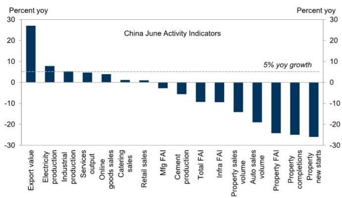
来源：CEIC，GS全球投资研究

**图表3：尽管美元指数今年走强，美元兑人民币持续下行**
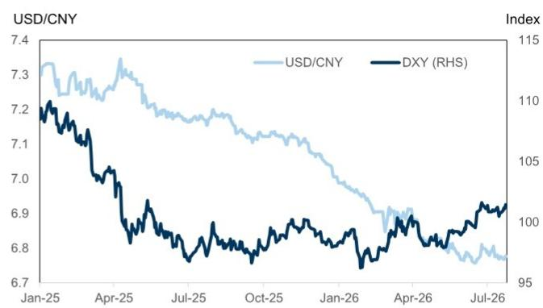
DXY：美元指数，衡量美元兑一篮子货币的价值。
来源：彭博

## 3. 韩国——经常账户持续扩大，外资流出放缓为韩元走强创造条件

人工智能驱动的出口繁荣今年对韩国出口、财政收入和增长形成有力支撑。1-5月经常账户盈余达1430亿美元，已超过2025年全年1230亿美元的盈余。我们的经济学家预计今年经常账户盈余将升至近3000亿美元，占GDP的13.9%，而2025年为6.5%，这将创下历史新高。尽管出口激增且KOSPI指数在2026年上半年上涨100%，但由于投资组合流出，韩元在2025年和今年早些时候表现相对落后。去年资本流出主要由国内读者（包括国民养老金和散户）驱动，而今年外国读者年初至今净卖出约1000亿美元（图表4）。KOSPI相对全球市场的突出表现，以及其中两只个股的优异表现，促使外国读者减少韩国敞口以管理集中度风险（图表5和图表6）。但近期，随着KOSPI自6月中旬以来回调近30%，外资流出速度明显放缓（图表7），从而减轻了对激增的经常账户盈余的抵消作用，为7月韩元的表现创造了条件。我们预计经常账户盈余将继续支撑韩元，但市场动态值得密切关注，特别是如果出现类似2026年上半年的新一轮外资流出。然而，如果KOSPI涨势扩大（这是我们策略师的基本情景）或KOSPI呈现区间震荡，我们认为这些条件将对韩元有利，因为其走势可能更多受强劲的经常账户故事驱动。

**图表4：外资年初至今流出约1000亿美元，主要集中在两只个股**
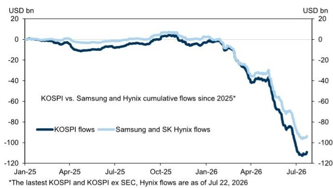
来源：彭博，Haver Analytics

**图表5：风险偏好变化和投资组合再平衡导致韩国外资流出**
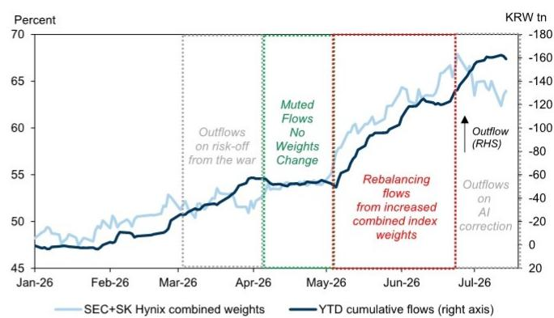
来源：彭博，Haver Analytics

**图表6：随着KOSPI指数集中度上升，外资流出往往加速**
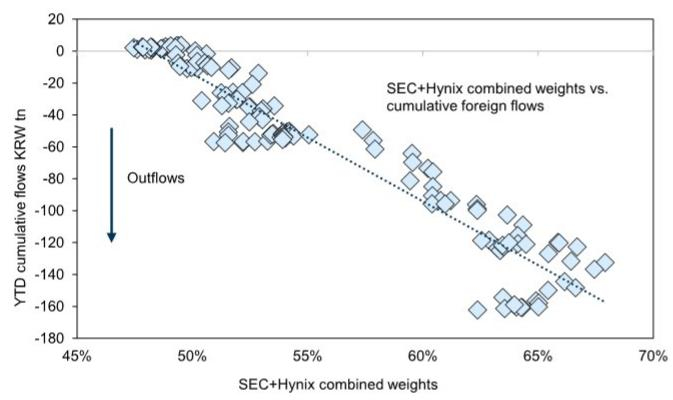
来源：MSCI，彭博，GS全球投资研究

**图表7：外资流出减少为韩元走强创造条件**
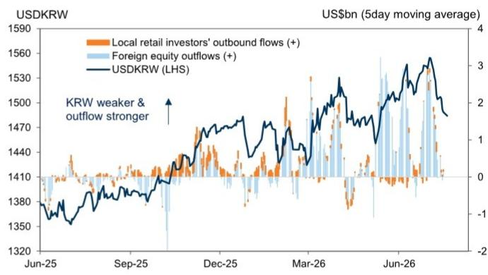
来源：Haver Analytics，GS全球投资研究

## 4. 台湾——强劲出口支撑新台币在2026年下半年表现

台湾出口今年大部分时间以40%-70%的创纪录速度增长。我们的经济学家预计今年经常账户盈余将升至GDP的25%，高于2025年创纪录的20%，并预计2026年GDP增速将从2025年的8.8%加速至10.3%，这将是自1980年代以来较强劲的增速之一。尽管增长前景强劲，台湾央行在6月将政策利率维持在2.0%不变。在新闻发布会上，行长表示委员会对通胀风险保持关注，维持审慎倾向。但其他评论相对温和，强调台湾通胀前景仍然温和，约2%的通胀水平总体可接受。根据行长的表态，我们认为进一步收紧政策的门槛高于此前预期，导致我们的经济学家将预测修正为今年不再加息（此前预计两次加息）。自中东局势变化以来，新台币表现优于多数亚洲货币，台湾半导体出口有助于抵消油价上涨对贸易条件的影响。在投资组合流动更为平衡（相比韩国）的情况下，非常强劲的经常账户盈余和大量美元存款积累应继续支撑新台币。展望未来，我们预计新台币将继续优于区域同类货币，但升值步伐可能保持渐进，反映台湾央行对汇率稳定的偏好。

## 5. 印度——印度储备银行的外汇措施支撑卢比，同时可能提升全球综合指数纳入机会

能源供给变化对整体宏观经济的影响小于最初担忧。一季度GDP同比增长7.8%，比我们的预测高出约50个基点。二季度增长跟踪高于我们早先预期，因此我们的经济学家在6月底将2026日历年实际GDP增长预测上调0.3个百分点至6.8%。6月5日，印度储备银行和印度政府宣布了一系列资本流动措施，包括为新的3-5年期外币非居民存款提供全额外汇对冲支持，以及为准主权公司筹集美元资金提供优惠外汇掉期利率。还有两项与债券相关的措施，应能改善印度纳入彭博全球综合债券指数的资格。当局取消了外国机构读者持有政府债券的利息和资本利得税，并扩大了完全可进入路径范围，纳入所有新的15年、30年和40年期债券。美元兑卢比的一个关键驱动因素是油价，近期因中东局势再度紧张而上涨。我们的商品团队强调了油价在这些紧张局势下的上行风险，但维持2026年底布伦特原油80美元/桶的预测，理由是如果局势缓和，大量供应过剩可能重返市场。展望短期波动，我们维持做空泰铢/卢比的建议（入场2.91，现价2.85，目标2.70，止损3.05）。我们近期还建议做多30年期政府债券（入场7.34%，现价7.45%，目标6.90%，止损7.65%）。

## 6. 新加坡——新加坡金管局7月按兵不动，但关注通胀传导

尽管是面临能源冲击的开放经济体，新加坡的经济动能保持稳健。初步GDP数据显示，二季度经济同比增长5.7%，高于5.5%的共识预期，受到人工智能引领的科技上行周期和更活跃的金融中介活动的支撑（图表8）。核心通胀保持温和（6月同比1.6%，5月为1.4%），部分原因是新加坡的核心通胀指标不包括住宿和私人交通，限制了零售燃料价格上涨对核心CPI的直接影响。主要风险是能源成本传导的滞后性，因为管制电价调整存在时滞。因此，三季度电价上调17%可能推高7月核心通胀并产生一些第二轮效应（图表9）。尽管如此，我们的分析表明整体影响应是可控的。在增长稳健、核心通胀可控以及传导效应仍不确定的背景下，我们预计新加坡金管局将采取观望态度，同时保持温和审慎倾向，并监测对工资、服务价格和通胀预期的溢出效应。新加坡元名义有效汇率目前交易在政策区间中值上方约+1.5%。鉴于我们预计金管局将维持政策不变，我们认为新加坡元显著优于区域同类货币的空间有限。因此，我们继续将新加坡元作为做多马来西亚林吉特头寸的融资货币。

**图表8：电子产品出口支撑新加坡增长动能**
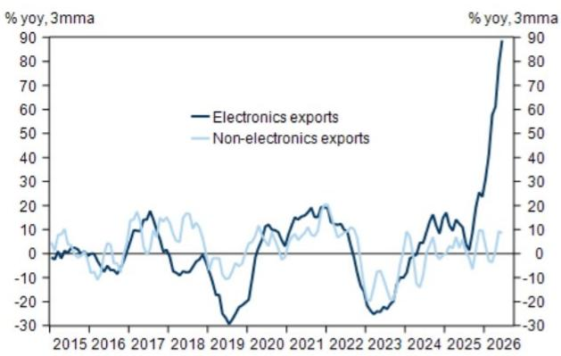
来源：SingStat，GS全球投资研究

**图表9：电价大幅上涨将对核心通胀产生溢出效应**
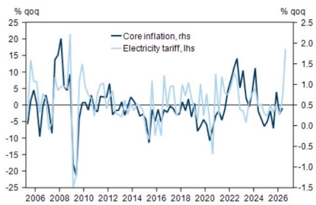
来源：SingStat，GS全球投资研究

## 7. 马来西亚——增长保持韧性，受内外需支撑

人工智能相关科技上行周期继续传导至实体经济，初步GDP数据显示二季度经济同比增长5.8%，高于5.2%的共识预期（图表10）。燃料补贴继续保护家庭和企业免受更高能源成本的影响，有助于维持需求，同时信贷增长保持支撑。我们预计马来西亚央行在2026年全年维持利率不变。马来西亚林吉特是2025年和2026年大部分时间亚洲表现最好的货币，但在6月表现相对落后，我们认为这反映了国内政治风险溢价的上升，而非宏观基本面走弱（图表11）。在柔佛和森美兰州议会解散以及总理安瓦尔·易卜拉欣早些时候表示如果团结政府分裂可能提前大选后，市场出现担忧。值得注意的是，下一次大选正式到期时间为2028年2月。柔佛于7月12日举行州选举，国民阵线赢得56席中的48席，高于2022年的40席，而总理安瓦尔的希望联盟获得8席，低于此前的12席。关注点现在转向8月1日的森美兰州选举。我们认为，马来西亚相对的政治稳定性是过去两年支持投资、资本流入和林吉特表现的重要因素。除非市场进一步计入显著的政治风险溢价，特别是围绕近期提前大选的可能性，否则我们认为更广泛的基本面仍对林吉特构成支撑。

**图表10：马来西亚电子产品出口支撑增长，非电子产品出口受能源产量提高提振**
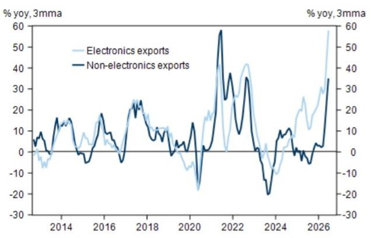
来源：DOSM，GS全球投资研究

**图表11：马来西亚央行鼓励外汇流入的措施有助于限制过度波动和贬值压力**
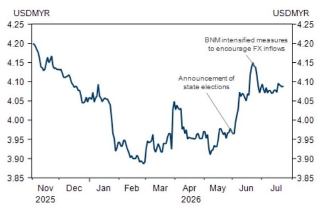
来源：DOSM，GS全球投资研究

## 8. 菲律宾——核心通胀上升使菲律宾央行保持谨慎

6月整体CPI通胀因能源和食品价格下降而放缓，但通胀下行趋势仍显脆弱。美伊关系再度紧张已推动燃料价格上涨，而核心通胀走强表明价格压力更为广泛，并出现第二轮效应（图表12）。我们认为通胀风险也偏向上行，受创纪录的最低工资上调以及厄尔尼诺现象可能带来的食品价格冲击驱动。在我们5月访问马尼拉期间，政策制定者指出，根据2022年的经验，第二轮通胀效应通常在初始冲击后约两个季度达到峰值。反映这些担忧，菲律宾央行在4月和6月各加息25个基点，将政策利率提高至4.75%，我们预计2026年剩余时间将进一步加息75个基点。自2025年下半年以来，增长保持温和，部分原因是与防洪腐败丑闻相关的干扰拖累了公共投资（图表13）。一季度实际GDP增速放缓至同比增长2.8%。虽然政策制定者预计2026年下半年投资活动将恢复，但我和本地读者仍持更谨慎态度，因为其他地区的经验表明，反腐运动后的复苏往往较为渐进。财政整固也限制了刺激空间。菲律宾比索今年表现落后于区域同类货币，原因是菲律宾对油价上涨的敞口较高。如果油价维持在90-100美元/桶区间，比索可能继续面临压力。然而，如果中东局势缓和导致油价下跌，菲律宾资产可能成为区域内的表现突出者。

**图表12：全球油价再度上涨可能推高CPI通胀**
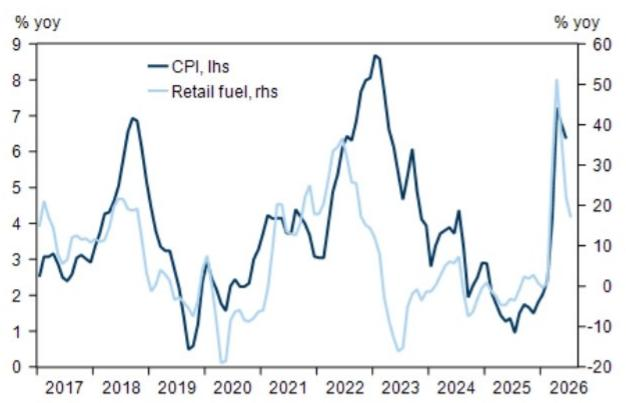
来源：PSA，GS全球投资研究

**图表13：2025年下半年以来政府投资大幅下降导致经济放缓**
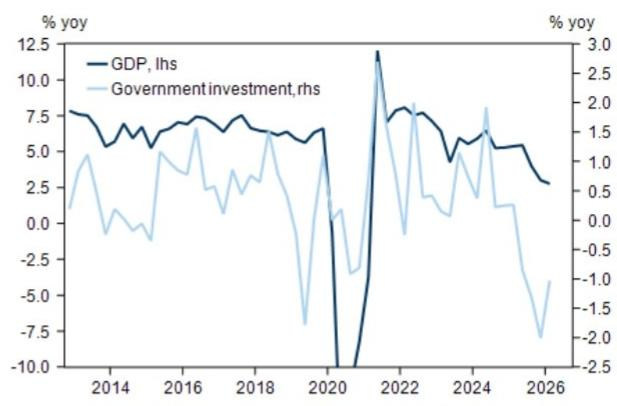
来源：PSA，GS全球投资研究

## 9. 印度尼西亚——印尼央行保留政策空间（以备后续加息），同时扩大激励措施吸引资金流入

印尼盾今年表现落后于亚洲货币。为应对货币波动，印尼央行在5月和6月各加息50个基点（一次在计划外会议，一次在预定会议）。印尼央行还表示将提高6个月、9个月和12个月期SRBI回报表现以吸引资金流入并帮助稳定印尼盾。然而，印尼央行上周将政策利率维持在5.75%不变（而市场共识预期加息25个基点），但扩大了吸引外资流入的激励措施，包括将对冲在岸资产（如地方政府债券）的读者折扣从10%提高至12.5%，并推出15%的国内无本金交割远期折扣。我们认为，印尼央行的决定反映了其对通胀保持在目标区间内的信心，尽管承认天气相关不确定性带来的上行风险，同时保留政策空间（以备后续加息），因其预计美联储将在2026年四季度加息。美元在过去几周呈现区间震荡，而标普于7月13日确认印尼'BBB'评级并给予稳定展望，为印尼盾提供了一些缓解。然而，围绕宏观政策仍存在若干担忧，这应使印尼盾中期内面临压力。政府计划监管自然资源出口，虽然旨在改善税收收入和防止出口低报，但读者担心增加的官僚程序可能延迟出口（图表14）。印尼议会通过了一项扩大印尼央行职责的法律，引发读者对通胀目标框架的担忧。与此同时，印尼在6月避免了MSCI从新兴市场下调至前沿市场，但指数提供商的信号仍保持谨慎，下一次评估在11月。上述压力叠加了本已具有挑战性的宏观目标组合，包括总统的亲增长偏好、维持燃料补贴、免费餐食计划（近期从268万亿印尼盾削减至229万亿印尼盾后，占GDP的1.0%）以及保持在3%财政赤字上限内（图表15）。鉴于这些国内担忧，我们对印尼盾持谨慎看法，预计其表现将落后于区域同类货币。

**图表14：煤炭、铁合金和棕榈油占总出口的40%**
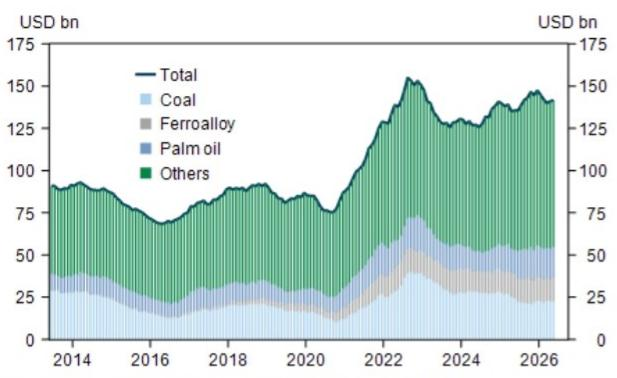
来源：Macrobond，GS全球投资研究
来源：BPS，GS全球投资研究

**图表15：历史模式表明2026年下半年财政赤字将进一步扩大**
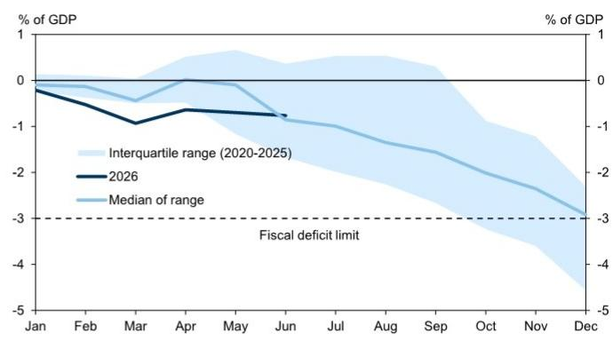
来源：财政部，GS全球投资研究

## 10. 泰国——泰铢因金价下跌和实际利率走低而表现落后

泰铢从2025年表现最好的亚洲货币之一（仅次于马来西亚林吉特）转变为今年表现最差的低收益亚洲货币。尽管泰国央行近期将2026年GDP预测上调至同比增长2.3%（从1.5%），其中4000亿泰铢紧急法令贡献+0.6个百分点的增长提振，一季度和二季度增长跟踪改善贡献+0.2个百分点，但泰铢仍表现落后。此外，今年2月令人信服的选举结果后，政治环境似乎更加稳定。除能源冲击外，我们将泰铢走弱归因于三个因素。首先，6月底出现大规模资金流出，当时新加坡电信出售了泰国海湾能源2.3%的股份，价值10亿美元。其次，全球金价从年初的近5500美元/盎司跌至约4000美元/盎司（图表16）。正如我们之前讨论的，鉴于泰国作为大型黄金交易中心的角色，金价与泰铢之间存在正相关关系。泰国央行在2月底宣布了几项措施试图打破这种相关性，但这些措施可能只会逐渐生效并消退。最后，我们注意到实际利率差异已显著转向有利于美元/泰铢走强（图表17）。泰国央行已将政策利率下调至1.0%，而通胀数据持续上升（6月同比2.4%），使实际利率处于负值区域。与此同时，美国实际利率上升。展望未来，虽然油价和金价的变化将继续影响泰国的贸易条件和旅游前景，但我们预计泰铢因其低实际利率将继续表现落后，并认为它是区域内针对高息货币的良好融资货币，继续建议做空泰铢/卢比。

**图表16：金价下跌缓解泰铢升值压力**
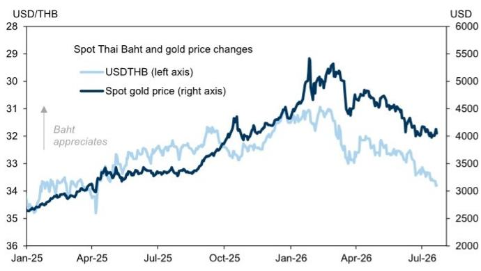
来源：彭博，GS全球投资研究

**图表17：美元兑泰铢实际利率上升对美元/泰铢构成上行压力**
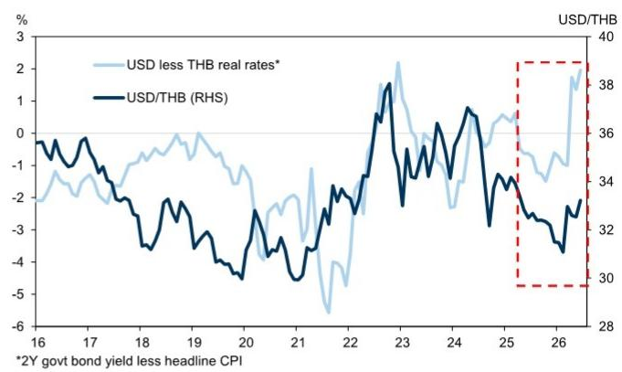
来源：彭博，GS全球投资研究

## 总结表格

**图表18：我们对亚洲货币和利率相对表现的看法（3个月展望）**

| | 外汇展望* | 利率展望** | 评论 |
|---|---|---|---|
| 中国 | 积极 | 中性 | 出口强劲、汇率低估以及央行对人民币走强的更大容忍度支撑我们的积极看法。近期央行行动表明对人民币升值节奏的管理。 |
| 韩国 | 积极 | 中性 | 外资流出减少减轻了对激增的经常账户盈余的抵消，为韩元走强创造条件。KOSPI区间震荡或涨势扩大应对韩元有利。 |
| 台湾 | 积极 | 中性 | 科技出口带来的强劲贸易顺差和大量美元存款积累为新台币走强提供不对称风险。对新台币利率持中性看法，预计央行维持不变。 |
| 香港 | 中性 | 中性 | 美元整体走强推动美元/港元向兑换区间上端移动；预计即期汇率将保持区间震荡。 |
| 印度 | 积极 | 积极 | 印度储备银行吸引资金流入的外汇措施意义重大。油价（从高点）回落应有助于缓解通胀和财政担忧。我们也看好卢比久期，推荐30年期债券。 |
| 新加坡 | 中性 | 中性 | 二季度增长保持韧性，通胀上升温和。新加坡金管局已在4月提前收紧政策，我们预计今年不会进一步收紧。 |
| 泰国 | 谨慎 | 中性 | 泰国央行保持中性，可能忽略暂时性通胀压力。金价下跌和实际利率走低应对泰铢构成贬值压力。 |
| 马来西亚 | 积极 | 中性 | 林吉特因州选举相关的政治风险溢价上升而面临压力。但增长、出口和外资直接投资前景依然稳健，我们对林吉特保持建设性看法。 |
| 印度尼西亚 | 谨慎 | 谨慎 | 印尼央行加息和外汇措施为印尼盾提供了短期缓解。但对自然资源出口规则、治理和财政纪律的担忧将使印尼盾面临压力。 |
| 菲律宾 | 中性 | 中性 | 菲律宾央行对第二轮通胀保持警惕，立场审慎。比索前景与油价高度相关，因补贴有限且传导较高。 |

斜体表示与我们此前立场的变化。
来源：GS全球投资研究

**图表19：新兴亚洲利率和外汇交易思路**

**当前持仓交易**

| 交易 | 启动日期 | 现价 | 入场 | 目标 | 止损 | 总盈亏（资本和carry） |
|---|---|---|---|---|---|---|
| 做多印度30年期债券 | 2026-06-26 | 7.44% | 7.34% | 6.90% | 7.65% | -10bps |
| 做空泰铢/卢比 | 2026-06-12 | 2.86 | 2.91 | 2.70 | 3.05 | +2.3% |
| 做空新加坡元/马来西亚林吉特 | 2026-01-23 | 3.17 | 3.13 | 2.90 | 3.30 | -1.3% |

*目标/止损水平以指数形式表示，纳入：i) 久期，ii) 利差和iii) 即期外汇的总回报。

**已平仓交易**

| 交易 | 启动日期 | 平仓日期 | 入场 | 平仓 | 总盈亏（资本和carry） |
|---|---|---|---|---|---|
| 接收泰铢THOR 2Y OIS | 2026-01-23 | 2026-03-09 | 1.20% | 1.13% | +15bps |
| 做多菲律宾5年期债券（外汇对冲） | 2025-08-05 | 2026-03-05 | 5.93% | 5.77% | +32bps |
| 做多印度30年期债券（外汇对冲） | 2025-09-05 | 2026-02-11 | 7.22% | 7.47% | +20bps |
| 韩元2年期IRS | 2025-11-18 | 2026-02-04 | 2.80% | 3.16% | -35bps |
| 做空新加坡元/新台币 | 2025-10-03 | 2026-01-07 | 23.57 | 24.6 | -3.80% |
| 做空泰铢/韩元 | 2025-01-10 | 2025-09-09 | 42.3 | 43.74 | -3.30% |
| 做多1年期SRBIs（全额外汇对冲） | 2024-10-03 | 2025-07-21 | 6.82% | 6.58% | +112bp |
| 做多2年期CGBs | 2025-04-06 | 2025-05-16 | 1.47% | 1.47% | 0bp |
| 接收印度2年期NDOIS | 2025-01-28 | 2025-05-16 | 6.08% | 5.48% | +44bp |
| 做多韩元2s10s IRS陡峭化 | 2024-09-04 | 2025-05-16 | -12bp | 20bp | +9bp |
| 做多卢比兑亚洲货币篮子（等权重CNH、TWD、THB、MYR、SGD） | 2025-01-06 | 2025-04-03 | 100 | 100.33 | +33bp |
| 做多5年期CGB（外汇对冲） | 2024-11-17 | 2025-02-21 | 1.69% | 1.55% | +14bp |
| 做多卢比兑亚洲货币篮子（等权重CNY、KRW、TWD、THB、MYR、SGD、JPY） | 2024-11-17 | 2024-01-06 | 100 | 100.48 | +114bp |
| 做多2年期IGBs（未对冲外汇） | 2024-02-29 | 2024-11-06 | 7.02% | 6.50% | +3.8% |
| 支付泰铢2年期THOR OIS | 2024-08-07 | 2024-10-01 | 2.02% | 2.04% | +8bp |
| 做空人民币兑CFETS篮子 | 2024-08-09 | 2024-09-30 | 100 | 103 | -0.7% |
| 做空欧元/卢比 | 2024-01-12 | 2024-08-21 | 90.91 | 93 | -0.3% |
| 接收新加坡元2年期SORA OIS兑全球2年期利率篮子 | 2023-04-14 | 2024-08-06 | -8bp | -28bp | +42bp |
| 做空泰铢/韩元 | 2024-03-15 | 2024-07-26 | 37.17 | 38.31 | -2.7% |
| 做多泰铢3年期债券兑支付3年期THOR互换 | 2024-01-10 | 2024-07-10 | -20 | -10 | +10bp |
| 做多1年期CGB（外汇对冲） | 2023-11-10 | 2024-04-27 | 2.25% | 1.65% | +60bp |
| 做多10年期INDOGBs（未对冲外汇） | 2023-12-14 | 2024-04-17 | 6.60% | 6.75% | -15bp |
| 做空新台币/韩元 | 2023-06-13 | 2024-03-15 | 41.42 | 41.83 | +0.3% |
| 做空马来西亚林吉特/泰铢 | 2023-11-10 | 2024-02-07 | 7.63 | 7.48 | +2.0% |

来源：GS全球投资研究

## 附录

**Reg AC**

我们，Danny Suwanapruti、Chris Poh、Lisheng Wang、Xinquan Chen、Irene Choi、Santanu Sengupta、Arjun Varma和Andrew Tilton，特此证明本报告中表达的所有观点均反映我们的个人观点，且未受公司业务或客户关系的影响。

除非另有说明，本报告封面列出的个人是GS全球投资研究部门的分析师。

**供稿作者：** Danny Suwanapruti GS (Singapore) Pte, Chris Poh GS (Singapore) Pte, Lisheng Wang GS (Asia) L.L.C., Xinquan Chen GS (Asia) L.L.C., Irene Choi GS (Asia) L.L.C., Seoul Branch, Santanu Sengupta GS India SPL, Arjun Varma GS India SPL, Andrew Tilton GS (Asia) L.L.C.

除非另有说明，本报告供稿作者披露中列出的个人是GS全球投资研究部门的分析师。

**披露信息**

**MSCI披露**

本报告中使用的所有MSCI数据均为MSCI Inc.（MSCI）的专有财产。未经MSCI事先书面许可，不得以任何形式复制或再传播此信息及任何其他MSCI知识产权，也不得用于创建任何金融工具、产品或任何指数。此信息按"现状"提供，信息使用者承担使用此信息的全部风险。MSCI、其任何关联公司或任何参与或相关计算或编译数据的第三方对此信息（或使用该信息所获得的结果）不作任何明示或暗示的保证或陈述，MSCI、其关联公司和任何此类第三方特此否认对此信息的任何原创性、准确性、完整性、适销性或特定用途适用性的所有保证。在不限制前述规定的前提下，MSCI、其任何关联公司或任何参与或相关计算或编译数据的第三方在任何情况下均不对任何直接、间接、特殊、惩罚性、后果性或任何其他损害（包括利润损失）承担责任，即使已被告知此类损害的可能性。MSCI和MSCI指数是MSCI及其关联公司的服务标志。全球行业分类标准由MSCI和标准普尔开发，是其专有财产。GICS是MSCI和S&P的服务标志，已授权GS Group Inc.使用。

**监管披露**

**美国法律法规要求的披露**

请参见上述针对本报告提及公司的特定监管披露，了解以下任何要求的披露：待定交易中的经理或联合经理；1%或其他所有权；特定服务的报酬；客户关系类型；先前期间的承销公开发行；董事职位；对于股权证券，做市和/或专家角色。GS作为自营交易或可能作为自营交易本报告中讨论的发行人的债务证券（或相关衍生品）。

以下为额外要求的披露：所有权和重大利益冲突：GS政策禁止其分析师、向分析师报告的专业人员及其家庭成员持有分析师覆盖范围内的任何公司的证券。分析师薪酬：分析师的薪酬部分基于GS的盈利能力，其中包括投资银行收入。分析师作为高管或董事：GS政策通常禁止其分析师、向分析师报告的人员或其家庭成员在分析师覆盖范围内的任何公司担任高管、董事或顾问。非美国分析师：非美国分析师可能不是GS & Co. LLC的关联人员，因此可能不受FINRA规则2241或FINRA规则2242关于与主题公司沟通、公开露面以及交易分析师覆盖证券的限制。

**美国以外司法管辖区法律法规要求的额外披露**
以下披露为所指示司法管辖区要求的披露，除非已根据美国法律法规在上述范围内作出。澳大利亚：GS Australia Pty Ltd及其关联公司不是澳大利亚《1959年银行法》定义的授权存款机构，不在澳大利亚提供银行服务或开展银行业务。除非GS另有约定，本研究及其访问权限仅面向澳大利亚《公司法》定义的"批发客户"。在制作研究报告时，GS Australia全球投资研究成员可能参加作为其研究报告主题的公司和其他实体举办的现场访问和会议。在某些情况下，如果GS Australia认为在特定情况下适当且合理，此类现场访问或会议的费用可能部分或全部由相关发行人承担。如果本文件内容包含任何金融产品建议，则仅为一般性建议，由GS在未考虑客户目标、财务状况或需求的情况下编制。客户在根据任何此类建议采取行动前，应考虑该建议是否适合其自身目标、财务状况和需求。GS Australia和新西兰的某些利益披露以及GS澳大利亚卖方研究独立性政策声明副本可在以下网址获取：https://www.goldmansachs.com/disclosures/australia-new-zealand/index.html。巴西：有关CVM第20号决议的披露信息可在https://www.gs.com/worldwide/brazil/area/gir/index.html获取。在适用的情况下，根据CVM第20号决议第20条定义，本研究报告内容的主要负责巴西注册分析师为本报告开头指定的第一作者，除非文末另有说明。加拿大：此信息仅供信息参考，在任何情况下均不应被解释为GS & Co. LLC为在加拿大购买证券而向加拿大证券购买者进行的广告、要约或招揽。GS & Co. LLC未在加拿大任何司法管辖区注册为适用加拿大证券法下的交易商，通常不允许交易加拿大证券，并可能被禁止在加拿大某些司法管辖区销售某些证券和产品。如果您希望在加拿大交易任何加拿大证券或其他产品，请联系GS Group Inc.的关联公司GS Canada Inc.或其他注册的加拿大交易商。香港：有关本研究中提及的覆盖公司证券的进一步信息可向GS (Asia) L.L.C.索取。印度：有关本研究中提及的主题公司或公司的进一步信息可从GS (India) Securities Private Limited获取，研究分析师 – SEBI注册号INH000001493，地址：10th Floor, Ascent-Worli, Sudam Kalu Ahire Marg, Worli, Mumbai-400 025, India，企业识别号U74140MH2006FTC160634，电话+91 22 6616 9000，传真+91 22 6616 9001。GS可能实益拥有本研究报告提及的主题公司或公司1%或以上的证券（如印度《证券合同（监管）法》1956年第2(h)条所定义）。SEBI的注册和NISM的认证不以任何方式保证中介机构的业绩或向读者提供任何回报保证。GS (India) Securities Private Limited的合规官和读者投诉联系详情、年度合规审计报告副本以及其他相关信息和披露可在以下链接获取：https://www.goldmansachs.com/worldwide/india/research-analyst。日本：见下文。韩国：除非GS另有约定，本研究及其访问权限仅面向《金融服务和资本市场法》定义的"专业读者"。有关本研究中提及的主题公司或公司的进一步信息可从GS (Asia) L.L.C., Seoul Branch获取。新西兰：GS New Zealand Limited及其关联公司不是新西兰《1989年新西兰储备银行法》定义的"注册银行"或"存款接受者"。除非GS另有约定，本研究及其访问权限面向《2008年金融顾问法》定义的"批发客户"。GS Australia和新西兰的某些利益披露副本可在以下网址获取：https://www.goldmansachs.com/disclosures/australia-new-zealand/index.html。俄罗斯：在俄罗斯联邦分发的研究报告不是俄罗斯立法定义的广告，而是不以产品推广为主要目的的信息和分析，不提供俄罗斯评估活动立法意义上的评估。研究报告不构成俄罗斯法律法规定义的个人化研究交流，不针对特定客户，且未分析客户的财务状况、投资概况或风险概况。GS不对客户或任何其他人基于本研究报告可能做出的任何投资决策承担责任。新加坡：GS (Singapore) Pte.（公司编号：198602165W），受新加坡金融管理局监管，接受对本研究的法律责任，如有任何与本研究报告相关的事宜，应联系该公司。台湾：此材料仅供参考，未经许可不得转载。读者应仔细考虑自身的投资风险。投资结果由个人读者自行负责。英国：在英国被归类为零售客户（如金融行为监管局规则所定义）的人士，应结合GS先前关于本报告提及的覆盖公司的研究报告阅读本研究，并应参考GS International已发送给他们的风险警告。这些风险警告的副本以及本报告中使用的某些金融术语的词汇表可向GS International索取。

**欧盟和英国：** 有关欧盟委员会授权条例(EU) (2016/958)第6(2)条（包括该授权条例在英国脱离欧盟和欧洲经济区后作为英国国内法律和法规实施）关于研究交流客观呈现的技术安排以及特定利益或利益冲突迹象披露的技术标准的披露信息，可在https://www.gs.com/disclosures/europeanpolicy.html获取，其中说明了与投资研究相关的利益冲突管理欧洲政策。

**日本：** GS Japan Co., Ltd.是在关东财务局注册的金融工具交易商，注册号Kinsho 69，是日本证券交易商协会、日本金融期货协会、第二类金融工具公司协会和日本投资管理协会的会员。股票买卖需支付与客户预先确定的佣金加消费税。有关日本证券交易所、日本证券交易商协会或日本证券金融公司要求的任何适用披露，请参见公司特定披露。

**全球产品；分发实体**

GS全球投资研究为GS客户在全球范围内制作和分发研究产品。位于全球GS办公室的分析师对行业和公司进行研究，并对宏观经济、货币、大宗商品和投资组合策略进行研究。本研究由GS Australia Pty Ltd (ABN
