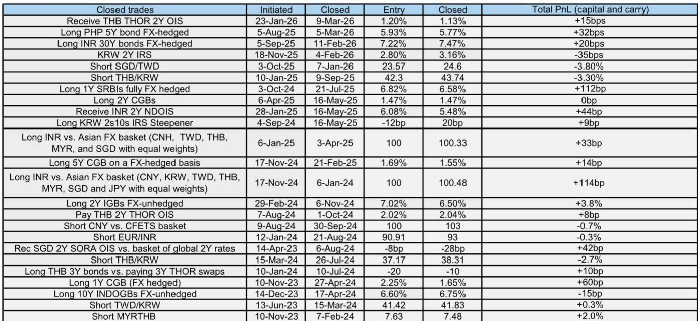
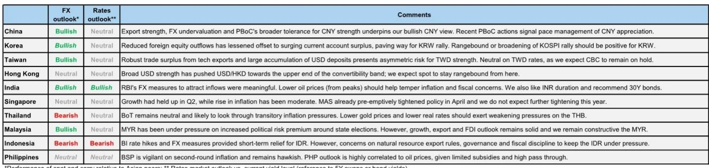
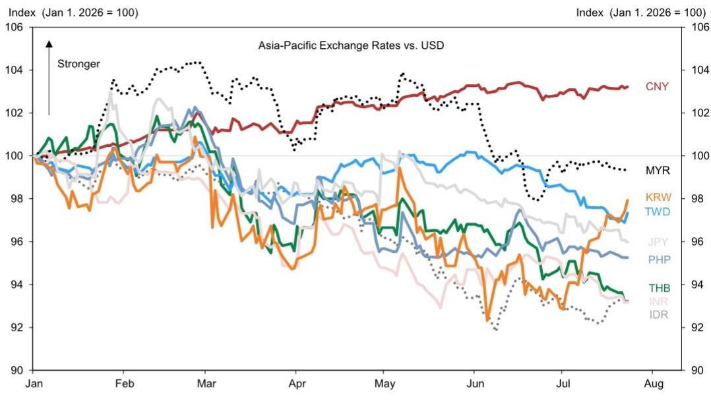

# 技术驱动的出口繁荣正在重塑亚洲货币表现格局——忽视这一分化的观察者将错失趋势

亚洲外汇市场不再作为一个整体同步波动。两个货币群体之间出现了结构性分化：与人工智能驱动的技术出口周期相关的货币，以及受能源供应冲击影响的货币。自2月以来，美元整体走强，美元指数自1月以来上涨约5%。然而，在亚洲外汇市场中，出现了明显的分化。人民币在美元强势背景下表现稳健，从7.0附近逐步调整至约6.77。与此同时，与技术相关的货币——韩元、新台币、新加坡元和马来西亚林吉特——整体表现优于其他货币。另一方面，泰国、菲律宾、印度尼西亚和印度等高度依赖能源进口的经济体的货币则相对滞后。这并非暂时的战术性模式。推动这种分化的宏观力量——依然活跃的人工智能投资热潮、高企的油价、更为鹰派的美联储以及稳定的美元/人民币汇率锚——可能在未来几个月持续存在。

报告的核心观点是，人工智能相关的投资热潮和能源供应冲击是今年亚洲宏观市场的两大主导驱动因素。但它们的影响并不均匀。那些人工智能热潮的净受益经济体——即出口半导体、电子产品及相关资本品的国家——正经历经常账户盈余激增、国内生产总值强劲增长以及货币升值。而能源净进口经济体则面临贸易条件恶化、通胀上升和货币贬值。结果是出现了分化，这要求采取差异化的策略，而非对亚洲市场采取单一方向性的看法。

其影响超出了货币交易范畴。这种分化预示着区域经济基本面更广泛的重组。将亚洲货币视为同质化资产类别的观察者正在错失结构性故事。关键不在于亚洲与美元之间的选择，而在于你持有的是哪个亚洲。

## 韩元的上涨由创纪录的经常账户盈余支撑，但股权集中风险仍是未知因素

韩国是人工智能驱动下表现突出的最清晰案例，但其路径并非一帆风顺。1月至5月间，经常账户盈余达到1430亿美元，已超过2025年全年1230亿美元的盈余。全年预测接近3000亿美元，占国内生产总值的13.9%，这将是历史新高。这是人工智能驱动出口繁荣的直接结果。然而，尽管盈余激增，韩元在2025年大部分时间和2026年初表现相对滞后。原因是投资组合外流。

去年，外流由国内读者推动，包括国民养老金和散户读者。今年，外国读者年初至今已净卖出约1000亿美元。KOSPI指数相对于全球市场的显著表现，以及这种表现极度集中于仅两只股票，导致外国读者为管理集中风险而减少了对韩国市场的敞口。KOSPI自6月中旬以来回调了近30%，外国股权外流的速度已显著放缓。这种放缓为7月份韩元的相对强势铺平了道路。

关键的战略问题是这种动态能否持续。经常账户盈余巨大且具有结构性支撑。但如果外国读者恢复卖出——要么是因为KOSPI的上涨未能扩大范围，要么是因为避险情绪重新引发投资组合再平衡——韩元可能会失去动力。报告股权策略师的基本假设是KOSPI的上涨将扩大范围。如果发生这种情况，或者指数在更窄的区间内交易，韩元应更多地受经常账户故事驱动。观察者应关注市场集中度和外国资金流动数据，作为韩元走势的领先指标。

## 台湾的半导体主导地位创造了抵御石油冲击和投资组合外流的独特屏障

台湾的出口表现强劲，今年大部分时间增长率在40%至70%之间。经常账户盈余预计将升至国内生产总值的25%，高于2025年创纪录的20%。2026年国内生产总值增长预计将加速至10.3%，是自1980年代以来的较强水平之一。然而，央行在6月将政策利率维持在2.0%不变，行长的评论表明进一步收紧的门槛高于此前预期。

台湾案例的独特之处在于其出口基础的性质。半导体出口帮助抵消了油价上涨对贸易条件的影响。这对大多数其他亚洲经济体来说并非如此。台湾的出口价值高且需求强劲，以至于油价冲击是次要问题。此外，与韩国相比，投资组合流动更为平衡。非常强劲的经常账户盈余与大量美元存款积累相结合，为新台币创造了有利的结构性背景。

升值步伐可能是渐进的，反映了央行对汇率稳定的偏好。但方向是明确的。台湾货币应继续相对于区域同行表现。对于观察者而言，这意味着新台币的任何战术性弱势都应被视为机会而非退出的理由。

## 新加坡元是融资货币而非表现型交易，尽管增长强劲

新加坡经济第二季度同比增长5.7%，高于市场共识，受到人工智能主导的技术上升周期和金融中介活动增强的支撑。核心通胀在6月保持温和，为1.6%。然而，存在一个特定风险：受监管的电价会滞后调整，第三季度电价上涨17%可能推高7月核心通胀并产生一些第二轮效应。

新加坡金融管理局预计将维持当前政策立场，保持温和鹰派倾向，同时监测对工资、服务价格和通胀预期的溢出效应。新加坡元名义有效汇率目前交易在政策区间中点上方约1.5%的水平。在政策设定不变的情况下，新加坡元相对于区域同行显著升值的空间有限。

这为新加坡元在投资组合中创造了一个特定角色：它是一种融资货币，而非表现型交易。报告明确表示，对于做多马来西亚林吉特的头寸，使用新加坡元作为融资货币是合适的。对于构建区域外汇策略的观察者而言，新加坡元为持有高收益或高确信度的亚洲货币头寸提供了相对稳定、低波动的融资来源。

## 印度卢比受益于政策工程，但石油仍是主导变量

印度受能源供应冲击的宏观影响小于最初担忧的程度。第一季度国内生产总值同比增长7.8%，比报告预测高出50个基点，第二季度增长跟踪数据高于早期预期。印度储备银行和印度政府在6月初宣布了一系列资本流动措施，包括为新外币非居民存款提供全额外汇对冲支持，以及为准主权公司筹集美元资金提供优惠外汇掉期利率。

两项与债券相关的措施尤为重要。当局取消了外国机构读者对政府债券的利息和资本利得税，并将完全可进入路径范围扩大到包括所有新的15年、30年和40年期债券。这些步骤应能改善印度被纳入彭博全球综合债券指数的资格，这将带来显著的被动资金流入。

然而，美元/卢比的主导变量仍然是油价。报告商品团队维持其2026年底布伦特原油每桶80美元的预测，理由是如果中东局势缓和，大量供应过剩可能重返市场。如果油价下跌，印度资产可能成为该地区表现突出的资产之一。目前，建议是做空泰铢/卢比，反映出鉴于泰国更高的能源进口依赖度和旅游敞口，泰铢将相对于卢比表现较弱。

## 亚洲外汇布局的决策框架

以下框架将报告的分析转化为观察者可操作的策略选择。

首先，将每种亚洲货币分为两类：人工智能技术受益者或能源进口依赖者。受益者是韩元、新台币、新加坡元和马来西亚林吉特。依赖者是泰铢、菲律宾比索、印尼盾和印度卢比。人民币属于特殊类别：它并非以同样的方式直接受人工智能驱动，但其升值趋势受到结构性因素支撑，包括估值偏低、国际化政策和出口实力。

其次，在受益者群体中，区分具有强劲经常账户支撑的货币和那些投资组合流动带来风险的货币。新台币和马来西亚林吉特的故事最为清晰。韩元拥有较强的经常账户盈余，但面临股权集中风险。新加坡元是融资货币，而非表现型交易。

第三，在依赖者群体中，区分那些通过政策积极应对货币弱势的经济体和那些被动暴露的经济体。印度正在使用外汇措施和债券市场改革来吸引资金流入。印度尼西亚正在为未来加息保留政策空间，同时扩大对资金流入的激励措施。菲律宾正在加息，但面临与腐败相关的公共投资放缓带来的结构性阻力。

第四，监测可能改变整个框架的两个关键宏观变量：油价和人工智能投资周期。油价的持续下跌将不成比例地惠及依赖型货币，尤其是菲律宾比索和印度卢比。人工智能投资主题的重大中断将损害受益型货币，尤其是韩元和新台币。当前的基本假设是油价和人工智能主题都继续支持当前的分化。

第五，以人民币作为锚。报告预计温和的升值趋势将持续，受到估值偏低、国际化政策和出口实力的支撑。稳定或升值的人民币为其他亚洲货币提供了底线，并降低了竞争性贬值的风险。如果人民币走势逆转，整个亚洲外汇格局将需要重新评估。

人工智能技术受益者与能源进口依赖者之间的结构性分化并非短期交易模式。它反映了由两个强大且持久的宏观力量驱动的区域经济基本面的根本性重组。为这种分化做好布局的观察者将比那些将亚洲货币视为单一资产类别的观察者处于更有利的位置。

*仅供参考。部分内容可能基于源材料通过人工智能辅助生成、翻译、总结或编辑，可能存在遗漏或错误。请独立核实。这不构成投资、法律、税务、会计或其他专业建议。*

仅供参考。部分内容可能基于源材料通过人工智能辅助生成、翻译、总结或编辑，可能存在遗漏或错误。请独立核实。这不构成投资、法律、税务、会计或其他专业建议。

