# 中国汽车行业观察：需求调整与行业整合持续

## 评级与目标价主要调整

# 中国汽车

需求变化，行业整合持续

◆ 基于2026年上半年需求低于预期，下调2026年预测

\- 行业整合与定价压力持续影响企业盈利

◆ 调整整车企业预测，保持个股选择；下调长城汽车A/H至持有/持有；下调目标价

需求变化速度快于预期：在2026年上半年表现低于预期后，我们将2026年中国乘用车和新能源汽车需求同比增速预测分别下调至-13%（此前为-5%）和-6%（此前为+10%）。最新的乘联会数据显示需求仍偏弱，7月1-19日乘用车零售量同比下降16%，新能源汽车零售量同比下降4%。在补贴政策推动的提前消费后，置换需求有所放缓，同时面对频繁的新品发布和更具竞争性的市场环境，消费者变得更加审慎。尽管我们预计2026年下半年需求将环比改善，但我们认为复苏步伐将比此前预期的更为渐进。

行业整合仍在进行中，国内定价或持续承压：新能源汽车渗透率的提升持续重塑中国汽车市场，但行业盈利能力仍面临挑战。激烈的竞争、持续的定价压力以及传统整车企业的高库存继续影响利润率，尤其是合资业务。与此同时，出口仍是重要的增长来源，帮助领先的中国整车企业部分抵消国内需求的波动。因此，我们预计行业整合和盈利分化将持续，优势企业将进一步扩大其竞争优势。

个股选择比行业配置更重要：尽管长城汽车股价已出现明显调整，但我们认为在第二季度指引低于预期、行业需求预期下调以及俄罗斯报废税退税不确定性持续的背景下，盈利可见度进一步减弱。因此，我们将长城汽车A/H股评级从买入下调至持有，同时维持对广汽集团A/H股和北京汽车的持有评级。我们继续偏好拥有较强出口能力、有竞争力的本土品牌以及更健康产品周期的整车企业，目前尚未看到行业整体估值重估的条件。在行业需求和盈利能力企稳之前，我们预计执行能力的差异将驱动表现分化。

# 股票 汽车

中国

## 丁雨谦\*

中国科技与汽车研究主管
香港上海HSBC银行有限公司
yuqian.ding@hsbc.com.hk
+852 2288 5108

李杨\*
分析师，中国汽车
香港上海HSBC银行有限公司
li01.yang@hsbc.com.hk
+852 2288 6216

\*受雇于HSBC证券（美国）公司的非美国关联机构，未根据FINRA规定注册/取得资格

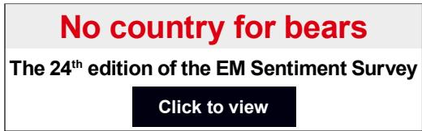

<table><tr><td rowspan="2">代码</td><td rowspan="2">公司</td><td rowspan="2">货币</td><td rowspan="2">市值（百万美元）</td><td rowspan="2">3个月日均交易量（百万美元）</td><td rowspan="2">收盘价</td><td colspan="2">目标价</td><td colspan="2">评级</td><td rowspan="2">上行/下行</td><td colspan="3">市净率</td><td colspan="3">净资产回报表现</td></tr><tr><td>旧</td><td>新</td><td>旧</td><td>新</td><td>2026年预测</td><td>2027年预测</td><td>2028年预测</td><td>2026年预测</td><td>2027年预测</td><td>2028年预测</td></tr><tr><td>601633 CH</td><td>长城汽车A</td><td>人民币</td><td>17,501</td><td>56</td><td>16.09</td><td>31.20</td><td>15.90</td><td>买入</td><td>持有</td><td>1%</td><td>1.4</td><td>1.3</td><td>1.2</td><td>11%</td><td>13%</td><td>14%</td></tr><tr><td>2333 HK</td><td>长城汽车H</td><td>港元</td><td>20,178</td><td>24</td><td>9.09</td><td>21.60</td><td>9.30</td><td>买入</td><td>持有</td><td>-2%</td><td>0.7</td><td>0.6</td><td>0.6</td><td>11%</td><td>13%</td><td>14%</td></tr><tr><td>601238 CH</td><td>广汽集团A</td><td>人民币</td><td>6,351</td><td>23</td><td>5.10</td><td>8.23</td><td>5.08</td><td>持有</td><td>持有</td><td>0%</td><td>0.5</td><td>0.5</td><td>0.5</td><td>-6%</td><td>0%</td><td>2%</td></tr><tr><td>2238 HK</td><td>广汽集团H</td><td>港元</td><td>6,351</td><td>5</td><td>2.19</td><td>3.62</td><td>2.13</td><td>持有</td><td>持有</td><td>3%</td><td>0.2</td><td>0.2</td><td>0.2</td><td>-6%</td><td>0%</td><td>2%</td></tr><tr><td>1958 HK</td><td>北京汽车</td><td>港元</td><td>889</td><td>1</td><td>0.87</td><td>2.20</td><td>0.80</td><td>持有</td><td>持有</td><td>9%</td><td>0.1</td><td>0.1</td><td>0.1</td><td>-2%</td><td>-1%</td><td>0%</td></tr></table>

来源：彭博，HSBC预测。价格为2026年7月21日收盘价

## 披露与免责声明

本报告必须与披露附录中的披露内容及分析师认证，以及构成报告一部分的免责声明一并阅读。

报告发行人：香港上海HSBC银行有限公司

# 需求调整，整合持续

基于需求变化，我们下调2026年中国汽车需求预测

\- 尽管新能源汽车渗透率提升，竞争仍影响盈利能力，整合持续

我们对个股保持选择性；下调长城汽车、广汽集团和北京汽车的预测，并将长城汽车A/H股评级下调至持有/持有

## 需求调整；复苏推至2026年下半年

下调2026年乘用车和新能源汽车需求预测；转折点可能在9月

2026年上半年，中国乘用车零售销量总计872万辆，同比下降20%，而新能源汽车销量达到470万辆，同比下降14%。最新的乘联会周度数据显示，7月份需求依然偏弱，7月1-19日乘用车零售量同比下降16%，新能源汽车零售量同比下降4%。除了整体消费倾向偏低外，置换补贴支持的减少可能将需求提前至2025年，导致2026年上半年动力不足。在行业层面，虽然价格战在表面上有所收敛，但制造商通过推出更多规格提升但价格不变的新车型来竞争。鉴于市场日益由置换需求主导，更快的产品更新周期可能强化了消费者的"观望"态度，延长了置换周期。

在此背景下，我们将2026年中国乘用车需求增长预测修正为-13%（此前为-5%）。我们维持2027年同比下降2%的预测，因为我们仍预计在置换补贴政策预期退出前，部分需求将被提前至2026年底。由于2026年上半年新能源汽车销售增长低于预期，我们也下调了新能源汽车渗透率假设；更新后的2026-2028年新能源汽车渗透率预测分别为58%、65%和71%。

在我们的更新预测中，我们预计2026年下半年将出现温和的环比复苏，同比降幅收窄至7%，主要受9月起的季节性提振、更新的产品阵容（2026年下半年180多款新车型）以重新激发消费者兴趣，以及2026年第四季度在置换补贴政策可能于年底到期前的潜在提前购买浪潮推动。

图表1. 中国乘用车和新能源汽车需求预测变化

<table><tr><td rowspan="2"></td><td colspan="4">新预测</td><td colspan="4">旧预测</td><td colspan="4">变化</td></tr><tr><td>2026年预测</td><td>2027年预测</td><td>2028年预测</td><td>2030年预测</td><td>2026年预测</td><td>2027年预测</td><td>2028年预测</td><td>2030年预测</td><td>2026年预测</td><td>2027年预测</td><td>2028年预测</td><td>2030年预测</td></tr><tr><td>乘用车销量（百万辆）</td><td>20.6</td><td>20.2</td><td>20.2</td><td>20.2</td><td>22.5</td><td>22.1</td><td>22.1</td><td>22.1</td><td>-8%</td><td>-8%</td><td>-8%</td><td>-8%</td></tr><tr><td>乘用车销量同比增速（%）</td><td>-13%</td><td>-2%</td><td>0%</td><td>0%</td><td>-5%</td><td>-2%</td><td>0%</td><td>0%</td><td>-8%</td><td>0%</td><td>0%</td><td>0%</td></tr><tr><td>新能源汽车销量（百万辆）</td><td>12.0</td><td>13.2</td><td>14.3</td><td>16.7</td><td>14.1</td><td>15.5</td><td>17.0</td><td>19.5</td><td>-15%</td><td>-15%</td><td>-16%</td><td>-15%</td></tr><tr><td>新能源汽车销量同比增速（%）</td><td>-6%</td><td>10%</td><td>8%</td><td>8%</td><td>10%</td><td>10%</td><td>10%</td><td>6%</td><td>-16%</td><td>0%</td><td>-2%</td><td>2%</td></tr><tr><td>新能源汽车渗透率（%）</td><td>58%</td><td>65%</td><td>71%</td><td>82%</td><td>62%</td><td>70%</td><td>77%</td><td>88%</td><td>-4%</td><td>-5%</td><td>-6%</td><td>-6%</td></tr></table>

来源：HSBC预测。PV：乘用车。EV：新能源汽车。

图表2. 我们将2026年需求增长预测下调至同比下降13%，新能源汽车为同比下降6%  
  
来源：乘联会，HSBC预测

图表3. 2026年6月新能源汽车渗透率维持在63%  
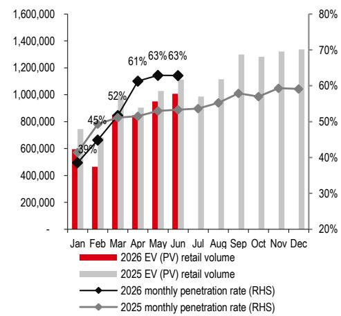  
来源：乘联会，HSBC

图表4. 2026年上半年整体汽车零售额同比下降20%  
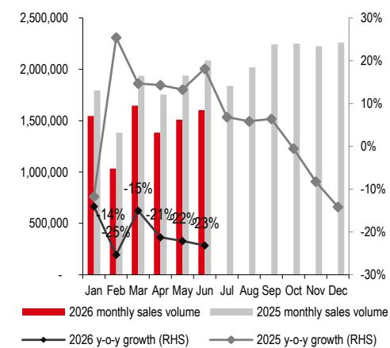  
来源：乘联会，HSBC

## 燃油车板块承压：2026年结构性收缩加速

2026年上半年燃油车零售量同比下降26.3%，第二季度降幅（-38.2%）较第一季度（-14.3%）明显扩大。仅在20万至30万元价格区间需求相对稳健；相比之下，燃油车在30万元以上的大众市场和高端市场（下降24-36%）需求明显减弱。随着消费者权衡加油和运行成本以及智能座舱和智能驾驶能力，偏好继续向新能源汽车转移。

在供给端，压力加剧。虽然6月份合资品牌和传统豪华品牌的库存指标环比有所缓解，但仍远高于1.5的警戒线。经销商维持较高折扣以清理库存，进一步削弱了定价纪律。整车企业也减少了燃油车新车型的推出——2026年上半年102款新车型中有12款，2026年下半年预计184款中有16款——产品更新周期放缓。随着燃油车产品竞争力落后于新能源汽车，2026年上半年燃油车在大多数价格区间的市场份额继续被蚕食。

按品牌看，高端中国新能源汽车（极氪9X、蔚来ES8/ES9、小鹏GX等）自2025年下半年以来持续对传统豪华品牌形成压力。尽管持续打折，宝马和奔驰在2026年上半年的降幅较2025年加快：宝马同比下降20%（2025年为-15%），奔驰同比下降27%（2025年为-20%）。在大众市场，丰田和大众在2026年上半年因以旧换新补贴较2025年减弱而恢复收缩：丰田同比下降9%，大众同比下降27%。

展望2026年下半年，我们预计燃油车需求将随旺季环比回升，但反弹幅度应落后于新能源汽车。长期趋势保持不变：新能源汽车将继续从燃油车手中夺取份额，预计到2030年新能源汽车渗透率将达到82%。

图表5. 除20-30万元区间外，燃油车在大多数价格区间失去份额  
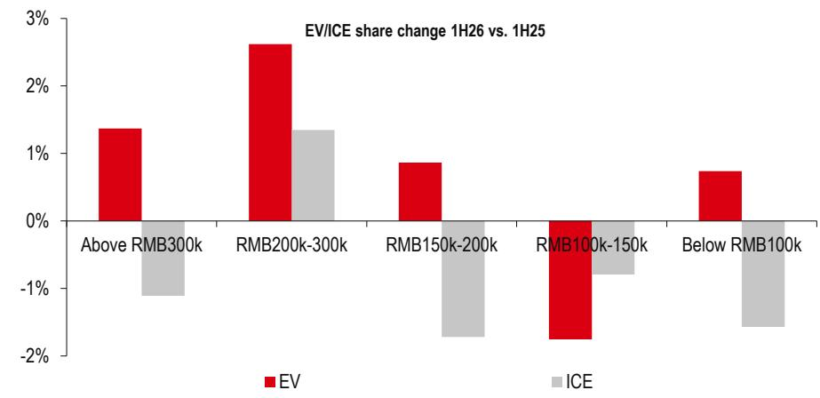  
来源：乘联会，HSBC

图表6. 2026年上半年，燃油车销量在几乎所有价格区间均出现明显收缩  
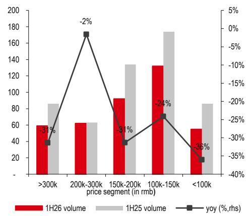  
来源：乘联会，HSBC

图表7. 2026年上半年，高端新能源汽车需求更具韧性  
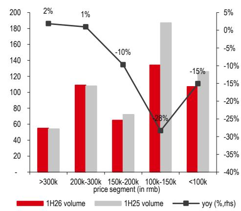  
来源：乘联会，HSBC

图表8. 2026年上半年中国整体乘用车市场：前15大品牌占据60%份额  
25%  
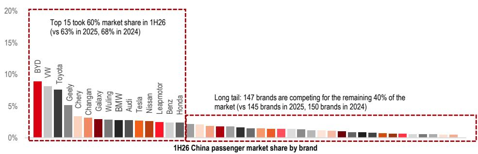

图表9. 中国新能源汽车乘用车折扣水平处于相对低位...  
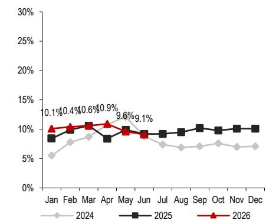  
来源：乘联会，HSBC  
图表10. ...而燃油车仍面临定价压力  
来源：乘联会，HSBC

图表11. 豪华燃油车折扣水平更高  
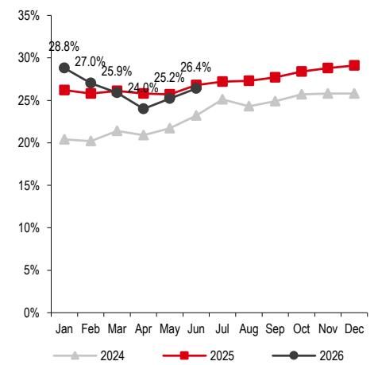  
来源：乘联会，HSBC

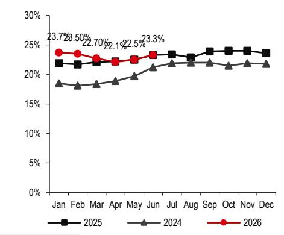

图表12. 合资品牌和传统豪华品牌库存水平较高  
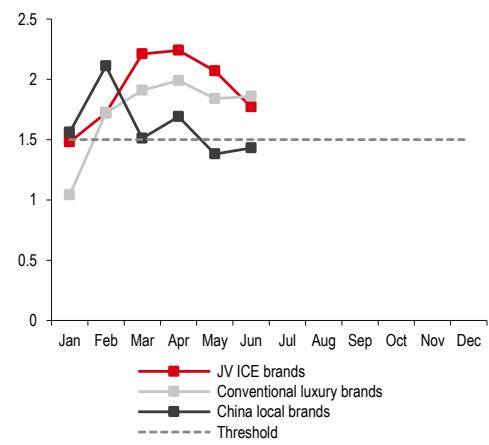  
来源：中国汽车流通协会，HSBC

## 整车企业股票分析

基于我们下调的行业需求预测，我们下调了长城汽车、广汽集团和北京汽车的预测，这些公司因新能源汽车周期较弱而相对承压。我们将长城汽车A/H股评级从买入下调至持有，并维持对广汽集团A/H股和北京汽车的持有评级。

图表13. 评级与预测主要调整

<table><tr><td rowspan="2">代码</td><td rowspan="2">公司</td><td rowspan="2">货币</td><td rowspan="2">市值（百万美元）</td><td rowspan="2">3个月日均交易量（百万美元）</td><td rowspan="2">收盘价</td><td colspan="2">目标价</td><td colspan="2">评级</td><td rowspan="2">上行/下行</td><td colspan="3">市净率</td><td colspan="3">净资产回报表现</td></tr><tr><td>旧</td><td>新</td><td>旧</td><td>新</td><td>2026年预测</td><td>2027年预测</td><td>2028年预测</td><td>2026年预测</td><td>2027年预测</td><td>2028年预测</td></tr><tr><td>601633 CH</td><td>长城汽车A</td><td>人民币</td><td>17,501</td><td>56</td><td>16.09</td><td>31.20</td><td>15.90</td><td>买入</td><td>持有</td><td>1%</td><td>1.4</td><td>1.3</td><td>1.2</td><td>11%</td><td>13%</td><td>14%</td></tr><tr><td>2333 HK</td><td>长城汽车H</td><td>港元</td><td>20,178</td><td>24</td><td>9.09</td><td>21.60</td><td>9.30</td><td>买入</td><td>持有</td><td>-2%</td><td>0.7</td><td>0.6</td><td>0.6</td><td>11%</td><td>13%</td><td>14%</td></tr><tr><td>601238 CH</td><td>广汽集团A</td><td>人民币</td><td>6,351</td><td>23</td><td>5.10</td><td>8.23</td><td>5.08</td><td>持有</td><td>持有</td><td>0%</td><td>0.5</td><td>0.5</td><td>0.5</td><td>-6%</td><td>0%</td><td>2%</td></tr><tr><td>2238 HK</td><td>广汽集团H</td><td>港元</td><td>6,351</td><td>5</td><td>2.19</td><td>3.62</td><td>2.13</td><td>持有</td><td>持有</td><td>3%</td><td>0.2</td><td>0.2</td><td>0.2</td><td>-6%</td><td>0%</td><td>2%</td></tr><tr><td>1958 HK</td><td>北京汽车</td><td>港元</td><td>889</td><td>1</td><td>0.87</td><td>2.20</td><td>0.80</td><td>持有</td><td>持有</td><td>9%</td><td>0.1</td><td>0.1</td><td>0.1</td><td>-2%</td><td>-1%</td><td>0%</td></tr></table>

来源：彭博，HSBC预测。价格为2026年7月21日收盘价

我们的估值基于当前/低谷的市盈率倍数，而非长期历史均值。虽然估值看起来偏低，但我们预计在目标价时间范围内不会出现有意义的估值重估，原因是需求偏弱、持续的定价压力以及传统整车企业有限的产品周期催化剂。在缺乏明确的盈利或需求拐点的情况下，我们认为当前市场倍数比历史均值更能代表公允价值。关键讨论不在于这些股票按历史区间是否便宜，而在于是否存在催化剂让市场愿意支付更高倍数。我们认为答案尚未到来。

## 估值与风险

## 长城汽车

## 下调2026-27年净利润预测，主要因国内需求偏弱

长城汽车发布了2026年第二季度业绩预告，指引净利润为14-16亿元人民币，低于我们此前的预期。主要不利因素是俄罗斯报废税退税流程延迟。2025年第四季度至2026年第一季度期间约有20亿元人民币可退税；虽然此前预计2026年第二季度将收到部分款项，但目前预计资金将在年底前到账。此外，尽管在出口势头（出口销量环比增长24%）的支撑下，第二季度销量环比增长17%（整体乘用车批发量环比增长14%），但由于国内需求偏弱，其2026年上半年销量同比下降12%。

长城汽车A股和H股年初至今分别下跌27%和38%（同期沪深300指数上涨2%，恒生指数下跌2%），反映了国内汽车板块的贝塔值偏弱以及与俄罗斯退税相关的季度盈利不确定性。展望未来，我们预计2026年下半年销量将随着9月起的季节性回升和出口持续增长而改善，但仍预测2026年全年增长偏弱，因为国内需求偏弱部分抵消了出口扩张（我们将2026年销量增长预测从10%下调至7%）。俄罗斯报废税退税的时间仍是一个关键的盈利风险。因此，我们对盈利能力持更谨慎态度，并将A股和H股评级从买入下调至持有。

盈利预测调整。我们将2026年净利润预测下调23%，主要基于以下变化：

1. 销量：反映国内乘用车需求偏弱，我们将2026年批发量预测下调至141万辆（此前为146万辆）。

2. 毛利率：总体而言，由于销量规模下降，我们预计公司毛利率将降低。但其出口扩张（我们预计到年底月出口量将达到约7万辆）和2026年下半年定价相对较高的新车型（哈弗H10、魏牌V9X/V8X、新坦克300和坦克800）可能部分抵消成本压力和规模下降的影响。总体而言，我们将2026年毛利率预测下调至15.2%（此前为15.4%）。

3. 运营支出：考虑到新车型营销和海外渠道扩张的持续投入，我们将运营支出比率预测上调至11.0%（此前为10.3%）。

我们还将2027年净利润预测下调14%，主要由于国内需求偏弱导致毛利率降低以及运营支出假设上调。我们在本报告中引入了2028年预测。

图表14. 预测变化

<table><tr><td rowspan="2">（百万元人民币）</td><td colspan="3">新</td><td colspan="3">旧</td><td colspan="3">变化</td></tr><tr><td>2026年预测</td><td>2027年预测</td><td>2028年预测</td><td>2026年预测</td><td>2027年预测</td><td>2028年预测</td><td>2026年预测</td><td>2027年预测</td><td>2028年预测</td></tr><tr><td>收入</td><td>240,667</td><td>280,600</td><td>291,336</td><td>240,579</td><td>252,153</td><td>不适用</td><td>0%</td><td>11%</td><td>不适用</td></tr><tr><td>毛利润（含折旧摊销）</td><td>36,543</td><td>43,432</td><td>45,534</td><td>37,118</td><td>40,200</td><td>不适用</td><td>-2%</td><td>8%</td><td>不适用</td></tr><tr><td>毛利率（含折旧摊销）</td><td>15.2%</td><td>15.5%</td><td>15.6%</td><td>15.4%</td><td>15.9%</td><td>不适用</td><td>-0.2个百分点</td><td>-0.5个百分点</td><td>不适用</td></tr><tr><td>运营支出比率</td><td>11.0%</td><td>10.8%</td><td>10.3%</td><td>10.3%</td><td>10.3%</td><td>不适用</td><td>0.7个百分点</td><td>0.5个百分点</td><td>不适用</td></tr><tr><td>净利润</td><td>10,482</td><td>13,045</td><td>15,111</td><td>13,583</td><td>15,088</td><td>不适用</td><td>-23%</td><td>-14%</td><td>不适用</td></tr><tr><td>每股收益（人民币）</td><td>1.22</td><td>1.52</td><td>1.77</td><td>1.59</td><td>1.76</td><td>不适用</td><td>-23%</td><td>-14%</td><td>不适用</td></tr></table>

来源：HSBC预测

图表15. 我们的预测与彭博一致预期对比

<table><tr><td rowspan="2">（百万元人民币）</td><td colspan="3">HSBC预测</td><td colspan="3">一致预期</td><td colspan="3">差异</td></tr><tr><td>2026年预测</td><td>2027年预测</td><td>2028年预测</td><td>2026年预测</td><td>2027年预测</td><td>2028年预测</td><td>2026年预测</td><td>2027年预测</td><td>2028年预测</td></tr><tr><td>收入</td><td>240,667</td><td>280,600</td><td>291,336</td><td>252,068</td><td>284,629</td><td>312,451</td><td>-5%</td><td>-1%</td><td>-7%</td></tr><tr><td>净利润</td><td>10,482</td><td>13,045</td><td>15,111</td><td>11,080</td><td>13,012</td><td>14,810</td><td>-5%</td><td>0%</td><td>2%</td></tr></table>

来源：彭博，HSBC预测

下调至持有/持有评级，目标价下调至人民币15.90元和9.30港元。我们继续使用市盈率方法，将目标市盈率倍数设定为13倍（此前为20倍；基于长城汽车过去三个月的平均市盈率），应用于我们2026年每股收益预测人民币1.22元（此前为2025年预测人民币1.56元），得出更新后的A股目标价人民币15.90元（此前为人民币31.20元）。

我们还将长城汽车H股相对于A股的估值折价更新为50%（此前为37%），原因是近期风险偏好和流动性降低。使用HSBC2026年底人民币兑港元汇率预测1.17（此前为2025年底的1.10），我们得出新的H股目标价9.30港元（此前为21.60港元）。

我们新的A股目标价意味着较当前水平有3%的下行空间；新的H股目标价意味着较当前水平有2%的上行空间；因此我们将两只股票的评级下调至持有（此前为买入）。对于H股的人民币计价股票（82333 HK），我们根据HSBC2026年底人民币兑港元汇率预测1.17（此前为2025年底的1.10），将H股目标价9.30港元转换为人民币。这得出目标价人民币7.98元（此前为人民币19.66元）。

主要上行风险：新车型及改款车型国内销售强于预期；海外销量扩张强于预期；俄罗斯退税早于预期。

主要下行风险：汇率波动及俄罗斯退税慢于预期；海外销量增长弱于预期；国内市场竞争激烈导致新车型国内销量爬坡慢于预期。

图表16. 长城汽车A股交易于11.8倍12个月远期市盈率，历史均值为23.2倍  
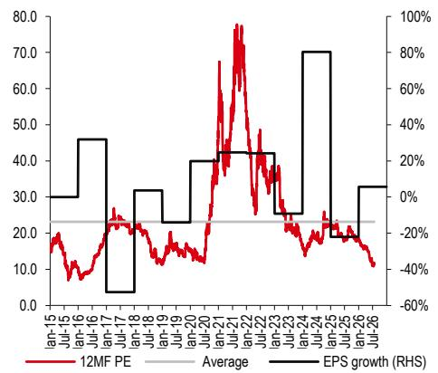  
来源：彭博，HSBC预测

图表17. 长城汽车H股交易于5.3倍12个月远期市盈率，历史均值为10.5倍  
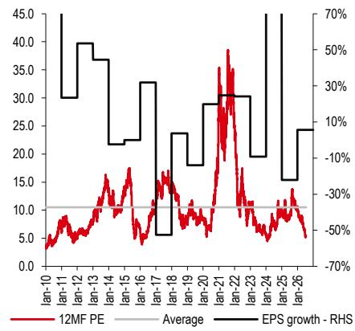  
来源：彭博，HSBC预测

## 广汽集团

第二季度盈利预警低于预期。广汽集团预告2026年第二季度净亏损34-39亿元人民币，低于我们的预期。盈利偏弱主要由于本土品牌和合资品牌的原材料成本压力，以及与新车型推出相关的销售和营销费用增加。

本土品牌销量保持韧性，而合资品牌表现分化。其本土品牌销量在2026年上半年同比增长31%，得益于出口（同比增长132%至12.2万辆）以及包括埃安i60和N60在内的新车型，部分抵消了国内需求偏弱的影响。在合资业务中，广汽丰田销量基本保持稳定，2026年上半年销量同比增长3%，得益于bZ3X和bZ7等车型，而广汽本田因产品组合老化继续出现销量大幅下降（同比下降56%）。

展望2026年下半年，本土品牌可能逐步复苏，但合资品牌的偏弱表现可能仍是主要的盈利拖累。与华为合作的AISTALAND品牌首款车型GT7已于7月开始交付，GX7计划于今年晚些时候推出。这些新车型的推出，加上出口的持续增长，应能为本土品牌销量和产品组合提供增量支持。然而，我们预计合资业务（尤其是本田）的持续偏弱将继续影响投资收益和整体盈利。

盈利预测调整。我们将2026年净利润预测从盈亏平衡下调至净亏损59亿元人民币，主要基于以下更新：

1. 销量：在出口扩张以及埃安和AISTALAND新车型推出的支撑下，我们将2026年本土品牌销量预测上调至72万辆（此前约为65万辆）。

2. 毛利率：我们将2026年毛利率预测下调至-1.3%（此前为3.4%），反映了今年原材料价格上涨后成本上升的影响。

3. 运营支出：鉴于新车型营销和海外渠道扩张的持续投入，我们将运营支出比率预测上调至10.0%（此前为9.3%）。

4. 投资收益：我们将2026年来自合资品牌的投资收益下调38%，主要由于广汽本田销量明显收缩。

我们还将2027年净利润预测下调79%，主要由于来自合资品牌的投资收益降低。我们在本报告中引入了2028年预测。

图表18. 预测变化

<table><tr><td rowspan="2">（百万元人民币）</td><td colspan="3">新</td><td colspan="3">旧</td><td colspan="3">变化</td></tr><tr><td>2026年预测</td><td>2027年预测</td><td>2028年预测</td><td>2026年预测</td><td>2027年预测</td><td>2028年预测</td><td>2026年预测</td><td>2027年预测</td><td>2028年预测</td></tr><tr><td>收入</td><td>113,612</td><td>132,731</td><td>138,554</td><td>93,385</td><td>100,383</td><td>不适用</td><td>22%</td><td>32%</td><td>不适用</td></tr><tr><td>毛利润（含折旧摊销）</td><td>-1,441</td><td>6,011</td><td>8,169</td><td>3,138</td><td>4,664</td><td>不适用</td><td>-146%</td><td>29%</td><td>不适用</td></tr><tr><td>毛利率（含折旧摊销）</td><td>-1.3%</td><td>4.5%</td><td>5.9%</td><td>3.4%</td><td>4.6%</td><td>不适用</td><td>-4.6个百分点</td><td>-0.1个百分点</td><td>不适用</td></tr><tr><td>运营支出比率</td><td>10.0%</td><td>9.3%</td><td>9.3%</td><td>9.3%</td><td>9.3%</td><td>不适用</td><td>+0.7个百分点</td><td>-</td><td>不适用</td></tr><tr><td>投资收益</td><td>2,489</td><td>2,406</td><td>2,326</td><td>4,002</td><td>4,477</td><td>不适用</td><td>-38%</td><td>-46%</td><td>不适用</td></tr><tr><td>净利润</td><td>-5,906</td><td>409</td><td>1,922</td><td>596</td><td>1,964</td><td>不适用</td><td>-1091%</td><td>-79%</td><td>不适用</td></tr><tr><td>每股收益（人民币）</td><td>(0.58)</td><td>0.04</td><td>0.19</td><td>0.06</td><td>0.19</td><td>不适用</td><td>-1101%</td><td>-79%</td><td>不适用</td></tr></table>

来源：HSBC预测

图表19. 我们的预测与彭博一致预期对比

<table><tr><td rowspan="2">（百万元人民币）</td><td colspan="3">HSBC预测</td><td colspan="3">一致预期</td><td colspan="3">差异</td></tr><tr><td>2026年预测</td><td>2027年预测</td><td>2028年预测</td><td>2026年预测</td><td>2027年预测</td><td>2028年预测</td><td>2026年预测</td><td>2027年预测</td><td>2028年预测</td></tr><tr><td>收入</td><td>113,612</td><td>132,731</td><td>138,554</td><td>108,984</td><td>123,373</td><td>134,202</td><td>4%</td><td>8%</td><td>3%</td></tr><tr><td>净利润</td><td>-5,906</td><td>409</td><td>1,922
