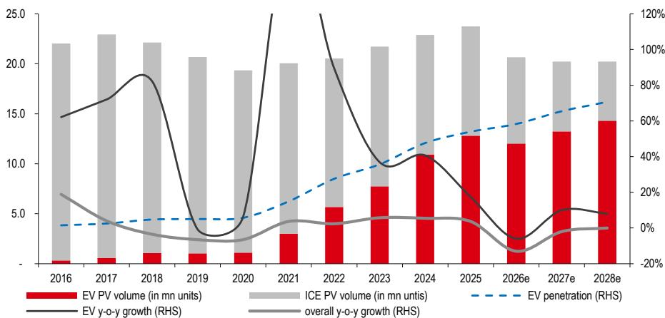
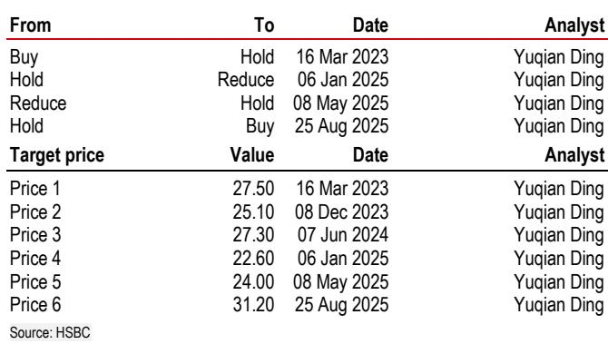

# 中国汽车市场观察：结构性变化下的新研究框架

中国乘用车市场在2026年上半年出现调整，根据中国乘用车协会数据，同期新能源汽车销量也有所变化。某研究机构已调整其2026年全年乘用车需求增长预测，并对新能源汽车增长预测进行了修正。这些调整反映了对全球最大汽车市场发展轨迹的重新评估。

传统观点认为中国汽车需求处于暂时性调整阶段，市场整合是周期性现象，2026年下半年将恢复常态。但2026年前七个月的数据显示，市场正经历需求变化、技术迭代、政策调整和利润变化等多重因素影响。对于观察者而言，基于历史估值和行业整体重估的旧框架已不再适用。公司选择成为关键，选择标准已转向出口能力、产品周期强度和财务稳健性。

## 需求调整的深度与持续性超出预期

需求调整的规模并非季度性微调。研究机构将2026年乘用车销量预测从2250万辆下调至2060万辆——下调8%，并延续至2028年。新能源汽车销量预测调整幅度更大，从1410万辆降至1200万辆，下调15%。2026年至2028年新能源汽车渗透率预测下调4至6个百分点，分别至58%、65%和71%。

直接原因是：2025年推动需求提前释放的置换补贴已到期，造成需求真空。2026年1月至7月，乘用车零售量同比下降16%，新能源汽车零售量下降4%。乘联会截至7月19日的周度数据显示未有改善。但结构性因素更为关键：在产品频繁推出和竞争激烈的环境下，消费者变得越来越挑剔。当每个月都有配置更好、价格相近的新车型时，理性选择是等待。置换周期延长，"观望"行为自我强化。

研究机构预计2026年下半年将出现温和的环比复苏，同比降幅收窄至7%，受9月季节性提振、超过180款新车型上市以及第四季度可能的置换补贴到期前提前购买推动。但复苏是渐进的，而非急剧的。2027年预测仍为负增长2%。这不是V型复苏，而是在较低基数上的U型企稳。

## 燃油车市场：各价格区间的结构性变化

2026年上半年燃油车数据明显。燃油车零售量同比下降26.3%，降幅从第一季度的14.3%加速至第二季度的38.2%。相对少见相对稳健的价格区间是20万至30万元。在30万元以上的大众和高端市场，燃油车需求下降24%至36%。

这不仅是需求问题。供给方面，整车厂大幅削减新燃油车型推出。2026年上半年推出的102款新车型中，仅12款为燃油车。下半年计划推出的184款新车型中，16款为燃油车。燃油车的产品更新周期正在放缓，而新能源汽车竞争对手却在加速。结果形成自我强化的竞争力下降循环：燃油车新车型减少导致消费者兴趣降低，进而推高经销商库存和折扣力度，进一步侵蚀品牌价值和盈利能力。

库存数据确认了严峻程度。合资品牌和传统豪华品牌的经销商库存水平在6月仍远高于1.5的阈值，尽管环比有所缓解。豪华燃油车折扣力度尤其大。宝马2026年上半年销量同比下降20%，较2025年15%的降幅加速。奔驰下降27%，2025年为20%。大众市场方面，丰田下降9%，大众下降27%，均在2025年相对稳定后重回收缩。

长期趋势明确。研究机构预计到2030年新能源汽车渗透率达82%。燃油车市场并非经历暂时性低迷，而是经历结构性变化，直至达到更小的均衡规模。对于观察者而言，基于燃油车盈利能力周期性复苏的任何估值论点，均缺乏数据支持。

## 盈利分化加速，市场尚未完全定价

研究机构的评级变化清晰说明了情况。长城汽车A股和H股被下调。下调由三个因素驱动：第二季度指引弱于预期、行业需求预期降低以及俄罗斯报废税退税的不确定性——约20亿元人民币应收款原预计第二季度到账，现预计年底前。

长城汽车的盈利修正具有参考意义。研究机构将其2026年净利润预测下调23%，原因是批发量从146万辆降至141万辆，毛利率从15.4%降至15.2%，运营费用率从10.3%升至11.0%。销量下降完全来自国内。出口销量第二季度环比增长24%，研究机构预计年底月出口量将达到约7万辆。矛盾明显：出口增长部分抵消国内疲软，但不足以阻止盈利变化。

广汽A股和H股以及北汽的评级维持不变。这些股票均未获上调。研究团队明确表示，尚未看到更广泛行业重估的条件。关键问题不在于这些股票在历史区间上是否便宜——它们确实便宜——而在于是否存在催化剂让市场给予更高估值。目前答案是否定的。

## 观察框架：区分领先与滞后的三个标准

研究机构的分析为当前环境下的公司选择提供了清晰框架。三个标准区分了能够维持或改善盈利的整车厂与不能的整车厂。

第一，出口能力。出口仍是重要增长来源，帮助领先中国整车厂部分抵消国内需求疲软。长城汽车的数据具有说明性：即使国内销量下降，出口销量仍环比增长24%。在海外市场——特别是东南亚、中东和欧洲——拥有成熟分销网络、监管批准和品牌认知度的整车厂具有结构性优势。主要依赖国内需求的整车厂面临更困难的销量增长路径。

第二，本土品牌竞争力和产品周期势头。在2026年下半年超过180款新车型上市的市场中，产品周期时机至关重要。拥有强大本土品牌、能在智能座舱、自动驾驶功能和性价比方面竞争的整车厂，比那些依赖传统合资企业或新能源汽车产品线薄弱的整车厂更具优势。研究机构指出，极氪、蔚来和小鹏等品牌的高端中国新能源汽车自2025年下半年以来持续对传统豪华品牌形成压力。变化正在高端市场和大众市场同时发生。

第三，财务稳健性和盈利可见性。长城汽车的俄罗斯报废税退税延迟提醒我们，在此环境下盈利质量与盈利水平同样重要。拥有透明应收款、可控库存水平和有限合资企业利润池敞口的整车厂，将拥有更可预测的盈利轨迹。合资企业敞口高、经销商库存高或利润表中一次性项目多的整车厂，承担着市场可能未充分定价的额外风险。

研究机构的结论直接：在行业需求和盈利能力企稳之前，执行差异将驱动表现分化。行业整体重估需要催化剂，而目前尚不存在。合适的策略不是持有整个行业等待复苏，而是持有满足所有三个标准的公司，避免那些不符合的。

## 估值处于低位，但低估值本身并非充分条件

所覆盖股票的当前市净率较低。长城汽车A股交易于2026年预估账面价值的1.4倍，到2028年降至1.2倍。广汽A股交易于0.5倍。北汽交易于0.1倍。从历史角度看，这些倍数看似便宜。研究机构明确说明：其估值基于当前和低谷交易市盈率，而非长期历史平均值。

逻辑合理。历史平均值是在不同的需求环境、竞争动态、补贴制度和产品周期下形成的。用这些平均值作为公允价值锚点，隐含假设了基础业务条件的均值回归。2026年上半年的证据不支持这一假设。需求更弱，竞争更激烈，从燃油车向新能源汽车的结构性转变正在加速。市场理性地给予较低倍数，因为这些业务的盈利能力已经变化。

对于观察者而言，关键问题是当前倍数是否充分反映了盈利风险。研究机构的答案是肯定的，但这并不意味着重估即将到来。重估需要催化剂：要么是需求的可证明企稳，要么是盈利能力的明确拐点，要么是改变特定整车厂竞争地位的产品周期。这些条件目前对整个行业均不存在。对于个股，催化剂必须是公司特定的。

这是报告的核心观察。中国汽车行业不是被动配置的领域。这是一个选股者的市场，选股标准比以往周期更为严格。能够保持领先的整车厂是那些拥有强大出口能力、有竞争力本土品牌、健康产品周期和透明盈利的公司。其余公司可能将保持区间波动，直到重塑市场的结构性力量达到新的均衡。

*仅供参考。部分内容可能基于源材料通过AI辅助生成、翻译、总结或编辑，可能存在遗漏或错误。请独立核实。本文不构成专业建议。*
