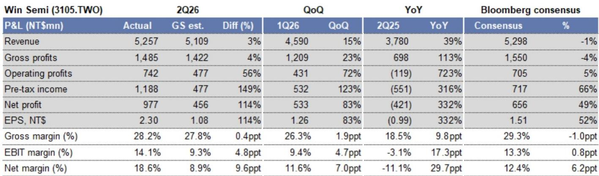
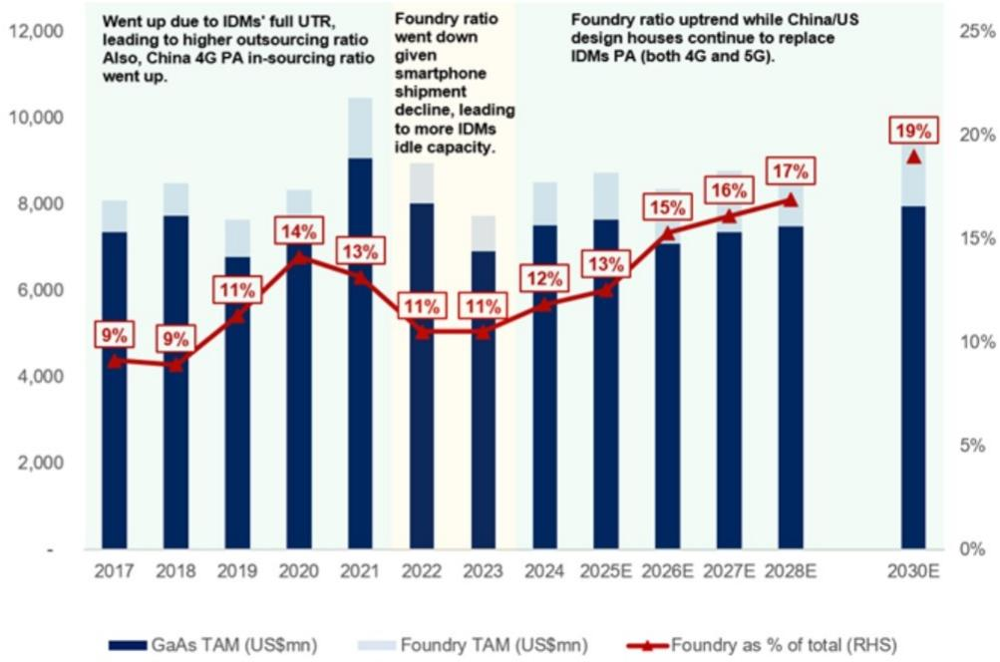
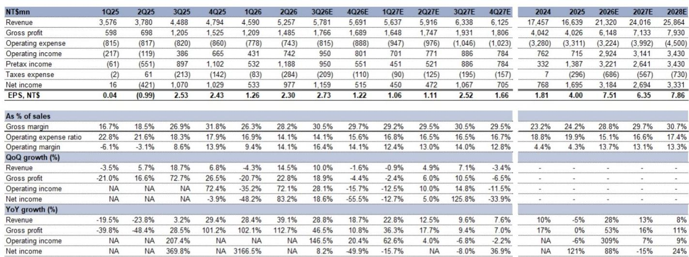

# The AI Optical Story at Win Semi Is Real, But It Is Priced as If the Entire Company Were Already Transformed

Win Semiconductors reported a 2Q26 operating profit that came in 56% above a global investment bank's estimate and 5% above Bloomberg consensus, driven by a favorable product mix shift toward higher-margin infrastructure business. Gross margin rose 1.9 percentage points quarter-over-quarter to 28.2%, exceeding the bank's forecast by 0.4 percentage points. Yet the stock trades at NT$341.50. A company that is executing well in the near term and a valuation that already discounts years of successful transformation is the central strategic question for observers today.

The market has latched onto Win Semi's AI-related optical product narrative. Management now expects AI-related revenue to reach double-digits of total revenue by 2027 and potentially match the scale of the cellular and infrastructure businesses in the long term. New photodiode (PD) products for a single client are expected to ramp in the second half of 2026. Laser diode (LD) products, including continuous wave laser and EML solutions, are in development with multiple clients but will not contribute meaningfully until 2027 or 2028. The optical business is real, but its near-term contribution is limited, and the stock price appears to reflect a scenario in which optical revenue transforms the entire company's earnings power within two years.

The following analysis examines why the current valuation is unsustainable, where the optical opportunity actually sits within the broader business, and how observers should think about the timing and magnitude of the transformation that is already priced in.

## The 2Q26 Earnings Beat Is Largely Non-Operational and Masks Structural Margin Constraints

Win Semi's 2Q26 net income exceeded the bank's estimate by 114% and Bloomberg consensus by 52%, but 38% of total pre-tax income came from a single non-operating item of NT$447 million. Without that item, the earnings beat would have been substantially narrower. Operating income, while strong, was driven by a temporary improvement in product mix toward infrastructure, not by a structural shift in the company's cost base or pricing power.

Gross margin guidance for 3Q26 is around low-thirties percent, which is better than the bank's prior expectation but exactly in line with Bloomberg consensus of 31.3%. The improvement is real, but it is being driven by utilization rate increases from 60% in 1Q26 to an expected 70% by 3Q26, not by pricing gains or a permanent mix shift. The company's own capex guidance of NT$2-3 billion for 2026, with the majority allocated to optical and infrastructure rather than GaAs capacity, indicates that management itself does not see a need to expand the core cellular foundry business. Utilization rates are expected to peak at around 80% during 2026-2028, which implies no capacity constraint that would allow the company to capture disproportionate upside from a demand surge.

The operational beat in 2Q26 is a cyclical improvement within a structurally challenged core business. It does not change the fact that Win Semi's PA foundry market share has declined from 74% in 2020 to an expected 52% in 2026, and is projected to fall further to 40-50% by 2030. The company's revenue in cellular PA will continue to grow because the total addressable market is expanding, but it is growing from a shrinking share of a growing pie. That is a fundamentally different economic profile from a company that is gaining share.

## The Optical Business Will Contribute Margin but Not Enough to Move the Earnings Needle in 2026-2027

The new PD product ramp for a single client in the second half of 2026 is a positive development, but its scale must be contextualized. Management expects AI-related business to reach double-digits of total revenue only by 2027. In 2Q26, total revenue was NT$5,257 million. Double-digits of that base would be approximately NT$500-1,000 million per quarter, or roughly 10-20% of current quarterly revenue. That is a meaningful contributor, but it is not transformative for a company with a market capitalization of NT$137.7 billion.

The LD products, which include higher-value solutions such as CW lasers and EMLs, will not contribute until 2027-2028. These are the products that could generate higher margins and larger revenue pools, but they are multiple years away from meaningful commercialization. The company is engaged with multiple clients on several solutions, which is encouraging, but engagement does not equal qualification, and qualification does not equal volume. The 2027-2028 timeline for LD products means that the optical revenue that is visible today is limited to the PD product for a single client.

The margin profile of optical products is likely higher than cellular PA, but the optical business is also capital-intensive. Win Semi is expanding InP and GaN capacity specifically for datacom optical and infrastructure, and capex is being directed away from GaAs. The depreciation burden from these investments will weigh on margins in the near term, even as the revenue mix improves. The net effect is that optical will contribute to gross margin expansion but will not drive a step-change in return on capital until volume scales sufficiently to absorb the fixed cost.

## The PA Foundry Business Faces a Structural Growth Deceleration That Optical Cannot Offset in the Medium Term

Win Semi's core cellular PA foundry business is facing a dual headwind. First, the total addressable market for PA foundry has been revised downward by 1%, 1%, and 4% for 2026, 2027, and 2028, respectively, due to weaker smartphone shipment assumptions. The bank now expects smartphone shipments to decline 10% in 2026, compared to a prior estimate of -6%, and to grow only 3% in 2027, compared to a prior estimate of +2%. High memory prices are depressing end-demand, and while Win Semi focuses on mid-to-high-end and premium models that are more resilient, management itself acknowledged downside risk if high-end smartphone prices increase.

Second, the foundry penetration rate in cellular PA is expected to grow from 15% in 2026 to 17% in 2028, which is a modest increase. The bank expects Win Semi's PA foundry revenue to grow 28% year-over-year in 2026, outpacing the overall PA foundry TAM growth of 17%, but this is a catch-up effect from a low base. The 2025 revenue decline of 4.7% means that 2026 growth is recovering lost ground, not breaking new ground. By 2027, the bank expects total revenue growth to decelerate to 12.6%, and by 2028 to 7.7%. EPS is expected to decline 15.4% in 2027 after an 88% surge in 2026, driven by the non-recurrence of the non-operating income item and higher depreciation.

The optical business, even if it reaches double-digits of revenue by 2027, cannot offset the deceleration in the core cellular business at the earnings level. The bank's EPS estimates show a drop from NT$7.51 in 2026 to NT$6.35 in 2027, then a recovery to NT$7.86 in 2028. At the current stock price of NT$341.50, the 2026 P/E is 45.5x, the 2027 P/E is 53.7x, and the 2028 P/E is 43.5x. These multiples imply that the market is pricing in a permanent re-rating of the business based on optical, but the earnings trajectory does not support that re-rating within the forecast horizon.

## A Decision Framework for Assessing Win Semi's Risk-Reward at Current Levels

The core analytical question is not whether Win Semi's optical business will succeed. The evidence suggests it will, with a single-client PD ramp in 2H26 and multi-client LD development underway. The question is whether the magnitude and timing of that success justify a valuation that implies the company has already completed its transformation.

Consider three scenarios. In the base case, consistent with the bank's estimates, optical reaches double-digits of revenue by 2027, PA foundry continues to lose share but benefits from TAM growth, and total revenue grows at a mid-to-high single-digit compound rate after 2026. EPS peaks in 2026 at NT$7.51, declines in 2027, and recovers to NT$7.86 by 2028. The stock at 45-54x earnings for this earnings trajectory implies a multiple that is sustainable only if the market expects optical to accelerate beyond the bank's estimates.

In the optimistic case, the LD products ramp faster than expected, contributing revenue in late 2027 rather than 2028, and the single PD client expands to multiple clients. Optical reaches 15-20% of revenue by 2028. Even in this scenario, the earnings power of the company would be approximately NT$9-10 per share by 2028, implying a P/E of 34-38x at the current price. That is still high for a semiconductor foundry with a declining core business and a capital-intensive growth vector.

In the pessimistic case, the smartphone market weakens further, the PD client does not ramp as expected, and the LD products face qualification delays. The PA foundry market share decline accelerates as Chinese IDMs gain traction. Revenue growth decelerates to low single digits, and EPS fails to recover to 2026 levels. The stock would face a multiple compression that compounds the earnings disappointment.

The current price embeds the optimistic case without the evidence to support it. The company has not guided for optical revenue percentages beyond "double-digits by 2027." The single-client PD ramp is a proof point, but it is not a diversified revenue stream. The capex allocation toward InP and GaN is a long-term bet that will depress free cash flow in the near term. The bank estimates free cash flow yield at 1.5% in 2026, 1.7% in 2027, and 2.3% in 2028. These are not yields that support a 45x earnings multiple.

## Valuation Has Decoupled from Fundamentals, and the Re-Rating Risk Is Asymmetric

The stock has already re-rated dramatically. The price-to-book ratio moved from 1.1x at the end of 2025 to 3.4x by the end of 2026. That multiple expansion reflects the optical narrative, not the underlying earnings power of a foundry business growing revenue at 7-8% and facing structural share loss in its core market. The current price implies that the market expects the company to grow into a multiple that semiconductor foundries with similar growth profiles do not typically sustain.

The risk is asymmetric. If the optical ramp proceeds exactly as management expects, the stock could remain at elevated multiples for another 12-18 months, but the earnings will eventually need to catch up. If the ramp disappoints, the multiple compression will be severe because the stock has no valuation support from the core business. The PA foundry business alone, at a 52% market share and declining, would not command a 45x P/E multiple. The optical premium is the entire valuation, and it is based on revenue that will not materialize in meaningful scale for 12-24 months.

The company's own guidance supports this assessment. Management expects AI-related revenue to reach double-digits by 2027 and match cellular and infrastructure "in the long term." The long term is not defined, but at current revenue run rates, matching a business segment that contributes 30-35% of revenue would require optical revenue of approximately NT$6-7 billion annually. That is roughly 25-30% of total 2028 revenue. The bank does not forecast that level of optical contribution within the explicit forecast period, and the company has not guided for it.

*For informational purposes only. Portions may be generated, translated, summarized, or edited with AI assistance based on source materials and may contain omissions or errors. Please verify independently. This is not investment, legal, tax, accounting, or other professional advice.*

For informational purposes only. Portions may be generated, translated, summarized, or edited with AI assistance based on source materials and may contain omissions or errors. Please verify independently. This is not investment, legal, tax, accounting, or other professional advice.

