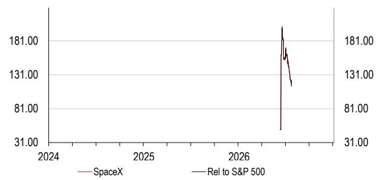
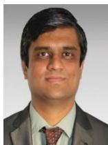
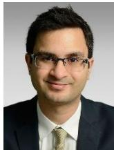
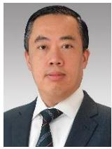
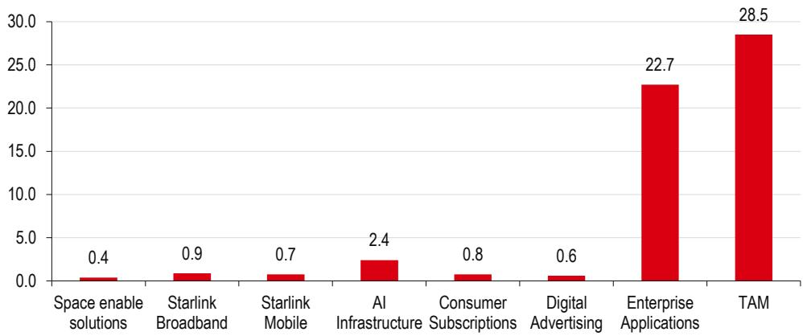
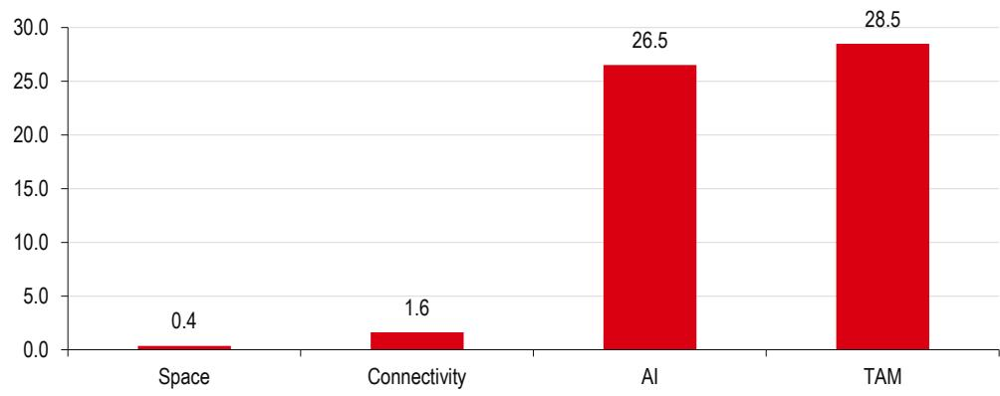
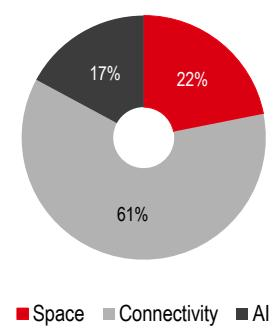
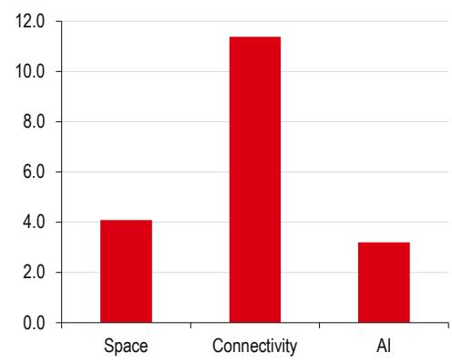

好的，这是根据您的要求改写后的版本。

# 宏观环境研究

主题研究

作者：Nicolas Cote-Colisson 和 Charlie Rothbarth

2026年7月

## 公司名称

初始评级为持有：以火箭为中心

太空、连接和人工智能旨在利用可重复、垂直整合、高成本效益的模式；该公司在火箭发射领域的市场领先地位已有效支撑了其卫星互联网业务

完全的垂直整合依赖于尚未成熟的技术，包括为其生成式人工智能模型提供的轨道计算能力，其结果将影响所需的太空发射节奏

我们以持有评级开始覆盖，基于分类加总估值法的目标价为115美元，其中包括2倍的创新溢价。我们的乐观情景估值为293美元

披露与免责声明：本报告必须与披露附录中的披露内容及分析师认证，以及构成报告一部分的免责声明一同阅读。

## 财务状况与估值：公司名称

财务报表

<table><tr><td>年份截至</td><td>12/2025a</td><td>12/2026e</td><td>12/2027e</td><td>12/2028e</td></tr><tr><td colspan="5">损益汇总 (百万美元)</td></tr><tr><td>收入</td><td>18,674</td><td>38,208</td><td>49,783</td><td>62,272</td></tr><tr><td>EBITDA</td><td>4,112</td><td>15,426</td><td>22,728</td><td>33,671</td></tr><tr><td>折旧与摊销</td><td>-6,701</td><td>-15,612</td><td>-24,194</td><td>-32,187</td></tr><tr><td>营业利润/EBIT</td><td>-2,589</td><td>-186</td><td>-1,465</td><td>1,484</td></tr><tr><td>净利息</td><td>-1,630</td><td>-3,040</td><td>-883</td><td>-958</td></tr><tr><td>税前利润</td><td>-4,219</td><td>-3,226</td><td>-2,348</td><td>526</td></tr><tr><td>HSBC 税前利润</td><td>-1,747</td><td>238</td><td>3,022</td><td>5,877</td></tr><tr><td>税收</td><td>-718</td><td>-184</td><td>399</td><td>-89</td></tr><tr><td>净利润</td><td>-4,937</td><td>-4,080</td><td>-1,949</td><td>436</td></tr><tr><td>HSBC 净利润</td><td>-2,465</td><td>-617</td><td>3,421</td><td>5,787</td></tr></table>

现金流量汇总 (百万美元)

## 持有

关键预测驱动因素

<table><tr><td>经营活动现金流</td><td>6,785</td><td>14,708</td><td>28,240</td><td>38,498</td></tr><tr><td>资本支出</td><td>-20,737</td><td>-68,587</td><td>-53,847</td><td>-59,109</td></tr><tr><td>投资活动现金流</td><td>-19,575</td><td>-75,204</td><td>-53,847</td><td>-59,109</td></tr><tr><td>股息</td><td>0</td><td>0</td><td>0</td><td>0</td></tr><tr><td>净债务变动</td><td>-3,459</td><td>-30,702</td><td>26,477</td><td>21,521</td></tr><tr><td>股权自由现金流</td><td>-14,247</td><td>-53,962</td><td>-25,607</td><td>-20,612</td></tr></table>

资产负债表汇总 (百万美元)

<table><tr><td>年份截至</td><td>12/2025a</td><td>12/2026e</td><td>12/2027e</td><td>12/2028e</td></tr><tr><td>太空业务收入</td><td>4,086</td><td>3,757</td><td>4,970</td><td>5,680</td></tr><tr><td>连接业务收入</td><td>11,387</td><td>15,551</td><td>21,903</td><td>28,822</td></tr><tr><td>人工智能业务收入</td><td>3,201</td><td>18,901</td><td>22,454</td><td>27,222</td></tr><tr><td>太空业务调整后EBITDA</td><td>653</td><td>-740</td><td>883</td><td>1,641</td></tr><tr><td>连接业务调整后EBITDA</td><td>7,168</td><td>10,089</td><td>14,626</td><td>19,864</td></tr><tr><td>人工智能业务调整后EBITDA</td><td>-1,237</td><td>9,541</td><td>12,589</td><td>17,518</td></tr></table>

<table><tr><td>无形资产</td><td>15,628</td><td>75,830</td><td>76,230</td><td>76,140</td></tr><tr><td>有形资产</td><td>43,862</td><td>100,371</td><td>149,625</td><td>176,547</td></tr><tr><td>流动资产</td><td>30,952</td><td>101,964</td><td>55,197</td><td>36,714</td></tr><tr><td>现金及其他</td><td>24,747</td><td>87,818</td><td>41,316</td><td>19,795</td></tr><tr><td>总资产</td><td>92,079</td><td>279,459</td><td>282,345</td><td>290,695</td></tr><tr><td>经营性负债</td><td>27,858</td><td>34,947</td><td>35,706</td><td>39,179</td></tr><tr><td>总债务</td><td>22,896</td><td>55,265</td><td>35,240</td><td>35,240</td></tr><tr><td>净债务</td><td>-1,851</td><td>-32,553</td><td>-6,076</td><td>15,445</td></tr><tr><td>股东权益</td><td>41,325</td><td>182,198</td><td>204,349</td><td>209,227</td></tr><tr><td>投入资本</td><td>16,184</td><td>155,401</td><td>204,029</td><td>230,428</td></tr></table>

比率、增长与每股分析

估值数据

<table><tr><td>年份截至</td><td>12/2025a</td><td>12/2026e</td><td>12/2027e</td><td>12/2028e</td></tr><tr><td>EV/销售额</td><td>81.0</td><td>38.8</td><td>30.3</td><td>24.6</td></tr><tr><td>EV/EBITDA</td><td>368.0</td><td>96.1</td><td>66.4</td><td>45.5</td></tr><tr><td>EV/IC</td><td>93.5</td><td>9.5</td><td>7.4</td><td>6.6</td></tr><tr><td>市盈率*</td><td>nm</td><td>nm</td><td>440.4</td><td>260.3</td></tr><tr><td>市净率</td><td>8.2</td><td>6.8</td><td>7.4</td><td>7.2</td></tr><tr><td>自由现金流回报表现 (%)</td><td>-0.9</td><td>-3.6</td><td>-1.7</td><td>-1.4</td></tr><tr><td>股息回报表现 (%)</td><td>0.0</td><td>0.0</td><td>0.0</td><td>0.0</td></tr></table>

\* 基于HSBC每股收益（稀释后）

ESG指标

<table><tr><td>环境指标</td><td>12/2025a</td></tr><tr><td>温室气体排放强度*</td><td>n/a</td></tr><tr><td>能源强度*</td><td>n/a</td></tr><tr><td>二氧化碳减排政策</td><td>是</td></tr><tr><td>社会指标</td><td>12/2025a</td></tr><tr><td>员工成本占收入百分比</td><td>n/a</td></tr><tr><td>员工流动率 (%)</td><td>n/a</td></tr><tr><td>多元化政策</td><td>是</td></tr></table>

<table><tr><td>治理指标</td><td>12/2025a</td></tr><tr><td>董事会成员人数</td><td>8</td></tr><tr><td>董事会平均任期 (年)</td><td>12.9</td></tr><tr><td>女性董事会成员比例 (%)</td><td>12.5</td></tr><tr><td>独立董事会成员比例 (%)</td><td>62.5</td></tr><tr><td>董事会成员人数</td><td></td></tr><tr><td>董事会成员人数</td><td></td></tr></table>

来源：公司数据，HSBC
\* 温室气体强度和能源强度分别以千克和千瓦时为单位，相对于以千美元计的收入进行衡量。

<table><tr><td>年份截至</td><td>12/2025a</td><td>12/2026e</td><td>12/2027e</td><td>12/2028e</td></tr><tr><td colspan="5">同比变化百分比</td></tr><tr><td>收入</td><td>33.2</td><td>104.6</td><td>30.3</td><td>25.1</td></tr><tr><td>EBITDA</td><td>-4.1</td><td>275.2</td><td>47.3</td><td>48.1</td></tr><tr><td>营业利润</td><td>-655.6</td><td></td><td></td><td></td></tr><tr><td>税前利润</td><td>-1843.4</td><td></td><td></td><td></td></tr><tr><td>HSBC 每股收益</td><td>-875.9</td><td></td><td></td><td>69.1</td></tr><tr><td colspan="5">比率 (%)</td></tr><tr><td>收入/投入资本 (x)</td><td>0.9</td><td>0.4</td><td>0.3</td><td>0.3</td></tr><tr><td>ROIC</td><td>-14.5</td><td>-0.2</td><td>-0.7</td><td>0.6</td></tr><tr><td>ROE</td><td>-7.3</td><td>-0.6</td><td>1.8</td><td>2.8</td></tr><tr><td>ROA</td><td>-6.6</td><td>-1.8</td><td>-0.7</td><td>0.2</td></tr><tr><td>EBITDA 利润率</td><td>22.0</td><td>40.4</td><td>45.7</td><td>54.1</td></tr><tr><td>营业利润率</td><td>-13.9</td><td>-0.5</td><td>-2.9</td><td>2.4</td></tr><tr><td>EBITDA/净利息 (x)</td><td>2.5</td><td>5.1</td><td>25.8</td><td>35.1</td></tr><tr><td>净债务/权益</td><td>-4.5</td><td>-17.2</td><td>-2.9</td><td>7.1</td></tr><tr><td>净债务/EBITDA (x)</td><td>-0.5</td><td>-2.1</td><td>-0.3</td><td>0.5</td></tr><tr><td>经营活动现金流/净债务</td><td></td><td></td><td></td><td>249.3</td></tr><tr><td colspan="5">每股数据 (美元)</td></tr><tr><td>报告每股收益 (稀释后)</td><td>-1.69</td><td>-0.38</td><td>-0.15</td><td>0.03</td></tr><tr><td>HSBC 每股收益 (稀释后)</td><td>-0.84</td><td>-0.06</td><td>0.26</td><td>0.44</td></tr><tr><td>每股股息</td><td>0.00</td><td>0.00</td><td>0.00</td><td>0.00</td></tr><tr><td>每股账面价值</td><td>14.12</td><td>16.91</td><td>15.63</td><td>16.01</td></tr></table>

发行人信息

<table><tr><td>股价 (美元)</td><td>115.26</td></tr><tr><td>目标价 (美元)</td><td>115.00</td></tr><tr><td>路透代码 (股票)</td><td>SPCX.N</td></tr><tr><td>彭博代码 (股票)</td><td>SPCX US</td></tr><tr><td>市值 (百万美元)</td><td>1,516,729</td></tr></table>

<table><tr><td colspan="2">自由流通股比例</td><td>5%</td></tr><tr><td>行业</td><td colspan="2">互联网软件与服务</td></tr><tr><td colspan="2">国家/地区</td><td>美国</td></tr><tr><td>分析师</td><td colspan="2">Nicolas Cote-Colisson</td></tr><tr><td>联系方式</td><td colspan="2">+44 20 7991 6826</td></tr></table>

相对价格

来源：HSBC
注：价格为2026年7月22日收盘价

## 认识我们的全球科技分析师

Paul Rossington\*
Yaryna Kobel

Nicolas Cote-Colisson\*
董事总经理，全球科技平台研究主管
订阅Nicolas的研究
nicolas.cote-colisson@hsbcib.com

全球科技平台分析师

订阅Charlie的研究

charlie.rothbarth@hsbc.com

高级全球科技平台分析师
订阅Paul的研究
paul.rossington@hsbcib.com

Abhishek Shukla\*, CFA

订阅Abhishek的研究

abhishek2.shukla@hsbc.com

Mohammed Khallouf\*, CFA

Madhvendra Singh\*, CFA

全球科技平台分析师
订阅Mohammed的研究
mohammed.khallouf@hsbc.com

高级分析师，TMT
订阅Madhvendra的研究 madhvendra.singh@hsbc.com

Phani Kanumuri

<table><tr><td>分析师，TMT</td></tr><tr><td>订阅Phani的研究phani.kanumuri@us.hsbc.com</td></tr></table>

Ali Naqvi\*

ali.naqvi@hsbc.com

全球科技硬件与半导体研究主管

订阅Frank的研究

frank.lee@hsbc.com.hk

Pushkar Tendolkar\*

Corey Chan\*
(Reg. No. S1700518100001)
主管，A股工业与可再生能源研究

订阅Corey的研究

corey.chan@hsbcqh.com.cn

高级全球汽车分析师

订阅Mike的研究

michael.tyndall@hsbc.com

订阅Pushkar的研究 pushkarnarendratendolkar@hsbc.co.in

Dylan Whitfield\*, FCA

主管，会计估值与法务会计

dylan.b.whitfield@hsbc.com

公司治理分析师

yaryna.kobel@hsbc.com

Stephen Bersey

美国科技研究主管

订阅Steve的研究

stephen.bersey@us.hsbc.com

## 目录

为何阅读本报告？ 4
来自太空的信息 8
估值溢价合理 17
太空——平台 29
连接 / 卫星互联网 42
人工智能 57
财务报表回顾 86
从另一家公司的经验中学习 89
治理 92
披露附录 102
免责声明 105

我们感谢班加罗尔团队Sonam Chamaria（首席助理副总裁）和Pulkit Aggarwal（助理副总裁）对本报告的贡献。

## 为何阅读本报告？

\- 该公司在商业太空发射市场拥有竞争优势和领先地位，支撑其长期战略

\- 迄今为止拥有强大的创新记录；我们对其未来愿景（包括太空数据中心、超级芯片工厂和月球经济）的定价持审慎态度

我们将“创新溢价”应用于我们的基础估值，得出目标价115.00美元，这意味着0.2%的下行空间，因此我们以持有评级开始覆盖；我们的乐观情景估值为293.00美元

## 市场如何看待该公司

我们认为该公司存在两大读者阵营。一些人将其视为一个基础平台，整合了CEO的全部愿景，有潜力改变世界。第二个阵营可能不完全否定其计划，但不愿在成果交付前支付溢价。我们注意到，另一家相关公司并未按照传统基本面进行交易，这反映出看涨读者可能比更怀疑的读者提供更多支持。

## 我们为讨论带来的视角

该公司带来了一系列技术创新和未来机遇。然而，我们认为读者在评估公司时应考虑一系列问题。我们旨在本报告中更详细地分析这些问题，同时对其招股说明书中的一些内容提出质疑，包括连接业务的总潜在市场、轨道数据中心的必要性或可行性，以及超级芯片工厂，以及因此所需的发射节奏。

## 我们对2030年的预期

对于集团，我们估计收入为1060亿美元，调整后EBITDA为760亿美元，GAAP营业利润为160亿美元，自由现金流为129亿美元。从我们了解的共识预期来看，我们对2030年收入和调整后EBITDA的预期比市场低72%。最终，我们可能是错的，但也可能是对的——要实现这些更高的收入预期，必须克服各种挑战，但我们认为这在2030年前不可行。

## 我们如何估值——详细的分类加总估值法和“创新溢价”

我们分别对每个业务部门进行估值，然后应用2.0倍的“创新溢价”（第17页）。

在估值公司时，分析师有时会应用折价（控股结构、负协同效应、风险等），但我们也考虑了应用溢价的情况，特别是当一位强势创始人拥有改变某些行业（包括汽车和火箭）的可靠记录时。我们考虑了几种估值方法，包括用于估值特殊目的收购公司、矿业股或生物技术/制药行业的方法，但根据我们的观点，这些方法都没有正确捕捉我们认为应考虑的创新倍数。因此，我们研究了另一家相关公司上市后前10年的股价表现，我们认为这是确定估值溢价最合适的参考，因为其在CEO/创始人、创新方法以及将颠覆性技术发展为可持续业务方面具有共性。

基于我们对另一家公司股价表现和卖方研究分析师设定的共识目标价的观察，我们得出结论，在其上市后的前10年（即2010-20年，我们选取此阶段以反映业务的早期阶段和创新速度），其股价比前一年的平均目标价高出超过一倍（118%）。这表明基础估值方法并未反映市场可能愿意为管理层或“飞轮”效应支付的价格，即技术和效率的渐进式进步随时间累积，最终形成一个可持续、增长的业务模式。我们对“科技七巨头”同行组进行了相同的计算，并得出在同一时间段（2010-20年）内，溢价要低得多，为18%。因此，我们估计该公司相对于更广泛的科技市场存在100%（118%减去18%）的“创新溢价”（即2.0倍）。我们认为，鉴于相似的管理方法和可能更强的飞轮效应，该公司也可能享有同样的溢价。我们将此“创新溢价”应用于我们的基础分类加总估值，得出目标价115.00美元。我们认为我们的创新溢价大致是更广泛使用的“集团折价”的反面。与所有估值溢价一样，它可能会发生变化。

## 乐观情景：每股293美元

我们为每个部门定义乐观情景，并将它们汇总，构建该公司的“乐观情景”，得出每股293美元的价值。

$\diamond$ 太空业务：我们的乐观情景假设新一代火箭的商业可行性始于2027年，总入轨质量是我们基础情景假设的2倍（第21页）。

连接业务：我们增加了卫星互联网宽带和移动服务的潜在市场，并提高了每用户平均收入，同时应用了更高的EV/销售额倍数（第22页）。

人工智能业务：我们将社交媒体平台的估值倍数提高20%，将人工智能模型的估值改为以另一家科技公司EV/销售额为基准（提升4.2倍），假设未来计算能力采购的估值更高，并将另一项收购标的的估值提高20%，以反映更高的增长机会（第24页）。

## 读者需要考虑的关键问题及我们的观点

## 公司定义的总潜在市场：真的可实现吗？

公司的招股说明书指出总潜在市场为28.5万亿美元，其中大部分来自人工智能（公司估计为26.5万亿美元），其次是连接业务（语音和宽带通信，1.6万亿美元）和太空发射（0.4万亿美元）。

挑战：公司考虑的总潜在市场相当于全球GDP的四分之一（2026年世界银行、HSBC估计为126万亿美元）。

HSBC的观点：对于人工智能，我们不认为该公司能成为与现有领先人工智能实验室和超大规模企业竞争的一流对手。其人工智能公司目前在陆地人工智能计算和前沿模型开发方面处于规模劣势。此外，对于连接业务，我们识别出的可寻址机会较小（1050-3100亿美元，而公司报告的总潜在市场为1.6万亿美元），因为传统电信运营商已经为相当大比例的人口（尤其是在城市/近郊区域）提供了连接解决方案。虽然我们认为太空总潜在市场是最容易进入的，但它是三个部门中最小的（占公司计算总潜在市场的11%）。

## 公司的人工智能模型能否赶上顶尖的人工智能大语言模型实验室？

目前，该模型是一个高智能的前沿模型，但缺乏其他人工智能实验室和大型科技公司那样的企业和消费者渗透率。公司将其定位为人工智能生态系统的核心部分，并作为“寻求真相”的人工智能。

挑战：该模型目前严重亏损，主要面向消费者，企业采用有限。它如何打入前三名？其人工智能公司在陆地人工智能计算和前沿模型开发的规模上处于竞争劣势。它将如何获得市场份额并与超大规模企业和已建立的人工智能实验室竞争？

HSBC的观点：我们认为，要赢得人工智能计算和前沿模型的市场份额，它必须像超大规模企业/领先的人工智能实验室那样投入。我们预测该公司2026年资本支出约为700亿美元，而另一家大型科技公司约为1900亿美元，其中大部分用于其云服务。

更多内容请参见第57页。

## 轨道数据中心是否可行且必要？

该公司计划每年向轨道发射100GW的计算能力，这大约相当于美国年发电量的20%。另一家大型科技公司计划在两年内增加约8GW的计算能力，使其总计算能力达到16GW。

挑战：要使轨道数据中心成为主流计算选择，发射成本需要进一步下降，某些工程挑战（包括冷却、电池和延迟等）必须克服，运营成本也需要降低。

HSBC的观点：我们认为在未来十年内，在太空建立大规模数据中心没有经济上的合理性，尽管该公司预计最早在2028年开始部署其轨道人工智能计算卫星（另一家公司的研究实验室也在“探索基于太空的可扩展人工智能基础设施系统设计”）。

更多内容请参见第77页。

## 卫星互联网能否从传统电信业务中夺取市场份额？

通过其卫星星座，该公司意图颠覆现有的电信运营商。在招股说明书中，公司指出电信运营商一直在减少资本支出，这意味着该行业维持历史高网络部署的意愿有限。

挑战：业务覆盖全球受众的挑战主要集中在监管、技术和缺乏政府支持上。此外，其溢价定价可能会限制采用。

HSBC的观点：鉴于上述挑战，我们估计可服务可获取市场比公司估计的总潜在市场低78-92%，与电信运营商合作是最可能的市场进入途径。与地面网络直接和普遍竞争将面临物理定律固有的困难。

## 更多内容请参见第50页。

## 超级芯片工厂的制约因素

该公司的超级芯片工厂项目旨在与另一家公司合作创建一个集成的半导体设施，这与当前半导体行业高度分散的价值链形成对比。该项目旨在实现每年1TW的产出，以满足内部和外部的AI需求。

挑战：我们认为这过于雄心勃勃，项目细节很少。制约因素包括经济和财务可行性、对单一供应商的依赖、内存瓶颈、半导体设备瓶颈、能源限制和人才短缺。

HSBC的观点：我们认为这是一个长期的愿景，而非短期的催化剂，并注意到另一家类似项目在美国的时间线困难。

更多内容请参见第75页。

## 公司的高现金消耗

该公司存在一些短期现金需求。

挑战：首先，它需要与同行保持同步的投入，以获得相同数量的计算能力来实现其目标，尤其是在人工智能领域。其次，它尚未通过超级芯片工厂实现垂直整合，因此必须在租赁前为外部计算能力（芯片）付费。第三，大语言模型的训练和部署需要资金。

HSBC的观点：我们预计该业务将在2030年实现正向自由现金流，在此之前公司将使用1060亿美元的现金。

更多内容请参见第98页。

## 读者对会计政策是否满意？

公司的财务信息依赖于主观判断、估计和管理层对公司未来预期运营的看法。

挑战：公司业务（尽管并非全部）大部分处于早期发展阶段，以及公司管理层的非常规方法，在考虑公司的财务报告和控制环境（最终产生信息和披露）时应予以考虑。

HSBC的观点：尽管我们对公司的会计没有重大的直接担忧，但我们的法务会计师建议保持谨慎，并在考虑财务信息和公司提供的财务披露时特别小心。

## 更多内容请参见第86页。

## 治理政策是否可接受？

与其他大型科技公司相比，该公司的治理有其独特性。这些包括：1）相对少见能罢免CEO的人是CEO本人，2）IPO后82%的投票权由CEO和创始人持有，3）公司将对股东纠纷进行强制仲裁。

挑战：拥有IPO后82%的投票权，创始人实际上掌控一切。因此，股东只能指望创始人/CEO实施符合其利益的战略。此外，公司的战略受美国政策变化的影响。

HSBC的观点：我们对治理政策不持立场，但我们在本报告中对此进行了更详细的解释。然而，读者应该意识到这些。

## 更多内容请参见第92页。

## 来自太空的信息

\- 该公司在商业太空发射市场拥有竞争优势和领先地位，支撑其战略和卫星互联网行业

\- 长期投资案例依赖于垂直人工智能战略，包括前沿模型、地面和轨道人工智能计算以及超级芯片工厂，而其中一些技术尚待开发

我们以持有评级和115.00美元的目标价开始覆盖该公司，这意味着0.2%的下行空间

## 使命明确，但能否实现？

## 完全垂直整合取决于技术创新

该公司成立于2002年，如今由太空、连接和人工智能三大支柱组成，旨在利用可重复、垂直整合的商业模式，以期实现成本效益。这促进了太空发射能力，以支持其通信业务，并在未来（如果能够实现）提供轨道计算能力以支持其生成式人工智能模型，同时构建可能是人工智能价值链中最高壁垒的半导体。该公司还怀有潜在的月球经济和小行星采矿的雄心。如果所有这些雄心都能实现，我们认为将形成一个重大且具有变革性的业务“飞轮”。

太空：该公司是全球太空发射市场的领导者；它估计总潜在市场为0.4万亿美元。2025年收入为41亿美元，占总收入的22%。

连接：卫星互联网是全球卫星连接领域的领导者；它估计总潜在市场为1.6万亿美元。2025年收入为114亿美元，占总收入的61%。

人工智能：根据该公司的说法，最大的可寻址总潜在市场为26.5万亿美元；2025年收入为32亿美元，占总收入的17%。其中，18亿美元来自广告。人工智能部门包括基础设施（目前是地面，并计划将计算部署到太空）、消费者订阅、广告和企业应用。

在我们的估值过程中，我们不考虑该公司的长期太空/星际雄心，包括长途地球旅行、太空旅游、月球/火星客运和货运、能源生产、在轨制造或小行星采矿。

该公司按全球行业划分的估计总潜在市场（万亿美元）

来源：公司数据，HSBC

该公司按业务部门划分的估计总潜在市场（万亿美元）

来源：公司数据，HSBC
2025年按部门划分的收入

来源：公司数据，HSBC

2025年按部门划分的相对收入（十亿美元）

来源：公司数据，HSBC

## 可重复、垂直整合的商业模式...

## '飞轮'解释

该公司指出，其商业模式的基石建立在其市场领先的发射能力，以及一个可重复、以工程为驱动的框架上，该框架专注于垂直整合、快速迭代和严谨的资本投资，其核心原则是：

\- 利用无与伦比的发射能力，能够大规模部署太空资产，否则这些资产在经济上不可行。

\- 发射业务支持连接业务，包括其为消费者、企业和政府提供的现有全球宽带和移动连接。

\- 如果计算基础设施可以部署在太空，并且如果超级芯片工厂能够生产半导体，那么也支持人工智能。

以世界一流的工程设计和第一性原理思维设计解决方案，基于物理学的、自下而上的方法，推动性能、可扩展性和成本的“阶跃式”改进。

应用“算法”（减少愚蠢、删除、优化、加速、自动化），这是一个五步迭代过程，应用于组织的各个方面，创造了自公司成立以来定义其的文化和运营标准。

\- 通过内部生产大部分组件（例如发动机、航空电子设备、结构、软件、半导体）实现向最终客户的垂直整合，从而缩短技术开发速度并实现成本效益。

通过火箭的可重复使用性、规模化制造、先进自动化和运营纪律，持续降低成本并提高吞吐量，以降低单位成本，同时提高发射节奏、卫星网络和人工智能托管能力。

产生大量现金流并再投资于未来/新兴市场，推动一个自我强化的持续创新循环，并创造额外价值。

## ...拥有可证明的技术创新记录

我们概述了该公司可重复、垂直整合的商业模式如何已经为其太空和连接部门带来了切实的利益，以及为什么这对于更大的人工智能总潜在市场具有相关性。

## 太空：以更低的发射成本支撑的市场领先地位

该公司是第一家将液体燃料火箭送入轨道（2008年）、将私人航天器与国际空间站对接（2012年）、以及实现推进式着陆（2015年）和重复飞行轨道级火箭助推器（2017年）的私营公司。根据NASA的数据，优越的成本基准和内部生产（该公司约85%的火箭部件在内部制造）使得猎鹰9号能够将有效载荷发射成本降低85%，至每公斤2,700美元（之前为每公斤18,500美元），有效载荷为23吨。具有更大有效载荷的猎鹰重型火箭进一步将发射成本降低至每公斤1,400美元。

对价值链的端到端控制带来了相对于同行的成本效率，以及可靠和高节奏的发射服务。截至2026年3月31日，该公司已通过超过650次发射将约7,400吨质量送入轨道，任务成功率为99%。现在的重点是开发新一代火箭，这是一种全新的完全可重复使用的两级火箭，迄今已完成12次测试发射，预计于2026年下半年开始商业发射，目标是通过100吨的有效载荷进一步降低发射成本。

## 连接：快速低轨部署支撑的市场领先地位

卫星互联网于2020年推出，运营着世界上最大的低延迟天基互联网宽带和移动服务，高峰时段下载速度中位数为225Mbps。卫星互联网可以在地球上的任何地方提供此服务，这得益于由超过9,600颗低轨卫星组成的网络，其中约3,100颗于2025年发射，是第二大低轨卫星网络的
