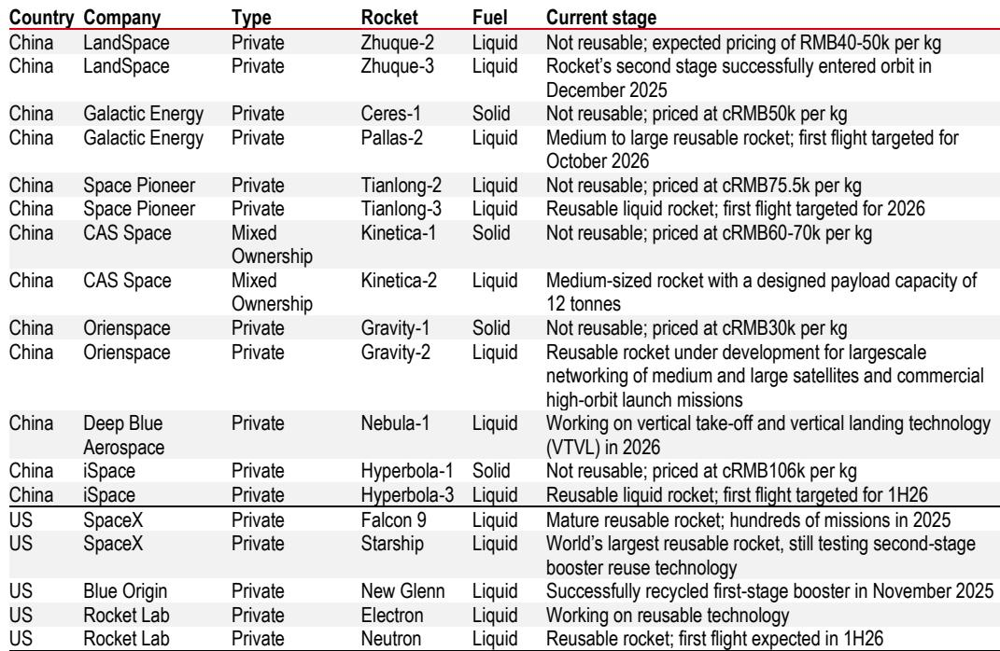
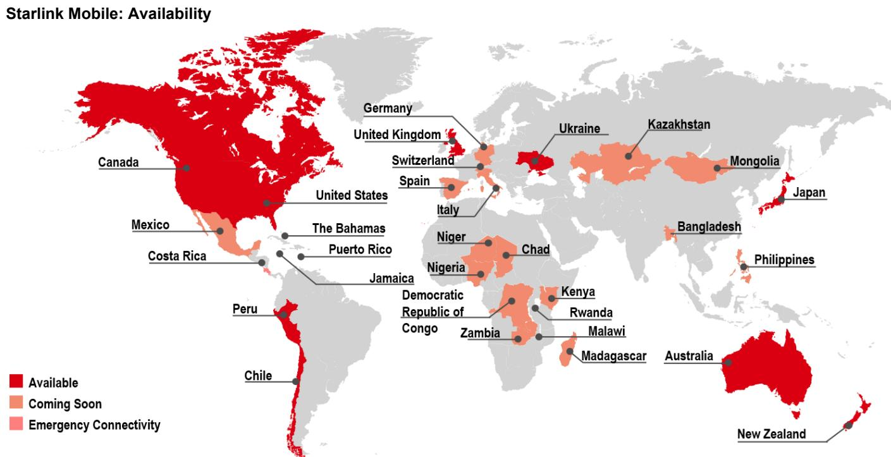
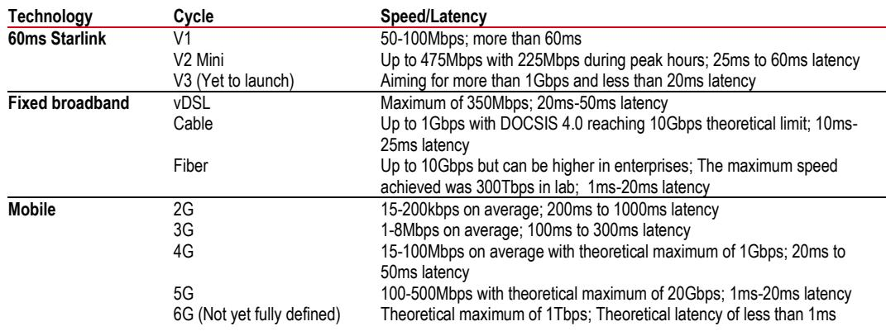

# SpaceX的估值：未经验证的AI与连接梦想能否支撑以火箭为核心的现实？

SpaceX在2025年产生了187亿美元的收入，然而该公司公布的GAAP运营亏损为26亿美元，净亏损为49亿美元。核心矛盾不在于SpaceX能否发射火箭——它显然可以，在商业发射市场占据主导地位——而在于其在人工智能和轨道连接领域的未来主义雄心，能否最终产生足以支撑其超过1.5万亿美元市值的回报。一份全球投资银行的报告开始覆盖SpaceX，并给出了其观点。该报告的乐观情景假设所有三个业务部门都取得积极成功，将公司估值定为每股293美元——这一数字仍远低于看涨读者似乎正在定价的水平。

市场热情与基本面估值之间的脱节，对于这家创始人领导的公司来说并不新鲜。该报告直接将其与特斯拉上市后的第一个十年相提并论，当时其股票交易价格相对于更广泛的“科技七巨头”科技集团，享有超过两倍的“创新溢价”，而这一溢价是通过在汽车制造领域的实际执行能力赢得的。SpaceX现在要求读者将同样的信任延伸到那些公司没有可靠业绩记录、且面临根深蒂固、资金充足的竞争对手的领域——尤其是地面AI和轨道数据中心。

本文的核心论点直截了当：SpaceX的火箭和星链连接业务构成了一个可信的、能产生现金流的基石，但公司的估值几乎完全依赖于未经证实的技术和市场，这些技术和市场可能无法在公司预期的时间表或规模上实现。读者必须区分SpaceX已经取得的成就和它仅仅承诺的东西。

## SpaceX的火箭业务是经过验证的引擎，但它也是最小的收入驱动力

太空发射部门在2025年仅产生了41亿美元的收入，仅占集团总收入的22%。到2028年，该报告预计太空业务收入将达到57亿美元，年复合增长率约为12%——对于一个成熟的发射业务来说，这个数字尚可，但远非公司总潜在市场声称所暗示的爆炸性增长。太空业务的调整后EBITDA利润率波动较大，从2025年的6.53亿美元，到2026年预计亏损7.4亿美元，再到2028年恢复至16亿美元。

利润率的波动反映了开发星舰所需的巨额资本支出，SpaceX认为星舰是其更雄心勃勃计划的关键。报告指出，全面的垂直整合——意味着SpaceX几乎所有的东西都内部制造，从发动机到航天器——过去一直是成本优势的来源。但星舰的商业可行性仍未得到证实，该报告的基本情况假设星舰在2027年之后才能达到全面商业运营。即便如此，该报告对太空业务的乐观情况也只是假设星舰向轨道运送的质量是基本情况的两倍——这是一个相对温和的上行空间，对整体估值贡献不大。

战略含义很明确：太空发射是基础，而不是增长故事。它提供了支持星链以及最终轨道AI计算所需的物理基础设施，但它本身无法支撑万亿美元的估值。只关注SpaceX发射主导地位的读者，可能会忽略这一部门在收入和叙事中所占份额都在缩小的事实。

## 星链的连接潜在市场远小于SpaceX声称的规模

SpaceX的SEC S-1表格招股说明书估计，连接业务的全球总潜在市场为1.6万亿美元，涵盖语音和宽带通信。该报告直接质疑了这一数字，估计实际潜在机会仅为1050亿至3100亿美元。差距产生的原因是，传统电信运营商已经通过光纤、电缆和5G网络服务于绝大多数城市和近郊人口。星链的竞争优势——为偏远和服务不足地区提供低地球轨道卫星覆盖——是真实存在的，但属于利基市场。

连接业务收入在2025年达到114亿美元，预计到2028年将增长至288亿美元，同期调整后EBITDA利润率将从63%扩大到69%。这些数字表现强劲，星链显然是SpaceX投资组合中的现金生成机器。但增长轨迹意味着减速：该报告预计2026年收入增长37%，2027年放缓至32%，2028年放缓至28%。即使达到288亿美元，星链在报告的下限连接TAM中占比仍不到2%，这表明市场渗透率不是限制因素——用户获取成本和定价权才是。

该报告对连接业务的乐观情况假设了更大的潜在市场和更高的每用户平均收入，但即使在这种情况下，也无法弥合与SpaceX自身TAM之间的差距。对读者而言，这意味着星链是一项高质量但有明确天花板的业务。它可以产生可观的现金流，但无法单枪匹马地证明当前的企业价值是合理的。

## AI业务是估值中的变数，且面临最严峻的挑战

SpaceX预计AI的总潜在市场为26.5万亿美元，这一数字相当于全球GDP的四分之一左右。该公司的AI雄心涵盖三个主要举措：由xAI开发的Grok大型语言模型、由星舰发射支持的轨道数据中心，以及用于AI硬件的Terafab制造概念。该报告对这三者都持怀疑态度，财务预测也证实了这一点。

AI收入在2025年为32亿美元，但预计将在2026年激增至189亿美元，这意味着一年内增长近六倍。到2028年，该报告预计AI收入将达到272亿美元。然而，AI的调整后EBITDA从2025年亏损12亿美元，转变为2026年盈利95亿美元——这一转变需要对Grok的市场采用率和轨道计算的商业可行性做出非同寻常的假设。

该报告指出了三个具体挑战。首先，Grok目前作为一个高智能前沿模型运行，但在企业和消费者渗透率方面落后于OpenAI和Alphabet等竞争对手。它目前严重亏损，主要面向消费者，企业采用有限。其次，轨道数据中心——将AI计算硬件置于太空以减少延迟并利用太阳能的想法——依赖于尚未得到验证的技术。该报告质疑了这种方法的必要性和可行性，指出地面数据中心的效率和成本仍在持续改进。第三，用于AI制造的Terafab概念仍处于概念阶段，没有明确的商业化规模路径。

该报告对AI的乐观情况应用了基于Palantir企业价值/销售倍数的估值倍数——比基本情况高出4.2倍——并假设计算承购和Cursor编码助手的价值更高。即便如此，乐观的AI估值也无法弥合与隐含市场预期之间的差距。该报告明确指出，其预测比Visible Alpha对2030年收入和调整后EBITDA的共识低72%，这意味着市场乐观方对AI的期望远高于报告分析师认为可实现的范围。

## 评估SpaceX三业务模式的决策框架

对于试图形成对SpaceX看法的严肃读者来说，该报告的分析建议了一个基于三个问题的结构化决策框架，每个问题对应公司的一个业务部门。

首先，随着星舰的规模化，太空发射业务能否保持其成本优势？答案取决于星舰是否能以SpaceX目标的速度和成本实现可重复使用。报告指出，全面的垂直整合一直是优势来源，但星舰的开发成本巨大——报告预计仅2026年的资本支出就达686亿美元，是2025年水平的三倍多。如果星舰遇到技术延迟或成本超支，整个财务模型都会发生变化，因为星链和AI都依赖于低成本、高频率的发射能力。

其次，星链能否在不引发电信运营商竞争反应的情况下，扩展到其利基市场之外？该报告较低的TAM估计意味着星链的最佳机会在于农村宽带、海事连接和政府合同。这些市场有利可图但规模有限。如果星链试图在城市地区与光纤和5G正面竞争，它将面临已经拥有基础设施的运营商的定价竞争。需要关注的关键指标是每用户平均收入和用户获取成本，而不仅仅是总用户数。

第三，SpaceX是否有一条不依赖轨道计算就能成为高质量AI公司的可信路径？这是最难的问题。报告表明，xAI的地面AI计算和前沿模型开发在规模上相对于领先的AI实验室处于劣势。Grok需要在能力和采用率上跻身前三名前沿模型，这需要大量的资本、人才和时间。轨道数据中心如果可行，可能会提供差异化的优势，但技术尚未得到验证，时间表也不确定。相信AI故事的读者也必须相信，SpaceX能够在OpenAI、谷歌、微软和Meta拥有多年先发优势的领域超越它们。

该框架得出了一个清晰的结论：太空和连接业务本身具有研究价值，但AI业务是一个二元赌注。如果AI成功，SpaceX可能成为历史上最有价值的公司之一。如果失败，当前的估值几乎没有容错空间。

## 创新溢价是一把双刃剑

该报告最具特色的分析贡献是应用于基本面分部加总估值的“创新溢价”。通过比较特斯拉上市头十年相对于分析师目标的股价表现与“科技七巨头”，该报告得出了100%的溢价，即2倍，并将其应用于SpaceX的基本情况估值。这一溢价旨在捕捉市场愿意为创始人主导的创新以及业务部门之间相互关联的复合“飞轮”效应买单的意愿。

这种方法在智力上是诚实的：它承认传统的估值方法会系统性地低估具有这位创始人过往记录和愿景的公司。但这也是一个警告。创新溢价并非股票的永久特征。它是衡量市场情绪的一种指标，可以根据执行情况而扩大或缩小。特斯拉的溢价持续了十年，因为该公司反复实现了雄心勃勃的生产目标。如果SpaceX在星舰上受挫，或者如果Grok未能获得发展势头，溢价可能会迅速压缩。

该报告给出了其估值水平。每股293美元的乐观情景需要所有三个部门同时成功——这是一个低概率的结果，该报告并未将其作为基本情况推荐。对读者来说，问题不在于SpaceX是否是一家创新公司。它显然是。问题在于，当前的价格是否已经反映了这种创新，从而为新买家留下的上行空间很小。

*仅供参考。部分内容可能基于源材料通过AI辅助生成、翻译、总结或编辑，可能存在遗漏或错误。请独立核实。这不构成投资、法律、税务、会计或其他专业建议。*

仅供参考。部分内容可能基于源材料通过AI辅助生成、翻译、总结或编辑，可能存在遗漏或错误。请独立核实。这不构成投资、法律、税务、会计或其他专业建议。

