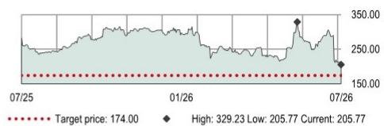
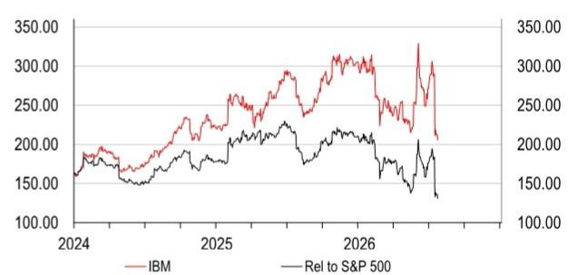
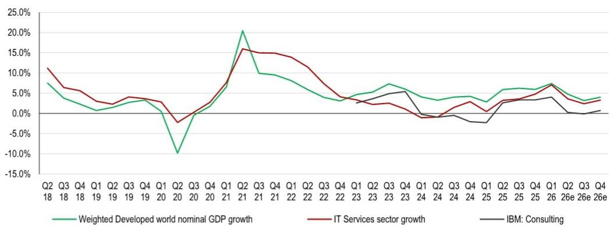

# 关于IBM近期业绩与市场表现的观察笔记

## 利润率指引表现突出，但其他领域或存在更优选择

IBM下调了2026年固定汇率收入指引，但仍维持非GAAP税前利润率同比提升100个基点的预期。

- 将2026-30年非GAAP每股盈利预测上调1-2%，以反映高于预期的利润率指引
- 尽管每股盈利预测上调1-2%，但由于市场整体估值倍数下调，目标价从175美元微调至174美元。维持现有评级。

**利润率指引表现突出**：如2026年7月14日预先披露，2026年第二季度收入按固定汇率计算同比增长1%至171.61亿美元（2026年第一季度：增长6%）。公司将2026年固定汇率收入增长指引从此前超过5%下调至4%-5%。尽管收入指引下调，管理层仍维持2026年非GAAP税前利润率同比提升100个基点的预期。2026年第二季度非GAAP税前利润率同比提升30个基点，但主要得益于该季度2.8亿美元的非GAAP其他收入（2025年第二季度：6500万美元）。预期利润率改善在多大程度上来自其他收入等一次性项目，是值得关注的关键点。

**软件板块表现不及预期**：软件板块固定汇率增速从2026年第一季度的8%放缓至4.6%。有机增速在2026年第二季度降至同比0%（2026年第一季度：我们估计为7%）。管理层将2026年固定汇率收入增长指引从此前超过10%下调至6-8%。交易处理子板块同比下滑9%（固定汇率）（2026年第一季度：增长2%）。管理层预计2026年下半年将出现低至中个位数的百分比下降，但表示大部分缺失的收入可能只是延迟而非流失。混合云子板块固定汇率增速在2026年第二季度同比加速至11%（2026年第一季度：10%）。自动化板块固定汇率增速在2026年第二季度放缓至3%（2026年第一季度：7%）。数据子板块报告增速在2026年第二季度加速至19%（2026年第一季度：16%），但扣除2026年第二季度Confluent收购带来的约18-19个百分点的非有机贡献后，有机增速明显放缓。

**基础设施板块出现转折**：基础设施板块固定汇率收入在2026年第二季度同比下降7%（2026年第一季度：增长12%），因新一代z17系列已进入发布后的第五个季度。大型机子板块的疲软部分被强劲的分布式基础设施子板块所抵消，后者收入同比增长37%（2026年第一季度：13%），部分得益于较低的比较基数。管理层目前预计2026年基础设施板块固定汇率收入将实现低个位数百分比增长（此前预期为低个位数下降），主要得益于分布式基础设施子板块的强劲表现。

**估值水平**：IBM当前交易于14.2倍2027年预期非GAAP EV/EBIT（行业中位数：13.9倍）。我们预计IBM的非GAAP每股盈利在2026-2028年期间将以6.7%的年复合增长率增长（行业中位数：19.2%）。我们的目标价174美元（此前为175美元）基于分类加总估值法。该目标价意味着约15.4%的下行空间，我们维持现有评级，认为其他领域存在更优选择。

## 披露与免责声明

本报告必须结合披露附录中的披露内容、分析师认证以及构成报告一部分的免责声明一起阅读。

美国

## 维持现有评级

目标价（美元） 此前目标价（美元）
174.00 175.00

当前价格（美元） 上行/下行空间
205.77 -15.4%

（截至2026年7月22日）

## 市场数据

| 项目 | 数值 |
|---|---|
| 市值（百万美元） | 193,400 |
| 三个月日均交易量（百万美元） | 2,815 |

| 项目 | 数值 |
|---|---|
| 自由流通量 | 100% |
| 彭博代码 | IBM US |
| 路透代码 | IBM.N |

财务数据与比率（美元）

| 年份 | 2025年实际 | 2026年预期 | 2027年预期 | 2028年预期 |
|---|---|---|---|---|
| HSBC每股盈利 | 11.59 | 12.16 | 12.30 | 13.86 |
| HSBC每股盈利（此前） | 11.59 | 11.56 | 12.10 | 13.60 |
| 变动（%） | 0.0 | 5.2 | 1.7 | 1.9 |
| 市场一致预期每股盈利 | 11.35 | 12.30 | 13.11 | 14.29 |
| 市盈率（倍） | 17.8 | 16.9 | 16.7 | 14.8 |
| 股息率（%） | 3.3 | 3.3 | 3.3 | 3.3 |
| EV/EBITDA（倍） | 13.2 | 14.4 | 12.6 | 11.3 |
| 净资产回报表现（%） | 36.6 | 32.8 | 29.3 | 29.2 |

52周价格走势（美元）

来源：LSEG IBES，HSBC估计

## 分析师信息

**Abhishek Shukla, CFA**
高级分析师，科技行业
HSBC Bank Middle East Limited, DIFC
abhishek2.shukla@hsbc.com
+971 4 5093343

**Stephen Bersey**
美国科技研究主管
HSBC Securities (USA) Inc.
stephen.bersey@us.hsbc.com
+1 212 525 4153

**Sameer Lam**
全球软件分析师
HSBC Bank plc
sameer.lam@hsbc.com
+44 20 7992 3780

*受雇于HSBC Securities (USA) Inc.的非美国关联机构，未根据FINRA规定注册/取得资格

报告发行人：HSBC Bank Middle East Limited, DIFC

查看HSBC全球投资研究：https://www.research.hsbc.com

## 财务数据与估值：IBM

财务报表

| 年份 | 2025年实际 | 2026年预期 | 2027年预期 | 2028年预期 |
|---|---|---|---|---|
| **利润表摘要（百万美元）** | | | | |
| 收入 | 67,535 | 70,025 | 71,325 | 75,081 |
| EBITDA | 16,843 | 15,619 | 17,199 | 18,214 |
| 折旧与摊销 | -5,022 | -3,605 | -4,319 | -3,655 |
| 营业利润/EBIT | 11,821 | 12,014 | 12,880 | 14,559 |
| 净利息 | -1,935 | -1,937 | -2,043 | -2,097 |
| 税前利润 | 10,329 | 10,735 | 11,155 | 13,038 |
| HSBC税前利润 | 12,713 | 13,744 | 14,067 | 15,950 |
| 税收 | 242 | -1,584 | -1,785 | -2,086 |
| 净利润 | 10,571 | 9,151 | 9,370 | 10,952 |
| HSBC净利润 | 10,994 | 11,607 | 11,817 | 13,398 |
| **现金流量表摘要（百万美元）** | | | | |
| 经营活动现金流 | 13,193 | 16,772 | 15,718 | 17,737 |
| 资本支出 | -1,617 | -1,574 | -1,600 | -1,600 |
| 投资活动现金流 | -10,302 | -11,770 | -1,600 | -1,600 |
| 股息 | -6,254 | -6,354 | -6,409 | -6,450 |
| 净债务变动 | 2,950 | 2,345 | -7,845 | -10,254 |
| 自由现金流（股权） | 11,575 | 15,230 | 14,118 | 16,137 |
| **资产负债表摘要（百万美元）** | | | | |
| 无形资产 | 79,108 | 87,561 | 85,781 | 84,246 |
| 有形资产 | 33,715 | 32,409 | 31,483 | 31,018 |
| 流动资产 | 36,944 | 35,308 | 41,376 | 50,565 |
| 现金及其他 | 30,654 | 28,036 | 33,881 | 42,134 |
| 总资产 | 151,879 | 157,306 | 160,669 | 167,858 |
| 经营性负债 | 48,861 | 49,708 | 50,398 | 53,284 |
| 总债务 | 61,260 | 60,987 | 58,987 | 56,987 |
| 净债务 | 30,606 | 32,951 | 25,106 | 14,853 |
| 股东权益 | 32,740 | 38,008 | 42,681 | 48,984 |
| 投入资本 | 70,252 | 77,533 | 74,361 | 70,411 |

## 现有评级

关键预测驱动因素
比率、增长与每股分析

| 年份 | 2025年实际 | 2026年预期 | 2027年预期 | 2028年预期 |
|---|---|---|---|---|
| 收入增长（%） | 8 | 4 | 2 | 5 |
| 非GAAP营业利润率（%） | 21 | 21 | 22 | 23 |
| 非GAAP税前利润率（%） | 19 | 20 | 20 | 21 |
| 非GAAP每股盈利增长（%） | 12 | 5 | 1 | 13 |

估值数据

| 年份 | 2025年实际 | 2026年预期 | 2027年预期 | 2028年预期 |
|---|---|---|---|---|
| EV/销售收入 | 3.3 | 3.2 | 3.0 | 2.7 |
| EV/EBITDA | 13.2 | 14.4 | 12.6 | 11.3 |
| EV/投入资本 | 3.2 | 2.9 | 2.9 | 2.9 |
| 市盈率* | 17.8 | 16.9 | 16.7 | 14.8 |
| 市净率 | 5.9 | 5.1 | 4.6 | 4.0 |
| 自由现金流回报表现（%） | 6.0 | 7.9 | 7.3 | 8.3 |
| 股息率（%） | 3.3 | 3.3 | 3.3 | 3.3 |

*基于HSBC每股盈利（摊薄）

ESG指标

| 环境指标 | 2024年实际 |
|---|---|
| 温室气体排放强度* | 不适用 |
| 能源强度* | 不适用 |
| 二氧化碳减排政策 | 是 |
| 社会指标 | 2024年实际 |
| 员工成本占收入比例 | 不适用 |
| 员工流动率（%） | 不适用 |
| 多元化政策 | 是 |

| 治理指标 | 2025年实际 |
|---|---|
| 董事会成员人数 | 13 |
| 董事会平均任期（年） | 不适用 |
| 女性董事会成员比例（%） | 23.1 |
| 独立董事会成员比例（%） | 92.3 |

来源：公司数据，HSBC
*温室气体排放强度和能源强度分别以千克和千瓦时计量，相对于以千美元计的收入

| 年份 | 2025年实际 | 2026年预期 | 2027年预期 | 2028年预期 |
|---|---|---|---|---|
| **同比变动（%）** | | | | |
| 收入 | 7.6 | 3.7 | 1.9 | 5.3 |
| EBITDA | 22.3 | -7.3 | 10.1 | 5.9 |
| 营业利润 | 26.0 | 1.6 | 7.2 | 13.0 |
| 税前利润 | 78.2 | 3.9 | 3.9 | 16.9 |
| HSBC每股盈利 | 11.7 | 5.0 | 1.1 | 12.7 |
| **比率（%）** | | | | |
| 收入/投入资本（倍） | 1.0 | 0.9 | 0.9 | 1.0 |
| 投入资本回报率 | 18.2 | 13.9 | 14.2 | 16.9 |
| 净资产回报表现 | 36.6 | 32.8 | 29.3 | 29.2 |
| 总资产回报表现 | 8.7 | 7.0 | 7.0 | 7.7 |
| EBITDA利润率 | 24.9 | 22.3 | 24.1 | 24.3 |
| 营业利润率 | 17.5 | 17.2 | 18.1 | 19.4 |
| EBITDA/净利息（倍） | 8.7 | 8.1 | 8.4 | 8.7 |
| 净债务/权益 | 93.5 | 86.7 | 58.8 | 30.3 |
| 净债务/EBITDA（倍） | 1.8 | 2.1 | 1.5 | 0.8 |
| 经营活动现金流/净债务 | 43.1 | 50.9 | 62.6 | 119.4 |
| **每股数据（美元）** | | | | |
| 报告每股盈利（摊薄） | 11.14 | 9.59 | 9.76 | 11.33 |
| HSBC每股盈利（摊薄） | 11.59 | 12.16 | 12.30 | 13.86 |
| 每股股息 | 6.71 | 6.75 | 6.76 | 6.76 |
| 每股账面价值 | 35.12 | 40.36 | 45.00 | 51.32 |

发行人信息

| 项目 | 数值 |
|---|---|
| 当前价格（美元） | 205.77 |
| 目标价（美元） | 174.00 |
| 路透代码（股权） | IBM.N |
| 彭博代码（股权） | IBM US |
| 市值（百万美元） | 193,400 |

| 项目 | 数值 |
|---|---|
| 自由流通量 | 100% |
| 行业 | IT服务 |
| 国家/地区 | 美国 |
| 分析师 | Abhishek Shukla, CFA |
| 联系方式 | +971 4 5093343 |

相对价格走势

来源：HSBC

注：价格为2026年7月22日收盘价

## 利润率指引表现突出

IBM于2026年7月22日公布了2026年第二季度业绩。公司已于2026年7月14日预先披露了大部分关键利润表项目，但当时未更新全年指引。

2026年第二季度收入按固定汇率计算同比增长1%至171.61亿美元（2026年第一季度：增长6%）。公司将2026年固定汇率收入增长指引从此前超过5%下调至4%-5%。

尽管收入增长指引下调，管理层仍维持非GAAP税前利润率同比提升100个基点的预期，主要得益于更高的生产力和效率、更好的供应链优化以及第三方支出减少。2026年第二季度非GAAP税前利润率同比提升30个基点，但主要得益于该季度2.8亿美元的非GAAP其他收入（2025年第二季度：6500万美元）。非GAAP营业利润率同比下降106个基点至20.4%。若非其他收入的有利影响，非GAAP税前利润率将同比下降约90个基点。

IBM：业绩演变

| 百万美元，财年截至12月 | 2024年第四季度 | 2025年第一季度 | 2025年第二季度 | 2025年第三季度 | 2025年第四季度 | 2026年第一季度 | 2026年第二季度 | 2026年第三季度预期 | 2026年第四季度预期 |
|---|---|---|---|---|---|---|---|---|---|
| 收入 | 17,554 | 14,541 | 16,978 | 16,330 | 19,686 | 15,918 | 17,161 | 16,697 | 20,248 |
| 软件 | 7,924 | 6,336 | 7,387 | 7,209 | 9,031 | 7,052 | 7,761 | 7,544 | 9,423 |
| 咨询 | 5,175 | 5,068 | 5,314 | 5,324 | 5,349 | 5,272 | 5,327 | 5,317 | 5,388 |
| 基础设施 | 4,256 | 2,886 | 4,142 | 3,559 | 5,132 | 3,326 | 3,835 | 3,612 | 5,234 |
| 其他 | 199 | 251 | 135 | 238 | 174 | 268 | 238 | 225 | 204 |
| 收入：同比 | 0.5% | 0.5% | 7.7% | 9.1% | 12.1% | 9.5% | 1.1% | 2.2% | 2.9% |
| 软件 | 10.4% | 7.4% | 9.6% | 10.5% | 14.0% | 11.3% | 5.1% | 4.6% | 4.3% |
| 咨询 | -2.0% | -2.3% | 2.6% | 3.3% | 3.4% | 4.0% | 0.2% | -0.1% | 0.7% |
| 基础设施 | -7.6% | -6.2% | 13.6% | 17.0% | 20.6% | 15.2% | -7.4% | 1.5% | 2.0% |
| 收入：同比，固定汇率 | 2.0% | 2.0% | 5.0% | 7.0% | 9.0% | 6.0% | 1.0% | 3.8% | 3.9% |
| 软件 | 9.0% | 9.0% | 8.0% | 9.0% | 11.0% | 8.0% | 4.6% | 6.2% | 5.3% |
| 咨询 | 1.0% | 0.0% | 0.0% | 2.0% | 1.0% | 1.0% | 1.1% | 1.4% | 1.7% |
| 基础设施 | -3.0% | -4.0% | 11.0% | 15.0% | 17.0% | 12.0% | -7.4% | 3.0% | 3.0% |
| 汇率影响 | -1.5% | -1.5% | 2.7% | 2.1% | 3.1% | 3.5% | 0.1% | -1.5% | -1.0% |
| 营业利润（非GAAP） | 4,403 | 2,005 | 3,641 | 3,334 | 5,149 | 2,505 | 3,498 | 3,463 | 5,326 |
| 利润率 | 25.1% | 13.8% | 21.4% | 20.4% | 26.2% | 15.7% | 20.4% | 20.7% | 26.3% |
| 利息支出 | -424 | -455 | -510 | -492 | -478 | -473 | -486 | -484 | -494 |
| 其他收入（非GAAP） | 292 | 188 | 65 | 191 | 75 | 97 | 280 | 242 | 271 |
| 税前利润（非GAAP） | 4,271 | 1,738 | 3,196 | 3,033 | 4,746 | 2,129 | 3,292 | 3,220 | 5,103 |
| 利润率 | 24.3% | 12.0% | 18.8% | 18.6% | 24.1% | 13.4% | 19.2% | 19.3% | 25.2% |
| 净利润（非GAAP） | 3,690 | 1,517 | 2,652 | 2,517 | 4,308 | 1,821 | 2,794 | 2,705 | 4,287 |
| 每股盈利（非GAAP） | 3.92 | 1.60 | 2.80 | 2.65 | 4.52 | 1.91 | 2.93 | 2.83 | 4.48 |
| 同比 | 1.2% | -4.2% | 14.9% | 15.5% | 15.5% | 19.2% | 4.8% | 6.8% | -0.9% |

来源：公司数据，HSBC估计

## 软件板块表现不及预期

软件板块固定汇率增速从2026年第一季度的8%放缓至4.6%。有机增速在2026年第二季度降至同比0%（2026年第一季度：我们估计为7%）。管理层将2026年固定汇率收入增长指引从此前超过10%下调至6-8%。管理层指出，IBM约20%的软件收入来自时点确认（而非订阅收入）。时点确认收入中很大一部分来自客户的"资本支出预算"。由于客户在预期价格上涨前将资本支出转向服务器/存储/内存，IBM的大型机硬件和时点确认收入面临挑战。然而，年度经常性收入在2026年第二季度同比增长8%，显示出持续韧性。

交易处理子板块同比下滑9%（固定汇率）（2026年第一季度：增长2%），我们认为这主要是时间性问题，源于不规则的收入确认周期，正如我们在2026年7月16日发布的报告《令人失望的预先披露；对更广泛行业的参考意义有限》中所解释的。管理层预计2026年下半年将出现低至中个位数的百分比下降，但表示大部分缺失的收入可能只是延迟而非流失。管理层暗示2026年收入较弱可能有助于提振2027年的增长。

混合云子板块固定汇率增速在2026年第二季度同比加速至11%（2026年第一季度：10%）。

然而，数据和自动化板块表现不及预期。自动化板块固定汇率增速在2026年第二季度放缓至3%（2026年第一季度：7%）。

数据子板块报告增速在2026年第二季度加速至19%（2026年第一季度：16%）。然而，2026年第二季度的增长可能包含了2026年3月17日完成的Confluent收购带来的额外18-19个百分点的非有机贡献。管理层此前曾预计2026年第二季度固定汇率增长为20-25%。因此，我们认为报告增速出现了明显的环比放缓。公司将放缓归因于不规则的收入确认周期。

IBM：软件板块动态

| 百万美元，财年截至12月 | 2024年第四季度 | 2025年第一季度 | 2025年第二季度 | 2025年第三季度 | 2025年第四季度 | 2026年第一季度 | 2026年第二季度 | 2026年第三季度预期 | 2026年第四季度预期 |
|---|---|---|---|---|---|---|---|---|---|
| 软件 | 7,924 | 6,336 | 7,387 | 7,209 | 9,031 | 7,052 | 7,761 | 7,544 | 9,423 |
| 混合云 | 1,774 | 1,687 | 1,796 | 1,886 | 2,000 | 1,900 | 1,994 | 2,044 | 2,177 |
| 自动化 | 1,984 | 1,584 | 1,883 | 1,934 | 2,300 | 1,700 | 1,958 | 1,963 | 2,346 |
| 数据 | 1,728 | 1,236 | 1,499 | 1,459 | 2,100 | 1,500 | 1,784 | 1,694 | 2,375 |
| 交易处理 | 2,438 | 1,828 | 2,208 | 1,930 | 2,631 | 1,952 | 2,025 | 1,843 | 2,526 |
| 报告收入：同比 | 10.4% | 7.4% | 9.6% | 10.5% | 14.0% | 11.3% | 5.1% | 4.6% | 4.3% |
| 混合云 | 15.7% | 11.7% | 16.1% | 13.7% | 12.7% | 12.6% | 11.0% | 8.4% | 8.8% |
| 自动化 | 11.1% | 13.9% | 16.2% | 23.7% | 15.9% | 7.3% | 4.0% | 1.5% | 2.0% |
| 数据 | 4.2% | 5.4% | 8.8% | 7.9% | 21.5% | 21.4% | 19.0% | 16.1% | 13.1% |
| 交易处理 | 10.7% | 0.2% | 0.6% | -1.1% | 7.9% | 6.8% | -8.3% | -4.5% | -4.0% |
| 汇率影响 | 1.4% | -0.6% | 1.6% | 1.5% | 3.0% | 3.3% | 0.5% | -1.5% | -1.0% |
| 收入：同比，固定汇率 | 9.0% | 8.0% | 8.0% | 9.0% | 11.0% | 8.0% | 4.6% | 6.2% | 5.3% |
| 混合云 | 14.3% | 13.0% | 12.4% | 12.0% | 8.0% | 10.0% | 10.6% | 9.9% | 9.8% |
| 自动化 | 9.8% | 15.0% | 14.0% | 22.0% | 14.0% | 7.0% | 3.0% | 3.0% | 3.0% |
| 数据 | 2.8% | 7.0% | 7.0% | 7.0% | 19.0% | 16.0% | 18.0% | 17.6% | 14.1% |
| 交易处理 | 9.3% | 2.0% | -2.0% | -3.0% | 4.0% | 2.0% | -9.0% | -3.0% | -3.0% |

来源：公司数据，HSBC估计

管理层历来指引长期板块收入增长率接近两位数，包括6-7个百分点的有机增长和2-3个百分点的非有机贡献。我们继续模拟约7%的长期收入年复合增长率，与管理层的有机增长指引一致。我们不模拟尚未公布的收购。

IBM软件板块：长期收入估计

| 百万美元，财年截至12月 | 2023年 | 2024年 | 2025年 | 2026年预期 | 2027年预期 | 2028年预期 | 2029年预期 | 2030年预期 |
|---|---|---|---|---|---|---|---|---|
| 软件 | 25,011 | 27,086 | 29,963 | 31,779 | 34,288 | 36,479 | 39,010 | 41,849 |
| 混合云 | 5,827 | 6,490 | 7,369 | 8,114 | 9,027 | 9,999 | 11,097 | 12,358 |
| 自动化 | 6,009 | 6,558 | 7,701 | 7,967 | 8,395 | 8,898 | 9,432 | 9,998 |
| 数据 | 5,462 | 5,631 | 6,294 | 7,353 | 7,916 | 8,391 | 8,894 | 9,428 |
| 交易处理 | 7,714 | 8,407 | 8,597 | 8,345 | 8,950 | 9,190 | 9,586 | 10,065 |
| 报告收入：同比 | 5.8% | 8.3% | 10.6% | 6.1% | 7.9% | 6.4% | 6.9% | 7.3% |
| 混合云 | 8.9% | 11.4% | 13.5% | 10.1% | 11.2% | 10.8% | 11.0% | 11.4% |
| 自动化 | 3.4% | 9.1% | 17.4% | 3.5% | 5.4% | 6.0% | 6.0% | 6.0% |
| 数据 | 4.5% | 3.1% | 11.8% | 16.8% | 7.7% | 6.0% | 6.0% | 6.0% |
| 交易处理 | 6.6% | 9.0% | 2.3% | -2.9% | 7.2% | 2.7% | 4.3% | 5.0% |
| 汇率影响 | -0.3% | -0.1% | 1.4% | 0.3% | -0.5% | 0.0% | 0.0% | 0.0% |
| 收入：同比，固定汇率 | 6.3% | 8.3% | 9.0% | 6.0% | 8.3% | 6.4% | 6.9% | 7.3% |
| 混合云 | 9.3% | 11.4% | 11.4% | 10.1% | 11.7% | 10.8% | 11.0% | 11.4% |
| 自动化 | 4.3% | 9.2% | 16.3% | 4.0% | 5.8% | 6.0% | 6.0% | 6.0% |
| 数据 | 5.3% | 3.1% | 10.0% | 16.4% | 8.5% | 6.0% | 6.0% | 6.0% |
| 交易处理 | 6.5% | 8.9% | 0.3% | -3.3% | 7.6% | 2.8% | 4.3% | 5.0% |

来源：公司数据，HSBC估计

## 基础设施板块将在分布式基础设施子板块增长推动下出现转折

基础设施板块固定汇率收入在2026年第二季度同比下降7%（2026年第一季度：增长12%），因新一代z17系列已进入发布后的第五个季度。通常，新大型机系列的收入从第五个季度开始下降，但2026年第二季度42%的降幅异常显著（例如，z16在2023年第二季度（发布后第五个季度）的收入仅同比下降30%）。管理层指出，由于组件成本上升，客户被迫将资本支出优先用于其他领域。

大型机子板块的疲软部分被强劲的分布式基础设施子板块所抵消，后者收入同比增长37%（2026年第一季度：13%）。增速加快部分得益于较低的比较基数。2025年第二季度收入同比下降17%（2025年第一季度：下降4%）。

管理层目前预计2026年基础设施板块固定汇率收入将实现低个位数百分比增长（此前预期为低个位数下降）。管理层指出，分布式基础设施的强劲增长是上调增长指引的首要驱动因素。

## 咨询板块持续不及预期

咨询板块固定汇率收入在2026年第二季度同比增长1%（2026年第一季度：1%）。IBM的咨询板块增长持续落后于更广泛的IT服务行业。0.2%的报告增速低于更广泛IT服务行业2026年第二季度预期3.6%的报告增速。

管理层预计2026年全年固定汇率收入增速将加速至低至中个位数。我们模拟2026年下半年固定汇率收入同比增长1.6%（上半年：1%）。

IBM咨询板块增长通常落后于更广泛的IT服务行业

来源：公司数据，Visible Alpha市场一致预期，HSBC估计

## HSBC估计的变动

我们的收入估计没有重大变化。

我们将非GAAP营业利润估计上调1-2%，因为我们此前预计公司将随收入增长指引下调而大幅削减利润率指引。

然而，我们将关注利润率改善的质量及其是否来自一次性因素。其他收入等一次性因素和/或低价收购历史库存的影响不太可能改变IBM的研究价值，而效率和生产力的提升则显然会。

IBM：HSBC估计的变动

| 百万美元，财年截至12月 | 2024年 | 2025年 | 2026年预期 | 2027年预期 | 2028年预期 | 2029年预期 | 2030年预期 |
|---|---|---|---|---|---|---|---|
| **收入** | | | | | | | |
| 此前 | 62,754 | 67,535 | 69,562 | 71,226 | 74,935 | 77,453 | 79,726 |
| 当前 | 62,754 | 67,535 | 70,025 | 71,325 | 75,081 | 77,548 | 79,769 |
| 变动（%） | 0.0% | 0.0% | 0.7% | 0.1% | 0.2% | 0.1% | 0.1% |
| **非GAAP营业利润** | | | | | | | |
| 此前 | 11,262 | 14,129 | 14,473 | 15,474 | 17,096 | 18,077 | 18,957 |
| 当前 | 11,262 | 14,129 | 14,792 | 15,712 | 17,391 | 18,329 | 19,168 |
| 变动（%） | 0.0% | 0.0% | 2.2% | 1.5% | 1.7% | 1.4% | 1.1% |
| **非GAAP税前利润** | | | | | | | |
| 此前 | 11
