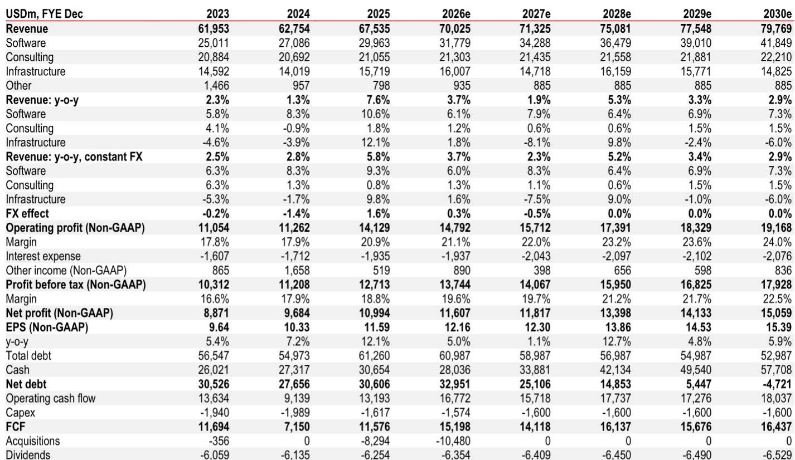
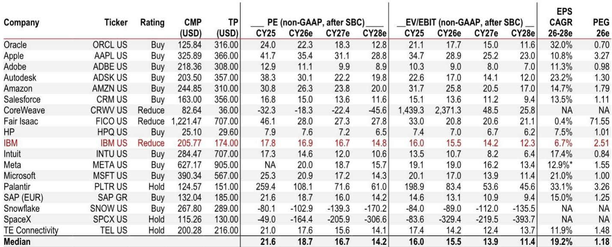
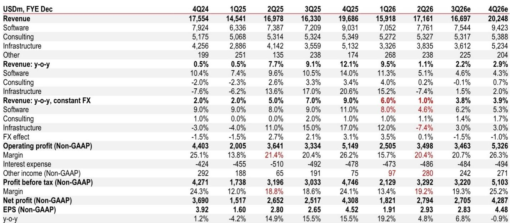

# HSBC：IBM业务与近期数据观察

IBM 在 2026 年 7 月 22 日发布了第二季度财报，同时下调了全年固定汇率收入增长指引。HSBC在最新报告中维持了对该公司的谨慎判断，认为尽管利润率指引超出预期，但软件业务的节奏变化与估值缺乏吸引力是核心关注点。

这份报告的核心矛盾在于：IBM 在收入增长减速的背景下，仍坚持全年非 GAAP 税前利润率同比提升 100 个基点的目标。但细看第二季度的利润率改善，很大程度上依赖一笔 2.8 亿美元的非 GAAP 其他收入，而去年同期仅为 6500 万美元。剔除这一项，非 GAAP 税前利润率实际上同比下滑了约 90 个基点。HSBC认为，利润率改善的可持续性，取决于这些一次性项目的贡献程度。

## 1. 软件业务增长显著节奏变化，有机增长降至零

软件是 IBM 最大的收入来源，但第二季度表现低于预期。该板块固定汇率收入增速从第一季度的 8% 降至 4.6%，有机增长更是滑落至零。管理层将全年软件收入增速指引从原先的超过 10% 下调至 6%-8%。

报告指出，约 20% 的软件收入来自“时点确认”模式，而非订阅模式。这部分收入与客户的资本支出预算高度相关。当客户将资金转向服务器、存储和内存硬件，以应对预期中的价格上涨时，IBM 的大型机硬件和时点确认软件收入均受到冲击。不过，年度经常性收入仍同比增长 8%，表明订阅业务的基本盘依然稳固。

交易处理子板块是影响软件业务的主要因素，其固定汇率收入同比下降 9%，而第一季度还是增长 2%。管理层认为这主要是收入确认周期导致的节奏问题，并预计下半年该板块仍将出现低至中个位数的下滑，但大部分丢失的收入可能只是延迟而非永久性损失。

> **KC评论：** 软件业务有机增长为零是一个关键信号。它意味着 IBM 的软件增长目前完全依赖并购（如 Confluent）的贡献，内生动力不足。读者需要区分报表增长与有机增长之间的差距。

## 2. 基础设施业务出现转折，分布式硬件表现强劲

与软件业务的疲软形成对比，基础设施板块在第二季度出现了结构性变化。虽然该板块固定汇率收入同比下降 7.4%，但这主要是由于新一代 z17 大型机已进入发布后的第五个季度，销售自然回落。

亮点在于分布式基础设施子板块，其收入同比增长 37%，远高于第一季度的 13%。管理层因此上调了全年基础设施收入指引，从原先预计的低个位数下滑，调整为低个位数增长。HSBC认为，这一上修主要得益于分布式硬件的强劲表现，但需要关注其低基数效应能否持续。

## 3. 估值缺乏吸引力，盈利增长预期低于同业

主要基于分部加总估值法。尽管因利润率指引上调而将 2026-2028 年非 GAAP 每股收益预期提高了 1%-2%，但估值倍数被压缩，抵消了盈利上调的影响。

报告指出，IBM 当前报价对应 2027 年非 GAAP EV/EBIT 为 14.2 倍，略高于行业中位数的 13.9 倍。但HSBC预计 IBM 在 2026-2028 年的非 GAAP 每股收益年复合增长率仅为 6.7%，远低于行业中位数的 19.2%。这意味着，IBM 的估值溢价缺乏盈利增长支撑。

> **KC评论：** HSBC的估值框架提供了一个可复用的观察角度：当一家公司的估值倍数高于行业，但盈利增速显著低于行业时，其相对吸引力就会下降。读者可以对比同行业公司的增长与估值匹配度，来判断是否存在更优选择。

HSBC认为，IBM 的利润率指引虽然亮眼，但其可持续性存疑，且核心软件业务的有机增长节奏变化、整体盈利增速低于同业，使得当前估值缺乏足够的安全边际。对于关注大型科技公司的读者而言，这份报告提供了一个审视“增长质量”与“估值合理性”的案例。

For informational purposes only. Portions may be generated,translated,summarized,or edited with AI assistance based on source materials and may contain omissions or errors. Please verify independently. This is not investment,legal,tax,accounting,or other professional advice.

For informational purposes only. Portions may be generated,translated,summarized,or edited with AI assistance based on source materials and may contain omissions or errors. Please verify independently. This is not investment,legal,tax,accounting,or other professional advice.

