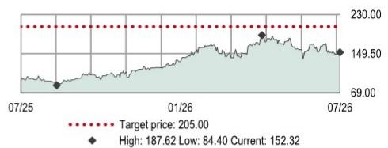
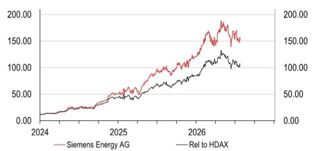
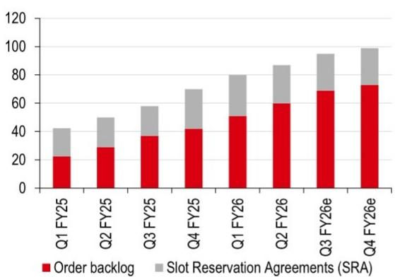
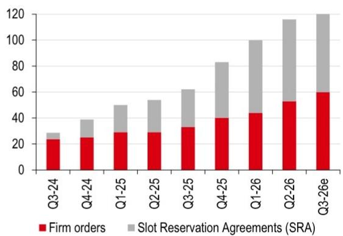
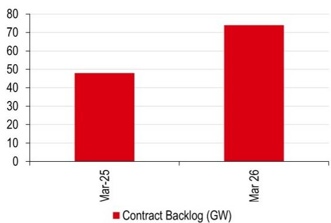
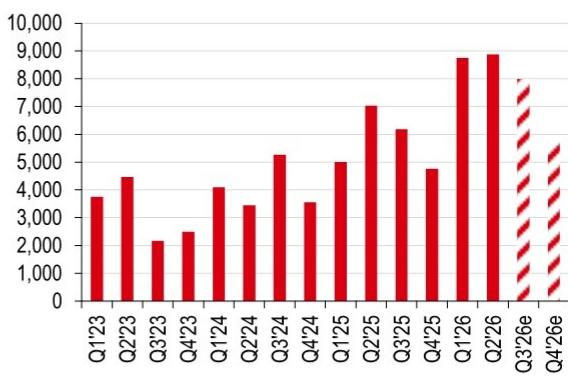
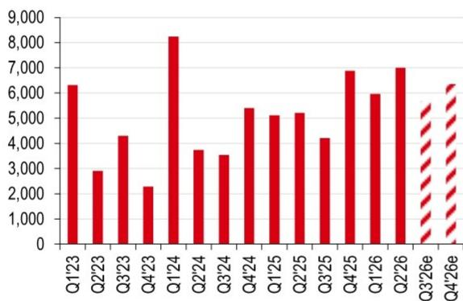
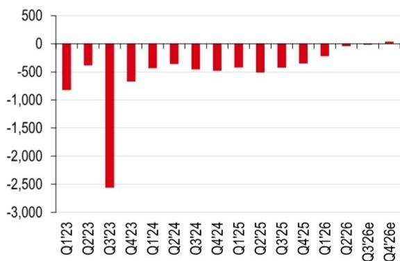

# Siemens Energy AG (ENR GR)

## 观察：在审慎市场情绪下的周期性支撑

预计下半年GS的GW承诺增长，凸显燃气轮机市场背景的持续强劲

- GT的结构性驱动因素看起来稳健，Gamesa在下半年迈向盈利可提供一定支撑

◆ 基于同行倍数和预估上调，目标价从190欧元上调至205欧元；近期报价回调有助于为第三季度结果去风险

## 第三季度结果值得关注

自2026年4月24日高点以来，报价下跌19%（而FTSE World Industrials上涨1%），我们认为西门子能源（ENR）即将于8月5日公布的2026财年第三季度结果在一定程度上已消化风险。我们认为存在进一步上调指引的可能性，尤其是在自由现金流方面，鉴于强劲的需求背景。

## 燃气服务（GS）：讨论围绕周期展开

从主要同行GE Vernova（GEV US，USD985.03，目标价USD1,040，持有）的2026年第二季度结果来看，燃气发电领域的核心讨论围绕2026年下半年和2027年涡轮机订单增长节奏，以及2030年及以后的供需平衡（参见2026年7月23日报告：第二季度业绩不及预期但周期确认）。GEV和ENR均表示整体GW承诺将进一步增长（ENR到2026财年达到90-100GW，GEV到2026年底达到125GW），而席位预留协议（SRA）的转化速度推动了强劲的确定积压增长（见第3页）。ENR认为2026财年第三季度市场需求强劲，并预计在第四季度相对较弱后，2027财年将迎来强劲开局，基于未来几年燃气轮机（包括联合循环）每年110-120GW的持续市场规模。这与三菱重工（7011 JT，JPY3,892，无评级）5月发布的更为保守的指引形成对比，后者预计订单同比下降，2026年全球燃气轮机需求为70-100GW。

## 电网技术（GT）：更具结构性的故事

我们认为电网设备的订单接收更具韧性，受更广泛的电气化趋势以及传统电网的改造/扩建需求驱动。高市场增长正在推动美国市场的积极定价，而欧洲定价更为稳定。

## 西门子歌美飒：下半年逐步接近盈利

我们预计歌美飒将在2026财年下半年实现盈利，此前多年亏损（见第3页），得益于海上风电的高交付量。我们注意到关于海上风电交付量从当前高位在2028-29年下降的广泛讨论，但认为欧洲2030年后拍卖量的上升和更好的可见性可以缓解短期影响。

## 维持观察并上调目标价至205欧元（此前190欧元）

我们小幅调整营收预估，对GT和GS到2028财年的利润率增长持更积极看法，导致2026/28财年预估利润率整体提高10-30个基点。基于对GEV 2028年预估EV/EBITDA倍数维持15%的折让，我们得出新的目标价205欧元（此前190欧元）。隐含上行空间约35%，我们维持对ENR的观察。

## 股票

能源设备与服务

德国

## 维持观察

目标价（欧元）

205.00

此前目标价（欧元）

190.00

当前报价（欧元） 上行/下行空间

152.32 +34.6%

（截至2026年7月22日）

## 市场数据

<table><tr><td>市值（百万欧元）</td><td>131,164</td></tr><tr><td>市值（百万美元）</td><td>149,677</td></tr><tr><td>3个月日均交易量（百万美元）</td><td>576</td></tr></table>

<table><tr><td>自由流通量</td><td>72%</td></tr><tr><td>彭博代码</td><td>ENR GR</td></tr><tr><td>路透代码</td><td>ENR1n.BE</td></tr></table>

财务数据与比率（欧元）

<table><tr><td>截至</td><td>09/2025a</td><td>09/2026e</td><td>09/2027e</td><td>09/2028e</td></tr><tr><td>HSBC每股收益</td><td>1.60</td><td>4.04</td><td>5.94</td><td>7.67</td></tr><tr><td>HSBC每股收益（此前）</td><td>1.60</td><td>4.45</td><td>5.80</td><td>7.41</td></tr><tr><td>变化（%）</td><td>0.0</td><td>-9.0</td><td>2.5</td><td>3.5</td></tr><tr><td>一致预期每股收益</td><td>1.58</td><td>4.41</td><td>6.07</td><td>7.84</td></tr><tr><td>市盈率（倍）</td><td>95.3</td><td>37.7</td><td>25.6</td><td>19.9</td></tr><tr><td>股息率（%）</td><td>0.5</td><td>1.2</td><td>1.7</td><td>2.3</td></tr><tr><td>企业价值/EBITDA（倍）</td><td>36.8</td><td>19.9</td><td>15.4</td><td>12.1</td></tr><tr><td>净资产回报表现（%）</td><td>14.1</td><td>33.6</td><td>48.3</td><td>54.2</td></tr></table>

52周报价（欧元）

来源：LSEG IBES，HSBC预估

## Sean McLoughlin\*

高级全球工业分析师

HSBC Bank plc

sean.mcloughlin@hsbcib.com

+44 20 7991 3464

## Stacey Sun\*

全球工业分析师

HSBC Bank plc

stacey.sun@hsbc.com

+44 203 2685810

## Shashi Mishra\*

助理

班加罗尔

\*受雇于HSBC Securities (USA) Inc的非美国关联公司，未根据FINRA规定注册/取得资格

财务与估值：西门子能源公司
财务报表

<table><tr><td>截至</td><td>09/2025a</td><td>09/2026e</td><td>09/2027e</td><td>09/2028e</td></tr><tr><td colspan="5">损益汇总（百万欧元）</td></tr><tr><td>营收</td><td>39,077</td><td>43,619</td><td>49,569</td><td>55,995</td></tr><tr><td>EBITDA</td><td>3,350</td><td>6,071</td><td>7,824</td><td>9,798</td></tr><tr><td>折旧与摊销</td><td>-1,781</td><td>-1,559</td><td>-1,431</td><td>-1,321</td></tr><tr><td>营业利润/EBIT</td><td>1,569</td><td>4,512</td><td>6,393</td><td>8,477</td></tr><tr><td>净利息</td><td>-28</td><td>40</td><td>65</td><td>110</td></tr><tr><td>税前利润</td><td>2,213</td><td>4,690</td><td>6,538</td><td>8,677</td></tr><tr><td>HSBC税前利润</td><td>2,208</td><td>4,990</td><td>6,668</td><td>8,807</td></tr><tr><td>税项</td><td>-527</td><td>-1,055</td><td>-1,308</td><td>-2,082</td></tr><tr><td>净利润</td><td>1,415</td><td>3,355</td><td>4,941</td><td>6,294</td></tr><tr><td>HSBC净利润</td><td>1,414</td><td>3,436</td><td>4,976</td><td>6,330</td></tr><tr><td colspan="5">现金流量汇总（百万欧元）</td></tr><tr><td>经营活动现金流</td><td>5,820</td><td>9,089</td><td>7,766</td><td>9,305</td></tr><tr><td>资本支出</td><td>-1,663</td><td>-2,289</td><td>-2,590</td><td>-2,915</td></tr><tr><td>投资活动现金流</td><td>-1,618</td><td>-2,289</td><td>-2,590</td><td>-2,915</td></tr><tr><td>股息</td><td>-612</td><td>-1,510</td><td>-2,223</td><td>-2,833</td></tr><tr><td>净债务变动</td><td>-2,793</td><td>-2,030</td><td>-793</td><td>-1,468</td></tr><tr><td>自由现金流（股权）</td><td>4,157</td><td>6,800</td><td>5,177</td><td>6,391</td></tr><tr><td colspan="5">资产负债表汇总（百万欧元）</td></tr><tr><td>无形资产</td><td>11,487</td><td>11,487</td><td>11,487</td><td>11,487</td></tr><tr><td>有形固定资产</td><td>7,559</td><td>8,290</td><td>9,448</td><td>11,042</td></tr><tr><td>流动资产</td><td>34,452</td><td>39,184</td><td>42,873</td><td>47,493</td></tr><tr><td>现金及其他</td><td>9,162</td><td>10,402</td><td>10,581</td><td>11,409</td></tr><tr><td>总资产</td><td>56,637</td><td>62,225</td><td>67,049</td><td>73,208</td></tr><tr><td>经营性负债</td><td>37,891</td><td>45,344</td><td>49,975</td><td>55,213</td></tr><tr><td>总债务</td><td>4,372</td><td>3,582</td><td>2,967</td><td>2,327</td></tr><tr><td>净债务</td><td>-4,790</td><td>-6,820</td><td>-7,614</td><td>-9,082</td></tr><tr><td>股东权益</td><td>10,675</td><td>9,800</td><td>10,808</td><td>12,570</td></tr><tr><td>投入资本</td><td>6,445</td><td>3,215</td><td>3,252</td><td>3,400</td></tr></table>

比率、增长与每股分析

<table><tr><td>截至</td><td>09/2025a</td><td>09/2026e</td><td>09/2027e</td><td>09/2028e</td></tr><tr><td colspan="5">同比变化%</td></tr><tr><td>营收</td><td>13.4</td><td>11.6</td><td>13.6</td><td>13.0</td></tr><tr><td>EBITDA</td><td>135.1</td><td>81.2</td><td>28.9</td><td>25.2</td></tr><tr><td>营业利润</td><td></td><td>187.6</td><td>41.7</td><td>32.6</td></tr><tr><td>税前利润</td><td>21.5</td><td>111.9</td><td>39.4</td><td>32.7</td></tr><tr><td>HSBC每股收益</td><td>123.8</td><td>153.1</td><td>47.0</td><td>29.0</td></tr><tr><td colspan="5">比率（%）</td></tr><tr><td>营收/投入资本（倍）</td><td>5.2</td><td>9.0</td><td>15.3</td><td>16.8</td></tr><tr><td>投入资本回报率</td><td>15.8</td><td>72.4</td><td>158.2</td><td>193.7</td></tr><tr><td>净资产回报表现</td><td>14.1</td><td>33.6</td><td>48.3</td><td>54.2</td></tr><tr><td>总资产回报表现</td><td>3.6</td><td>6.4</td><td>8.4</td><td>9.7</td></tr><tr><td>EBITDA利润率</td><td>8.6</td><td>13.9</td><td>15.8</td><td>17.5</td></tr><tr><td>营业利润率</td><td>4.0</td><td>10.3</td><td>12.9</td><td>15.1</td></tr><tr><td>EBITDA/净利息（倍）</td><td>119.6</td><td></td><td></td><td></td></tr><tr><td>净债务/权益</td><td>-44.9</td><td>-69.6</td><td>-70.4</td><td>-72.3</td></tr><tr><td>净债务/EBITDA（倍）</td><td>-1.4</td><td>-1.1</td><td>-1.0</td><td>-0.9</td></tr><tr><td colspan="5">经营活动现金流/净债务</td></tr><tr><td colspan="5">每股数据（欧元）</td></tr><tr><td>每股收益（摊薄）</td><td>1.60</td><td>3.95</td><td>5.90</td><td>7.63</td></tr><tr><td>HSBC每股收益（摊薄）</td><td>1.60</td><td>4.04</td><td>5.94</td><td>7.67</td></tr><tr><td>每股股息</td><td>0.70</td><td>1.78</td><td>2.66</td><td>3.44</td></tr><tr><td>每股账面价值</td><td>12.20</td><td>11.45</td><td>12.81</td><td>15.13</td></tr></table>

估值数据

观察

<table><tr><td>截至</td><td>09/2025a</td><td>09/2026e</td><td>09/2027e</td><td>09/2028e</td></tr><tr><td>企业价值/营收</td><td>3.2</td><td>2.8</td><td>2.4</td><td>2.1</td></tr><tr><td>企业价值/EBITDA</td><td>36.8</td><td>19.9</td><td>15.4</td><td>12.1</td></tr><tr><td>企业价值/投入资本</td><td>19.1</td><td>37.7</td><td>37.0</td><td>35.0</td></tr><tr><td>市盈率*</td><td>95.3</td><td>37.7</td><td>25.6</td><td>19.9</td></tr><tr><td>市净率</td><td>12.5</td><td>13.3</td><td>11.9</td><td>10.1</td></tr><tr><td>自由现金流回报表现（%）</td><td>3.2</td><td>5.2</td><td>3.9</td><td>4.9</td></tr><tr><td>股息率（%）</td><td>0.5</td><td>1.2</td><td>1.7</td><td>2.3</td></tr></table>

\*基于HSBC每股收益（摊薄）

ESG指标

<table><tr><td>环境指标</td><td>09/2025a</td><td>治理指标</td><td>09/2025a</td></tr><tr><td>温室气体排放强度*</td><td>4.5</td><td>董事会成员人数</td><td>20</td></tr><tr><td>能源强度*</td><td>37.4</td><td>董事会平均任期（年）</td><td>4.1</td></tr><tr><td>二氧化碳减排政策</td><td>是</td><td>女性董事会成员比例（%）</td><td>45</td></tr><tr><td>社会指标</td><td>09/2025a</td><td>董事会成员独立性（%）</td><td>45</td></tr><tr><td>员工成本占营收比例</td><td>26.7</td><td></td><td></td></tr><tr><td>员工流动率（%）</td><td>7.4</td><td></td><td></td></tr><tr><td>多元化政策</td><td>是</td><td></td><td></td></tr></table>

来源：公司数据，HSBC
\*温室气体排放强度和能源强度分别以千克和千瓦时对营收（千美元）计量

<table><tr><td colspan="2">发行人信息</td></tr><tr><td>报价（欧元）</td><td>152.32</td></tr><tr><td>目标价（欧元）</td><td>205.00</td></tr><tr><td>路透代码</td><td>ENR1n.BE</td></tr><tr><td>彭博代码</td><td>ENR GR</td></tr><tr><td>市值（百万美元）</td><td>149,677</td></tr></table>

<table><tr><td>自由流通量</td><td>72%</td></tr><tr><td>行业</td><td>能源设备</td></tr><tr><td>国家/地区</td><td>德国</td></tr><tr><td>分析师</td><td>Sean McLoughlin</td></tr><tr><td>联系方式</td><td>+44 20 7991 3464</td></tr></table>

相对报价

来源：HSBC
注：报价截至2026年7月22日收盘

ENR燃气发电总承诺（GW）

注：9月财年截止。来源：公司数据，HSBC预估

GEV燃气发电总承诺（GW）

注：12月财年截止。来源：公司数据，HSBC预估

三菱重工燃气轮机积压（GW）

注：3月财年截止。来源：公司数据

我们预计ENR燃气服务下半年订单如指引所示有所回落（百万欧元）

来源：公司数据，HSBC预估

我们预计ENR电网技术订单（百万欧元）下半年表现更为稳健

来源：公司数据，HSBC预估

西门子歌美飒下半年终于实现盈利（百万欧元）

来源：公司数据，HSBC预估

西门子能源2026财年第三季度业绩预览表

<table><tr><td>单位：百万欧元，9月截止</td><td>Q2 FY25</td><td>Q3 FY25</td><td>Q4 FY25</td><td>Q1 FY26</td><td>Q2 FY26</td><td>Q3 FY26e</td><td>同比</td><td>一致预期</td><td>vs.一致预期</td></tr><tr><td colspan="10">订单：</td></tr><tr><td>--燃气服务</td><td>7,038</td><td>6,180</td><td>4,769</td><td>8,751</td><td>8,869</td><td>7,994</td><td>29.4%</td><td>8,167</td><td>-2.1%</td></tr><tr><td>--电网技术</td><td>5,209</td><td>4,218</td><td>6,880</td><td>5,964</td><td>6,996</td><td>5,666</td><td>34.3%</td><td>5,579</td><td>1.6%</td></tr><tr><td>--工业转型</td><td>1,564</td><td>1,356</td><td>1,629</td><td>1,579</td><td>1,254</td><td>1,432</td><td>5.6%</td><td>1,422</td><td>0.7%</td></tr><tr><td>合计</td><td>13,811</td><td>11,754</td><td>13,278</td><td>16,294</td><td>17,119</td><td>15,091</td><td>28.4%</td><td>15,168</td><td>-0.5%</td></tr><tr><td>--西门子歌美飒</td><td>875</td><td>4,890</td><td>1,123</td><td>1,556</td><td>846</td><td>935</td><td>-80.9%</td><td>1,560</td><td>-40.1%</td></tr><tr><td>分部合计</td><td>14,686</td><td>16,644</td><td>14,401</td><td>17,850</td><td>17,965</td><td>16,026</td><td>-3.7%</td><td>16,728</td><td>-4.2%</td></tr><tr><td>--抵销</td><td>-253</td><td>-31</td><td>-187</td><td>-242</td><td>-216</td><td>-128</td><td>-313.6%</td><td>-99</td><td>-29.9%</td></tr><tr><td>西门子能源</td><td>14,433</td><td>16,613</td><td>14,214</td><td>17,608</td><td>17,749</td><td>15,898</td><td>-4.3%</td><td>16,629</td><td>-4.4%</td></tr><tr><td colspan="10">营收：</td></tr><tr><td>--燃气服务</td><td>3,163</td><td>3,118</td><td>3,094</td><td>3,097</td><td>3,478</td><td>3,704</td><td>18.8%</td><td>3,678</td><td>0.7%</td></tr><tr><td>--电网技术</td><td>2,861</td><td>2,819</td><td>3,145</td><td>3,054</td><td>3,067</td><td>3,712</td><td>31.7%</td><td>3,617</td><td>2.6%</td></tr><tr><td>--工业转型</td><td>1,411</td><td>1,361</td><td>1,614</td><td>1,303</td><td>1,422</td><td>1,469</td><td>7.9%</td><td>1,451</td><td>1.2%</td></tr><tr><td>合计</td><td>7,435</td><td>7,298</td><td>7,853</td><td>7,454</td><td>7,967</td><td>8,885</td><td>21.7%</td><td>8,746</td><td>1.6%</td></tr><tr><td>--西门子歌美飒</td><td>2,706</td><td>2,506</td><td>2,744</td><td>2,355</td><td>2,526</td><td>2,594</td><td>3.5%</td><td>2,581</td><td>0.5%</td></tr><tr><td>分部合计</td><td>10,141</td><td>9,804</td><td>10,597</td><td>9,809</td><td>10,493</td><td>11,478</td><td>17.1%</td><td>11,327</td><td>1.3%</td></tr><tr><td>--抵销</td><td>-180</td><td>-59</td><td>-169</td><td>-134</td><td>-197</td><td>-138</td><td>-133.5%</td><td>-127</td><td>-8.5%</td></tr><tr><td>西门子能源</td><td>9,961</td><td>9,745</td><td>10,428</td><td>9,675</td><td>10,296</td><td>11,341</td><td>16.4%</td><td>11,200</td><td>1.3%</td></tr><tr><td colspan="10">特殊项目前利润：</td></tr><tr><td>--燃气服务</td><td>511</td><td>406</td><td>251</td><td>515</td><td>552</td><td>556</td><td>36.9%</td><td>567</td><td>-2.0%</td></tr><tr><td>--电网技术</td><td>571</td><td>448</td><td>463</td><td>538</td><td>524</td><td>705</td><td>57.4%</td><td>710</td><td>-0.7%</td></tr><tr><td>--工业转型</td><td>155</td><td>157</td><td>177</td><td>154</td><td>171</td><td>184</td><td>16.9%</td><td>176</td><td>4.1%</td></tr><tr><td>合计</td><td>1,237</td><td>1,011</td><td>891</td><td>1,207</td><td>1,247</td><td>1,444</td><td>42.9%</td><td>1,453</td><td>-0.6%</td></tr><tr><td>--西门子歌美飒</td><td>-249</td><td>-438</td><td>-303</td><td>-46</td><td>-44</td><td>-10</td><td>97.7%</td><td>28</td><td>不适用</td></tr><tr><td>分部合计</td><td>988</td><td>573</td><td>588</td><td>1,161</td><td>1,203</td><td>1,434</td><td>150.3%</td><td>1,481</td><td>-3.2%</td></tr><tr><td>--抵销</td><td>-82</td><td>-76</td><td>-117</td><td>-2</td><td>-39</td><td>-110</td><td>-44.7%</td><td>-106</td><td>-3.7%</td></tr><tr><td>西门子能源</td><td>906</td><td>497</td><td>471</td><td>1,159</td><td>1,164</td><td>1,324</td><td>166.5%</td><td>1,369</td><td>-3.3%</td></tr><tr><td colspan="10">特殊项目前利润率：</td></tr><tr><td>--燃气服务</td><td>16.2%</td><td>13.0%</td><td>8.1%</td><td>16.6%</td><td>15.9%</td><td>15.0%</td><td>200bps</td><td>15.4%</td><td>-40bps</td></tr><tr><td>--电网技术</td><td>20.0%</td><td>15.9%</td><td>14.7%</td><td>17.6%</td><td>17.1%</td><td>19.0%</td><td>310bps</td><td>19.6%</td><td>-60bps</td></tr><tr><td>--工业转型</td><td>11.0%</td><td>11.5%</td><td>11.0%</td><td>11.8%</td><td>12.0%</td><td>12.5%</td><td>100bps</td><td>12.2%</td><td>30bps</td></tr><tr><td>合计</td><td>16.6%</td><td>13.9%</td><td>11.3%</td><td>16.2%</td><td>15.7%</td><td>16.3%</td><td>240bps</td><td>16.6%</td><td>-40bps</td></tr><tr><td>--西门子歌美飒</td><td>-9.2%</td><td>-17.5%</td><td>-11.0%</td><td>-2.0%</td><td>-1.7%</td><td>-0.4%</td><td>1710bps</td><td>1.1%</td><td>-150bps</td></tr><tr><td>分部合计</td><td>9.7%</td><td>5.8%</td><td>5.5%</td><td>11.8%</td><td>11.5%</td><td>12.5%</td><td>670bps</td><td>13.1%</td><td>-60bps</td></tr><tr><td>西门子能源</td><td>9.1%</td><td>5.1%</td><td>4.5%</td><td>12.0%</td><td>11.3%</td><td>11.7%</td><td>660bps</td><td>12.2%</td><td>-50bps</td></tr></table>

来源：公司数据，HSBC预估与计算，Visible Alpha一致预期

## 研究观点：我们对西门子能源的观察基于以下因素：

1) 该公司是全球能源领域设备和服务的主要供应商，受益于多种未来能源机会的选择权，我们认为其估值具有吸引力。

2) 我们认为ENR核心业务（不含西门子歌美飒）前景稳健。燃气服务（GS）持续提供高利润的经常性收入流，并受益于新燃气发电设备需求的回升。电网技术（GT）将受益于全球电气化趋势和可再生能源安装加速推动的新输电基础设施需求的上升。我们预计SE的工业转型部门中期内也将受益于工业脱碳趋势。

3) 西门子歌美飒（SG）转型计划的执行，目标是在所有陆上涡轮机质量问题成功解决后，于2026年底实现盈亏平衡，并拥有更简化的涡轮机组合和更精简的结构；这应能增强对长期盈利增长的信心。我们注意到，根据公司说法，解决质量问题的涡轮机干预措施迄今按计划推进，陆上市场重新进入并非2026年目标的核心。

4) 我们预期股东回报。因此，宣布2025年每股0.70欧元的股息是股东回报的良好开端，我们认为2026财年回购量的增加进一步增强了这一点。

## 西门子能源：预估调整

在本报告中，我们小幅调整营收预估，更新了汇率预估，并根据修订后的指引更新了可比营收增长假设。2026财年指引上调也使我们更看好电网技术业务的利润率进展，导致2026/28财年预估利润率整体提高10-30个基点。2026财年预估税率假设提高导致2026财年净利润减少11%。

## 西门子能源：预估调整

<table><tr><td rowspan="2">百万欧元（9月30日截止）</td><td rowspan="2">FY25</td><td colspan="3">HSBC预估</td><td colspan="3">HSBC此前预估</td><td colspan="3">vs此前</td></tr><tr
