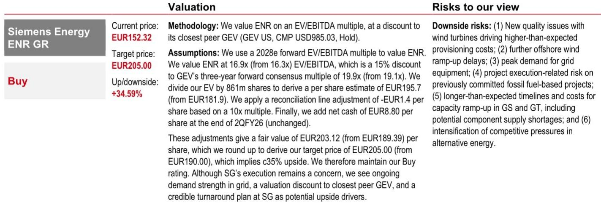
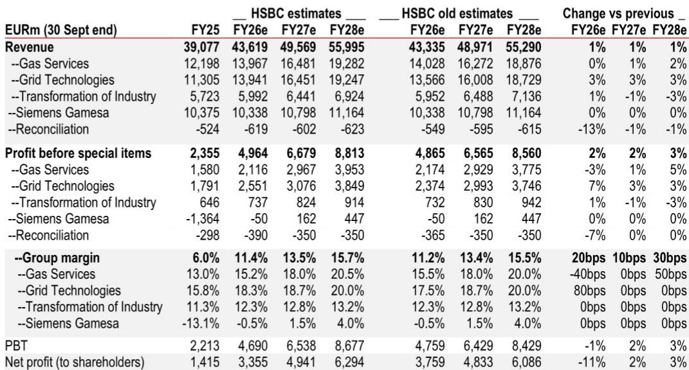

# HSBC：能源行业数据与主题变化观察

西门子能源报价自2026年4月高点回落约19%，而同期FTSE World Industrials指数上涨约1%。HSBC在最新报告中认为，即将于8月5日公布的第三财季业绩已在一定程度上被市场提前定价。报告的核心判断是：燃气轮机订单增长节奏和海上风电业务的盈利拐点，是当前市场对西门子能源定价分歧最大的两个变量。

，主要基于对同业GE Vernova的估值倍数上修以及对西门子能源自身盈利预测的微调。，而是HSBC对三大业务板块——燃气服务、电网技术和西门子歌美飒——各自周期属性的区分。

## 1. 燃气服务订单增长节奏是当前市场争论焦点

HSBC指出，燃气服务业务的核心争论在于2026年下半年和2027年涡轮机订单增速，以及2030年之后的供需平衡。西门子能源管理层预计，未来几年全球燃气轮机（含联合循环）年市场容量维持在110-120GW。这一判断与三菱重工5月给出的70-100GW指引形成明显差异。三菱重工预计其自身订单将同比下降。

HSBC认为，西门子能源的订单承诺总量（GW commitments）有望在2026财年达到90-100GW，而GE Vernova的目标是到2026年底达到125GW。订单储备的转化速度，尤其是预约协议（SRA）向正式订单的转换，是决定未来几个季度订单可见度的关键。报告预计第三财季燃气服务订单约80亿欧元，同比增29%，但环比第二财季的88.7亿欧元有所回落。

> **KC评论：** 三菱重工与西门子能源对全球燃气轮机市场容量的分歧，本质是对天然气发电在能源转型中角色持续性的不同假设。三菱更保守的指引可能反映其在特定区域或技术路线上的暴露差异，而非全行业信号。

## 2. 电网技术订单韧性更强，受益于电气化与电网更新

与燃气服务的周期性争论不同，HSBC将电网技术定位为更具结构性的增长故事。报告认为，电网设备订单的韧性来自两个方向：一是广泛的电气化趋势带来的新增需求，二是老旧电网的改造与扩容需求。在美国市场，高增长正推动定价上行，而欧洲市场定价相对稳定。

HSBC预计第三财季电网技术订单约56.7亿欧元，同比增34%，环比第二财季的70亿欧元有所下降，但降幅小于燃气服务。从全年看，电网技术订单的H2回落幅度预计更温和，反映出该业务受长期合同和基础设施研究周期支撑的特点。

## 3. 西门子歌美飒有望在H2实现盈利，但海上风电交付节奏存隐忧

西门子歌美飒是西门子能源近年最大的利润影响。HSBC预计该业务在第三财季仍将录得约1000万欧元的亏损，但亏损幅度已从去年同期的4.38亿欧元大幅收窄。报告认为，得益于海上风电的高交付量，歌美飒有望在2026财年下半年实现整体盈利。

但报告也提及一个更长期的讨论：当前海上风电的高交付水平可能在2028-2029年消退。HSBC的观点是，欧洲2030年后拍卖量上升和项目可见度改善，可以缓解这一短期逆风。这一判断的成立，取决于各国海上风电拍卖的执行速度和电网接入条件。

## 4. 盈利预测微调与估值框架

HSBC小幅上调了2026-2028财年的收入预期，并将燃气服务和电网技术的利润率预期上调10-30个基点。调整后，2026-2028财年每股盈利预测分别为4.04、5.94和7.67欧元，较此前预测有-9%至+3.5%的变动。估值方面，报告沿用对GE Vernova 2028年EV/EBITDA倍数给予15%折价的框架。

报告同时提供了第三财季业绩预览表。HSBC对西门子能源整体利润的预测（13.24亿欧元）略低于市场共识（13.69亿欧元），差异主要来自对歌美飒亏损幅度的判断——HSBC预计亏损1000万欧元，而市场共识为盈利2800万欧元。这一分歧本身，就是8月5日业绩公布时最值得关注的数字。

For informational purposes only. Portions may be generated,translated,summarized,or edited with AI assistance based on source materials and may contain omissions or errors. Please verify independently. This is not investment,legal,tax,accounting,or other professional advice.

For informational purposes only. Portions may be generated,translated,summarized,or edited with AI assistance based on source materials and may contain omissions or errors. Please verify independently. This is not investment,legal,tax,accounting,or other professional advice.

