# 中国本地市场周报

# 等待夏季调整

Extel - 2026

全球固定收益研究调查

点击投票

投票开放时间：7月6日至7月24日

请为JPM投票（5星）

- 自我们发布年中展望以来，此前市场对中国相关资产的乐观情绪有所消退，市场在2026年下半年开始时对中国持有大致中性的风险溢价。最新二季度GDP数据确认增长有所放缓，国内需求持续偏弱，不过近期活动指标显示情况可能在边际上趋于稳定。市场关注点已转向即将召开的7月政治局会议，预计政策制定者将重申支持增长的承诺。然而，市场对大规模刺激政策的预期仍然较低。

- 自6月以来，政府债券发行有所加快，但整体节奏仍落后于去年，其中专项地方债发行尤为缓慢。尽管未使用额度为未来几个月发行提速留出了空间，但地方融资平台融资规则收紧、对地方举债的监管加强以及政策性银行债券发行放缓，导致读者下调了对财政/准财政支持的预期。在此背景下，中国债券回报表现保持稳定，而地方债与国债利差因持续的久期需求已收窄至多年低位。

- 与此同时，境外读者对中国债券的需求依然强劲。近几个月来，通过CIBM和债券通渠道的资金流入持续强劲，境外持有国债的比例继续上升。尽管外汇对冲后的回报有限，但资金流入依然强劲，这表明境外参与中可能有越来越大的比例未进行外汇对冲。如果这一趋势持续，可能形成一种正向循环：人民币升值提升境外读者的总回报，吸引更多资金流入，并进一步产生对人民币资产的直接需求。

- 尽管中美利差扩大，中国企业在6月仍加大了美元净卖出力度，为人民币提供了持续支撑。持续的出口商结汇需求，加上每日中间价的逐步下调，表明政策制定者对人民币走强持接受态度。这有助于在亚洲交易时段保持美元/离岸人民币的弱势，抵消了亚洲以外时段美元的整体强势。结合境外对人民币资产的强劲需求，这些因素使我们对人民币的积极看法基本保持不变。我们仍看好人民币，通过做空美元/离岸人民币期权来表达观点，维持年底美元/在岸人民币6.70的目标不变，同时预计CFETS人民币汇率指数将进一步升值，可能测试105。

当前交易建议

<table><tr><td>当前直接交易</td><td>入场日期</td><td>入场价</td><td>当前价</td><td>盈亏</td><td>相关说明</td></tr><tr><td>3个月 6.75 美元/离岸人民币看跌期权</td><td>2026年5月6日</td><td>0.46%</td><td>0.08%</td><td>-0.38%</td><td>说明</td></tr><tr><td>GBI-EM模型组合</td><td>持仓</td><td>权重</td><td></td><td></td><td></td></tr><tr><td>人民币外汇</td><td>市场权重</td><td></td><td></td><td></td><td></td></tr><tr><td>人民币债券</td><td>市场权重</td><td></td><td></td><td></td><td></td></tr></table>

来源：JPM。

参见第7页分析师认证和重要披露。

新兴市场策略

Tiffany Wang AC
(852) 2800-1726
tiffany.r.wang@JPM.com
JPM证券（亚太）有限公司/ JPM经纪（香港）有限公司

Arindam Sandilya

(65) 6882-7759

arindam.x.sandilya@JPM.com

JPM大通银行，N.A.，新加坡分行

## 等待夏季调整

自我们发布中国本地市场2026年中展望以来，中国相关资产已回吐了此前市场定价中的大部分乐观情绪，市场在进入下半年时对中国持有大致中性的风险溢价。最新二季度GDP数据显示增长动能有所放缓且更加不均衡，GDP同比增速从一季度的5.0%降至二季度的4.3%，环比折年率增速放缓至2.4%（中国：尽管活动趋于稳定，增长有所减弱）。虽然受出口、产业升级和政策支持行业推动，工业生产和服务业活动仍相对稳健，但国内需求仍是主要薄弱环节（图1）。投资是明显的拖累因素，不过6月数据指向一定程度的稳定，提供了些许积极信号（图2）。消费在6月也有所改善，零售销售反弹提供助力，但整体居民需求仍偏弱，服务业继续优于商品消费。市场关注点已转向7月政治局会议，预计政策制定者将重申对国内增长的支持。然而，市场对大规模刺激政策的预期仍然较低。我们对市场隐含的中国风险溢价的追踪显示，中国相关资产已基本回吐了此前的乐观情绪（图3），头寸相对于潜在周期基本面大致中性（图4）。

图4：...进入2026年下半年时头寸更为中性
标准差，市场隐含的中国风险溢价与经济意外指数之间的偏离，正值表示市场定价偏乐观
图1：中国国内活动尤其偏弱，...
中国关键经济指标
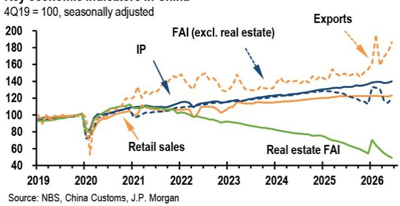
来源：国家统计局，中国海关，JPM
来源：国家统计局，JPM。

图2：...投资是二季度的明显拖累因素
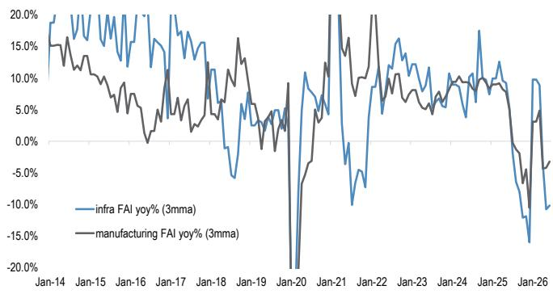

图3：中国相关资产已基本回吐了此前的乐观情绪，...
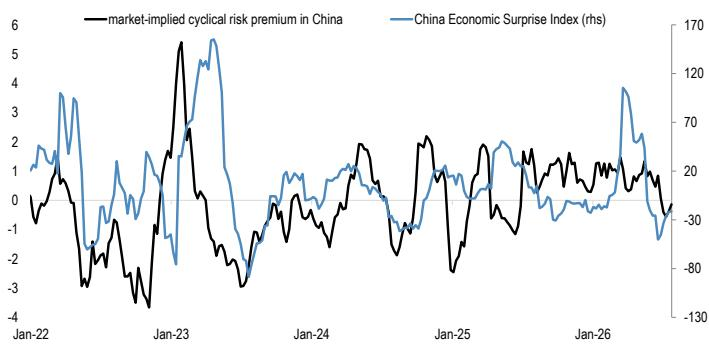
来源：Wind，JPM。
来源：中国海关，JPM。

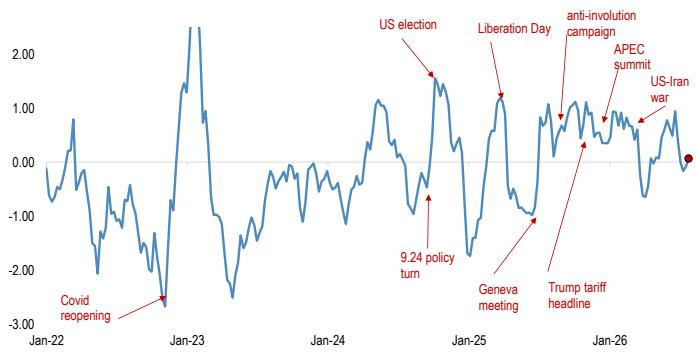
来源：Bloomberg Finance L.P.，JPM。

利差，基点

自6月以来，政府债券发行在边际上有所加快（图5），这与市场预期一致，即在二季度偏弱之后，财政政策在下半年仍有空间为增长提供支持。即便如此，整体发行节奏仍低于去年（图6）。值得注意的是，专项地方债发行尤其缓慢，迄今发行量不到年度额度的60%，而去年同期接近70%。原则上，这为未来几个月发行显著提速留出了空间，地方政府公布的发行计划也指向8月可能有所加快。然而，近期地方融资平台融资监管收紧，加上中央对地方债发行和资金使用的监督加强，以及政策性银行债券发行慢于预期（图7），导致读者下调了对财政和准财政刺激的预期。因此，市场担忧未来几个月财政支持可能继续低于经济增长需求，加剧了整体谨慎的市场情绪。这一宏观背景继续将中国国债回报表现锚定在低位。与此同时，由于地方债供给受限，地方债与国债利差已收窄至近年最窄水平（图8）。地方债估值的走强反映了国内读者对久期的持续需求和对回报表现的追逐，因为在增长偏弱和优质投资选择有限的背景下，资产稀缺性日益凸显。

图5：自6月以来，政府债券发行在边际上有所加快，...
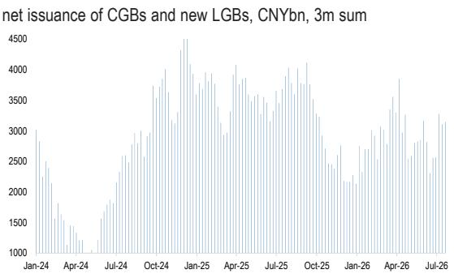
来源：Wind，JPM。

图6：...但整体节奏仍低于去年，专项地方债发行尤其缓慢
年初至今净发行量占年度额度百分比，截至2026年7月
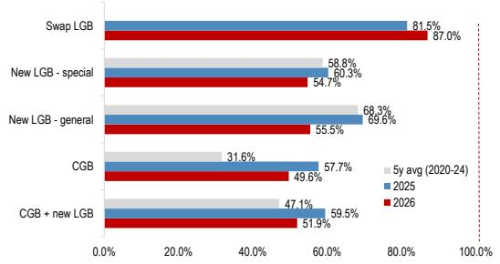
图7：近几个月政策性银行债券发行明显放缓，加剧了市场对财政和准财政支持可能再次低于预期的担忧
来源：Wind，JPM。
年初至今政策性银行债券净发行量

来源：Wind，JPM

图8：地方债与国债利差已收窄至近年最窄水平，凸显在供给偏轻的情况下读者对久期的强劲需求
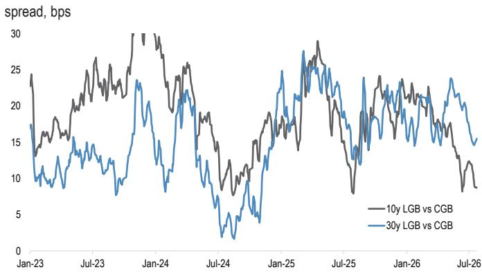
来源：Wind，JPM

对中国债券的需求不仅限于在岸市场。近几个月中国与全球利率持续脱钩，继续支持境外读者对中国债券的需求。虽然境外持有量在5月增加约130亿美元后，6月减少约20亿美元，但回落主要集中在NCD（减少29亿美元），可能反映了现有头寸到期。相比之下，境外持有国债在6月进一步增加16亿美元，此前5月增加90亿美元。来自CFETS的资金流数据也指向持续的境外需求（图9）。CIBM读者的净买入在6月仍保持强劲，达170亿美元，远高于110亿美元的6个月平均速度，而债券通读者也延续了买入势头，上月净流入40亿美元，而6个月平均速度为29亿美元。值得注意的是，尽管外汇对冲后的回报表现提升改善有限（图10），这些资金流入依然持续。在往年，压缩的人民币外汇隐含回报表现通过提升境外读者将美元兑换为人民币后的外汇对冲回报，增强了中国债券的吸引力。近期资金流入在缺乏这一支撑因素的情况下依然强劲，表明境外参与中可能有越来越大的比例未进行外汇对冲。如果是这样，这些资金流入可能为人民币提供更持久的支持。货币升值将提升境外读者持有国债的总回报，进一步改善该类资产的吸引力，并可能鼓励更多未对冲的外汇资金流入。这一动态可能形成境外债券资金流入与人民币直接需求的相互加强循环。

图9：境外对中国债券的需求依然强劲，...
十亿美元
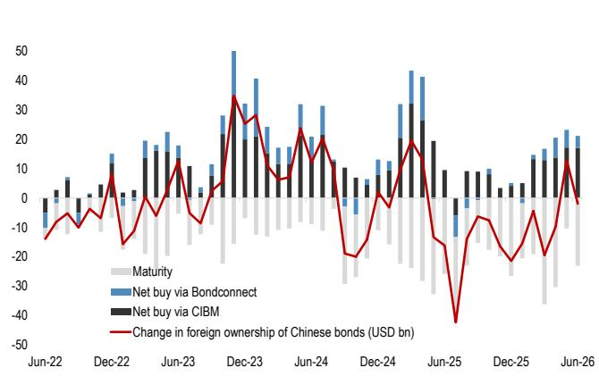
来源：CFETS，JPM

图10：...外汇对冲回报的回报表现提升有限，表明近期资金流入中较大比例可能未进行外汇对冲
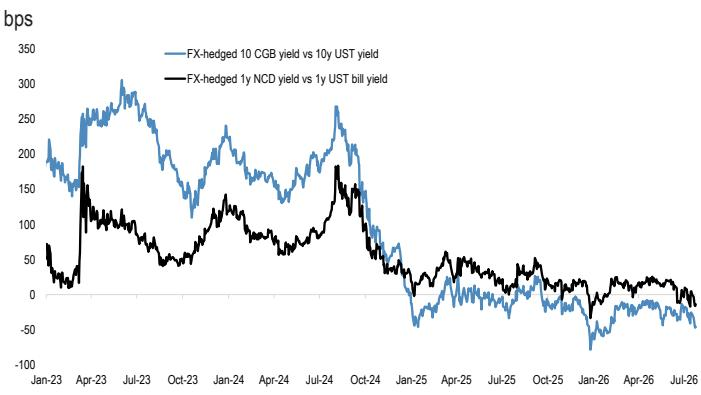
来源：Bloomberg Finance L.P.，JPM

中国企业美元卖出在6月有所增加，这应有助于缓解市场对美元叙事转变以及中美利差扩大可能阻碍出口商延续年初将出口收入兑换为人民币模式的担忧。最新外管局数据显示，中国企业6月净卖出约570亿美元，其中货物贸易相关的美元卖出净额达820亿美元，为去年12月以来最高水平。部分增长反映了更强的贸易相关资金流入，6月货物贸易外汇收入净额升至1060亿美元，远高于800亿美元的六个月平均速度。除此之外，出口商在上月美元/离岸人民币上涨期间卖出美元的意愿也有所回升。外汇结算总额比升至65.3%，而外汇卖出总额比仍接近60.1%的多年低位。因此，净外汇结算比（衡量出口商净美元卖出兴趣的关键指标）扩大至5.2个百分点（图11），创下6月第二高纪录。这应能为人民币多头提供信心。持续的出口商美元卖出仍是美元/离岸人民币的重要锚定因素，而每日中间价的逐步下调继续表明政策制定者对货币走强持接受态度。美元/离岸人民币在亚洲交易时段持续偏弱，印证了强劲的出口商结汇需求（图12），这在很大程度上抵消了非亚洲交易时段更为强势的美元基调。因此，我们仍看好人民币，并通过期权维持美元/离岸人民币空头头寸（2026年8月6日 6.75 美元/离岸人民币看跌期权），预计支持性的资金流动态和持续的境外对人民币资产需求将为货币提供持续支持。我们维持年底美元/在岸人民币6.70的目标不变，同时预计CFETS人民币汇率指数将继续升值，可能测试105（当前为102.8）。

图11：尽管利差扩大，中国企业美元卖出依然稳健，...
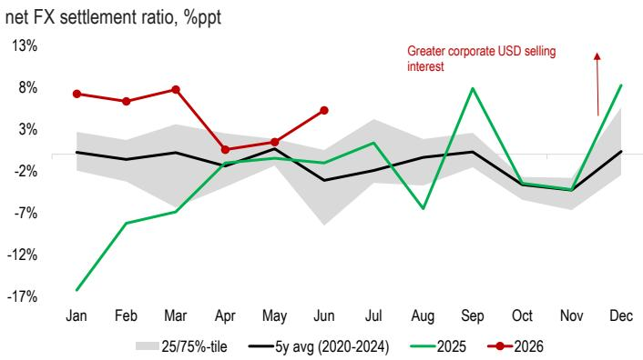
来源：外管局，Bloomberg Finance L.P.，JPM。

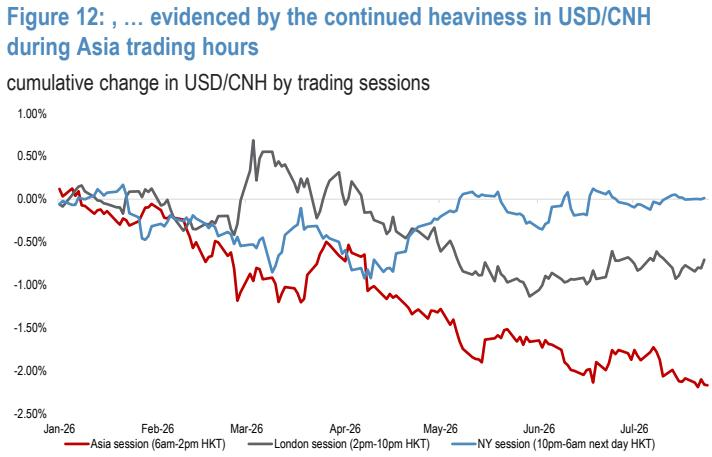
来源：Bloomberg Finance L.P.，JPM。

中国本地市场图表
图13：美元/在岸人民币和CFETS人民币汇率指数
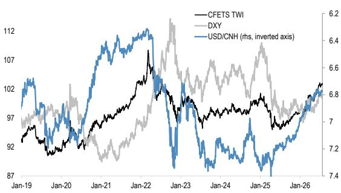
来源：Bloomberg Finance L.P.，JPM。

图14：人民币中间价偏向
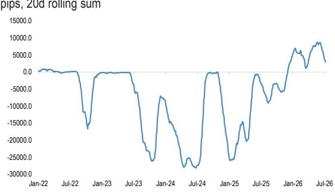
来源：Bloomberg Finance L.P.，JPM。走强偏向以实际中间价与仅基于隔夜一篮子货币表现的JPM模型估计值之间的差异衡量。

图15：美元/离岸人民币与基于利差的公允价值
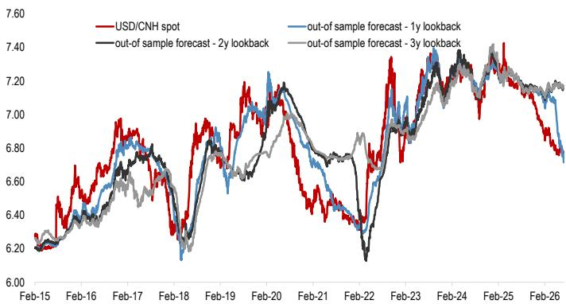
来源：Bloomberg Finance L.P.，JPM。

图16：美元/离岸人民币与利率基本面的偏离
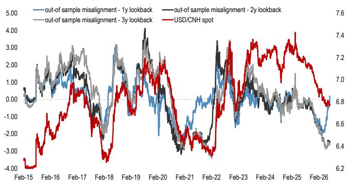
来源：Bloomberg Finance L.P.，JPM。

图17：境外债券资金流入
十亿美元，境外持有量变化
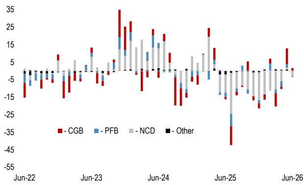
来源：中央结算公司，上海清算所，JPM。

图18：货币市场利率
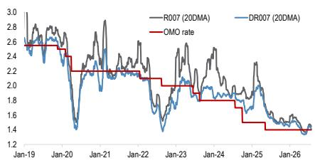
来源：Bloomberg Finance L.P.，JPM。

## 披露

分析师认证：本报告封面标注“AC”的研究分析师证明（或，当多位研究分析师主要负责本报告时，封面或文档内标注“AC”的研究分析师分别证明，对于该研究分析师在本研究中涵盖的每个证券或发行人）：(1) 本报告中表达的所有观点准确反映了研究分析师对任何及所有标的证券或发行人的个人观点；(2) 研究分析师的任何薪酬部分过去、现在或将来均未直接或间接与本报告中所表达的具体建议或观点相关。对于封面列出的所有韩国研究分析师（如适用），他们还根据KOFIA要求证明，研究分析师的分析是善意进行的，且观点反映了研究分析师自身的意见，没有受到不当影响或干预。

除非另有说明，本报告内列出的所有作者均为制作独立研究的研究分析师。在欧洲，行业专家（销售和交易）可能在本报告中作为联系人列出，但并非报告作者或研究部门成员。

## 重要披露

公司特定披露：重要披露，包括价格图表和信用意见历史表（如适用），可通过访问 https://www.jpmm.com/research/disclosures、致电 1-800-477-0406 或发送邮件至 research.disclosure.inquiries@JPM.com 获取，适用于汇编报告及所有JPM覆盖的公司及某些未覆盖公司。

## 研究交流历史：

过去12个月内发布的JPM研究交流历史可在 http://www.JPMmarkets.com 的研究与评论页面访问，您也可以按分析师姓名、行业或金融工具进行搜索。

## 新兴市场主权研究评级体系及估值与方法论说明：

评级体系：JPM对新兴市场主权研究使用以下发行人组合权重：超配（未来三个月，建议的风险头寸预计将跑赢相关指数、行业或基准信用回报）；标配（未来三个月，建议的风险头寸预计将与相关指数、行业或基准信用回报表现一致）；低配（未来三个月，建议的风险头寸预计将跑输相关指数、行业或基准信用回报）。NR为未评级。在此情况下，JPM因法律、监管或政策原因，或缺乏充分基本面依据，已移除对该证券的评级。此前评级不再适用。NR指定并非建议或评级。NC为未覆盖。NC指定并非评级或建议。建议将在发行人层面做出，发行人建议适用于该发行人同一级别的所有指数合格债券。当我们更改发行人级别评级时，除非另有说明，我们将更改所有覆盖债券的评级。EMBIG中准主权发行人的评级可能与EM公司覆盖中提供的评级不同。

估值与方法论：对于JPM的新兴市场主权研究，我们根据对发行人基本面、市场技术面及其证券相对价值的综合看法，为每个主权发行人分配评级（超配、标配或低配），判断其未来三个月相对于EMBIGD指数信用回报的表现。我们对发行人基本面的看法包括我们对发行人偿还到期债务能力以及偿债意愿是否增强或减弱的判断。

## JPM新兴市场主权研究评级分布，截至2026年7月4日

<table><tr><td></td><td>超配（买入）</td><td>标配（持有）</td><td>低配（卖出）</td></tr><tr><td>新兴市场主权研究范围*</td><td>9%</td><td>84%</td><td>7%</td></tr><tr><td>投行客户**</td><td>100%</td><td>84%</td><td>100%</td></tr></table>

\*请注意，由于四舍五入，百分比可能不合计为100%。
\*\*JPM在过去12个月内提供投资银行服务的标的发行人在"超配"、"标配"和"低配"各类别中的百分比。
就FINRA评级分布规则而言，我们的超配评级属于报告评级类别；标配评级属于持有评级类别；低配评级属于报告评级类别。新兴市场主权研究评级分布在发行人层面。具有NR或NC指定的发行人不包括在上表中。此信息截至最近一个日历季度末。

分析师薪酬：负责编制本报告的研究分析师的薪酬基于多种因素，包括研究的质量和准确性、客户反馈、竞争因素以及公司整体收入。

非美国分析师注册：除非另有说明，本报告封面列出的非美国分析师是非美国JPM证券有限责任公司关联公司的员工，可能未根据FINRA规则注册为研究分析师，可能不是JPM证券有限责任公司的关联人士，并且可能不受FINRA规则2241或2242关于与覆盖公司沟通、公开露面以及交易研究分析师账户持有证券的限制。

## 其他披露

JPM是JPM大通公司及其全球子公司和关联公司投资银行业务的营销名称。

英国MiFID FICC研究分拆豁免：英国客户应参考英国MiFID研究分拆豁免，了解JPM实施FICC研究豁免的详情以及相关FICC研究分类的指导。

本研究材料中对中国的任何长格式引用为：中国大陆；香港特别行政区（中国）；台湾（中国）；澳门特别行政区（中国）。

JPM可能不时撰写关于受美国、欧盟、英国或其他相关司法管辖区政府当局实施或管理的经济或金融制裁所针对的发行人或证券（受制裁证券）的文章。本报告中的任何内容均无意被解读为鼓励、促进、推动或以其他方式批准对受制裁证券的投资或交易。客户在做出投资决策时应了解自身的法律和合规义务。

本研究报告中讨论的任何数字或加密资产均受快速变化的监管环境影响。有关加密资产（包括比特币和以太坊）的相关监管建议，请参见 https://www.JPM.com/disclosures/cryptoasset-disclosure。

本研究报告的作者可能未获授权在您的司法管辖区开展受监管活动，如果未获授权，则不会声称自己能够这样做。

交易所交易基金（ETF）：JPM证券有限责任公司（"JPMS"）作为几乎所有美国上市ETF的授权参与者。如果本报告中提及任何ETF，JPMS可能因分销这些ETF份额而赚取佣金和基于交易的补偿，并可能因执行其他交易相关服务（如向ETF份额卖空者提供证券借贷）而赚取费用。JPMS还可能为ETF本身提供服务，包括担任ETF的经纪商或交易商。此外，JPMS的关联公司可能为ETF提供服务，包括信托、托管、管理、借贷、指数计算和/或维护及其他服务。

期权和期货相关研究：如果本文所含信息涉及期权或期货相关研究，则该信息仅提供给已收到适当期权或期货风险披露文件的人士。请联系您的JPM代表或访问 https://www.theocc.com/components/docs/riskstoc.pdf 获取期权清算公司标准化期权的特征和风险副本，或访问 https://www.finra.org/sites/default/files/2020-08/Security_Futures_Risk_Disclosure_Statement_2020.pdf 获取证券期货风险披露声明副本。

银行间报价利率（IBOR）及其他基准利率的变更：某些利率基准目前或未来可能受到持续的国际、国内及其他监管指导、改革和改革提案的影响。更多信息请参见：https://www.JPM.com/global/disclosures/interbank_offered_rates

私人银行客户：如果您作为JPM大通公司及其子公司（"JPM私人银行"）私人银行业务的客户接收研究，则研究由JPM私人银行提供给您，而非JPM的任何其他部门，包括但不限于JPM企业与投资银行及其全球研究部门。

负责制作和分发研究的法律实体：撰写本材料的Reg AC研究分析师姓名下方标识的法律实体是负责制作本研究的法律实体。如果多位Reg AC研究分析师撰写了本材料，且其姓名下方标识了不同的法律实体，则这些法律实体共同负责制作本研究。如果分析师姓名下列出多个法律实体，则除非另有说明，第一个法律实体负责制作。来自不同JPM关联公司的研究分析师可能对本材料的制作做出了贡献，但可能未获授权在您的司法管辖区开展受监管活动（并且不会声称自己能够这样做）。除非下文法律实体披露中另有说明，本材料已由负责制作的法律实体分发，或者如果分析师姓名下列出多个法律实体，则第一个法律实体负责分发。如果您有任何疑问，请联系您所在司法管辖区的相关研究分析师或分发本研究材料的实体。

## 法律实体披露及国家/地区特定披露：

阿根廷：JPM大通银行N.A.布宜诺斯艾利斯分行受阿根廷共和国中央银行（"BCRA"）和阿根廷国家证券委员会（"CNV"）监管。

澳大利亚：JPM证券澳大利亚有限公司（"JPMSAL"）（ABN 61 003 245 234/AFS牌照号：238066）受澳大利亚证券和投资委员会监管，是ASX有限公司的市场参与者、ASX Clear Pty Limited的清算和结算参与者以及ASX Clear（Futures）Pty Limited的清算参与者。本材料由JPMSAL或其代表在澳大利亚仅向"批发客户"（定义见2001年公司法第761G条）发行和分发。所覆盖的所有金融产品列表可通过访问 https://www.jpmm.com/research/disclosures 获取。JPM力求覆盖所有全球行业分类标准（GICS）行业以及各种市值规模中与国内外读者基础相关的公司。如适用，在对标的公司进行公开尽职调查过程中，研究分析师团队有时可能通过公司接触（如实地考察、与公司代表讨论、管理层演示等）进行此类尽职调查。JPMSAL发布的研究已根据JPM澳大利亚研究独立性政策编制，该政策可在以下链接找到：JPM澳大利亚 - 研究独立性政策。

巴西：Banco JPM S.A.受巴西证券委员会（CVM）和巴西中央银行监管。JPM监察员：0800-7700847 / 0800-7700810（听障人士）/ ouvidoria.jp.morgan@jpmchase.com。

加拿大：JPM证券加拿大有限公司是一家注册投资交易商，受加拿大投资监管组织和安大略证券委员会监管，是加拿大交易所的参与会员。本材料由JPM证券加拿大有限公司或其代表在加拿大分发。

智利：Inversiones JPM Limitada是一家在智利注册的未受监管实体。

中国：JPM证券（中国）有限公司已获中国证监会批准开展证券投资咨询业务。

哥伦比亚：Banco JPM Colombia S.A.受哥伦比亚金融监管局（SFC）监管。本材料中对哥伦比亚境外实体提供的产品或服务的任何引用仅用于描述目的。此类引用不构成也不应被解释为在哥伦比亚领土内的促销活动或金融产品或服务的提供（根据适用的哥伦比亚法规）。

迪拜国际金融中心（DIFC）：JPM大通银行，N.A.，迪拜分行受迪拜金融服务局（DFSA）监管，注册地址为迪拜国际金融中心 - The Gate，西翼，3层和9层，PO Box 506551，迪拜，阿联酋。本材料由JPM大通银行，N.A.，迪拜分行向根据DFSA规则被视为专业客户或市场对手方的人士分发。

欧洲经济区（EEA）：除非另有说明，研究由JPM SE（"JPM SE"）在EEA分发，JPM SE是一家由联邦金融监管局（BaFin）授权作为信贷机构的公司，并受BaFin、德国中央银行（德意志联邦银行）和欧洲中央银行（ECB）共同监管。JPM SE总部位于法兰克福，注册地址为TaunusTurm, Taunustor 1, Frankfurt am Main, 60310, Germany。本材料已在EEA向根据MiFID II第4条第1款第10项及附件II及其在各自母国的实施被视为专业读者（或同等）的人士（"EEA专业读者"）分发。非EEA专业读者不得依据或依赖本材料。本材料所涉及的任何投资或投资活动仅面向EEA相关人士，且仅与EEA相关人士进行。

香港：JPM证券（亚太）有限公司（CE编号AAJ321）受香港金融管理局和香港证券及期货事务监察委员会监管，JPM经纪（香港）有限公司（CE编号AAB027）受香港证券及期货事务监察委员会监管。JPM大通银行，N.A.，香港分行（CE编号AAL996）受香港金融管理局和证券及期货事务监察委员会监管，根据美国法律组织，承担有限责任。如果本材料的分发在香港是受监管活动，则本材料由JPM证券（亚太）有限公司和/或JPM经纪（香港）有限公司在香港分发。

印度：JPM印度私人有限公司（公司识别号 - U67120MH1992FTC068724），注册办事处位于JPM Tower, Off. C.S.T. Road, Kalina, Santacruz - East, Mumbai – 400098，在印度证券交易委员会（SEBI）注册为"研究分析师"，注册号INH000001873。JPM印度私人有限公司还在SEBI注册为印度国家证券交易所和孟买证券交易所的会员（SEBI注册号 – INZ000239730）以及商人银行（SEBI注册号 - MB/INM000002970）。电话：91-22-6157 3000，传真：91-22-6157 3990，网站：http://www.jpmipl.com。JPM大通银行，N.A. - 孟买分行获得印度储备银行（RBI）许可（牌照号 53/Licence No. BY.4/94；SEBI - IN/CUS/014/ CDSL : IN-DP-CDSL-444-2008/ IN-DP-NSDL-285-2008/ INBI00000984/ INE231311239），作为印度的指定商业银行，这是其主要许可证，允许其在印度开展银行业务以及印度银行分行允许从事的其他活动。对于非本地研究材料，本材料不由JPM印度私人有限公司在印度分发。合规官：Ashutosh Sharma；ashutosh.j.sharma@jpmchase.com；+912261575002。申诉官：Ramprasadh K，jpmipl.research.feedback@JPM.com；+912261573000。SEBI的注册和NISM的认证不以任何方式保证中介机构的业绩或向读者提供任何回报保证。请访问条款和条件及最重要的条款和条件（MITC）。年度合规审计报告可在 http://www.jpmipl.com/#research 获取。

印度尼西亚：PT JPM Sekuritas Indonesia是印度尼西亚证券交易所的会员，并在金融服务管理局（OJK）注册和监管。

韩国：JPM证券（远东）有限公司首尔分行是韩国交易所（KRX）的会员。JPM大通银行，N.A.，首尔分行在韩国获得外国银行分行牌照（JPM大通银行，N.A.）。两个实体均受金融服务委员会（FSC）和金融监督院（FSS）监管。对于非宏观研究材料，该材料由JPM证券（远东）有限公司首尔分行在韩国分发。

日本：JPM证券日本有限公司和JPM大通银行，N.A.，东京分行受日本金融厅监管。

马来西亚：本材料由JPM证券（马来西亚）有限公司（18146-X）在马来西亚发行和分发，该公司是马来西亚证券交易所的参与组织，并持有马来西亚证券委员会颁发的资本市场服务牌照。

墨西哥：JPM Casa de Bolsa, S.A. de C.V., JPM Grupo Financiero是墨西哥证券交易所（"Bolsa Mexicana de Valores"）和机构证券交易所（"Bolsa Institucional de Valores"）的会员，并获授权由国家银行和证券委员会（"Comisión Nacional Bancaria y de Valores"）担任经纪交易商。

新西兰：本材料由JPMSAL在新西兰仅向"批发客户"（定义见2013年金融市场行为法）发行和分发。JPMSAL根据2008年金融服务提供商（注册和争议解决）法注册为金融服务提供商。

菲律宾：JPM证券菲律宾公司是菲律宾证券交易所的交易参与者，也是菲律宾证券清算公司和证券读者保护基金的成员。它受证券交易委员会监管。

新加坡：本材料由JPM证券新加坡私人有限公司（JPMSS）[MDDI (P) 057/08/2025 和公司注册号：199405335R] 和/或JPM大通银行，N.A.，新加坡分行（JPMCB新加坡）在新加坡发行和分发，两者均受新加坡金融管理局监管。JPMSS是新加坡交易所证券交易有限公司的会员。本材料仅向符合证券与期货法（第289章）第4A条定义的认可读者、专家读者和机构读者在新加坡发行和分发。本材料无意向任何零售读者或不符合第4A条定义的"认可读者"、"专家读者"或"机构读者"类别的任何其他读者发行或分发。新加坡的收件人应就本材料引起或与之相关的任何事宜联系JPMSS或JPMCB新加坡。

南非：JPM Equities South Africa Proprietary Limited和JPM大通银行，N.A.，约翰内斯堡分行是约翰内斯堡证券交易所的会员，并受金融服务行为监管局（FSCA）监管。

台湾：JPM证券（台湾）有限公司是台湾证券交易所的参与者（公司型），并受台湾证券期货局监管。与股权证券相关的材料由JPM证券（台湾）有限公司在台湾发行和分发，受许可证范围及适用法律法规的限制。如果JPM证券（台湾）有限公司制作关于未在台湾证券交易所或台北交易所上市证券（"非台湾上市证券"）的研究材料，这些材料不构成适用台湾法规下的证券建议，并且为免生疑问，JPM证券（台湾）有限公司不就非台湾上市证券担任经纪商。根据证券商推介客户买卖有价证券管理办法（经修订或补充）第7-1条第2款和/或其他适用法律法规，请注意，除非本材料"重要披露"中另有披露，本材料收件人不得从事与本材料相关的可能产生利益冲突的任何活动。

泰国：本材料由JPM证券（泰国）有限公司在泰国发行和分发，该公司是泰国证券交易所的会员，并受财政部和证券交易委员会监管。注册地址为548 One City Center Building, 50th Floor, Ploenchit Road, Lymphini, Pathum Wan, Bangkok 10330。

英国：研究由JPM证券有限公司（"JPMS plc"）在英国制作，该公司是伦敦证券交易所的会员，并受审慎监管局授权及受金融行为监管局和审慎监管局监管；或由JPM Markets Limited（"JPMML Ltd"）制作，该公司受金融行为监管局授权和监管。除非另有说明，本材料由JPMS plc在英国分发，且仅针对英国境内的：(a) 具有投资相关事务专业经验的人士，属于2005年金融服务与市场法（金融促销）命令第19(5)条范围；(b) 该命令第49条所述人士（高净值公司、非法人协会或合伙企业、高价值信托的受托人等）；或(c) 可合法接收此通讯的任何其他人士；所有此类人士称为"英国相关人士"。非英国相关人士不得依据或依赖本材料。本材料所涉及的任何投资或投资活动仅面向英国相关人士，且仅与英国相关人士进行。JPM EMEA关于预防和避免与研究制作相关的利益冲突政策的描述可在以下链接找到：JPM EMEA - 研究独立性政策。

美国：JPM证券有限责任公司（"JPMS"）是NYSE、FINRA、SIPC和NFA的会员。JPM大通银行，N.A.是FDIC的会员。非美国关联公司发布的材料由JPMS在美国分发，JPMS对其内容承担责任。

一般信息：可根据要求提供更多信息。本材料中的信息来自被认为可靠的来源。尽管已采取一切合理措施确风险自担材料中陈述的事实准确，且其中包含的预测、意见和预期公平合理，但JPM大通公司或其关联公司和/或子公司（统称"JPM"）不对所提供材料的完整性或准确性作出任何陈述或保证，但有关JPM和研究分析师参与作为材料主题的发行人的披露除外。因此，不应依赖本材料所含信息的准确性、公平性或完整性。由于计算、调整、翻译成不同语言和/或当地监管限制（如适用），本材料中可能存在某些数据差异和/或内容限制。这些差异不应影响对材料中可能讨论的标的公司的整体分析、观点和/或建议。人工智能工具可能已用于本材料的准备，包括协助数据分析、模式识别和研究材料的内容起草。JPM对因使用本材料或其内容而产生的任何损失不承担任何责任，且JPM或其各自的董事、高级职员或员工均不对本内容负责，但相关司法管辖区的监管机构或该监管制度可能施加的责任和义务除外。本材料中包含的意见、预测或预测仅代表JPM截至材料日期的当前意见或判断，因此如有变更，恕不另行通知。可能会根据公司特定发展或公告、市场状况或任何其他公开信息提供公司/行业的定期更新。无法保证未来结果或事件与任何此类意见、预测或预测一致，这些意见、预测或预测仅代表一种可能的结果。此外，此类意见、预测或预测受某些风险、不确定性和假设的影响，尚未得到验证，未来的实际结果或事件可能存在重大差异。本材料中提及的任何投资的价值或收入可能会波动和/或受汇率变化影响。除非另有说明，所有定价均为所讨论证券的市场收盘价指示性价格。过往表现并不预示未来结果。因此，读者可能收回少于最初投资的金额。本材料不构成购买或出售任何金融工具的要约或招揽。本文中的意见和建议未考虑个别客户的情况、目标或需求，也不构成对特定客户推荐特定证券、金融工具或策略的建议。本材料可能包含对结构性证券、期权、期货和其他衍生品的看法。这些是复杂工具，可能涉及高风险，仅适合能够理解并承担相关风险的成熟读者。本材料的收件人必须就本文提及的任何证券或金融工具做出自己的独立决定，并应寻求其认为必要的独立财务、法律、税务或其他顾问的建议。JPM可能基于研究分析师的观点和研究作为主体进行交易，也可能以与本材料所持观点不一致的方式为其自身账户或客户账户进行交易，且JPM无义务确保此类其他沟通引起本材料任何收件人的注意。JPM内部的其他人员，包括策略师、销售人员和其他研究分析师，可能持有与本材料所持观点不一致的观点。未参与本材料编制的JPM员工可能持有本材料中提及的证券（或此类证券的衍生品）的投资，并可能以与本材料讨论的方式不同的方式进行交易。本材料在任何司法管辖区均不构成对任何发行人、其产品或服务或其证券的广告或营销。

保密与安全通知：此传输可能包含根据适用法律享有特权、保密、法律特权及/或免于披露的信息。如果您不是预期的收件人，特此通知您，对本文所含信息的任何披露、复制、分发或使用（包括任何依赖）均被严格禁止。尽管此传输及任何附件被认为不含任何可能影响接收和打开它的任何计算机系统的病毒或其他缺陷，但收件人有责任确保其无病毒，JPM大通公司及其子公司和关联公司（如适用）对因使用而产生的任何损失或损害不承担任何责任。如果您
