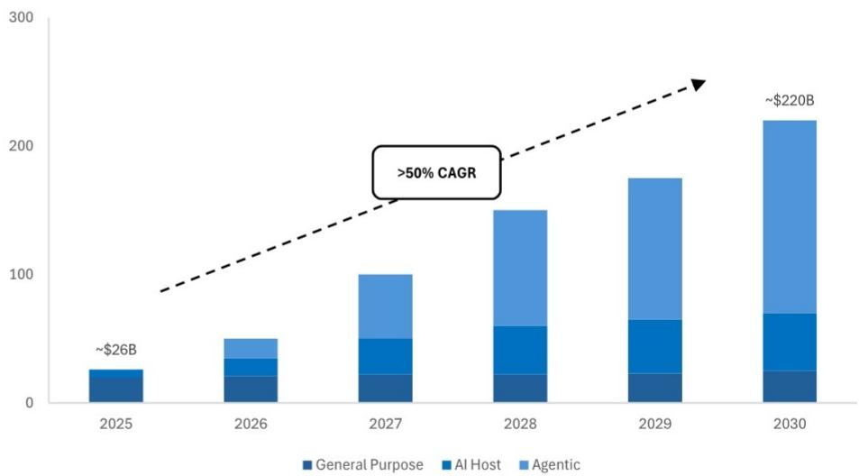

## Advanced Micro Devices

## AAI26 观察：AI/CPU 市场空间预期上调，MI450/Helios 规模部署凸显AI机遇的扩展；在利用CPU领域优势的同时缩小与GPU同行的差距

我们昨日在旧金山参加了AMD旗舰级Advancing AI活动（AAI26），对公司的端到端计算产品组合（半导体+系统+软件）、即将推出的产品路线图以及不断强化的AI生态系统合作（与Anthropic、OpenAI、Meta等公司）有了更积极的看法。与往年一样，AMD也在本次活动中发布了多款新产品，其中最引人注目的包括其第六代EPYC处理器（"Venice"）、Instinct MI4XX系列GPU以及Helios AI机架级解决方案（其他发布产品还包括Ryzen AI嵌入式X100s和Kria AI SOM等）。然而，我们认为今年活动的真正关键收获如下：（1）管理层将其AI加速器市场空间预测上调至2030年约1.4万亿美元，高于其在2025年11月分析师日提出的超过1万亿美元的预估，以及去年活动（AAI25）上提出的到2028年超过5000亿美元的前景。市场空间的扩大主要源于智能体AI应用的普及，这推动了GPU和CPU市场的整体需求增长（见图1）。（2）管理层还将数据中心CPU市场空间预测上调至2030年约2200亿美元（到2030年服务器CPU年复合增长率超过50%），这比公司2026年第一季度财报电话会议上提出的约1200亿美元增加了1000亿美元，较2025年11月分析师日提出的600亿美元增长了近4倍（见图2）。（3）AMD确认其MI450系列GPU和Helios机架级系统将于本季度末开始出货，并在2026年第四季度和2027年上半年加速部署。我们认为9月底的首次出货比市场预期稍晚，但这相对无关紧要，因为多个吉瓦的MI450已计划在2027/2028年期间部署（在Anthropic、OpenAI和Meta之间）。管理层还进一步澄清，他们有意这样安排部署节奏，以便让ODM合作伙伴（如有需要）微调制造，同时使部署与客户数据中心建设进度保持一致。（4）AMD认为这是其有史以来较强大、最广泛的产品组合，总体而言，我们认为AMD广泛的芯片组合——涵盖数据中心EPYC CPU、Instinct GPU和Helios机架级系统，以及Ryzen AI和边缘/嵌入式处理器——使公司能够抓住几乎每个垂直领域的AI机遇，从数据中心的前沿模型训练到智能体工作负载、边缘计算和客户端/物理AI。总而言之，我们认为今年的活动独特地凸显了AMD如何在继续缩小与大型GPU同行差距的同时，受益于CPU及相关市场的加速趋势。

## 中性

AMD，AMD US  
价格（2026年7月22日）：552.33美元  
目标价（2026年12月）：385.00美元

半导体及半导体资本设备/IT硬件

Harlan Sur AC (1-415) 315-6700 harlan.sur@JPM.com

Mayur Ramdhani (1-212) 622-1664 mayur.ramdhani@JPM.com

Apoorva Kumar (1-212) 270-0668 apoorva.kumar@JPM.com JPM Securities LLC

请参阅第6页了解分析师认证和重要披露。

\- AI加速器市场空间上调至2030年约1.4万亿美元（此前为超过1万亿美元），由AI相关计算需求向智能体AI工作负载扩展所驱动... AMD将其AI加速器市场空间预测上调至2030年约1.4万亿美元，这意味着未来5年复合年增长率超过45%（从2025年的约2000亿美元起）。这相较于公司2025年11月分析师日提出的超过1万亿美元预估以及去年AAI活动上提供的超过5000亿美元前景，是一个显著的提升。这一上调主要反映了AMD的观点，即AI相关计算需求正从模型训练扩展到推理，并越来越多地涉及智能体AI工作负载。其论点是，随着智能体应用在企业及消费者用例中的普及，它们不仅会推动GPU的整体需求增长，还会推动包括CPU在内的整个计算堆栈的需求增长——而AMD的Instinct GPU和EPYC CPU产品线为公司提供了多种途径来受益于这一相同的长期趋势。总而言之，我们认为更高的AI市场空间预测反映了管理层对AI建设在本十年末的广度和持久性信心增强——这对我们整个行业是一个积极信号。不过，我们仍然认为，到2030年，AI ASIC/XPU的增长将继续超过数据中心GPU的增长，这应将GPU的市场空间份额从2025年的约85%削减至2030年的约60-70%。这意味着GPU市场空间的复合年增长率略低于整体AI加速器市场空间的复合年增长率，可能接近约40%的范围，而AMD可能正在获得份额（从2025年低于5%的水平）。如果我们保守假设2030年GPU在整体AI加速器市场空间中的份额约为60%，且AMD占据该GPU份额的15%，则意味着数据中心GPU收入可能达到约1250亿美元的范围，这远高于当前市场共识预估的约940亿美元...

图1：AI加速器市场空间预测（十亿美元）  
  
来源：AMD Advancing AI 2026，JPM预估

\- 数据中心CPU市场空间上调至2030年约2200亿美元，高于2026年第一季度财报电话会议上提出的1200亿美元，并略高于买方预估（约2000亿美元）... AMD还将数据中心CPU市场空间预测上调至2030年约2200亿美元，这意味着未来5年复合年增长率超过50%（从2025年的约260亿美元起）。这一新的市场空间数字略高于我们在活动前听到的一些买方预期（约2000亿美元），并且比公司几个月前在2026年第一季度财报电话会议上提出的约1200亿美元增加了1000亿美元。这也反映了较去年2025年11月分析师日提出的600亿美元增长了近4倍。我们认为这些连续上调的幅度和速度本身就值得注意，但考虑到推理和智能体工作负载自然需要大量通用计算能力与GPU协同处理编排和数据任务，这并不令人意外。虽然隐含的市场空间复合年增长率现在超过50%，但我们认为额外的份额获取可能会推动AMD服务器CPU业务实现更高的增长率。如果我们保守假设与市场同步增长，AMD的服务器CPU收入在2030年可能达到850亿美元以上，这与数据中心GPU收入（约1250亿美元范围，见前文）相结合，可能在2030年产生超过2000亿美元的总数据中心业务收入（远高于当前市场对约1220亿美元的预测）。

图2：数据中心CPU市场空间（十亿美元）  
  
来源：AMD Advancing AI 2026，JPM预估

\- MI450 GPU / Helios机架级系统于2026年9月开始出货，并在2026年第四季度和2027年上半年加速部署... AMD确认其MI450系列GPU和Helios机架级系统将于2026年第三季度末——具体是9月——开始出货，并在2026年第四季度和2027年上半年加速部署。虽然9月的首次出货可能比活动前的普遍预期稍晚，但我们认为这相对无关紧要，因为多个吉瓦的MI450产能已计划在2027年期间部署。换句话说，需求管道依然强劲，而这最终才是对部署轨迹以及AMD基本面最重要的因素——而非精确的起始日期。值得一提的是，管理层也澄清，这一时间安排是刻意的设计选择，而非执行失误的迹象。以这种方式安排部署节奏，为ODM合作伙伴提供了（如有需要）微调制造的空间，同时也使出货与客户自身的数据中心建设进度保持一致。

\- AMD认为这是其有史以来较强大、最广泛的产品组合，我们倾向于同意这一观点... AMD广泛的芯片组合，涵盖数据中心EPYC CPU、Instinct GPU和Helios机架级系统，以及Ryzen AI和边缘/嵌入式处理器，使公司能够抓住几乎每个垂直领域的AI机遇，从前沿模型训练到智能体工作负载、边缘计算和物理AI。在今年的活动中，尤其令我们印象深刻的是，AMD越来越能够为客户提供全栈解决方案——芯片、机架级集成和开放软件（ROCm）——这理论上扩大了AMD每次部署可获取的价值量。这种广度也提供了针对任何单一终端市场不均衡节奏的自然对冲，使AMD能够在需求出现的任何地方参与AI建设——无论是超大规模训练集群、企业推理、自主机器人，还是边缘的端侧AI。

# 研究主题、估值与风险

Advanced Micro Devices（中性；目标价：385.00美元）

## 研究主题

尽管AMD通过Ryzen、EPYC和Radeon平台提升了其在CPU和GPU产品上的竞争力，并有望在短期内改善其市场份额并推动可观的收入增长，但我们认为长期份额增长存在不确定性。此外，AMD将需要在运营支出（尤其是研发）上进行大量投入，以跟上市场领先者的步伐。虽然我们对AMD的执行力感到鼓舞，但我们维持中性评级，因为其报价似乎已接近充分反映价值。

## 估值

我们对2026年12月的385美元目标价，是基于约35倍的市盈率倍数（与同行倍数一致）应用于2026年底约11美元的盈利能力。

## 评级与目标价风险

AMD通常约50%的收入来自核心PC终端市场，该市场与宏观环境高度相关。如果PC终端市场弱于/强于预期，可能导致微处理器和GPU出货量减少/增加，进而可能导致我们对AMD的收入和每股收益预估向下/向上修正。

AMD分别在微处理器和图形市场与英特尔和英伟达竞争。因此，任何重大的份额获取/损失都可能导致我们收入和每股收益预估的上行/下行风险，这可能导致我们重新评估对AMD的中性评级。

分析师认证：本报告封面以“AC”标识的研究分析师（或，当多位研究分析师主要负责本报告时，封面或文件内以“AC”标识的研究分析师分别就其在本研究中涵盖的每个证券或发行人认证）证明：(1) 本报告中表达的所有观点均准确反映了研究分析师对任何及所有相关证券或发行人的个人观点；(2) 研究分析师的任何报酬部分过去、现在或将来均未直接或间接与本报告中研究分析师表达的具体建议或观点相关联。对于封面列出的所有韩国研究分析师（如适用），他们还根据KOFIA要求证明，研究分析师的分析是本着诚信原则进行的，且观点反映了研究分析师自身的意见，未受到不当影响或干预。

除非另有说明，本报告中列出的所有作者均为独立撰写研究报告的研究分析师。在欧洲，本报告中可能将行业专家（销售与交易）列为联系人，但他们并非报告作者，也非研究部门成员。

## 重要披露

• 做市商：JPM Securities LLC 为 Advanced Micro Devices 或相关实体的证券提供做市服务。

\- 做市商/流动性提供者：JPM 是 Advanced Micro Devices 或相关实体金融工具的做市商和/或流动性提供者。

\- 实益所有权（1%或以上）：JPM 实益持有 Advanced Micro Devices 或相关实体一类普通股证券的1%或以上。

\- 客户：JPM 目前拥有，或在过去12个月内曾拥有以下实体作为客户：Advanced Micro Devices 或相关实体。

\- 客户/投资银行：JPM 目前拥有，或在过去12个月内曾拥有以下实体作为投资银行客户：Advanced Micro Devices 或相关实体。

\- 客户/非投资银行、证券相关：JPM 目前拥有，或在过去12个月内曾拥有以下实体作为客户，且提供的服务为非投资银行、证券相关服务：Advanced Micro Devices 或相关实体。

\- 客户/非证券相关：JPM 目前拥有，或在过去12个月内曾拥有以下实体作为客户，且提供的服务为非证券相关服务：Advanced Micro Devices 或相关实体。

\- 已收投资银行报酬：JPM 在过去12个月内已从 Advanced Micro Devices 或相关实体收取投资银行服务报酬。

\- 潜在投资银行报酬：JPM 预计在未来三个月内将从 Advanced Micro Devices 或相关实体收取或寻求投资银行服务报酬。

• 已收非投资银行报酬：JPM 在过去12个月内已从 Advanced Micro Devices 或相关实体收取产品或服务报酬（非投资银行服务）。

\- 债务头寸：JPM 可能持有 Advanced Micro Devices 或相关实体的债务证券头寸（如有）。

公司特定披露：JPM 确实并寻求与其研究报告所覆盖的公司开展业务。因此，读者应注意，该公司可能存在影响本报告客观性的利益冲突。读者应将本报告视为做出决策的单一因素。重要披露，包括价格图表和信用意见历史表（如适用），可在综合报告和所有JPM覆盖的公司以及某些未覆盖公司的页面上获取，请访问 https://www.jpmm.com/research/disclosures，致电 1-800-477-0406，或发送电子邮件至 research.disclosure.inquiries@JPM.com 提出请求。

Advanced Micro Devices (AMD, AMD US) 价格图表  
  
来源：Bloomberg Finance L.P. 和 JPM；价格数据已根据股票分割和股息进行调整。覆盖起始于2002年9月12日。所有报价均为前一交易日收盘价。

<table><tr><td>日期</td><td>评级</td><td>价格（美元）</td><td>目标价（美元）</td></tr><tr><td>2023年8月2日</td><td>N</td><td>117.60</td><td>130</td></tr><tr><td>2023年11月1日</td><td>N</td><td>98.50</td><td>115</td></tr><tr><td>2024年1月31日</td><td>N</td><td>172.06</td><td>180</td></tr><tr><td>2025年2月5日</td><td>N</td><td>119.50</td><td>130</td></tr><tr><td>2025年5月7日</td><td>N</td><td>98.62</td><td>120</td></tr><tr><td>2025年8月6日</td><td>N</td><td>174.31</td><td>180</td></tr><tr><td>2025年11月5日</td><td>N</td><td>250.05</td><td>270</td></tr><tr><td>2026年5月6日</td><td>N</td><td>355.26</td><td>385</td></tr></table>

图表显示了JPM对这些股票的持续覆盖；当前分析师可能并非在整个期间内都覆盖这些股票。JPM评级或名称：OW = 增持，N = 中性，UW = 减持，NR = 未评级

## 股票研究评级、名称及分析师覆盖范围说明：

JPM使用以下评级体系：增持（在本报告所述目标价期间内，我们预计该股票的表现将优于研究分析师或其团队覆盖范围内股票的平均总回报）；中性（在本报告所述目标价期间内，我们预计该股票的表现将与研究分析师或其团队覆盖范围内股票的平均总回报持平）；减持（在本报告所述目标价期间内，我们预计该股票的表现将逊于研究分析师或其团队覆盖范围内股票的平均总回报）。NR为未评级。在此情况下，JPM已因缺乏充分基本面依据或出于法律、监管或政策原因，移除了对该股票的评级及（如适用）目标价。先前评级及（如适用）目标价不应再被依赖。NR名称并非推荐或评级。部分被覆盖股票有评级但无目标价；在此情况下，我们预计该股票的表现将优于/持平/逊于研究分析师或其团队在相关区域期间内覆盖范围内股票的平均总回报。在我们的亚洲（除澳大利亚和印度外）以及英国中小盘股票研究中，每只股票的预期总回报是与基准国家市场指数的预期总回报进行比较，而非与研究分析师的覆盖范围进行比较。如果本报告的重要披露部分未显示，认证研究分析师的覆盖范围可在JPM研究网站 https://www.JPMmarkets.com 上找到。

覆盖范围：Sur, Harlan：Advanced Micro Devices (AMD), Analog Devices (ADI), Applied Materials (AMAT), Arm Holdings Plc (ARM), Astera Labs Inc (ALAB), Broadcom Inc (AVGO), Cadence Design Systems (CDNS), GlobalFoundries (GFS), Intel (INTC), KLA Corporation (KLAC), Lam Research (LRCX), Marvell Technology Inc (MRVL), Microchip Technology (MCHP), Micron Technology (MU), NVIDIA Corporation (NVDA), NXP Semiconductors (NXPI), ON Semiconductor Corporation (ON), Quantinuum (QNT), Sandisk (SNDK), Synopsys Inc (SNPS), Texas Instruments (TXN)

JPM股票研究评级分布，截至2026年7月4日

<table><tr><td></td><td>增持（买入）</td><td>中性（持有）</td><td>减持（卖出）</td></tr><tr><td>JPM全球股票研究覆盖*</td><td>53%</td><td>36%</td><td>12%</td></tr><tr><td>投行客户**</td><td>83%</td><td>80%</td><td>73%</td></tr><tr><td>JPMS股票研究覆盖*</td><td>51%</td><td>37%</td><td>12%</td></tr><tr><td>投行客户**</td><td>95%</td><td>92%</td><td>87%</td></tr></table>

\*请注意，由于四舍五入，百分比可能未加总至100%。  
\*\*在过去12个月内，JPM为其提供投资银行服务的“买入”、“持有”和“卖出”类别中各标的公司的百分比。

仅就FINRA评级分布规则而言，我们的增持评级属于报告评级类别；我们的中性评级属于持有评级类别；我们的减持评级属于报告评级类别。请注意，带有NR名称的股票未包含在上述表格中。此信息截至最近一个日历季度末。

股票估值与风险：有关被覆盖公司或目标价的估值方法和风险，请参阅最新的公司特定研究报告，网址为 http://www.JPMmarkets.com，联系首席分析师或您的JPM代表，或发送电子邮件至 research.disclosure.inquiries@JPM.com。有关所用专有模型的实质性信息，请参阅公司特定研究报告中的财务摘要和公司概况表，这些内容可在我们客户网站 http://www.JPMmarkets.com 的公司页面上获取。本报告还阐述了所使用的基本假设。

## 研究交流历史：

过去12个月内JPM研究交流的传播历史可在 http://www.JPMmarkets.com 的研究与评论页面获取，您也可以按分析师姓名、行业或金融工具进行搜索。

分析师薪酬：负责编写本报告的研究分析师的薪酬基于多种因素，包括研究的质量和准确性、客户反馈、竞争因素以及公司整体收入。

## 其他披露

JPM是JPM Chase & Co.及其全球子公司和关联公司投资银行业务的营销名称。

英国MiFID FICC研究豁免：英国客户应参阅英国MiFID研究豁免以了解JPM实施FICC研究豁免的详情以及相关FICC研究分类的指导。

除非相关法律特别允许，所有研究材料在提供给客户的同时，均可在我们的客户网站JPM Markets上获取。并非所有研究内容都会重新分发、通过电子邮件发送或提供给第三方聚合平台。如需获取特定股票的所有研究材料，请联系您的销售代表。

本研究材料中对中国的任何长格式引用；香港；台湾；和澳门分别指中国大陆；中国香港特别行政区；中国台湾；和中国澳门特别行政区。

JPM可能不时撰写关于受美国、欧盟、英国或其他相关司法管辖区政府当局实施或管理的经济或金融制裁所针对的发行人或证券（受制裁证券）的文章。本报告中的任何内容均无意被解读为鼓励、促进、推动或以其他方式批准对受制裁证券的投资或交易。客户在做出决策时应了解自身的法律和合规义务。

本研究报告中讨论的任何数字或加密资产均受快速变化的监管环境影响。有关加密资产（包括比特币和以太坊）的相关监管建议，请参阅 https://www.JPM.com/disclosures/cryptoasset-disclosure。

本研究报告的作者可能未获授权在您的司法管辖区开展受监管活动，如果未获授权，则不会声称自己能够这样做。

交易所交易基金：JPM Securities LLC (“JPMS”) 是几乎所有美国上市交易所交易基金的授权参与者。如果本报告中提及任何交易所交易基金，JPMS可能因分销这些交易所交易基金份额而赚取佣金和基于交易的报酬，并可能因执行其他交易相关服务（例如向交易所交易基金份额的卖空者提供证券借贷）而赚取费用。JPMS也可能为交易所交易基金本身提供服务，包括担任交易所交易基金的经纪商或交易商。此外，JPMS的关联公司可能为交易所交易基金提供服务，包括信托、托管、管理、借贷、指数计算和/或维护及其他服务。

期权和期货相关研究：如果本文所含信息涉及期权或期货相关研究，则该信息仅提供给已收到适当期权或期货风险披露文件的人士。请联系您的JPM代表或访问 https://www.theocc.com/components/docs/riskstoc.pdf 获取期权清算公司标准化期权的特征和风险副本，或访问 https://www.finra.org/sites/default/files/2020-08/Security\_Futures\_Risk\_Disclosure\_Statement\_2020.pdf 获取证券期货风险披露声明副本。

银行间同业拆借利率及其他基准利率的变更：某些利率基准现在或将来可能受到持续的国际、国内及其他监管指导、改革和改革提案的影响。更多信息，请参阅：https://www.JPM.com/global/disclosures/interbank\_offered\_rates

私人银行客户：如果您作为JPM Chase & Co.及其子公司（“JPM私人银行”）私人银行业务的客户接收研究，则研究由JPM私人银行提供，而非JPM的任何其他部门，包括但不限于JPM企业与投资银行及其全球研究部门。

负责制作和分发研究的法律实体：撰写本材料的Reg AC研究分析师姓名下方标识的法律实体是负责制作本研究的法律实体。如果多位Reg AC研究分析师撰写了本材料，且其姓名下方标识了不同的法律实体，则这些法律实体共同负责制作本研究。如果分析师姓名下列出了多个法律实体，则除非另有说明，第一个法律实体负责制作。来自不同JPM关联公司的研究分析师可能对本材料的制作有所贡献，但可能未获授权在您的司法管辖区开展受监管活动（并且不会声称自己能够这样做）。除非下文法律实体披露中另有说明，本材料已由负责制作的法律实体分发，或者如果分析师姓名下列出了多个法律实体，则第一个法律实体将负责分发。如果您有任何疑问，请联系您所在司法管辖区的相关研究分析师或分发本研究材料的实体。

法律实体披露及国家/地区特定披露：

阿根廷：JPM Chase Bank N.A Sucursal Buenos Aires 受阿根廷共和国中央银行和阿根廷国家证券委员会监管。

澳大利亚：JPM Securities Australia Limited ("JPMSAL") (ABN 61 003 245 234/AFS Licence No: 238066) 受澳大利亚证券和投资委员会监管，是ASX Limited的市场参与者、ASX Clear Pty Limited的清算和结算参与者以及ASX Clear (Futures) Pty Limited的清算参与者。本材料由JPMSAL或其代表在澳大利亚仅向“批发客户”（定义见《2001年公司法》第761G条）发行和分发。所有涵盖的金融产品清单可在 https://www.jpmm.com/research/disclosures 找到。JPM力求覆盖与国内外读者基础相关的所有全球行业分类标准行业以及各种市值规模的公司。如适用，在对标的公司进行公开尽职调查过程中，研究分析师团队有时可能通过公司拜访、与公司代表讨论、管理层演示等公司接触方式进行此类尽职调查。JPMSAL发布的研究已按照JPM澳大利亚研究独立性政策编制，该政策可在以下链接找到：JPM Australia - Research Independence Policy。

巴西：Banco JPM S.A. 受巴西证券交易委员会和巴西中央银行监管。JPM监察员：0800-7700847 / 0800-7700810（听障人士）/ ouvidoria.jp.morgan@jpmchase.com。

加拿大：JPM Securities Canada Inc. 是一家注册投资交易商，受加拿大投资监管组织和安大略省证券委员会监管，是加拿大交易所的参与会员。本材料由JPM Securities Canada Inc.或其代表在加拿大分发。

智利：Inversiones JPM Limitada 是一家在智利注册的未受监管实体。

中国：JPM Securities (China) Company Limited 已获中国证监会批准开展证券投资咨询业务。

哥伦比亚：Banco JPM Colombia S.A. 受哥伦比亚金融监管局监管。本材料中对哥伦比亚境外实体提供的产品或服务的任何引用仅用于描述目的。此类引用不构成也不应被解释为在哥伦比亚领土内推广活动或提供金融产品或服务，如适用哥伦比亚法规所定义。

迪拜国际金融中心：JPM Chase Bank, N.A., Dubai Branch 受迪拜金融服务管理局监管，其注册地址为迪拜国际金融中心 - The Gate, West Wing, Level 3 and 9 PO Box 506551, Dubai, UAE。本材料由JPM Chase Bank, N.A., Dubai Branch 向根据DFSA规则被视为专业客户或市场对手方的人士分发。

欧洲经济区：除非另有说明，研究由JPM SE在EEA分发，JPM SE是一家由联邦金融监管局授权、并由BaFin、德国中央银行和欧洲中央银行共同监管的信贷机构。JPM SE总部位于法兰克福，注册地址为TaunusTurm, Taunustor 1, Frankfurt am Main, 60310, Germany。本材料已在EEA向根据MiFID II第4条第1款第10项及附件二及其在各自母国的实施被视为专业读者（或同等资格）的人士分发。非EEA专业读者不得依据或依赖本材料。本材料所涉及的任何投资或投资活动仅面向EEA相关人士，并仅与EEA相关人士进行。

香港：JPM Securities (Asia Pacific) Limited (CE编号AAJ321) 受香港金融管理局和香港证券及期货事务监察委员会监管，JPM Broking (Hong Kong) Limited (CE编号AAB027) 受香港证券及期货事务监察委员会监管。JPM Chase Bank, N.A., Hong Kong Branch (CE编号AAL996) 受香港金融管理局和证券及期货事务监察委员会监管，是根据美国法律组建的有限责任公司。如果本材料的分发在香港属于受监管活动，则本材料由JPM Securities (Asia Pacific) Limited 和/或 JPM Broking (Hong Kong) Limited 在香港分发。

印度：JPM India Private Limited (公司识别号 - U67120MH1992FTC068724)，注册办事处位于JPM Tower, Off. C.S.T. Road, Kalina, Santacruz - East, Mumbai – 400098，已在印度证券交易委员会注册为“研究分析师”，注册号INH000001873。JPM India Private Limited 还作为印度国家证券交易所和孟买证券交易所的会员（SEBI注册号 – INZ000239730）以及商人银行家（SEBI注册号 - MB/INM000002970）在SEBI注册。电话：91-22-6157 3000，传真：91-22-6157 3990，网站：http://www.jpmipl.com。JPM Chase Bank, N.A. - Mumbai Branch 已获得印度储备银行许可（许可证号 53/Licence No. BY.4/94；SEBI - IN/CUS/014/ CDSL : IN-DP-CDSL-444-2008/ IN-DP-NSDL-285-2008/ INBI00000984/ INE231311239）作为印度的指定商业银行，这是其主要许可证，允许其在印度开展银行业务以及印度银行分支机构允许从事的其他活动。对于非本地研究材料，本材料不由JPM India Private Limited在印度分发。合规官：Ashutosh Sharma; ashutosh.j.sharma@jpmchase.com; +912261575002。申诉官：Ramprasadh K, jpmipl.research.feedback@JPM.com; +912261573000。SEBI授予的注册和NISM的认证不以任何方式保证中介机构的业绩或向读者提供任何回报保证。请访问条款和条件以及最重要的条款和条件。年度合规审计报告可在 http://www.jpmipl.com/#research 获取。

印度尼西亚：PT JPM Sekuritas Indonesia 是印度尼西亚证券交易所的会员，并受金融服务管理局注册和监管。

韩国：JPM Securities (Far East) Limited, Seoul Branch 是韩国交易所的会员。JPM Chase Bank, N.A., Seoul Branch 在韩国注册为外国银行分行（JPM Chase Bank, N.A.）。两个实体均受金融服务委员会和金融监督院监管。对于非宏观研究材料，该材料由JPM Securities (Far East) Limited, Seoul Branch 在韩国分发。

日本：JPM Securities Japan Co., Ltd. 和 JPM Chase Bank, N.A., Tokyo Branch 受日本金融厅监管。

马来西亚：本材料由JPM Securities (Malaysia) Sdn Bhd (18146-X) 在马来西亚发行和分发，该公司是马来西亚证券交易所的参与组织，并持有马来西亚证券委员会颁发的资本市场服务许可证。

墨西哥：JPM Casa de Bolsa, S.A. de C.V., JPM Grupo Financiero 是墨西哥证券交易所和机构证券交易所的会员，并获授权由国家银行和证券委员会作为经纪交易商运营。

新西兰：本材料由JPMSAL在新西兰仅向“批发客户”（定义见《2013年金融市场行为法》）发行和分发。JPMSAL已根据《2008年金融服务提供商（注册和争议解决）法》注册为金融服务提供商。

菲律宾：JPM Securities Philippines Inc. 是菲律宾证券交易所的交易参与者，也是菲律宾证券清算公司和证券读者保护基金的成员。它受证券交易委员会监管。

新加坡：本材料由JPM Securities Singapore Private Limited (JPMSS) [MDDI (P) 057/08/2025 和公司注册号：199405335R] 和/或 JPM Chase Bank, N.A., Singapore branch (JPMCB Singapore) 在新加坡发行和分发，两者均受新加坡金融管理局监管。JPMSS是新加坡交易所证券交易有限公司的会员。本材料仅向《证券及期货法》（第289章）第4A条定义的认可读者、专家读者和机构读者在新加坡发行和分发。本材料无意向任何零售读者或任何不属于“认可读者”、“专家读者”或“机构读者”类别的其他读者发行或分发。新加坡的接收者应就本材料引起或与之相关的任何事宜联系JPMSS或JPMCB Singapore。

南非：JPM Equities South Africa Proprietary Limited 和 JPM Chase Bank, N.A., Johannesburg Branch 是约翰内斯堡证券交易所的会员，并受金融服务行为监管局监管。

台湾：JPM Securities (Taiwan) Limited 是台湾证券交易所的参与者（公司型），并受台湾证券期货局监管。与股权证券相关的材料由JPM Securities (Taiwan) Limited 在台湾发行和分发，受限于许可证范围及适用的台湾法律法规。如果JPM Securities (Taiwan) Limited 制作关于未在台湾证券交易所或台北交易所上市的证券（“非台湾上市证券”）的研究材料，这些材料不应构成适用台湾法规下的证券推荐，并且为免生疑问，JPM Securities (Taiwan) Limited 不担任非台湾上市证券的经纪商。根据《证券商受托买卖有价证券对客户推介买卖有价证券作业规范》（或其修订或补充）第7-1条第2款和/或其他适用法律法规，请注意，除非本材料“重要披露”中另有披露，本材料的接收者不得从事与本材料相关的任何可能产生利益冲突的活动。

泰国：本材料由JPM Securities (Thailand) Ltd. 在泰国发行和分发，该公司是泰国证券交易所的会员，并受财政部和证券交易委员会监管。注册地址为548 One City Center Building, 50th Floor, Ploenchit Road, Lymphini, Pathum Wan, Bangkok 10330。

英国：研究由JPM Securities plc (“JPMS plc”) 在英国制作，该公司是伦敦证券交易所的会员，并受审慎监管局授权及受金融行为监管局和审慎监管局监管；或由JPM Markets Limited (“JPMML Ltd”) 制作，该公司受金融行为监管局授权和监管。除非另有说明，本材料由JPMS plc在英国分发，并且仅针对以下英国人士：(a) 具有《2000年金融服务和市场法（金融促销）2005年命令》第19(5)条所述的投资相关事务专业经验的人士；(b) 该命令第49条所述的人士（高净值公司、非法人协会或合伙企业、高价值信托的受托人等）；或(c) 可以合法接收此通讯的任何其他人士；所有此类人士均称为“英国相关人士”。非英国相关人士不得依据或依赖本材料。本材料所涉及的任何投资或投资活动仅面向英国相关人士，并仅与英国相关人士进行。JPM EMEA关于预防和避免与研究制作相关的利益冲突的政策说明可在以下链接找到：JPM EMEA - Research Independence Policy。

美国：JPM Securities LLC (“JPMS”) 是纽约证券交易所、FINRA、SIPC和NFA的会员。JPM Chase Bank, N.A. 是FDIC的会员。非美国关联公司发布的材料由JPMS在美国分发，JPMS对其内容承担责任。

一般信息：可根据要求提供更多信息。本材料中的信息来自被认为可靠的来源。尽管已采取一切合理措施确风险自担材料中陈述的事实准确，且其中包含的预测、意见和预期公平合理，但JPM Chase & Co.或其关联公司和/或子公司（统称JPM）不对所提供材料的完整性或准确性作出任何陈述或保证，但有关JPM和研究分析师参与作为材料主题的发行人的披露除外。因此，不应依赖本材料中所含信息的准确性、公平性或完整性。由于计算、调整、翻译成不同语言和/或当地监管限制（如适用），本材料中可能存在某些数据差异和/或内容有限。这些差异不应影响对材料中可能讨论的标的公司的整体分析、观点和/或建议。人工智能工具可能已用于本材料的准备，包括协助数据分析、模式识别和内容起草。JPM不对因使用本材料或其内容而产生的任何损失承担任何责任，并且JPM或其各自的董事、高级职员或员工均不对本文件的内容承担任何责任，但相关司法管辖区的监管机构或该监管制度可能施加的责任和义务除外。本材料中包含的意见、预测或项目仅代表JPM截至材料日期的当前意见或判断，因此如有变更，恕不另行通知。可能会根据公司特定发展或公告、市场状况或任何其他公开信息，定期提供关于公司/行业的更新。无法保证未来的结果或事件将与任何此类意见、预测或项目一致，这些仅代表一种可能的结果。此外，此类意见、预测或项目受某些未经验证的风险、不确定性和假设的影响，未来的实际结果或事件可能存在重大差异。本材料中提及的任何投资的价值或收入可能会波动和/或受汇率变化的影响。除非另有说明，所有定价均为所讨论证券的市场收盘价指示性价格。过往表现并不预示未来结果。因此，读者可能收回少于最初投资的金额。本材料不构成购买或出售任何金融工具的要约或招揽。本文中的意见和建议未考虑个别客户的情况、目标或需求，也不构成对特定客户推荐特定证券、金融工具或策略。本材料可能包含对结构性证券、期权、期货和其他衍生品的看法。这些是复杂工具，可能涉及高风险，仅适合能够理解并承担相关风险的成熟读者。本材料的接收者必须就本文提及的任何证券或金融工具做出自己的独立决定，并应寻求其认为必要的独立财务、法律、税务或其他顾问的建议。JPM可能基于研究分析师的看法和研究进行自营交易，也可能以与本材料所持观点不一致的方式为其自身账户或客户账户进行交易，并且JPM没有义务确保此类其他沟通被本材料的任何接收者知晓。JPM内部的其他人员，包括策略师、销售人员和其他研究分析师，可能持有与本材料所持观点不一致的看法。未参与本材料编制的JPM员工可能持有本材料中提及的证券（或此类证券的衍生品）并可能以与本材料讨论的方式不同的方式进行交易。本材料在任何司法管辖区均不构成对任何发行人、其产品或服务或其证券的广告或营销。

保密与安全通知：此传输可能包含根据适用法律享有特权、保密、法律特权和/或免于披露的信息。如果您不是预期的接收者，特此通知您，披露、复制、分发或使用本文所含信息（包括任何依赖）是严格禁止的。尽管此传输及其任何附件被认为不含任何可能影响接收和打开它的任何计算机系统的病毒或其他缺陷，但接收者有责任确保其无病毒，并且JPM Chase & Co.、其子公司和关联公司（如适用）不对因使用而产生的任何损失或损害承担任何责任。如果您错误地收到此传输，请立即联系发件人并完全销毁该材料，无论是电子版还是硬拷贝版。此消息受电子监控：https://www.JPM.com/disclosures/email

MSCI：本文中的某些信息（“信息”）经MSCI Inc.、其关联公司和信息提供商（“MSCI”）©2026许可复制。未经适当许可，不得复制或传播信息。MSCI对信息不作任何明示或暗示的保证（
