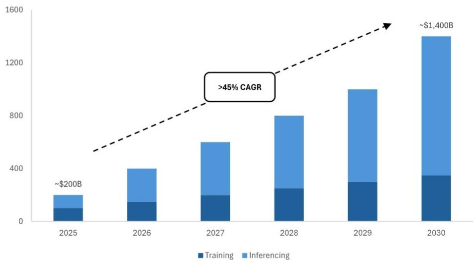
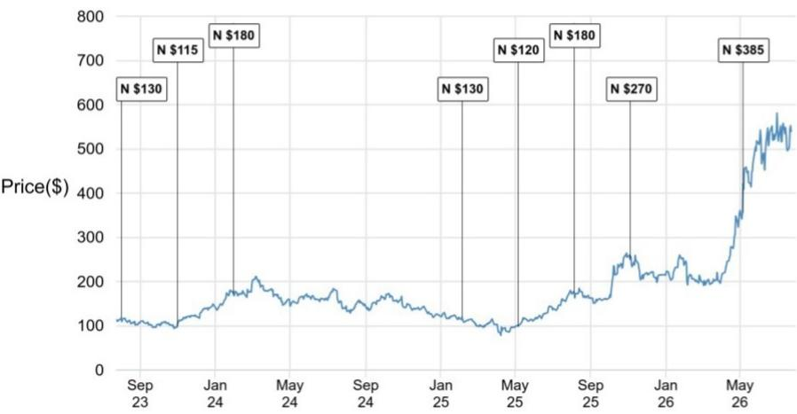

# AMD的TAM修订揭示了一个根本性转变：AI机遇不再仅是GPU的故事

在AMD的Advancing AI 2026活动上，管理层将其AI加速器总可寻址市场预测上调至2030年约1.4万亿美元，高于2025年11月分析师日时提出的超过1万亿美元的预估。不到一年内上调40%本身就足够引人注目。但更重要的数字来自一个意想不到的来源：数据中心CPU TAM，AMD现在预计到2030年约为2200亿美元，比2026年第一季度财报电话会议上列出的数字增加了1000亿美元，比去年分析师日时指出的600亿美元增长了近四倍。这些连续加速的TAM上调不仅仅是渐进的乐观情绪。它们标志着市场应如何思考AI计算需求——以及哪些公司有能力抓住这一机遇——的结构性重新评估。

传统叙事将AI基础设施建设描绘为以GPU为中心的故事，NVIDIA是主要受益者，AMD则是试图缩小差距的追赶者。AMD的最新披露从根本上挑战了这一框架。该公司正用越来越具体的数据论证，AI机遇正在扩展到CPU计算至关重要的领域——而AMD的EPYC系列在这些领域拥有真正的竞争优势。与此同时，AMD正在通过MI450系列和Helios机架级系统加速其GPU路线图，确认2026年9月底开始首次出货，并已安排到2027日历年的多个千兆瓦部署容量。

战略含义很明确：AMD不再仅仅将自己定位为GPU替代方案。它正在构建一个论点，即公司的全栈产品组合——涵盖GPU、CPU、机架级系统和开放软件——创造了多个同时捕捉AI相关收入增长的途径。对于评估半导体领域的观察者和策略师来说，问题不再是AMD能否在GPU上赶上NVIDIA。问题是市场是否正在正确核算AMD现在明确量化的CPU驱动的AI机遇。

## 1.4万亿美元AI TAM修订反映了对代理型工作负载的根本性重新评估，而不仅仅是模型训练

AMD修订后的AI加速器TAM到2030年达到1.4万亿美元，意味着从2025年约2000亿美元起，年复合增长率超过45%。这比公司在去年Advancing AI活动上提供的到2028年超过5000亿美元的前景有了实质性加速。根据管理层的说法，主要驱动力是代理型AI应用的激增——这些自主系统不仅生成内容，还执行任务、做出决策并与企业软件环境交互。代理型工作负载从根本上改变了计算方程，因为它们需要持续的推理、实时编排以及与现有数据基础设施的集成。它们不仅仅消耗GPU周期进行训练；它们需要跨整个数据中心的持续、交互式计算能力。

这里的关键见解是，代理型AI扩展了总计算空间，但不一定以许多市场参与者假设的方式改变GPU与CPU的混合比例。训练大型模型仍然是GPU密集型的。但大规模推理，特别是对于必须响应查询、检索数据和跨系统协调的代理型应用，对通用计算提出了很高的要求。AMD的论点是，整体AI加速器TAM增长更快、规模更大，正是因为工作负载特征正在多样化。到2030年达到1.4万亿美元的市场并不意味着GPU份额保持不变。事实上，报告指出，GPU TAM份额可能从2025日历年的约85%下降到2030年的60-70%，因为定制ASIC和XPU在推理工作负载中占据更大份额。但相对GPU TAM继续以约40%的复合年增长率增长，而AMD有望从低于5%的基数中获取份额。

对于评估半导体研究主题的读者来说，实际要点是AI基础设施建设正在进入第二阶段。第一阶段由超大规模训练集群和GPU采购主导。第二阶段，AMD现在明确预测，将以大规模推理、代理型应用和异构计算架构为特征。能够在统一平台内同时满足GPU和CPU需求的公司将获得不成比例的收益。

## CPU TAM在九个月内增长四倍，凸显推理和编排正成为主导计算瓶颈

AMD的数据中心CPU TAM预测到2030年达到2200亿美元，意味着从2025年约260亿美元起，超过50%的复合年增长率。为了说明这一修订的规模：公司在2025年11月分析师日上指出600亿美元的CPU TAM，在2026年第一季度财报电话会议上将其提高到1200亿美元，现在又增加到2200亿美元。这在不到九个月内增长了近四倍。这些连续上调的速度和规模表明，AMD正在实时了解客户部署计划，这些计划指向比先前建模的更大的CPU需求。

驱动这一扩张的机制直接但未被充分认识。代理型AI工作负载需要运行在CPU上的编排层。每个触发多步骤推理过程的推理请求、每个查询数据库的检索增强生成管道、以及每个与企业软件交互的自主代理，都会产生CPU绑定的处理，这些处理与AI交互次数呈线性或超线性扩展。AI系统能力越强，它们为非GPU任务消耗的CPU周期就越多。AMD的EPYC系列凭借其高核心数和内存带宽，在结构上与这种工作负载特征保持一致。

这一CPU TAM修订的战略意义不容低估。它意味着AMD的数据中心收入机会远远超出GPU市场份额的获取。即使AMD仅维持其当前的CPU市场份额轨迹，报告估计服务器CPU收入到2030年可能达到850亿美元或更多。结合潜在的数据中心GPU收入在1250亿美元范围内——基于60% GPU TAM份额和15% AMD GPU市场份额的保守假设——数据中心板块总收入可能接近2000亿美元或更多。这远高于当前市场共识估计的约1220亿美元。共识与AMD隐含机会之间的差距要么代表市场效率低下，要么是未能将CPU驱动的AI叙事完全纳入长期模型。

## MI450和Helios的推进确认AMD正在执行GPU路线图，同时管理客户对齐

AMD确认其MI450系列GPU和Helios机架级系统将于2026年第三季度末开始出货，并在2026年第四季度和2027年上半年加速推进。9月的首次出货可能比一些市场预期稍晚，但报告认为这相对不重要。多个千兆瓦的MI450产能已安排到2027日历年在包括Anthropic、OpenAI和Meta在内的客户中部署。需求管道强劲，推进轨迹——而非精确的起始日期——才是对基本面重要的。

管理层明确表示，时间安排是深思熟虑的设计选择，而非执行失误。以这种方式安排推进，使ODM合作伙伴能够在需要时微调制造流程，同时使出货与客户自身的数据中心建设时间表保持一致。这是一种务实的方法，反映了AMD在大规模部署方面的经验。公司优先考虑可靠性和客户对齐，而非尽早出货的表象。对于在GPU市场历史上曾面临执行质疑的挑战者来说，这种对推进管理的严谨方法可以说比满足任意时间表更重要。

Helios机架级系统尤其值得注意，因为它代表了AMD提供与NVIDIA的DGX和HGX平台竞争的集成解决方案的能力。通过将MI450 GPU与AMD自己的网络、冷却和软件栈相结合，Helios使AMD能够每次部署捕获更高的美元内容，并降低客户集成风险。这不仅仅是芯片层面的竞争；这是系统层面的竞争，增加了转换成本并加深了客户关系。报告指出，AMD的产品组合现在涵盖数据中心EPYC CPU、Instinct GPU、Helios机架级系统、Ryzen AI处理器和边缘/嵌入式解决方案。对于评估端到端AI基础设施的客户来说，AMD现在可以提供一个可信的替代方案，避免单一供应商锁定。

## AMD的全栈产品组合为评估三个时间跨度的AI计算敞口创建了决策框架

对于构建研究主题或评估半导体市场竞争动态的读者来说，AMD的Advancing AI披露提供了一个有用的框架，用于思考三个不同时间跨度和工作负载类别的AI计算敞口。

第一个时间跨度是到2027年的GPU训练和推理市场。在这里，AMD是一个拥有可信产品路线图和已确认客户承诺的挑战者。MI450的推进，结合在主要超大规模企业中的现有Instinct部署，表明AMD可以从低个位数基数中获得有意义的GPU市场份额。关键风险在于执行：AMD能否大规模交付良率、性能和软件稳定性？深思熟虑的推进策略和ODM对齐表明管理层意识到这一风险并正在主动管理。

第二个时间跨度是到2030年的CPU推理和编排市场。这是AMD竞争地位较强、市场可能低估机会的领域。EPYC处理器已经与Intel的Xeon系列竞争，AMD在传统服务器CPU市场展示了持续的份额增长。AI驱动的CPU TAM扩张创造了一个独立于GPU市场份额结果的顺风。即使AMD的GPU雄心未能达到最乐观的情景，仅CPU机会就足以证明对公司长期收入潜力进行重新评估是合理的。

第三个时间跨度是边缘和客户端AI市场，AMD的Ryzen AI和嵌入式处理器在此应对设备端推理、自主系统和物理AI应用。这个市场处于发展周期的早期阶段，更难量化，但AMD硅片产品的广度使其能够在AI工作负载从数据中心迁移到边缘时参与其中。

对于观察者来说，决策框架不是在这些时间跨度中选择单一赢家。而是认识到AMD在所有三个时间跨度中具有独特的多元化，并且公司的TAM修订意味着至少其中一个时间跨度将带来超额回报的可能性更高。对AMD的保守观点传统上是它在GPU领域是遥远的第二名，在CPU领域是份额获取者。乐观观点——AMD现在用具体数字阐述——是AI市场足够大且足够多样化，可以支持多个赢家，并且AMD的产品组合广度是资产而非干扰。

## 公司情况更新

尽管Advancing AI 2026带来了建设性的启示，报告仍维持对AMD的观察观点，目标价为552.33美元。积极的基本面信号与谨慎的估值之间的这种脱节，源于2026日历年后每股收益的可见性，这与同行倍数一致。报告明确指出，股价似乎已接近充分估值。

这里的张力在于AMD的长期AI机遇与近期收益轨迹之间。TAM修订意味着到2030年收入基础要大得多，但将其转化为近期收益需要在研发、制造能力和市场推广基础设施方面进行大量投入。AMD必须大力投入以跟上市场领导者的步伐，这些投入将在短期内对利润率造成压力。报告的观察观点并非否定AMD的AI论点；而是表明当前股价已经计入了相当一部分上行空间，留给错误的余地有限。

对于读者来说，关键要点是AMD的战略地位已实质性改善，但估值已经反映了这种改善。相对于其他半导体公司，对AMD持观察观点还是其他观点的决定，取决于人们对公司执行MI450推进、维持CPU份额增长以及比市场预期更快地将TAM扩张转化为收益增长的能力的信心。Advancing AI的披露为这一评估提供了原材料，但它们并未解决估值争论。

*仅供参考。部分内容可能基于源材料通过AI辅助生成、翻译、总结或编辑，可能包含遗漏或错误。请独立验证。这不是研究、法律、税务、会计或其他专业建议。*

仅供参考。部分内容可能基于源材料通过AI辅助生成、翻译、总结或编辑，可能包含遗漏或错误。请独立验证。这不是研究、法律、税务、会计或其他专业建议。

