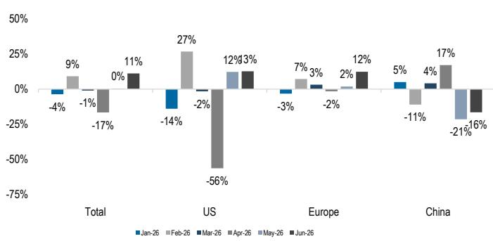
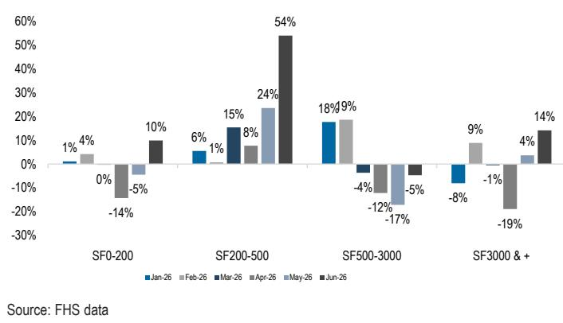

# European Luxury and Sporting Goods Weekly

Timely & Priceless

The European Luxury Goods sector saw a -6% change this week, compared to the MSCI Europe Index (-1%), following the previous week's +4% performance. The Q2/H1 reporting season continued, showing mixed trends across those that reported this week: Swatch (-18%), Moncler (-9%) and Zegna (-4%). The deliveries this week further confirm our view that, while the luxury backdrop was relatively stable in the quarter, performance remains highly polarised amidst macro volatility and with an increasingly discerning luxury consumer. The mixed deliveries from the reporters led to a notable sector adjustment, with LVMH -10%, Kering -7%, Burberry -7% (mainly down on its own trading update last week) and Ferragamo -7%. Zooming in on the learnings from this week's reporting: Swatch reported a 2% beat on H1 sales, showing strong traction in the US and pockets of Asia, but still evolving trends in China (a read to all players, in our view); Moncler delivered group sales in line with expectations and a beat on EBIT, but softness at Moncler brand in Q2 confirmed the brand's structural seasonality and still very mixed trends among tourists in Europe (we think performance of tourist spend will be one of the most mixed outcomes of this reporting, driven by the brand's exposures to the different nationalities and specific brand's momentum); Zegna strong Q2 trading update, with double-digit DTC growth at all three brands, confirmed our positive views on both the attractiveness of the very high-end RTW category (in our view a key beneficiary of the wealth effect, especially in men) and growing strength of the Zegna brand portfolio. We also think this solid result should be read positively to Brunello Cucinelli (-4%), which we have placed on Positive Catalyst Watch into results next week. This leaves us with a mixed read-across as we move into the bulk of the reporting next week, with LVMH, Kering and Hermes up next. Positioning is definitely lighter than how we started reporting and hence the risk reward might be better now. Still, with such mixed learnings so far, we would continue to be very selective on stock picking, backing stories with self-help to grow, rather than trying to call a sector-wide inflection. And in this context, to us one of the main learnings of this week is how robust the Richemont delivery was, both in absolute and relative terms, increasingly warranting a valuation premium vs its own history and to the sector.

The European Sporting Goods sector was -6% this week, also underperforming the MSCI Europe Index, and continuing to be volatile driven by macro headlines. On (-9%) and Puma (-6%) underperformed, whereas adidas (-4%) and JD Sports (-2%) were also soft, on limited company specific newsflow. adidas (-4%, and -3% as we write) came under pressure after the company released sell-side consensus yesterday, but without accompanying a highly anticipated pre-release or guidance upgrade. Our discussions with investors suggest that expectations were higher following the positive World-Cup related headlines, thus a lack of an upgrade might lead to some disappointment and invite questions about the outlook for the rest of the year. Still, adidas is more than a Q2 trade, in our view, and the consistent innovation, brand building and execution across lifestyle and performance should support solid earnings delivery from H2 onwards. Elsewhere, read-across from Deckers (owners of Hoka and UGG, not covered) suggest resilient demand for premium sporting goods, despite a broadly challenging trading environment and softer sentiment in Europe. In China, Q2 updates from Anta and Xtep (both covered by Qian Yao) last Friday confirmed that the retail environment for sporting goods remained measured, with both flagging short-term headwinds, including a lukewarm retail environment and unfavourable weather. On the other hand, Nike (covered by Matthew Boss) confirmed that it will take back its China e-commerce operations from its retail partners and concentrate online sales through DTC beginning in January 2027, in an effort to create a consistent consumer experience. In the near term, we see risks that the transition could add to the promotional environment in China, especially if retailers rush to clear online inventories by year end, although we think such a move is constructive for the sector in the medium term.

Table 1: Forex Watch

<table><tr><td>Forex</td><td>Value</td><td>Up/Dwn</td><td>Week%</td></tr><tr><td>$/€</td><td>1.138</td><td>▲</td><td>0.6%</td></tr><tr><td>€/£</td><td>1.170</td><td>▲</td><td>0.6%</td></tr><tr><td>$/£</td><td>1.331</td><td>▲</td><td>1.2%</td></tr><tr><td>SF/€</td><td>0.930</td><td>▼</td><td>-0.4%</td></tr><tr><td>Yen/€</td><td>186.430</td><td>▼</td><td>-0.3%</td></tr><tr><td>RMB/€</td><td>7.710</td><td>▲</td><td>0.5%</td></tr></table>

Source: Bloomberg Finance L.P.

## Luxury Goods

- Moncler reported Q2 sales broadly in line and a 5% beat on EBIT excluding one-off charges. Moncler brand grew +3% ex-FX in Q2, below expectations, dragged by softer tourist trends and the "buy now, wear now" consumer behaviour delaying Fall/Winter purchases, while the Spring/Summer collection performed ahead of expectations. This retail delivery, in our view, is better than it looks at first sight, including a LFL that remained positive in a low seasonal quarter, successful Spring / Summer collection that was not pushed to its full potential and continued to be supported by good traction in most regions. H1 EBIT was a strong beat, driven by tight opex control and strong Q1 topline leverage. Read more in our note A slow Q2, and yet a strong H1 EBIT delivery.

- Zegna Group reported a robust Q2 trading update with a very high-quality mix. Group sales came in at €517m, up 11% ex-FX, accelerating sequentially. The beat was driven primarily by very strong DTC performance, +17% ex-FX, with all three brands up double-digit DTC growth (inc Zegna brand +18%). Wholesale remained a drag but came in better than feared. By region, the Americas and Rest of APAC posted the strongest results, Greater China was solid while EMEA remained muted. Management highlighted that AUR was the primary driver of DTC growth, characterising it as a mix rather than a price story. Read more in our note Q2 26 trading update first takes: strong across the board.

- Swatch Group reported its H1 26 results with a solid top-line beat of +8.5% ex-FX, driven by strong performance in the US, Japan, Korea and other high-potential markets such as India, Saudi Arabia and Mexico. Mainland China remained the drag where management does not expect an inflection in H2. Despite the top-line beat, EBIT was a significant miss dragged by negative FX and continued operating deleverage in the Production segment. Read more in our notes First Take - H1 Results, H1 Conference call snippets and Model Update - H1 26 Results.

- Swiss Watch Exports in June improved to +11% from +0.4% in May on tougher comps. However, on a trading days adjusted basis, exports decelerated to +1% vs +12% in May (Q2 -1% vs Q1 +2%). By region, the US improved to +13% on softer comps, although on a two-year basis, US exports were still -7%. China remained volatile, -16.5% in June, while HK grew to +7%. Exports to Europe overall grew 12%. By price point, trends improved across categories: watches in the higher-priced bracket (>SF3,000) improved to +14% vs +4% last month, watches in the SF500–3,000 bracket improved to -5% vs May -17% despite tougher comps. Watches in the SF200–500 bracket accelerated to +54% vs May +24% on comps 10pp easier, and at the lower end, watches <SF200 improved to +10% vs. May -4.5%.

Figure 1: Exports yoy growth (value) by region  
  
Source: FHS data

Figure 2: Exports yoy growth (value) by region  

- Chow Tai Fong released its Q1 (CY Q2) trading update with Mainland China SSS +20% yoy in owned stores and +16% in franchised stores (71% of total stores), accelerating from CY Q1 +0.2%/-7% despite comps 1000bps tougher, with the release noting that the group is "outperforming the overall jewellery retail market." Hong Kong+Macau SSS was very strong, up 42% vs Q1 +40%, on comps 25pp tougher, driven by positive consumer sentiment and strong customer traffic. Improvement in both Mainland China and HK was driven primarily by an acceleration in weight-based gold jewellery.

- M&A: Frasers Group acquired a further 2.5mn Hugo Boss shares, lifting its total holding to about 30.28%. Frasers noted that the offer of €38/ share remains open, with the initial acceptance period ending on July 27 $^{th}$ .

- ESG: 1) The EU has implemented a ban preventing major fashion groups from destroying unsold clothes and footwear, requiring them to instead re-sell, re-purpose or donate returns and over-production. Medium-sized companies will be subject to the same rules from 2030; 2) As part of an investigation into alleged worker exploitation at sub-contractors, the Italian police requested documents on governance and supply-chain controls from nine high-end fashion firms including Brunello Cucinelli, Moncler, Chanel and Bulgari. Brunello Cucinelli said in a statement it was surprised and deeply saddened that part of the materials intended for its packaging were found at an unsuitable workplace, despite supplier checks and fair pricing, and pledged full co-operation to protect workers and the wider 'Made in Italy' brand.

- Management on the move: 1) Moncler appointed Sidney Toledano as Director, replacing Alexandre Arnault and Geoffroy van Raemdonck who both resigned from the Board. Toledano brings extensive industry experience, most recently serving as Special Advisor to the Chairman and CEO of LVMH since 2024; 2) Chanel appointed Helene de Tissot as its next CFO, replacing Philippe Blondiaux who will retire at year-end. De Tissot joins from Pernod Ricard, where she spent over two decades, including eight years as EVP of Finance and Technology and a stint as CFO for Asia. She will assume full responsibilities in January, reporting to CEO Leena Nair; 3) Tapestry appointed Jonathan Saunders as creative director for Kate Spade New York, filling a vacant role. Saunders brings experience from Calvin Klein, Diane von Furstenberg, and Tiffany & Co; 4) LVMH has appointed Yann Musquin as brand MD for LVMH Fragrance Brands from Aug. 3, replacing Romain Spitzer who moves on to become CEO of Kering's Bottega Veneta; Musquin currently serves as chief brand officer for Givenchy Parfums and Beauty and will report to Veronique Courtois. His focus will be on boosting the desirability of the Givenchy and Kenzo perfume brands.

- Small but interesting: 1) China's surveyed youth unemployment in urban areas rose to 14.9% in June, the highest for June since the government excluded university students from the sample more than two years ago. The ratio may increase further, especially as a record 12.7m graduates are expected to enter the workforce this year; 2) Christie's and Sotheby's highlighted growth in the luxury second-hand market, noting that Millennials and Gen Z now account for about a third of watch bidders. They also noted increased demand in the jewelry category; 3) Hermes opened a new store at Chatswood Chase in Sydney, Australia, following recent openings in California and Australia; 4) Prada tapped Academy Award-winning filmmaker Barry Jenkins to direct its fall 2026 campaign, featuring a cast of international actors. This marks Jenkins' first creative collaboration with a fashion label; 5) The docufilm Brunello: The Gracious Visionary, produced by Brunello Cucinelli S.p.A., has secured distribution deals across Europe, Asia and the Middle East, with a UK, Ireland and North America release set for 24 July; 6) Moët & Chandon (owned by LVMH) returned as title sponsor of the Belgian Grand Prix for the second consecutive year, reaffirming its historic connection with the sport and its iconic role in celebrating Formula 1's greatest victories; 7) LMDV Capital, the family office of EssilorLuxottica's heir Leonardo Maria Del Vecchio, signed a deal with Apollo to refinance its c.€1.1bn debt at an 8% interest rate, with Apollo also reportedly ready to increase the facility to c.€10bn to potentially fund a buy-out of two of Leonardo Maria's siblings in the Del Vecchio family holding, Delfin; 8) Dior opened its largest boutique in Brazil at the Cidade Jardim complex in Sao Paulo, relocating and expanding from its previous c.5,380 square foot store at the same complex which it had operated since 2013.

## Sporting Goods

- Deckers (NC) reported its Q1 27 (CYQ2, Apr-Jun) results with sales +5% ex-FX (CYQ1 +8%) or +6% reported, incl. Hoka sales +8% (CYQ1 +14.5%) reported yoy driven by DTC sales +17%, which was broad based with strong demand for most popular products, alongside well-received updates to emerging models. Hoka WS sales were +3%, affected by an expected timing shift in shipment. By region, the US was solid, Asia was strong and management called the consumer in Europe "probably a bit more pressured than it is in the US" due to energy prices, but highlighted strong underlying demand. On the FY27 outlook, the company reiterated its topline guidance (Hoka sales +LDD%), while upgraded profitability targets.

- Into the Back-to-School Season: 1) According to data from Circana's latest consumer survey, running-inspired styles, as well as low-profile sneakers and Mary Jane-inspired silhouettes are expected to stand out in this year's back-to-school season. This reflects the broader fashion trends, as well as a focus on "versatility," as families look for footwear that can transition seamlessly between the classroom, extra-curricular activities, and other events. Sneakers, including cleats, generate about two-thirds of footwear sales during the peak back-to-school months of July and August. 2) National Retail Federation (NRF) forecasts US back-to-school spending of \$146.8bn, up 14% from \$128.2bn in 2025, based on a survey of 7,677 consumers from July 1 to 8. Clothing, accessories and shoes are among the top categories. In the past, retailers usually kicked off the season around mid-July, but this year, early shopping was already seen in June, although spurred by heightened back-to-school promotions.

- US Tariff: The Trump administration imposed new tariffs of 10% and 12.5% on goods from 60 trading partners, over allegations of lax enforcement of forced labour bans, just as a temporary 10% global tariff expired. Among the major sporting goods manufacturing hubs in Southeast Asia, Vietnam was assigned a 12.5% rate, whereas Cambodia, India and Indonesia were assigned 10%. The US also announced an additional 25% tariff on imports from Brazil, which could also face a further proposed 12.5% Section 301 duty on top.

- Nike (covered by Matthew Boss) announced it will end online mainland China sales through distributors Topsports and Pou Sheng from the beginning of next year. Online sales of Nike products contributed to 15% of Pou Sheng's 2025 revenue, and 22% of Topsport's revenue in the last fiscal year.

- ESG: Nike was ordered by a US federal jury to pay at least \$7.5m in punitive damages, plus c.\$20,000 in compensatory damages, due to claims that the company had discriminated against former engineer Heather Hender on pay and promotion grounds due to her sex during her tenure from 2015 to 2020. Nike stated it disagrees with the verdict and is evaluating next steps, including a potential appeal.

- Management on the Move: 1) JD Sports announced that Darren Shapland has been appointed as the Interim Chair with immediate effect, following the step down of Andy Higginson on $22^{\text{nd}}$ April. Shapland previously served as chair of the ESG Committee and member of the Audit & Risk Committee at JD Sports; 2) PUMA appoints Dusan Hamlin as Vice President E-Commerce, a newly created role following the company's decision to split its DTC business into Global Retail and Global E-Commerce. Hamlin brings over 25 years of experience, including leading digital and e-commerce transformations at Reebok and adidas; 3) David Sosnowski joins the board of Digital Brands Group, stepping into a newly created director role, bringing experience as former Chief Digital Officer of Vuori, where he is credited with driving a $2,400\%$ surge in annual revenue over five years.

- Small but interesting: 1) adidas launched its first Originals Sport collection on 23rd July 2026, merging adidas Originals style codes with performance technologies for women's training; 2) adidas Originals has launched the Hyperboost Euphoria, a lifestyle iteration of its Hyperboost Edge running silhouette, already spotted on Jude Bellingham, Lionel Messi and Pedri off the pitch during the FIFA World Cup; 3) Josh Kerr broke the men's mile world record finishing in 3:42.66 wearing a custom Brooks Hyperion 222 spike developed under a joint campaign between Kerr and Brooks; 4) adidas is set to open its first full-price store at Mall of America in October, spanning c. 9,161 square feet. The store features curated Originals and Badge of Sport collections, a Made For You personalisation experience, and a dedicated in-store shop for Minnesota Timberwolves star and adidas ambassador Anthony Edwards; 5) JD Sports is opening a new c.29,225 sq ft megastore at Meadowhall shopping centre on 30 July, nearly triple the size of its previous site, and featuring self-service tills for a faster customer experience.

## The Week Ahead

- Mon 27 $^{th}$ July: LVMH H1 Results: We expect Q2 26 sales growth +2% ex-FX incl F&LG +1%; We model H1 EBIT margin -50bps to 22.1%. See our latest preview here.

- Tue 28 $^{th}$ July: EssilorLuxottica H1 Results: We expect Q2 sales growth of +9% ex-FX with DTC sales +10% ex-FX and wholesale +9% ex-FX. See our preview here.

- Tue $28^{\text{th}}$ July: Kering H1 Results: We expect Q2 26 total sales +2% ex-FX incl.

<table><tr><td>"Buy now, wear now. They may see the collection, but they prefer to buy the collection in season. So they buy now what they can wear now. And this is one component of the good results of spring/summer. ... This is a trend that we saw in all the markets." Luciano Santel, Chief Corporate &amp; Supply Officer, Moncler</td></tr><tr><td>Source: Company Conference Call, 22/07/2026</td></tr><tr><td>The quarter has been a good, not a great, but a good, very good in the first two months of the quarter. Honestly, April and May were both very good months of the quarter. June, softer, much softer due to an evident and clear decline in traffic in all of the different regions. Luciano Santel, Chief Corporate &amp; Supply Officer, Moncler</td></tr><tr><td>Source: Company Conference Call, 22/07/2026</td></tr><tr><td>"This spring/summer campaign meant way more than just a seasonal effort for us. This represents the kickoff of a long-term commitment that we have as a brand, and we strongly believe that this kickoff means for us the opportunity to become relevant and meaningful across the entire year." Gino Fisanotti, Chief Brand Officer, Moncler</td></tr><tr><td>Source: Company Conference Call, 22/07/2026</td></tr><tr><td>"Despite low sentiment and high gas prices, over the course of the year we've also seen record per person spend at almost every spending event this year." Mark Mathews, Chief Economist and Executive Director of Research, National Retail Federation</td></tr><tr><td>Source: National Retail Federation Back-to-School Briefing, 21/07/2026</td></tr><tr><td>"Stretching the dollar, families are looking for footwear that can transition seamlessly between the classroom, extracurricular activities, and other events — and sneakers fit most wearing occasions." Beth Goldstein, Footwear and Accessories Industry Advisor, Circana</td></tr><tr><td>Source: Circana Consumer Survey Commentary, 17/07/2026</td></tr><tr><td>"We see some softer European trend in these three weeks... For the rest, America is still very solid. We are seeing Middle East very well, recovering with resilience. We see Asia in line with the GCR with some positive signs, and the rest of APAC still strong." Gianluca Tagliabue, CEO, Ermenegildo Zegna Group</td></tr></table>

Source: Company Conference Call, 23/07/2026

F&LG sales flat ex-FX; H1 EBIT +1% yoy and margin +50bps to 12.9%. See our preview here.

- Wed 29 $^{th}$ July: Hermes H1 Results: We expect Q2 26 total sales +6.5% ex-FX; H1 EBIT -1% yoy and margin -100bps to 40.4%. See our preview here.

- Thu 30 $^{th}$ July: adidas Q2 Release: We expect Q2 sales +14% ex-FX, 51.3% gross margin (-40bps yoy) and Q2 EBIT margin +20bps yoy to 9.3%. See our preview our recent Sporting Goods relaunch note here

- Thu 30 $^{th}$ July: Prada H1 Results: We expect Q2 total sales +13% ex-FX, Prada retail +3% ex-FX and Miu Miu retail +3%; H1 EBIT -20% and margin -6pp to 16.3%. See our preview here.

- Thu 30 $^{th}$ July: Brunello Cucinelli H1 Results: We expect Q2 26 sales +10% ex-FX incl. retail sales +15% ex-Fx; EBIT margin +30bps to 16.9%. See our preview here.

• Fri 31 $^{st}$ July: Ferretti H1 Results

- Fri 31 $^{st}$ July: Puma H1 Results: We expect Q2 Group sales -9% ex-FX, gross margin +80bps to 47.0% and an adj. EBIT loss of €48m. See our preview our recent Sporting Goods relaunch note here

## Quotes of the Week

See more quotes inside the weekly.

## Valuation

Table 2: Luxury Goods Valuation

<table><tr><td rowspan="2">Company</td><td rowspan="2">Traded Currency</td><td rowspan="2">Price</td><td rowspan="2">Reported Currency</td><td colspan="3">EV/Sales</td><td colspan="3">EV/EBITD</td><td colspan="3">EV/EBIT</td><td colspan="3">P/E</td></tr><tr><td>2027E</td><td>2028E</td><td>2029E</td><td>2027E</td><td>2028E</td><td>2029E</td><td>2027E</td><td>2028E</td><td>2029E</td><td>2027E</td><td>2028E</td><td>2029E</td></tr><tr><td colspan="16">Luxury Goods</td></tr><tr><td>Brunello Cucinelli</td><td>EUR</td><td>80.4</td><td>EUR</td><td>3.9</td><td>3.6</td><td>4.2</td><td>13.5</td><td>12.6</td><td>12.4</td><td>22.5</td><td>20.6</td><td>22.1</td><td>30.8</td><td>27.5</td><td>23.7</td></tr><tr><td>Burberry</td><td>GBP</td><td>1037.5</td><td>GBP</td><td>1.7</td><td>1.6</td><td>1.7</td><td>6.9</td><td>6.4</td><td>6.3</td><td>15.7</td><td>13.7</td><td>15.9</td><td>22.3</td><td>19.7</td><td>18.6</td></tr><tr><td>Canada Goose</td><td>USD</td><td>9.2</td><td>CAD</td><td>1.1</td><td>1.1</td><td>1.1</td><td>3.1</td><td>3.3</td><td>3.1</td><td>5.6</td><td>7.7</td><td>6.2</td><td>10.4</td><td>17.5</td><td>7.0</td></tr><tr><td>Essilor Luxottica</td><td>EUR</td><td>161.9</td><td>EUR</td><td>2.5</td><td>2.2</td><td>2.8</td><td>9.5</td><td>8.3</td><td>8.1</td><td>16.1</td><td>13.9</td><td>15.6</td><td>20.3</td><td>18.1</td><td>16.2</td></tr><tr><td>Ermenegildo Zegna</td><td>USD</td><td>13.8</td><td>EUR</td><td>1.9</td><td>1.7</td><td>1.6</td><td>7.5</td><td>6.6</td><td>6.5</td><td>15.8</td><td>13.3</td><td>15.8</td><td>22.0</td><td>18.4</td><td>15.7</td></tr><tr><td>Ferragamo</td><td>EUR</td><td>9.8</td><td>EUR</td><td>1.8</td><td>1.7</td><td>1.8</td><td>8.0</td><td>7.4</td><td>7.0</td><td>29.9</td><td>23.5</td><td>28.3</td><td>66.6</td><td>45.7</td><td>36.1</td></tr><tr><td>Ferrari</td><td>EUR</td><td>315.5</td><td>EUR</td><td>7.2</td><td>6.8</td><td>7.5</td><td>17.8</td><td>16.5</td><td>15.8</td><td>23.4</td><td>21.4</td><td>22.4</td><td>30.4</td><td>28.1</td><td>25.0</td></tr><tr><td>Ferretti Group</td><td>EUR</td><td>2.9</td><td>EUR</td><td>0.6</td><td>0.6</td><td>0.7</td><td>3.9</td><td>3.4</td><td>3.3</td><td>5.9</td><td>5.0</td><td>5.7</td><td>9.5</td><td>8.6</td><td>7.7</td></tr><tr><td>Hermès</td><td>EUR</td><td>1622.5</td><td>EUR</td><td>8.8</td><td>8.0</td><td>9.4</td><td>19.8</td><td>17.9</td><td>17.2</td><td>22.0</td><td>19.9</td><td>21.2</td><td>33.2</td><td>30.7</td><td>27.5</td></tr><tr><td>Kering</td><td>EUR</td><td>238.8</td><td>EUR</td><td>2.5</td><td>2.3</td><td>2.6</td><td>9.2</td><td>8.1</td><td>7.8</td><td>16.6</td><td>13.9</td><td>15.9</td><td>26.7</td><td>20.3</td><td>16.8</td></tr><tr><td>LVMH</td><td>EUR</td><td>453.6</td><td>EUR</td><td>3.1</td><td>2.8</td><td>3.0</td><td>9.6</td><td>8.7</td><td>8.0</td><td>13.6</td><td>12.2</td><td>12.5</td><td>19.0</td><td>17.4</td><td>14.9</td></tr><tr><td>Moncler</td><td>EUR</td><td>47.4</td><td>EUR</td><td>3.5</td><td>3.2</td><td>3.7</td><td>8.7</td><td>7.9</td><td>7.3</td><td>12.0</td><td>10.5</td><td>11.1</td><td>18.9</td><td>17.0</td><td>14.8</td></tr><tr><td>Prada</td><td>HKD</td><td>40.4</td><td>EUR</td><td>2.2</td><td>2.1</td><td>2.3</td><td>6.4</td><td>5.8</td><td>5.6</td><td>11.1</td><td>9.9</td><td>10.7</td><td>13.3</td><td>11.8</td><td>10.1</td></tr><tr><td>Richemont</td><td>CHF</td><td>190.6</td><td>CHF</td><td>4.2</td><td>3.8</td><td>4.6</td><td>14.4</td><td>12.7</td><td>12.4</td><td>18.6</td><td>16.1</td><td>18.1</td><td>24.7</td><td>22.1</td><td>19.6</td></tr><tr><td>Swatch</td><td>CHF</td><td>173.5</td><td>CHF</td><td>1.4</td><td>1.4</td><td>1.2</td><td>11.7</td><td>10.9</td><td>9.0</td><td>23.1</td><td>20.1</td><td>19.0</td><td>37.2</td><td>31.0</td><td>22.5</td></tr><tr><td>Luxury Goods Average</td><td></td><td></td><td></td><td>3.1</td><td>2.9</td><td>3.2</td><td>10.0</td><td>9.1</td><td>8.6</td><td>16.8</td><td>14.8</td><td>16.0</td><td>25.7</td><td>22.3</td><td>18.4</td></tr><tr><td colspan="16">Premium Brands</td></tr><tr><td>Capri</td><td>USD</td><td>15.5</td><td>USD</td><td>0.9</td><td>0.8</td><td>0.9</td><td>5.7</td><td>4.4</td><td>4.2</td><td>9.4</td><td>7.2</td><td>9.0</td><td>7.1</td><td>5.6</td><td>4.3</td></tr><tr><td>Hugo Boss</td><td>EUR</td><td>37.7</td><td>EUR</td><td>0.8</td><td>0.7</td><td>0.9</td><td>4.0</td><td>3.5</td><td>3.5</td><td>8.8</td><td>7.3</td><td>8.8</td><td>11.8</td><td>10.3</td><td>9.1</td></tr><tr><td>Pandora</td><td>DKK</td><td>753.6</td><td>DKK</td><td>2.2</td><td>2.0</td><td>2.2</td><td>8.8</td><td>0.0</td><td>0.0</td><td>13.1</td><td>10.8</td><td>12.7</td><td>19.9</td><td>14.0</td><td>11.4</td></tr><tr><td>PVH Corp</td><td>USD</td><td>77.8</td><td>USD</td><td>0.8</td><td>0.8</td><td>0.8</td><td>4.3</td><td>3.9</td><td>3.9</td><td>6.0</td><td>5.1</td><td>6.0</td><td>6.1</td><td>5.0</td><td>4.6</td></tr><tr><td>Ralph Lauren</td><td>USD</td><td>371.7</td><td>USD</td><td>2.7</td><td>2.6</td><td>2.7</td><td>12.0</td><td>11.3</td><td>11.0</td><td>13.8</td><td>13.4</td><td
