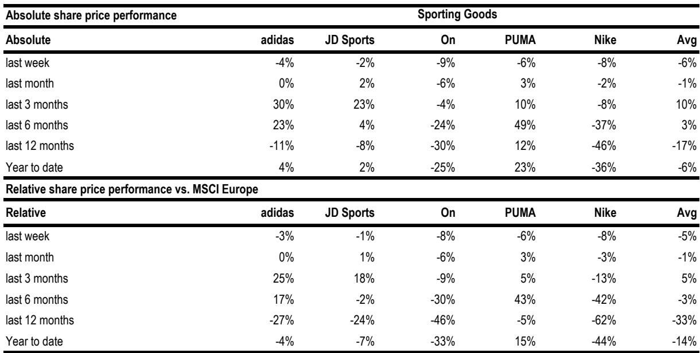
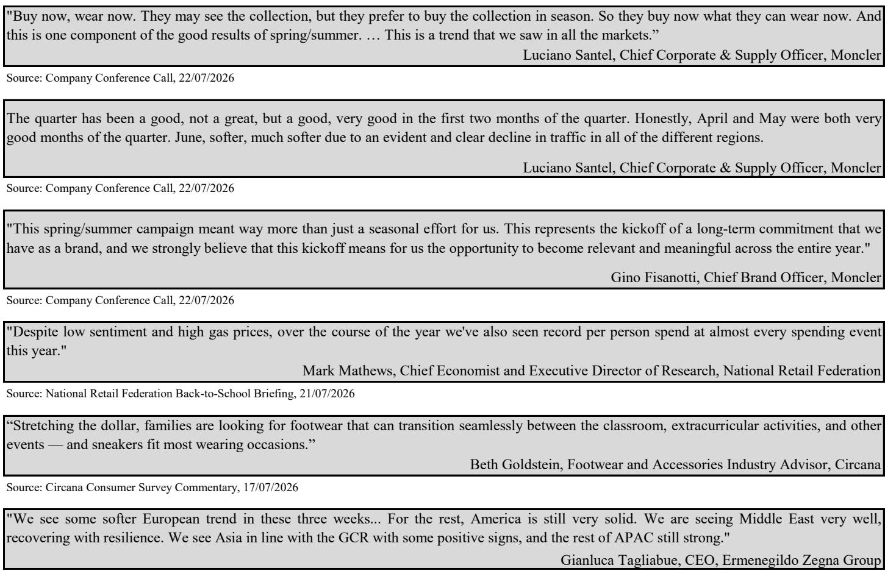
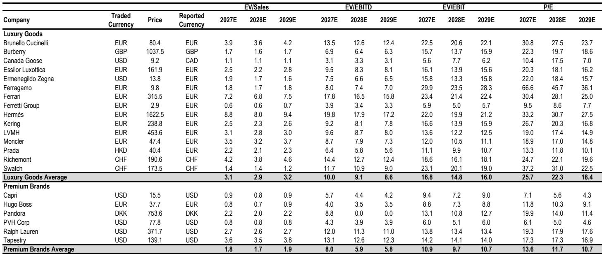

# 奢侈品不再是单一赛道：市场正在奖励有选择的赢家，惩罚广泛敞口

本周欧洲奢侈品板块下跌6%，而MSCI欧洲指数仅下跌1%，逆转了前一周4%的涨幅。这一逆转并非随机波动，而是市场在消化一批二季度和上半年报告后，发现了一条日益明显的分界线：业绩表现呈现极端分化。斯沃琪销售额超预期但利润未达预期；盟可睐营收符合预期且息税前利润大幅超预期，但其品牌显示出季节性疲软；杰尼亚加速增长，旗下三个品牌的直接面向消费者业务均实现两位数增长。尽管如此，该板块整体仍遭抛售——LVMH下跌10%，开云集团下跌7%，博柏利下跌7%，菲拉格慕下跌7%。信息很明确：过去将奢侈品板块作为一篮子持有的策略已不再有效。相对少见可行的策略是持有那些具有自我驱动增长故事的公司，并接受为经过验证的执行力支付估值溢价。

运动用品板块也呈现出类似情况。该板块本周同样下跌6%，其中On下跌9%，彪马下跌6%。阿迪达斯在发布低于市场共识的报告观点后下跌4%，且未进行备受期待的提前披露或指引上调，令那些基于世界杯热度建立预期的读者失望。但同一周，Hoka和UGG的母公司Deckers报告了高端运动用品的韧性需求，Hoka直接面向消费者销售额增长17%。这种分化并非随机，它反映了消费者行为的结构性转变：买家正在转向那些提供真正创新和持续品牌建设的品牌，同时惩罚那些仅依赖宏观顺风或渠道扩张的品牌。

这不是周期性的暂停，而是对执行质量的结构性重新定价。未来几周，随着LVMH、开云集团和爱马仕发布报告，将要么强化要么挑战这一论点。但迄今为止的证据已足够有说服力，值得据此行动。

## 奢侈品板块正在分裂为两种模式：掌控自身需求的公司，和依赖宏观环境的公司

本周的财报季揭示了一个清晰模式。杰尼亚集团报告二季度销售额为5.17亿欧元，剔除汇率影响后增长11%，较上一季度加速。旗下三个品牌均实现两位数直接面向消费者增长，其中杰尼亚品牌本身剔除汇率影响后增长18%。管理层将直接面向消费者增长主要归因于平均单位收入改善，并将其描述为组合故事而非价格故事。这是一个关键区别，意味着杰尼亚并非单纯提价以抵消销量下降，而是在向一个主动选择增加消费的客户群销售更高价值的产品组合。

与此形成对比的是斯沃琪。该集团上半年销售额超预期2%，得益于美国、日本、韩国、印度、沙特阿拉伯和墨西哥的强劲表现。中国大陆市场仍构成拖累，管理层明确表示预计下半年不会出现拐点。但真正的问题在于利润线。息税前利润显著低于预期，受到负面外汇影响和生产部门持续运营去杠杆的拖累。斯沃琪的营收增长在地理上较为狭窄且利润为负。公司销售更多但单位利润更低，这是品牌在其最重要终端市场缺乏定价能力的典型标志。

盟可睐则处于两者之间。集团销售额符合预期，剔除一次性费用后息税前利润超预期5%。盟可睐品牌二季度剔除汇率影响后增长3%，低于预期，旅游趋势较为疲软，且“即看即买”的消费者行为延迟了秋冬采购。然而春夏系列表现超出预期，同店销售在低季节性季度仍保持正值。上半年息税前利润超预期来自严格的运营费用控制和强劲的一季度营收杠杆。盟可睐的品牌资产完好，但其季度节奏具有结构性季节性，且对旅游客流的敞口使其容易受到与斯沃琪相同的宏观交叉影响。

教训在于品牌实力并非二元对立。杰尼亚的业绩表明，超高端成衣品类是财富效应的主要受益者，尤其是在男性消费者中。盟可睐表明即使是强势品牌也会面临季节性和地理逆风。斯沃琪则表明，营收韧性若缺乏利润纪律是一个危险信号。观察者应关注那些同时展现定价能力和成本控制的品牌，避免那些仅以销量为增长杠杆的公司。

## 历峰集团本周的交付值得估值溢价——它应成为评估奢侈品公司的模板

本周报告中最重要数据点之一并非新发布，而是市场对历峰集团此前交付的反应。报告指出，“本周的主要收获之一是历峰集团的交付无论在相对还是相对层面都多么稳健，越来越值得相对于其自身历史和板块的估值溢价。”这句话值得深入解读。

历峰集团的表现正被用作基准，因为它证明了一家奢侈品集团即使在宏观环境波动时也能交付持续、高质量的盈利。市场现在正将该标准应用于板块中的每一个其他公司。达到历峰集团标准的公司——持续执行、强劲直接面向消费者增长、定价能力和利润率纪律——值得溢价。那些未达标的公司则将受到惩罚，无论其品牌传统或市场份额如何。

这是一个根本性转变。多年来，奢侈品股票的交易与对中国消费和旅游客流的贝塔值挂钩。这种相关性正在被打破。市场现在正在奖励那些能够展现自我驱动增长的公司：创新、品牌建设、直接面向消费者渠道发展和成本控制。报告强调“寻找具有自我驱动增长故事的公司，而非试图判断板块整体拐点”是正确的框架。

这对组合构建的影响是明确的。观察者应关注那些管理层已证明能够独立于宏观环境执行的公司。杰尼亚符合这一描述。布鲁内罗·库奇内利，在下周业绩发布前被列入正面催化剂观察名单，也可能符合，尤其是考虑到杰尼亚在超高端成衣品类的强劲表现带来的积极信号。盟可睐是一个值得关注的标的，品牌资产良好但季度波动较大。斯沃琪则需谨慎，因其中国敞口和利润未达预期。

## 运动用品需求在高端领域具有韧性，但中国渠道转变带来短期风险

运动用品板块6%的跌幅掩盖了更为细致的图景。Deckers报告一季度销售额剔除汇率影响后增长5%，其中Hoka销售额报告增长8%，直接面向消费者增长17%。公司重申了Hoka全年销售额低两位数增长的指引，并上调了盈利目标。管理层指出，由于能源价格因素，欧洲消费者“可能比美国消费者面临更大压力”，但强劲的潜在需求依然存在。

相比之下，阿迪达斯令人失望并非基本面问题，而是预期问题。该公司发布了低于市场共识的报告观点，未进行提前披露或指引上调，股价下跌4%。报告作者认为，“阿迪达斯不仅仅是一个二季度交易标的”，并且“在生活方式和性能领域的持续创新、品牌建设和执行应能支撑下半年起稳健的盈利交付。”这一观点有其合理性，但取决于公司能否兑现其创新管线并在下半年保持势头。

该板块最重要的进展是耐克宣布将从2027年1月起收回其中国电商业务，从零售合作伙伴处集中在线销售至直接面向消费者渠道。报告指出了短期风险：这一转变可能加剧中国的促销环境，尤其是如果零售商在年底前急于清理在线库存。这是一个真实担忧。中国运动用品市场已面临一定压力。安踏和特步均在二季度更新中指出了零售环境温和及不利天气因素。耐克渠道转变带来的促销噪音可能在短期内压缩整个板块的利润率。

但中期逻辑是合理的。耐克正在寻求一致的消费者体验，这在多个分销商控制在线渠道时难以实现。这一举措对板块具有建设性，因为它协调了激励机制并减少了渠道冲突。短期阵痛是长期品牌健康的必要成本。

## 未来四周的决策框架：持有自我驱动故事，避免板块押注，关注中国渠道重置

未来四周将决定分化论点是成立还是被打破。LVMH、开云集团和爱马仕将在未来几天发布报告。它们的业绩要么将确认板块正在分裂为执行赢家和宏观依赖者，要么将表明广泛的报告观点抛售过度了。

决策框架很直接。首先，评估每个公司对两个关键风险因素的敞口：中国需求和旅游消费。具有高中国敞口且缺乏自我驱动故事的公司——斯沃琪是最明显的例子——应予以回避。其次，评估直接面向消费者增长和利润率轨迹。杰尼亚17%的直接面向消费者增长和组合驱动的平均单位收入改善是黄金标准。第三，寻找创新和品牌建设投入。阿迪达斯的创新管线和世界杯势头是真实的，但缺乏指引上调表明管理层持谨慎态度。第四，考虑中国渠道转变。耐克的举措创造了短期促销风险，但也为那些已在中国建立强大直接面向消费者运营的品牌创造了机会。

报告作者“对选股非常挑剔”是正确的。风险回报比财报季开始前有所改善，因为仓位更轻。但“更好”并不意味着“好”。这意味着积极惊喜的门槛更低，这为能够跨越门槛的公司创造了机会。那些无法做到的公司将比在牛市中受到更严厉的惩罚。

奢侈品和运动用品板块已不再是宏观交易标的。它们是选股者的市场。本周的证据表明，市场正以真正的信念执行这一区分。观察者应跟随其指引。

*仅供参考。部分内容可能基于源材料通过AI辅助生成、翻译、总结或编辑，可能存在遗漏或错误。请独立核实。这不构成研究、法律、税务、会计或其他专业建议。*

仅供参考。部分内容可能基于源材料通过AI辅助生成、翻译、总结或编辑，可能存在遗漏或错误。请独立核实。这不构成研究、法律、税务、会计或其他专业建议。

