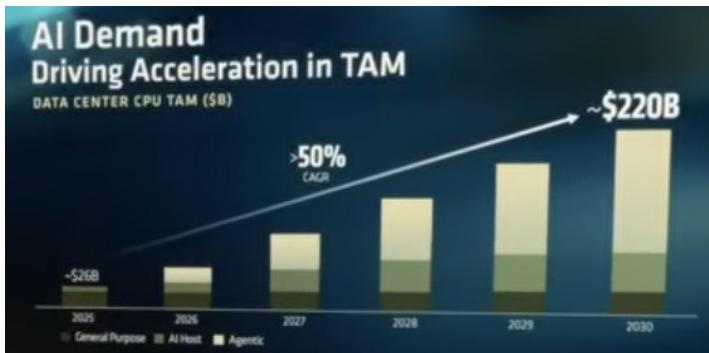
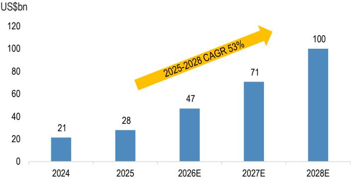

# 行业观察：PC与服务器供应链动态

## 从英特尔与AMD最新动态看PC/服务器产业链趋势

### 核心观察

从英特尔2026年第二季度财报电话会议及AMD“Advancing AI 2026”活动，可以梳理出亚洲PC/服务器供应链的以下关键信息：

1. **客户端业务表现**：第二季度客户端销售额超出预期，主要受益于产品组合优化与价格策略调整。
2. **数据中心业务**：第二季度数据中心与AI业务收入增长，得益于各领域需求强劲及供应改善。
3. **PC需求展望**：下半年PC需求呈现季节性偏弱特征，服务器领域保持增长势头。
4. **服务器CPU需求**：2026-2027年服务器CPU需求预计保持两位数增长，并延续至2028年。
5. **供应端约束**：先进逻辑制程、硅晶圆、存储及基板等环节仍存在供应限制。

AMD在“Advancing AI 2026”活动中，将数据中心CPU市场空间预估从此前的1200亿美元上调至2030年的2200亿美元，对应2025-2030年复合增长率约53%。

### 客户端业务：价格调整影响显现

英特尔CCPG（客户端计算事业部）第二季度收入环比增长15%，优于公司及市场预期，主要受成本驱动的价格调整及产品组合优化影响。展望下半年，管理层预计第三季度客户端收入环比持平，反映终端需求偏弱。全年来看，管理层预计PC需求将出现低两位数下滑，主要受存储价格上涨带来的需求弹性变化及Windows 10商用PC换机需求减弱影响。

### 服务器领域：AI驱动需求持续

英特尔DCAI（数据中心与AI）业务第二季度收入环比增长24%、同比增长59%，受云服务提供商及企业服务器需求强劲、供应改善共同推动。尽管仍面临供应约束，第三季度该业务收入有望延续增长势头。管理层预计第四季度因供应改善，收入增长可能更为明显。全年服务器CPU需求预计保持两位数增长，并延续至2027-2028年。

### 产品路线图：制程推进有序

- **PC端**：基于18A制程的Panther Lake/Wildcat Lake已进入大规模量产阶段。
- **服务器端**：首款基于18A制程的Clearwater Forest服务器CPU已发布。下一代高性能Diamond Rapid CPU的初步量产预计在第四季度至明年初。
- **先进制程**：18A产出超内部目标25%，14A制程目标2027年下半年风险试产、2028年大规模量产。

### 先进封装与供应链

英特尔在先进封装领域推进EMIB-T技术，目标2027年实现大规模量产。目前EMIB-T良率约60%，多个主流AI加速器项目正在评估该技术。公司上调2026年资本支出指引至超过200亿美元，2027年资本支出预计同比显著增长，反映洁净室建设加速及设备订单锁定。整体供应紧张局面预计至少持续至2027年。

---

**图1：AMD上调数据中心CPU市场空间预估**

来源：公司数据

**图2：服务器CPU需求预测**

来源：Gartner、机构估算

---

*本文基于公开信息整理，仅供研究参考，不构成任何建议。*
