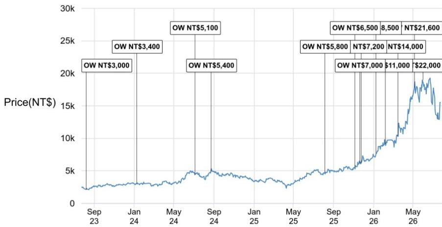
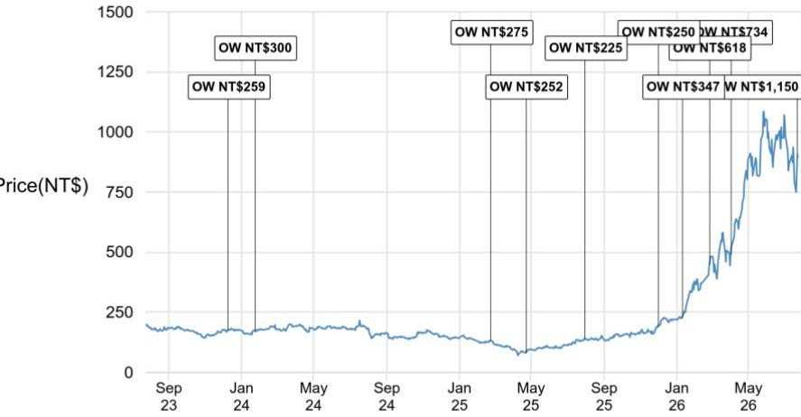
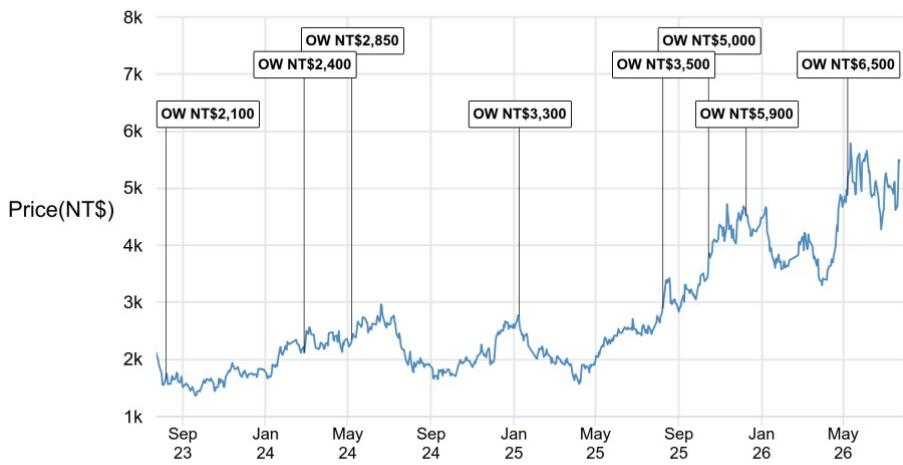

# The PC and Server Markets Are Diverging Sharply: One Is a Value Trap, the Other a Structural Growth Opportunity

Intel's 2Q26 earnings call and AMD's Advancing AI 2026 event have revealed a fundamental bifurcation in the technology hardware landscape. The PC market is heading into a double-digit unit decline in 2026, driven by memory price hikes and fading Windows 10 replacement demand, while the server CPU market is entering a multiyear supercycle that AMD now estimates will reach $220 billion in datacenter CPU total addressable market by 2030. These two trajectories are not merely different; they are moving in opposite directions with compounding force. For observers and supply chain strategists, the implication is clear: exposure to the traditional PC supply chain carries mounting downside risk from negative price elasticity, while the server supply chain offers sustained growth driven by AI workload expansion, content upgrades, and supply constraints that act as pricing tailwinds rather than demand destroyers.

The divergence matters now because it is not a cyclical pause. The PC decline is structural in nature—memory pricing has become a binding constraint on end-user demand, and the commercial refresh cycle from Windows 10 has largely run its course. Meanwhile, server demand is accelerating on a secular basis, with Intel's management guiding to strong double-digit server CPU demand growth through 2028 and AMD raising its datacenter CPU TAM by 83% from its prior estimate. The second-order implications ripple through the entire supply chain: component suppliers, ODM assemblers, and substrate manufacturers will face increasingly divergent demand profiles depending on which end market they serve. Understanding this split is the single most important analytical task for hardware observers today.

## Memory Price Hikes Are Affecting PC Unit Demand, and the Impact Will Continue Through 2026

Intel's Client Computing Group revenue grew 15% quarter-over-quarter in 2Q26, beating both company and market expectations. At first glance, this appears positive. But the driver was not volume growth; it was cost-driven price actions and a favorable product mix. Intel's own management guided to a sub-seasonal flattish sequential revenue trend in 3Q26, which implies a sequential unit decline given continued mix improvement toward higher-ASP products. For the full year, management expects a low-double-digit decline in PC demand, directly attributing this to negative price elasticity from memory price hikes and fading Windows 10 commercial replacement demand.

The mechanism here is critical. Memory prices have risen sharply enough that they are now affecting overall PC demand, not just shifting mix. When a key component becomes expensive enough to reduce the total number of units sold, the entire ecosystem is affected—ODMs face lower shipment volumes, component suppliers face reduced bill-of-materials content per system, and brand vendors face margin compression from their inability to fully pass through costs. The negative price elasticity effect is self-reinforcing: higher memory prices reduce unit demand, which reduces economies of scale in PC assembly, which keeps per-unit costs elevated, which further affects demand. This is not a temporary inventory correction. It is a structural demand dynamic that will persist as long as memory supply remains constrained.

The fading of Windows 10 commercial replacement demand removes the other major support pillar for PC volumes. Enterprise and government PC refresh cycles that drove 2023-2025 shipments are largely complete. With no equivalent catalyst on the horizon—Windows 11 adoption has not generated a comparable forced-upgrade cycle—commercial PC demand will revert to a replacement-only baseline that is structurally lower than the replacement-driven peaks of the past three years. The combination of memory-driven price elasticity and the end of the Windows 10 cycle means that 2026 PC unit declines are not a one-year anomaly; they represent a reset of the demand baseline.

## Server CPU Demand Is Entering a Multi-Year Supercycle, Driven by AI Workload Expansion and Content Upgrades

Intel's Data Center and AI segment revenue increased 24% quarter-over-quarter and 59% year-over-year in 2Q26, driven by strong cloud service provider and enterprise server demand alongside improving supply. Management expects continued growth momentum in 3Q26 despite ongoing supply constraints across logic foundry, silicon wafer, memory, and substrate, with a likely stronger revenue uptick in 4Q26 as supply conditions improve. For the full year, management projects strong double-digit server CPU demand growth with sustained momentum into 2027 and 2028.

The magnitude of this demand shift is best captured by AMD's updated datacenter CPU TAM estimate. At its Advancing AI 2026 event, AMD raised its datacenter CPU TAM to $220 billion by 2030, up from its previous estimate of $120 billion. This represents a compound annual growth rate of 53% from 2025 to 2030. Such a dramatic upward revision from one of the two dominant server CPU suppliers indicates that AI workload demand is not merely supplementing traditional server demand; it is fundamentally expanding the addressable market. Every major cloud provider and enterprise is building out AI inference and training infrastructure that requires server CPUs for data preprocessing, model serving, and infrastructure management alongside GPU accelerators.

Content upgrades are amplifying the volume growth. Intel's server CPU roadmap includes the 18A-based Clearwater Forest (Xeon 6+) already launched, with the high-performance Diamond Rapid CPU (Xeon 7 or Oak Stream) expected to begin initial ramp in 4Q26 or early 2027. Each new generation brings higher pin counts, more memory channels, and increased power delivery requirements, all of which drive higher content per server for component suppliers. For a connector and socket supplier like Lotes, or a baseboard management controller supplier like ASPEED, the combination of higher server unit volumes and higher content per server creates a double growth vector that is independent of PC market conditions.

## Supply Constraints Create a Pricing Tailwind for Server Components, Unlike the Demand Effect in PCs

The supply chain dynamics for server components are the mirror image of the PC market. In PCs, memory price hikes affect unit demand. In servers, supply constraints across logic foundry, silicon wafer, memory, and substrate act as a pricing tailwind without affecting demand, because server buyers have inelastic demand driven by AI workload deployment urgency.

Intel's management highlighted substrates, wafers, and memory as the most constrained parts of the supply chain. The company raised its 2026 capex guidance to over $20 billion, with 2027 capex guidance to be significantly higher year-over-year, indicating an acceleration in cleanroom buildouts and tool purchase orders. This reinforces the view that overall supply tightness will persist at least through 2027. For server component suppliers, tight supply means pricing power. When server OEMs and CSPs cannot get enough CPU packages, they are willing to pay a premium for the components that enable each server to be built and shipped. This is fundamentally different from the PC market, where end-user price sensitivity constrains the total addressable units.

The advanced packaging segment illustrates this dynamic clearly. Intel's EMIB-T technology, targeting high-volume ramp in 2027, currently has yields around 60% and a growing backlog driven by tight CoWoS supply at TSMC. Multiple mainstream AI accelerator programs are evaluating EMIB-T as an alternative packaging solution. Even at suboptimal yields, the demand is there because the alternative—not shipping AI accelerators at all—is unacceptable for hyperscalers. This inelastic demand at the system level flows through to component suppliers who can command premium pricing for the connectors, substrates, and management controllers that enable each server to function.

## A Decision Framework for Navigating the PC-Server Divergence

For observers and supply chain managers, the divergence between PC and server markets requires a portfolio-level framework that separates exposure into three categories.

First, companies with dominant server revenue exposure and minimal PC dependency represent the clearest structural opportunity. ASPEED, which supplies baseboard management controllers for virtually every server platform, benefits from both rising server unit volumes and content upgrades as new CPU generations require more sophisticated management capabilities. Lotes, as a connector and socket supplier, gains from higher server CPU pin counts and the proliferation of server platforms. Wiwynn, as a server ODM focused on cloud customers, rides the direct volume growth of CSP server deployments. Unimicron, as a substrate supplier, benefits from the substrate supply tightness that Intel explicitly identified as a binding constraint.

Second, companies with dual exposure require careful parsing of revenue mix and growth vectors. A PC ODM that also builds servers may see its server division grow rapidly while its PC division contracts, creating a net positive but with significant segment-level volatility. The key analytical question is whether the server growth rate is sufficient to offset the PC decline rate, and whether the margin structure of the server business is superior enough to drive overall profitability improvement.

Third, companies with dominant PC exposure and no meaningful server offset face structural headwinds that are unlikely to reverse in the next 12-18 months. ASUSTek and Micro-Star, as the report explicitly notes, are expected to continue underperforming the index. The combination of PC unit declines, memory-driven price elasticity, and the absence of a replacement cycle catalyst creates a negative earnings revision cycle that is still in its early stages. The risk is that the PC decline is not a one-year phenomenon but a multiyear reset to a lower baseline, which means current valuation multiples may not fully reflect the earnings power reduction.

## The 18A and 14A Roadmaps Will Not Disrupt TSMC's Dominance, but They Will Create Niche Opportunities for the Supply Chain

Intel's foundry revenue grew 6% quarter-over-quarter in 2Q26, with 18A output running 25% above internal targets and up over 50% quarter-over-quarter. However, external foundry revenue accounted for only approximately 5% of the segment. This is the critical context: Intel's foundry progress is real in engineering terms, but it remains predominantly an internal manufacturing operation. The 14A node, targeted for risk production in 2H27 and high-volume ramp in 2028, will face a TSMC N2 that is already running at high yields and approaching approximately $80 billion in annual revenue by that time. TSMC will maintain 95% or greater market share in front-end wafer manufacturing despite some small volume projects moving to Intel, simply because the supply-demand situation across the industry is so tight that any incremental capacity is absorbed immediately.

The second-order implication for the supply chain is that Intel's foundry ramp creates additional demand for substrates, packaging materials, and testing services, but it does not fundamentally alter the competitive landscape for server CPU supply. Intel's internal server CPU production benefits from 18A, which supports the Clearwater Forest and Diamond Rapid roadmaps, but this is already captured in the server CPU volume growth projections. The foundry business itself, absent meaningful external customers, does not create a new vector of demand for the Asian supply chain beyond what is already embedded in Intel's own product ramp.

The advanced packaging opportunity through EMIB-T is more tangible. With yields currently around 60% and a growing backlog, the ramp to high-volume production in 2027 will create demand for substrate and assembly services from suppliers who can support the technology. The largest program, TPU v9, is expected to reach mass production in late 2027 to 2028. This timeline aligns with the broader server CPU supercycle and adds a packaging-specific growth driver for substrate suppliers like Unimicron and assembly service providers.

*For informational purposes only. Portions may be generated, translated, summarized, or edited with AI assistance based on source materials and may contain omissions or errors. Please verify independently. This is not professional advice.*

For informational purposes only. Portions may be generated, translated, summarized, or edited with AI assistance based on source materials and may contain omissions or errors. Please verify independently. This is not professional advice.

