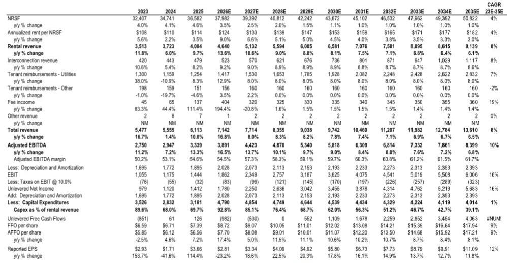
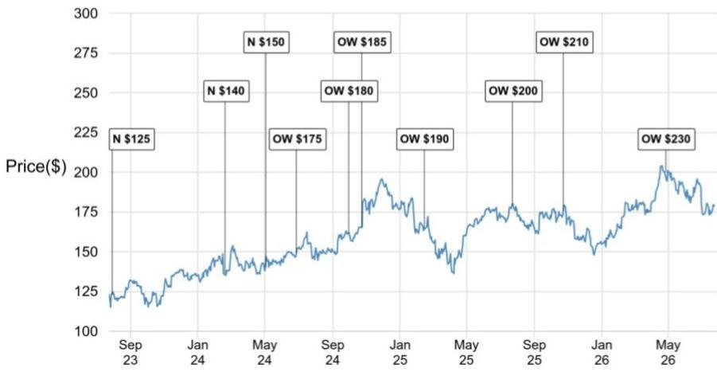
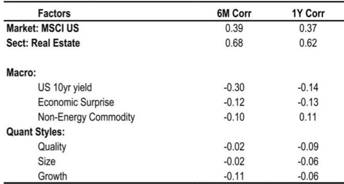

# Digital Realty's Pricing Power Has Entered a Structural Regime: The Data Center Operator Now Commands Multi-Year Double-Digit FFO Growth Visibility

Digital Realty Trust raised its full-year 2026 core FFO per share guidance by 11% year-over-year at the midpoint—not on one-time gains, but on a pricing environment that has improved every quarter since February. The company's cash releasing spread on leases over 1 MW hit 66.7% in the second quarter, driven by renewals in Singapore and Northern Virginia, while total new signings reached $307 million at 100% share. These are not incremental beats. They signal that the supply-demand imbalance in data center capacity has moved from cyclical tightness into a structural pricing regime that management now feels confident enough to project double-digit core FFO per share growth from 2026 through 2028. For observers who have watched data center REITs trade on narrative rather than compounding, Digital Realty has just provided a visible, multi-year earnings trajectory backed by a $1.9 billion backlog and a development pipeline that is 62% pre-leased in North America.

The timing of this inflection matters because it is not driven by a single hyperscale deal or a one-off renegotiation. It is the product of three converging forces: demand that continues to outstrip available supply, mounting local opposition to new construction, and a capital formation strategy that allows Digital Realty to fund growth without diluting equity. The company's guidance raise excluded $200 million of promote income from the Blackstone buyout and a $113 million insurance settlement, meaning the underlying operational momentum is even cleaner than the headline numbers suggest. When a REIT raises guidance on core operations while simultaneously absorbing a $3.5 billion asset acquisition, the message is clear: the pricing cycle has legs.

## The 66.7% Cash Releasing Spread on Large Leases Is Not an Anomaly—It Is the New Baseline for Tight Markets

The standout metric in the quarter was the 66.7% cash releasing spread on the greater-than-1 MW segment, which accounted for $115 million of total renewals. A single renegotiation in Singapore and Northern Virginia pushed that number higher, but the underlying trend is what matters. The company's overall cash releasing spread guidance was raised by 250 basis points to a new range of 9.0% to 11.0%, up from 6.0% to 8.0% in February. This is the fourth consecutive quarter of sequential improvement in pricing expectations. The 0-1 MW and interconnection business, which is less volatile and more recurring, posted a record $108 million in bookings and a 5.2% cash uplift. Together, these two segments tell a coherent story: small and medium enterprises are paying more for colocation and connectivity, while hyperscale tenants are paying dramatically more to secure long-term capacity in constrained markets.

The implication for observers is that the market has moved past the phase where data center operators compete on price to fill space. Digital Realty's 25.4% blended cash releasing spread across all renewals means that every lease that rolls is coming in at a meaningfully higher rate. In a portfolio with $4.6 billion in annual rental revenue, each percentage point of renewal uplift flows directly to net operating income with minimal incremental cost. The company's NOI margin expanded to 80.7% in the current year estimates, and the trajectory points toward 82.1% by 2028. Pricing power at this scale is rare in real estate. It is even rarer when the underlying asset class is experiencing demand growth that is not only cyclical but structural, driven by cloud migration and AI inference workloads that require physical proximity to data.

## A $1.9 Billion Backlog with Multi-Year Commencement Visibility Eliminates the Execution Risk That Typically Haunts REIT Guidance

Digital Realty ended the quarter with $1.9 billion of backlog at 100% share, and after the quarter closed, signed two additional hyperscale leases representing $205 million of annualized GAAP rent. The company now expects $635 million of commencements in the remainder of 2026, $480 million in 2027, and $312 million in 2028 and beyond. This is not a speculative pipeline. It is contracted revenue that will convert to cash flows on a schedule management has already mapped. The pre-leasing on North American construction rose to 62% from 56% in the prior quarter, driven by the Digital Dulles project where leasing moved into the low-60s range. When a company can see three years of commencement activity and raise guidance on the back of it, the traditional discount applied to REIT earnings for uncertainty should narrow.

The practical effect of this visibility is that Digital Realty's core FFO per share growth is no longer dependent on new leasing velocity. It is dependent on construction completion and tenant delivery, which are operational execution items rather than demand-dependent variables. The company has 1,405 megawatts under construction globally, with 1,140 megawatts in North America. The expected yield on those projects is 11.8%, up from 11.5% in the first quarter. That yield expansion, combined with the pricing uplift on renewals, is the engine behind the projected 11% core FFO per share growth in 2026, 10.6% in 2027, and 11.1% in 2028. For a REIT, these are compounding rates that rival growth technology companies, but with the contractual visibility of infrastructure.

## The Kansas City Site and the Columbia Capital Acquisition Signal That Digital Realty Is Building a Self-Funding Growth Machine

The most strategically significant move in the quarter was not a lease signing but an infrastructure investment. Digital Realty secured an initial 600 megawatts of utility power for a site in Kansas City, with the potential to scale to 2 gigawatts of gross capacity. Power availability is the single most binding constraint on data center development today. NIMBYism, utility interconnection delays, and grid capacity limitations are preventing new supply from coming online in major markets. By securing a large, scalable power position in a market with available land and supportive utilities, Digital Realty is effectively creating a new supply zone that competitors cannot easily replicate. The site will begin to ramp in 2028, which aligns with the back end of the current growth guidance and provides a bridge to the next cycle.

Simultaneously, the acquisition of Columbia Capital for $9 billion in fund commitments gives Digital Realty a direct channel to institutional capital. The company has been clear that it does not intend to become an investment manager, but the acquisition brings relationships with sovereign wealth funds, pensions, insurance companies, and endowments that can co-invest in development projects. This is a capital-light growth mechanism that reduces the need for equity issuance or excessive leverage. Digital Realty's net debt-to-EBITDA is projected at 4.8 times for 2026, which is manageable for a development-heavy REIT, and the Columbia Capital platform should keep it there even as construction spending rises. The company raised discretionary capex guidance by $750 million to $4.5 billion, partially funded by $1.25 billion in dispositions and joint venture capital. The model is self-reinforcing: develop, pre-lease, syndicate to institutional partners, recycle capital, and repeat.

## A Decision Framework for Observers: Three Conditions That Must Hold for the Thesis to Play Out

For observers evaluating Digital Realty at current levels, three conditions must hold for the thesis to play out. First, cash releasing spreads must remain in the 9% to 11% range or higher. The 66.7% print on large leases was elevated by a single renegotiation, but the guidance raise to 9-11% is the organic baseline. If that range holds or expands, the revenue trajectory is secure. If it contracts below 7%, the compounding narrative weakens. Second, pre-leasing on the North American development pipeline must stay above 60%. The current 62% pre-lease rate provides a cushion against any slowdown in leasing velocity. A drop below 50% would indicate that supply is catching up with demand or that pricing has become prohibitive for tenants. Third, the Kansas City power position and Columbia Capital platform must begin to produce visible contributions by late 2027. The Kansas City site is the next growth chapter, and the capital platform is the funding mechanism. If either stalls, the 2028 growth projection becomes more dependent on the existing backlog rolling off, which would compress the duration of visible earnings.

The most important variable is not demand, which remains robust across both enterprise and hyperscale segments. It is the pace of new supply. NIMBYism is not a temporary headwind for competitors; it is a structural barrier that protects incumbents with existing permits, power contracts, and community relationships. Digital Realty's 1.4 gigawatts under construction and 3 gigawatts of operational IT capacity represent a scale advantage that new entrants cannot match in the near term. The company is effectively monetizing scarcity, and the financial results show that the market is willing to pay for it. The 11.8% development yield on new projects, combined with the 25.4% renewal uplift on existing leases, creates a dual margin expansion that is difficult to replicate in any other real estate sector.

The risk that deserves attention is the one-off nature of the 66.7% large-lease renewal spread. The report explicitly notes that a customer opted to renegotiate for a longer term, allowing Digital Realty to bring the rate to market levels. That dynamic may not repeat every quarter. But the broader trend of sequential pricing improvement suggests that even without such events, the base case is strong. The company's guidance for 9% to 11% cash renewal rates is already above the original February forecast, and the raised guidance embeds that improvement. The key for observers is to distinguish between the headline spike and the underlying trend. The spike is informative but not repeatable. The trend is the research case.

*For informational purposes only. Portions may be generated, translated, summarized, or edited with AI assistance based on source materials and may contain omissions or errors. Please verify independently. This is not professional advice.*

For informational purposes only. Portions may be generated, translated, summarized, or edited with AI assistance based on source materials and may contain omissions or errors. Please verify independently. This is not professional advice.

