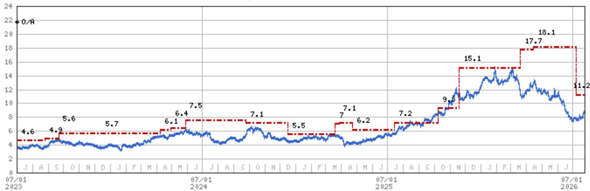
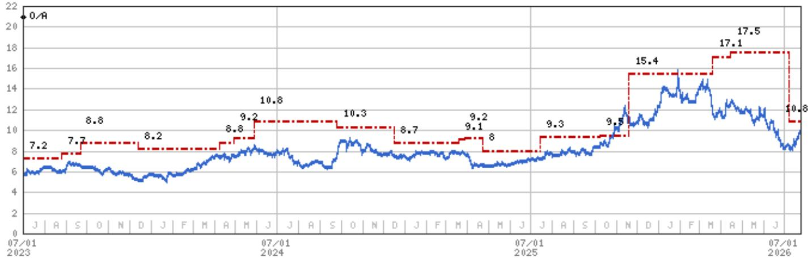
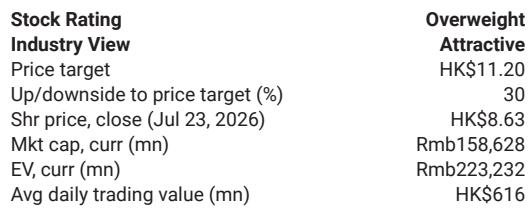

# China’s New Regulatory Architecture Is Reshaping the Aluminum Industry’s Cost and Capacity Dynamics

The Chinese aluminum industry is entering a structurally different phase, one defined not by cyclical demand swings but by a hardening regulatory ceiling on supply. A recent plant visit to Aluminum Corp. of China’s (Chalco) Baotou facility reveals a producer that already operates with a 62.5 percent captive power ratio, an average power cost below RMB 0.40 per kilowatt-hour, and renewable power costs as low as RMB 0.17 per kilowatt-hour. These figures are not merely operational metrics; they represent a competitive moat that is about to widen considerably as two new regulatory frameworks take effect. The National Development and Reform Commission’s Document No. 45, effective August 1, introduces retrospective traceability checks on production, while Document No. 837, effective July 1, imposes granular review on overseas aluminum investments. Together, these policies will compress the supply side, reward incumbents with low-cost captive power, and raise the strategic value of domestic capacity that is both compliant and renewable-integrated.

The 45 million tonne hard capacity cap has been a known constraint, but its enforcement has historically been uneven. What changes now is the mechanism. Document No. 45 does not merely restate the cap; it creates a forensic audit trail that compares electricity consumption, approved capacity, and actual output against maintenance records and operating days. A producer running above its permitted capacity can no longer hide behind vague reporting. The traceability framework examines potline operating parameters, current efficiency, environmental compliance, and the proportion and source of renewable power. For an industry where overproduction has been a persistent feature, this shift from output-based to consumption-based enforcement represents a material tightening. The implication is clear: capacity that was previously marginal or operating above permit will face mounting compliance costs or forced curtailment.

## China’s Dual Regulatory Push Will Simultaneously Cap Domestic Supply and Restrict Overseas Capacity Expansion

The two new documents operate as complementary levers. Document No. 45 tightens the domestic supply valve by making overproduction harder to conceal. Document No. 837 restricts the release valve of overseas investment, making it more difficult for Chinese aluminum companies to relocate capacity abroad to circumvent domestic constraints. The overseas investment review process now examines the ultimate ownership structure, the nature of the asset being acquired, the geopolitical risk of the host country, the financing structure, and whether sensitive technology is being exported. This is not a procedural formality. It is a strategic filter that will slow, and in some cases block, the kind of capacity relocation that has historically allowed Chinese producers to grow even when domestic caps were in place. The combined effect is a supply system that is more closed, more monitored, and more expensive to bypass.

For observers, the key insight is that the supply side is becoming less elastic at a time when the demand outlook, while not booming, remains structurally supported by energy transition and infrastructure spending. The report’s estimates for Chalco show earnings per share rising from RMB 0.74 in 2025 to RMB 1.27 in 2026, before settling at RMB 0.73 in 2027 and RMB 0.91 in 2028. The sharp spike in 2026 reflects the immediate impact of supply tightening on pricing power, while the moderation in subsequent years suggests that the market will eventually adjust to a new equilibrium. What matters is that the 2026 earnings jump is not a one-off cyclical spike; it is the first year in which the full force of both regulatory frameworks will be felt simultaneously. The 2027 and 2028 numbers, while lower, still represent a significant step up from the 2025 base, implying that the regulatory floor on pricing will persist even after the initial adjustment.

## Producers with Captive Renewable Power Will Capture the Largest Share of Regulatory Rents

The Baotou plant’s power structure is instructive. With 1.46 million tonnes of aluminum capacity, the facility draws 62.5 percent of its power from captive sources: 200 megawatts of solar, 1,900 megawatts of wind, and 1,720 megawatts of coal, backed by four hours of energy storage. The average power cost of below RMB 0.40 per kilowatt-hour is already well below the grid average for Chinese aluminum smelters, but the renewable component at RMB 0.17 per kilowatt-hour is a game changer. As Document No. 45 places greater emphasis on the proportion and source of renewable power in compliance assessments, producers with high renewable penetration will face lower compliance risk and lower energy costs simultaneously. This creates a virtuous cycle: lower costs improve margins, which fund further renewable investment, which in turn strengthens compliance positioning.

The strategic implication is that the aluminum industry’s cost curve is about to become steeper and more stratified. Producers reliant on grid power, particularly in regions with high coal or gas prices, will face both higher energy costs and greater scrutiny under the new traceability framework. Those with captive renewable power will enjoy a cost advantage that is not merely operational but regulatory. The gap between the lowest-cost and highest-cost producers will widen, and the lowest-cost producers will be those that have already integrated renewable energy into their captive power mix. Chalco’s Baotou plant is a template for this model, but the question is how many other producers can replicate it. The answer will determine the shape of the industry’s supply response over the next three to five years.

## The Overseas Investment Review Creates a Structural Barrier to Capacity Relocation

Document No. 837 addresses a long-standing loophole in China’s aluminum capacity management. When domestic caps became binding, producers increasingly looked to Southeast Asia, the Middle East, and Africa to build new smelters. These overseas projects allowed Chinese companies to grow their global aluminum footprint while staying within domestic constraints. The new review process changes this calculus. By requiring a look-through analysis of the ultimate investor, a geopolitical risk assessment of the host country, and a technology export review, the policy introduces friction into every stage of the overseas investment process. A project that might have taken 12 months to approve could now take 24 months or more, and some projects may be denied outright if the host country is deemed high-risk or if sensitive technology is involved.

The consequence is that the global aluminum supply that Chinese companies might have built overseas will not materialize as quickly or as cheaply. This is not a ban on overseas investment, but it is a significant slowdown. For the domestic industry, this means that the pressure to add capacity cannot be easily exported. The 45 million tonne cap becomes more binding because the alternative of building abroad is now less viable. For global aluminum markets, it means that Chinese producers will remain net exporters of metal from domestic capacity rather than becoming net exporters of capital for overseas capacity. The supply response to rising demand will be slower, which supports higher prices for longer.

## A Decision Framework for Observers: Mapping Regulatory Exposure to Competitive Positioning

Observers evaluating aluminum companies should assess three variables: captive power ratio and its renewable composition, the age and compliance history of smelting assets, and the exposure to overseas investment restrictions. Companies with captive power ratios above 50 percent and renewable penetration above 20 percent are best positioned to benefit from the regulatory tightening. Their cost advantage will widen as grid-dependent competitors face higher energy costs and compliance risks. Companies with older smelters that have a history of operating above approved capacity face the greatest risk under Document No. 45’s retrospective traceability framework. The cost of bringing these facilities into compliance, or the revenue loss from forced curtailment, could be material.

The overseas investment dimension adds a second layer. Companies with large overseas expansion plans that are still in the approval stage face execution risk. The review process under Document No. 837 will introduce delays and may require changes to project structure or financing. Companies that have already completed overseas projects and are in production face less risk, but their ability to expand those projects further is now constrained. The net effect is that the most valuable aluminum assets are those that are domestic, compliant, and powered by captive renewable energy. These assets will command a premium in both earnings and valuation.

The report’s financial projections for Chalco illustrate this dynamic. The company’s return on equity is estimated at 18.3 percent for 2025, rising to 29.0 percent in 2026, before settling at 14.1 percent in 2027 and 16.1 percent in 2028. The spike in 2026 is driven by the combination of supply tightening and the company’s low-cost power position. The decline in 2027 reflects the normalization of pricing as the market adjusts, but the ROE remains above the cost of equity, implying that the company continues to earn economic profits even after the initial adjustment. The leverage ratio, measured as net debt to total capital, drops from 39.1 percent in 2025 to 8.6 percent in 2026 and turns negative in 2027 and 2028, meaning the company becomes net cash positive. This deleveraging is a direct consequence of higher margins and disciplined capital allocation, and it further strengthens the company’s ability to invest in renewable power and compliance upgrades.

## The Regulatory Framework Will Force a Structural Re-rating of Compliant, Low-Cost Producers

The combination of Document No. 45 and Document No. 837 represents a structural shift in how the Chinese aluminum industry operates. The old model, in which capacity could be expanded through a combination of domestic overproduction and overseas relocation, is being replaced by a model in which capacity is fixed, compliance is enforced, and the cost of non-compliance is high. This is not a short-term policy intervention; it is a long-term restructuring of the industry’s supply architecture. The companies that will thrive in this new environment are those that have already invested in captive renewable power, maintained compliant production records, and built their domestic capacity within the approved cap.

For observers, the decision framework is straightforward. The regulatory tailwind is strongest for producers with low-cost captive power, high renewable penetration, and a clean compliance record. The headwind is strongest for producers with high grid dependence, older assets, and a history of operating above permit. The overseas investment review adds an additional layer of risk for companies with large unapproved overseas projects. The re-rating of the sector will not be uniform; it will be highly differentiated based on these three variables.

The final takeaway is that the Chinese aluminum industry is becoming a regulated utility in all but name. The 45 million tonne cap, combined with retrospective traceability and overseas investment controls, creates a supply ceiling that is both hard and enforceable. Within that ceiling, producers will compete on cost and compliance, not on volume growth. The winners will be those that have already positioned themselves at the low end of the cost curve and the high end of compliance. The losers will be those that have relied on volume growth and regulatory arbitrage. The market is beginning to price this differentiation, and the gap will widen as the new regulations take full effect.

*For informational purposes only. Portions may be generated, translated, summarized, or edited with AI assistance based on source materials and may contain omissions or errors. Please verify independently. This is not professional advice.*

For informational purposes only. Portions may be generated, translated, summarized, or edited with AI assistance based on source materials and may contain omissions or errors. Please verify independently. This is not professional advice.

