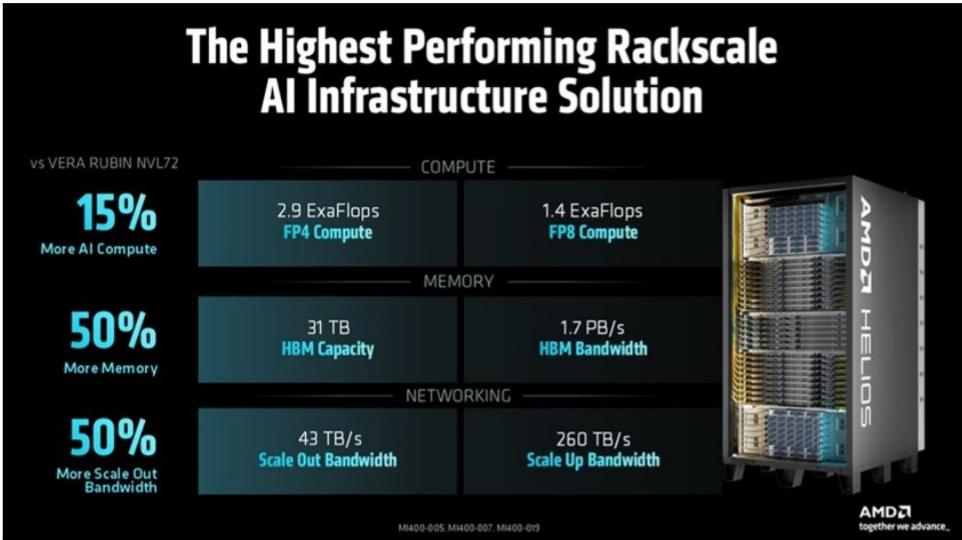
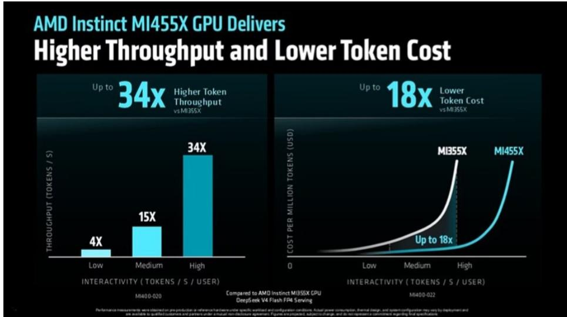
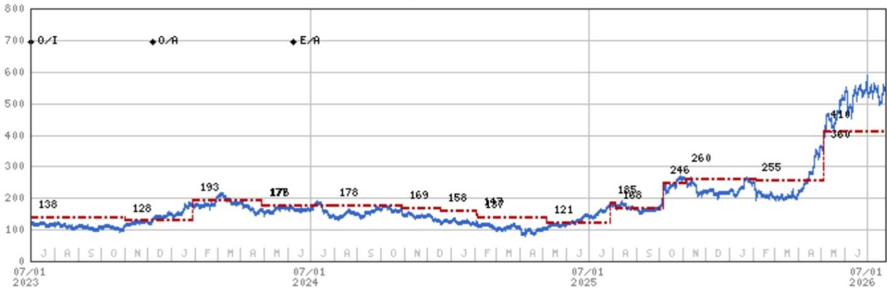

# 服务器CPU市场格局变化：从AMD最新活动看行业趋势

2026年7月24日，AMD举办了“Advancing AI”活动，并公布了一项值得企业基础设施战略制定者关注的数据。该公司将其2030年服务器CPU潜在市场规模预测上调至约2200亿美元，年复合增长率约为50%。这是十四个月内的第三次上调——从去年分析师日的600亿美元，到四月的1200亿美元，再到此次的新数字。调整的节奏本身就是一个信号。AMD不仅是在参与一个增长中的市场，它正在重新定义市场的边界，同时将自己定位为这场前所未有的服务器建设浪潮的主要受益者。

此次活动围绕Helios GPU平台、与Cerebras的合作，以及面向主权AI工作负载的新款MI430X芯片产生了大量报道。这些产品发布固然重要，但它们并非核心洞察。核心洞察在于：服务器CPU市场——长期以来被视为成熟、个位数增长的领域——现在预计在本十年末将以50%的年复合增长率增长。如果这一预测方向正确，其战略影响将波及超大规模云服务商的采购、企业数据中心规划、半导体供应链，以及x86与Arm架构之间的竞争格局。GPU的故事是真实的，但CPU的故事可能比市场当前定价的更为宏大。

## AMD上调CPU市场规模预测：企业AI基础设施的结构性转变，而非周期性波动

市场规模预测调整的幅度需要一个结构性的解释。在十四个月内从600亿美元跃升至2200亿美元，无法用增量式的服务器更新周期或适度的云容量扩张来解释。企业在计算部署方式上发生了根本性的变化。

报告中的客户反馈提供了因果机制。一位Meta的代表描述了在连续四代EPYC处理器上逐步深化的协同设计关系。AT&T的首席技术官讨论了在AMD硬件上训练开源电信模型。这些并非试验性部署。它们代表了生产规模的承诺，所需的CPU容量远超先前的规划假设。

结构性驱动因素似乎是AI智能体和推理工作负载的出现，这些工作负载对主机CPU提出了前所未有的需求。AMD内部演示了在MI350P和EPYC之间进行LLM查询路由，实现了43%的代币成本降低。这一效率提升并非边际性的。它改变了推理部署的经济性。当代币成本降低近一半时，可应用的场景呈指数级增长。每个曾认为LLM推理对于内部应用过于昂贵的企业，现在都必须重新计算。

50%的年复合增长率预测意味着，服务器CPU需求将从今天的大约600亿美元增长到2030年的2200亿美元。作为参考，全球半导体市场规模约为6000亿美元。一个单一的CPU细分市场在四年内增长到占该总额的三分之一以上，将代表行业历史上最显著的需求转变之一。即使实际数字显著低于2200亿美元，其发展方向也是明确的。

## Helios带来可衡量的推理优势，但GPU生态系统成熟度仍是多年挑战

Helios平台将72个Instinct MI455X GPU与18个第六代EPYC“Venice”CPU和Pensando网卡集成到一个机架级系统中。AMD声称，与Nvidia相比，每美元可获得的推理代币数量最多可提升30%，这得益于15%的计算能力提升、50%的HBM容量和带宽提升，以及50%的扩展带宽提升。这些都是具体、可验证的声明，而非营销抽象概念。

30%的效率提升对于总拥有成本是约束条件的推理工作负载最为重要。对于每天运行数十亿推理请求的超大规模云服务商来说，每美元代币数量提升30%意味着每年数亿美元的节省。这就是为什么活动中的客户反馈强化了Helios在2027年的强劲增长势头。

然而，报告明确警告，与市场领导者相比，长期竞争力需要时间。AMD已经直面解决了一些最艰巨的挑战——收购ZT的机架工程业务弥补了系统集成方面的差距，而客户认股权证结构虽然成本高昂，但应能加速采用。但这些是赋能条件，而非领先地位的保证。

与Cerebras在解耦推理方面的合作引入了一个有趣的战略替代方案。通过将Helios机架与Cerebras的晶圆级引擎配对，AMD可以为超低延迟工作负载实现5倍的吞吐量提升。这一合作可能是挑战Nvidia的关键，后者将能够通过其收购的Groq提供标准GPU与基于SRAM的方法之间的集成。解耦架构允许客户混合搭配推理组件，而不是被锁定在单一供应商的集成解决方案中。在工作负载多样性快速增加的市场中，这种灵活性具有真正的价值。

MI430X变体，配备原生FP64硬件，为HPC和主权AI工作负载提供288 TFLOPS性能，针对一个不同但具有战略重要性的细分市场。主权AI——各国政府推动建设独立AI基础设施的趋势——创造了能够同时处理传统HPC和新兴AI工作负载的芯片需求。该芯片已用于橡树岭国家实验室和欧洲CSN/Genci的百亿亿次系统，这一事实提供了任何营销活动都无法比拟的可信度。

## ROCm生态系统加速：活动中最被低估的进展

AMD推出了rocm.ai，一个位于ROCm之上的智能体层，允许现有的编码智能体——Claude、Codex、Cursor——原生理解AMD硬件和ROCm。这解决了AMD GPU采用的最大障碍：开发者的使用门槛。

数据支持生态系统正在成熟的说法。AMD演示了在MI355上优化MiniMax M3，每秒代币数提升了38%。它引用了在DeepSeek模型上，与ROCm 7相比，平均训练速度提升2.4倍，推理速度提升3.3倍。ROCm版本现在每六周发布一次，而不是每四个月。在Hugging Face、PyTorch、JAX、vLLM和SGLang上的默认启用意味着开发者不再需要采取额外步骤来使用AMD硬件。

其战略逻辑很清晰。AMD无法仅凭原始性能战胜Nvidia在CUDA优化方面长达十年的先发优势。但它可以在易用性和总拥有成本上取胜。如果开发者能够在AMD硬件上实现可比的推理吞吐量，且无需额外的工程工作，那么决策逻辑就从“AMD够好吗？”转变为“为什么要支付Nvidia的溢价？”

报告提到，公司从一些Instinct客户那里了解到，他们因AI而在AMD硬件上取得了进展。这并非轶事性的点缀。这是生态系统飞轮开始转动的证据。每一次成功的客户部署都降低了下一个客户的风险。每六周一次的ROCm发布缩短了开发者需求与软件能力之间的反馈循环。

## 决策框架：每个基础设施采购者必须回答的三个问题

对于企业技术领导者和采购策略师而言，AMD的活动提供了一个结构化的决策框架，包含三个不同的维度。

首先，CPU问题。您的组织是否为一个可能在四年内增长3.7倍的服务器CPU市场做好了准备？大多数数据中心规划周期基于两到三年的视野和适度的增长假设。一个50%年复合增长率的市场需要根本不同的容量规划、供应商关系管理和预算分配。现在锁定多年EPYC承诺的组织可能获得有利的定价和分配优先级。那些等待的组织则可能在一个快速扩张的市场中争夺受限的供应。

其次，GPU问题。Helios是否提供了足够的推理效率优势，以证明多源采购策略的合理性？每美元代币数量提升30%是真实的，但必须与生态系统成熟度差距进行权衡。主要运行训练工作负载的组织应保持谨慎。运行高容量推理工作负载的组织应运行自己的基准测试。与Cerebras的合作增加了一个额外的维度：对于超低延迟推理，解耦方法可能优于任何供应商的集成解决方案。

第三，生态系统问题。您的开发者组织是否准备好与ROCm互动？六周的发布周期和与主要框架的原生集成降低了切换成本，但并未完全消除。拥有深厚CUDA专业知识的组织可能会发现，转型的成本高于硬件节省带来的收益。从零开始构建新AI能力的组织则没有此类遗留负担，应在同等条件下评估AMD硬件。

报告中关于认股权证发行的谨慎态度值得纳入此框架。AMD向客户发行股票作为营销费用，报告估计这将在未来几年内抹去GPU的大部分利润。这是建立生态系统可信度的合理策略，但它造成了AMD股价与其继续提供有吸引力客户激励的能力之间的依赖关系。买家应将AMD的财务可持续性作为供应商风险评估的一部分。

## CPU实力显而易见，但市场规模预测调整的速度引入了读者无法忽视的可信度张力

报告关于CPU市场规模预测调整最引人注目的观察是，调整的速度让分析师感到不安。“毕竟，如果八个月前的预测偏差如此之大，我们确实无法感到确定。”这不是对AMD机会的否定。这是对一个变化速度超过任何历史先例的市场中预测挑战的诚实评估。

这种张力是真实的。AMD在CPU市场份额方面的信心值得注意，该公司似乎处于有利地位，能够在x86内部和整体上获得份额。但报告也指出，Arm芯片的侵蚀可能比AMD的评论所暗示的更为严重。Arm在能效和总拥有成本方面的架构优势已得到充分证实。问题在于，服务器CPU市场是否扩张得足够快，以同时容纳x86和Arm的份额增长。2200亿美元的市场规模表明答案是肯定的。1200亿美元的市场规模则会使竞争变成零和游戏。

产品路线图为AMD的地位提供了额外的信心。2028年基于Zen 7的“Florence”、“Ferrara”和“Fidenza”CPU，以及2030年基于Zen 8的“Ravenna”CPU，展示了持续的架构投入。GPU路线图显示，MI500系列将于2027年推出，四年内推理性能提升超过2000倍，MI600于2028年推出，以及与之相关的Helios 500和Helios 600机架平台。这不是一家依赖单一产品周期的公司。

报告维持中性评级。该股票相对于Nvidia和Broadcom等同行似乎非常昂贵，后者拥有更稳固的地位，尽管没有AMD的选择权。报告对叙事持建设性态度，但在其他地方看到了更好的风险回报比。这是一个可辩护的立场。AMD的上行情景需要同时在CPU份额增长、GPU生态系统开发和围绕认股权证发行的财务纪律方面取得成果。这是一个要求苛刻的三重奏。

对于认真的观察者和策略师来说，最重要的收获是，AMD正在推动一场很少有市场参与者完全吸收的转变。如果AMD的市场规模预测即使只有一半是正确的，那么对超大规模云服务商的资本支出、企业IT预算、半导体供应链以及x86与Arm之间的竞争动态的影响将是深远的。GPU的故事将继续占据头条。CPU的故事最终可能更为重要。

*仅供参考。部分内容可能基于源材料通过AI辅助生成、翻译、总结或编辑，可能存在遗漏或错误。请独立核实。本文不构成专业建议。*

仅供参考。部分内容可能基于源材料通过AI辅助生成、翻译、总结或编辑，可能存在遗漏或错误。请独立核实。本文不构成专业建议。

