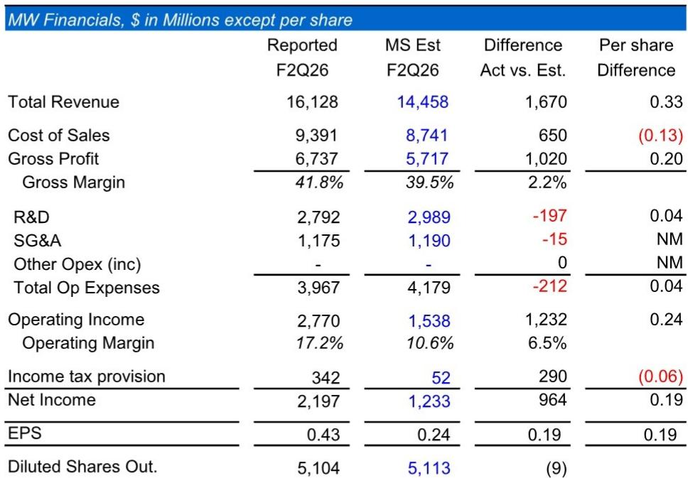
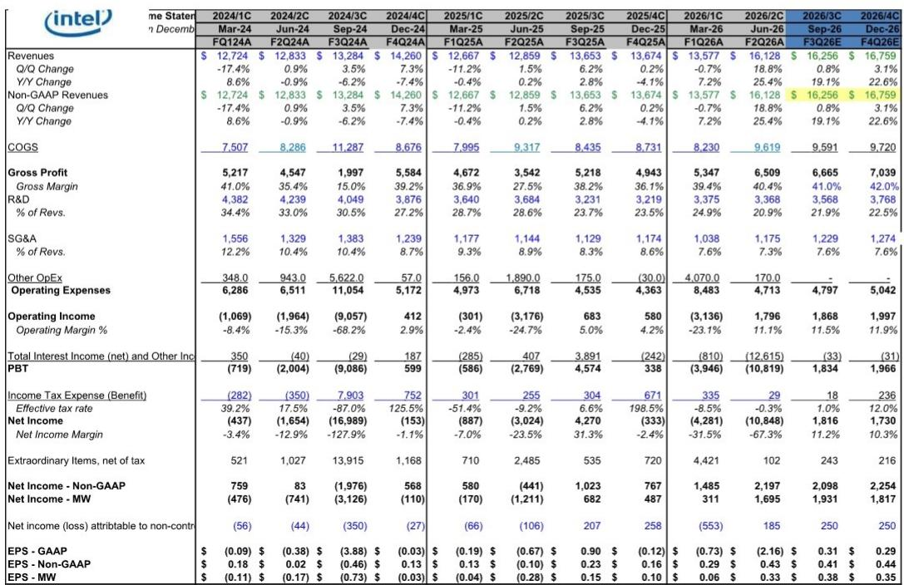
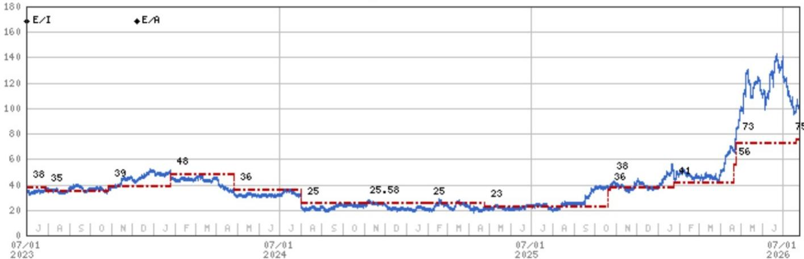

# MS：英特尔业务与近期数据观察

英特尔二季度财报交出了一份明显超出市场预期的成绩单。非GAAP营收161.28亿美元，高于MS预期的144.58亿美元和市场的144.17亿美元；每股收益0.43美元，也显著高于预期的0.24美元。但这份报告真正值得关注的，不是业绩本身，而是管理层对长期代工前景的热情，以及由此带来的更高资本开支——这两件事放在一起，构成了一个需要仔细拆解的判断。

服务器CPU市场正在经历罕见的扩张。AMD在同一天表示，2030年服务器CPU市场总规模可达2200亿美元，而三个月前这个数字还是1200亿美元，八个月前仅为600亿美元。英特尔数据中心业务环比增长26%，远超MS预测的15%。PC业务同样强劲，营收环比增长16%，而预期仅为2%。报告认为，这背后有需求超预期、价格上升、低端市场受内存短缺影响而出现结构上移，以及客户在高通胀环境下提前备货等多重因素。

但业绩超预期的另一面，是资本开支的大幅上调。2026年总资本开支从约150亿美元升至200亿美元，2027年预计将更高，MS估算为300亿美元。资本开支比折旧高出约80亿美元，意味着今年自由现金流将非常有限，尤其是考虑到此前从Brookfield获得的资金将在明年开始偿还。管理层在电话会上提到未来可能进行融资，但当前账上仍有大量现金，没有紧迫需求。

> **KC评论：** 这份报告的核心矛盾在于，服务器市场的强劲需求确实支撑了短期业绩，但英特尔在自由现金流为负的情况下，还要为代工业务投入巨额资本。MS的态度是，代工成功与否取决于文化转变，而这一点至今尚未看到明确证据。

## 1. 服务器CPU市场扩张幅度为近年罕见

报告用了一个很具体的对比来说明当前服务器市场的热度：AMD将2030年服务器CPU TAM从三个月前的1200亿美元上调至2200亿美元，八个月前这个数字还只有600亿美元。MS认为，这是他们见过的潜在增长前景中最显著的拐点之一。

英特尔数据中心营收62.62亿美元，同比增长59%。即便产品路线图不算突出，英特尔也充分参与了这一轮增长。但报告同时指出，服务器CPU的盈利前景至少部分依赖于供应短缺的持续——一旦CPU供应充足，份额流失和价格下降的不确定性就会显现。

## 2. 代工与先进封装前景乐观，但MS持保留态度

管理层对14A制程和EMIB-T先进封装技术信心很高。报告提到，行业在先进制程节点上的产能紧张，让管理层对长期代工前景（2028年不确定性生产，2029年量产）以及中期封装前景（明年EMIB-T收入可达数十亿美元）都相当乐观。

MS对此区分了两种判断：EMIB封装业务不确定性较低，因为市场确实存在需求缺口；但代工业务完全不同。报告明确写道，自2014年以来，他们一直认为代工成功需要文化转变，而这一点至今没有看到。这一判断得到了多家先进制程半导体公司CEO的印证——代工前景更多取决于行业新进入者、超大规模云厂商或系统公司，而非传统半导体IDM。

## 3. 资本开支上升与自由现金流不确定性形成对照

2026年资本开支从约150亿美元升至200亿美元，2027年预计达到300亿美元。报告估算，资本开支比折旧高出约80亿美元，今年自由现金流将非常有限。管理层表示未来可能进行融资，但当前没有紧迫需求。

报告提供了一个观察框架：读者对资本开支的热情，完全取决于对这些研究长期回报的预期。如果市场对代工前景保持乐观，报价可以消化这些消息。但MS目前没有这种信心，他们选择保持观望。服务器市场的增长确实能支撑部分估值——如果AMD和NVIDIA关于2030年2000亿美元以上服务器CPU市场的判断成立，英特尔即使大幅流失份额，也能从目前约240亿美元的年化营收基础上继续增长。

但报告也提醒，英特尔在自由现金流为负的情况下经历服务器市场历史上最大的拐点，这给代工前景带来了更多不确定性。与多家半导体同行在未来两年拥有数百亿美元自由现金流相比，英特尔的表现显得不够有力。

## 4. 估值框架：42倍市盈率反映杠杆潜力，但需要更多证据

基于2027年每股收益2.00美元的42倍市盈率。42倍高于大型逻辑半导体同业的高端，报告解释这反映了当前盈利仍处于低位时的杠杆潜力，以及代工业务的期权价值——尽管他们长期持怀疑态度。

报告的不确定性回报分析显示，牛市情景下报价可达137美元，对应2027年每股收益3.04美元和45倍市盈率，前提是产品路线图交付、份额稳定、营收达到770亿美元且毛利率回到50%。熊市情景下报价为50美元，对应每股收益1.25美元和40倍市盈率，假设2027年周期转向、份额继续流失、代工业务不及预期。

For informational purposes only. Portions may be generated,translated,summarized,or edited with AI assistance based on source materials and may contain omissions or errors. Please verify independently. This is not investment,legal,tax,accounting,or other professional advice.

For informational purposes only. Portions may be generated,translated,summarized,or edited with AI assistance based on source materials and may contain omissions or errors. Please verify independently. This is not investment,legal,tax,accounting,or other professional advice.

