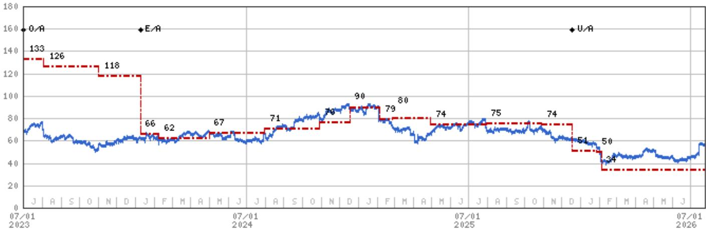
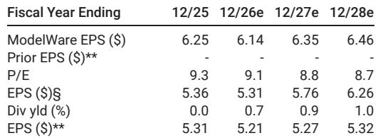
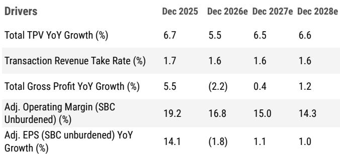

# MS：PayPal二季度业绩前战略选择与商户流失数据

PayPal 将在 7 月 28 日发布二季度财报。MS在最新报告中指出，市场关注的焦点已从短期业绩数字转向管理层对战略选项的表态——尤其是在 Stripe 收购传闻背景下，公司是否愿意出售，还是继续作为独立实体推进转型。报告同时提供了其自建的商户接受度追踪数据，显示 Venmo 按钮的商户流失率正在上升，而 Shop Pay 的粘性首次超过 PayPal。

这份报告的核心判断是：PayPal 独立运营面临的结构性挑战——品牌支付市场份额流失、技术债务累积、用户基础成熟化——难以通过现有成本优化和产品改进解决。管理层在二季度会议上的措辞，可能比任何财务数字都更能影响市场对公司价值的判断。

## 1. 管理层战略表态成为二季度业绩发布的核心变量

报告认为，读者最关注的是新任 CEO Enrique Lores 及董事会对“出售全部或部分业务”与“继续作为独立公司推进转型”之间的态度。据 Tech Times 报道，PayPal 董事会已拒绝 Stripe/Advent 每股 60.50 美元的收购报价，并寻求更高价格，但双方均未证实。

MS分析师指出，如果收购传闻属实，这可能是当前最可信的价值实现路径。报告估算，60.50 美元的报价对应约 10 倍 2027 年市场一致预期调整后每股收益，以及 11.5 倍该机构自己的预测——后者仍低于市场共识。相比之下，Fiserv 和 Global Payments 等处理商同行在约 5% 的收入增长和双位数每股收益增长预期下，估值仅为 5 倍 2027 年调整后每股收益。

> **KC评论：** 这里的估值对比值得注意。MS认为，即便 Stripe 报价被拒，PayPal 当前报价隐含的估值倍数已经高于处理商同行，而同行拥有更快的增长算法。这意味着，如果收购溢价无法实现，市场可能需要重新评估独立运营下的合理估值区间。

## 2. Venmo 商户接受度追踪显示高流失率，按钮效果存疑

MS自建的商户接受度追踪数据显示，Venmo 在二季度仅净增加 1 个商户（新增 8 个、流失 7 个），总商户数维持在 89 家，按商户数量计算的接受份额保持在 19%（与一季度持平），按交易量（剔除亚马逊）计算的份额也维持在 8%。

更值得关注的是商户流失率。Venmo 的季度商户流失率从一季度的 5.6% 上升至二季度的 8%，是追踪的所有数字钱包中最高的。报告认为，高流失率可能表明 Venmo 按钮并未给商户网站带来有意义的转化提升，导致商户在添加后不久便移除该选项。根据追踪数据，自 2025 年一季度以来移除 Venmo 的 17 个商户，平均保留时长约为 4.5 个季度。

报告同时指出，PayPal 主品牌按钮的商户流失率仍然很低（二季度净增 1 个商户，流失率约 0.51%），但两年平均流失率已从 2022 年一季度至 2023 年四季度的 0.38% 上升至 0.51%。Shop Pay 的两年平均流失率已降至 0.4%，首次低于 PayPal，表明其界面在结账和商户粘性方面表现更优。

## 3. 品牌支付增长承压，短期激励难以持续驱动 Venmo 增长

报告预计，PayPal 二季度品牌支付（Branded Checkout）增长约为 1-2%，略高于一季度的 1%，主要受 Venmo 支付增长改善推动。但分析师对 Venmo 增长的可持续性持怀疑态度，理由有二：一是增长主要依赖短期奖励计划，管理层预计今年奖励和激励措施将对交易利润美元增长造成约 3 个百分点的影响；二是高商户流失率表明按钮并未带来有意义的改善。

在宏观层面，美国非实体零售销售数据在 4-5 月加速至同比增长 11%（一季度为 10%），6 月进一步加速至 18%，但部分受亚马逊 Prime Day 时间影响。PayPal 管理层在季中曾指出，品牌支付表现持续落后于整体电商增长，旅行领域仍显疲软，欧洲市场也在节奏变化。

## 4. 独立运营面临资本配置两难，加速研究与股东回报难以兼得

报告提出一个核心矛盾：PayPal 当前面临的市场份额加速流失和品牌支付增长转负不确定性，需要公司大幅加速研究——包括品牌支付现代化、与 Apple Pay 等硬件钱包集成、扩大 Venmo 接受度、为代理型商务准备平台——但 2026 年展望显示，公司连续第四年将几乎全部自由现金流用于回购。

MS认为，如果 PayPal 选择独立运营，可能需要接受连续数年的每股收益负增长，以重新配置资本用于竞争性研究。而竞争对手 Shopify 和 Adyen 的盈利能力正在显著改善，增强了它们从 PayPal 手中夺取份额的能力；Apple Pay 的硬件无缝集成则构成持续的结账威胁。

> **KC评论：** 这份报告实际上在追问一个更根本的问题：当一家公司的核心业务正在流失市场份额，而竞争对手的盈利能力和技术能力都在提升时，继续将几乎全部自由现金流用于回购，是否是最优的资本配置？二季度会议上管理层对研究意愿的表态，可能比任何财务指引都更能说明问题。

For informational purposes only. Portions may be generated,translated,summarized,or edited with AI assistance based on source materials and may contain omissions or errors. Please verify independently. This is not investment,legal,tax,accounting,or other professional advice.

For informational purposes only. Portions may be generated,translated,summarized,or edited with AI assistance based on source materials and may contain omissions or errors. Please verify independently. This is not investment,legal,tax,accounting,or other professional advice.

