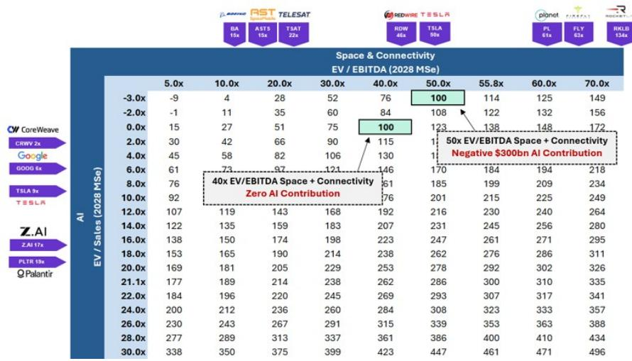
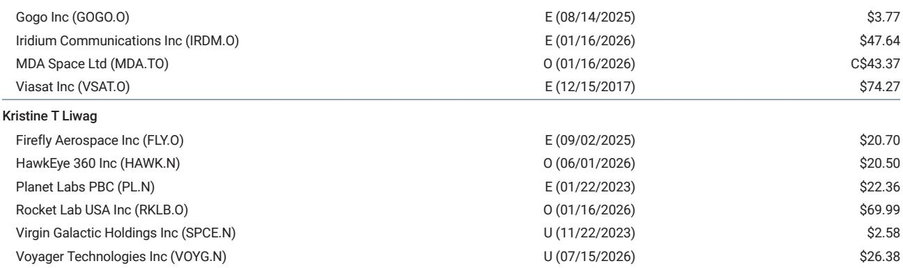
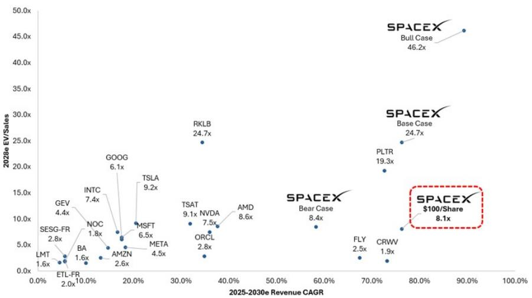

# At $100, SpaceX Would Price Its Core Business Below Retail Giants While Giving Away AI for Free

The arithmetic is stark. If SpaceX shares fall to $100, the company would trade at 18x estimated 2028 EV/EBIT. That multiple is roughly equivalent to the median of its peer group. But the comparison misses the crucial point: SpaceX is projected to grow revenue at a 76% compound annual rate between 2025 and 2030, nearly three times the 26% CAGR of those same peers. At $100, an investor would be paying a retail multiple for a growth rate that far exceeds any company in that valuation bracket.

The tension in the current market is not about fundamentals. Nothing material has changed in the business over recent weeks. Yet bearish sentiment has hardened, while bulls have grown more resigned to waiting for obvious catalysts. The result is a valuation that has drifted toward a level where the implied math becomes extreme. At $100 per share, the market would be assigning zero value to SpaceX's entire artificial intelligence opportunity—a business that a global investment bank estimates could generate roughly $100 billion in AI revenue by 2028 on 6 gigawatts of average compute capacity. Worse, depending on the multiple applied to the Space and Connectivity segment, the market could be implying a negative $300 billion value for the AI operations.

This is not a typical growth stock discount. This is a structural mispricing of a company that dominates three-quarters of global mass to orbit, operates the largest maneuverable satellite constellation in existence, and is building one of the most ambitious AI infrastructure platforms on the planet. The question is not whether SpaceX is overvalued or undervalued in the abstract. The question is what exactly the market is refusing to pay for—and whether that refusal is rational.

## At $100 per Share, the Market Implies Zero Value for AI and a 30% Discount on Space and Connectivity Earnings

The most direct way to understand the $100 price point is to decompose it using a sum-of-the-parts framework. A global investment bank's base case values Space and Connectivity alone at approximately $136 per share using a 15-year discounted cash flow model that implies 56x EV/EBITDA. That valuation already embeds a premium for market leadership, but it is grounded in the segment's demonstrated performance: nearly 50% growth this year with 40% EBITDA margins.

At $100, the implied enterprise value for Space and Connectivity would be roughly $1.27 trillion. Dividing that by the bank's 2028 EBITDA estimate for the segment yields an implied multiple of 55.8x—nearly identical to the 56x used in the DCF. But here is the catch: that calculation assumes the entire enterprise value comes from Space and Connectivity, with AI worth nothing. And even then, the implied 2028 EBITDA for Space and Connectivity would need to be approximately $22.8 billion, which is 28% below the bank's base case estimate of $31.6 billion.

In other words, at $100, the market would be pricing the core business as if it will underperform its own trajectory by nearly a third, while simultaneously assigning no worth to an AI operation that the bank models as contributing roughly half of total enterprise value by 2028. The asymmetry is extreme. An investor at $100 is not buying a growth story with optionality. They are buying a penalized core business with a free option on what could be the largest AI infrastructure build of the decade.

## The Discount Relative to Consumer Retail Peers Reveals How Unusual This Valuation Has Become

To appreciate how unusual the $100 valuation is, consider the comparison to two of the most widely held consumer retail stocks. At $100, SpaceX would trade at 16x estimated 2028 price-to-earnings. Walmart trades at 33x forward earnings. TJX Companies trades at 26.5x. Both are mature, low-growth businesses. SpaceX is a capital-intensive, pre-profitable (on a GAAP basis) infrastructure company with negative net income in 2025 and an estimated $0.28 of earnings per share in 2026.

But the comparison is not about current earnings. It is about what the market is willing to pay for future earnings. Walmart and TJX command premiums because their earnings are predictable, their competitive positions are stable, and their capital returns are reliable. SpaceX offers none of those attributes today. Yet the implied multiple compression at $100 suggests that investors are demanding a risk premium far in excess of what the underlying growth trajectory would justify.

The more relevant comparison is within the S&P 500. At 18x EV/EBIT, SpaceX would rank approximately 81st among non-financial, non-real-estate companies in the index. It would sit between Boeing at 21x, Waste Management at 19x, CSX at 18x, and Garmin at 18x. These are mature industrial and infrastructure businesses. SpaceX, by contrast, is scaling launch capacity, building a global broadband network, and deploying one of the fastest-growing AI compute fleets on the planet. The market is effectively saying that the risk of execution failure, capital overhang, and competitive disruption is so high that the entire AI opportunity must be discounted to zero.

## The Bear Case Has Grown More Convincing to Investors Despite No Change in Fundamentals

The shift in sentiment is not driven by new data. The business has not experienced a major launch failure, a Starlink subscriber miss, or a regulatory setback that would alter the long-term thesis. What has changed is the cumulative weight of uncertainty. Lockup expirations loom, and the next earnings print is unlikely to answer the most pressing investor questions about AI monetization, compute deployment timelines, and Starship operational readiness.

Many investors now assign zero or negative value to the AI segment. The reasoning is straightforward: the capital expenditure requirements are enormous, the economics of neocloud and inference are still unproven at scale, and management attention is divided across launch, connectivity, and AI simultaneously. The bear case does not require a fundamental flaw in the technology. It only requires that the path to profitability is longer, more expensive, and less certain than the bull case assumes.

But the bear case has a logical limit. Even if AI delivers nothing, the Space and Connectivity business alone—at the bank's base case estimates—supports a $136 per share valuation. The current price of $118 is already below that. At $100, the discount deepens. The bear case does not explain why the core business should trade at a discount to its own intrinsic value while growing at nearly 50% annually with dominant market share.

## A Decision Framework for Investors Weighing the $100 Entry Point

For an investor considering SpaceX at or near $100, the decision reduces to three scenarios, each with distinct implications.

Scenario one: the bear case is correct, and AI delivers negligible value. In this outcome, the Space and Connectivity business must generate EBITDA approximately 30% below current estimates to justify the $100 price. That would require slower Starlink subscriber growth, lower launch margins, or both. The bank's bear case, which assumes Starship does not become operational until 2029 and AI monetization underperforms, would still be worth something—Space and Connectivity alone would account for over 90% of valuation.

Scenario two: the base case materializes. Space and Connectivity grow as modeled, and AI begins to contribute meaningfully. The upside in the bear case and the 200% upside in the base case is striking, but it is not automatic. It depends on execution across multiple dimensions: Starship reuse cadence, Starlink subscriber growth, compute deployment timelines, and enterprise AI adoption.

Scenario three: the bull case accelerates. Starship becomes operational in the fourth quarter of 2026, compute deployment grows at a 46% CAGR through 2040, and AI represents more than 60% of valuation. This scenario depends on favorable regulatory outcomes, but it is not implausible given the company's track record of over-delivering on technical milestones.

The decision framework is not about predicting which scenario will occur. It is about recognizing that at $100, the market is pricing the most pessimistic outcome for AI while simultaneously discounting the core business. An investor who believes the Space and Connectivity segment is worth at least the bank's base case estimate does not need to believe in the AI story to find the entry point attractive. They only need to believe that the core business will not underperform its own trajectory by 30%.

## The Catalysts That Could Break the Current Stalemate Are Concentrated in the Next 90 Days

The next three months contain a dense cluster of potential catalysts. Starship Test Flight 14 and 15, expected in September and October, could mark the first catch of a V3 Starship booster, the first orbital Starship flight, and the first simultaneous deployment of operational V3 satellites. These are not incremental milestones. They are the difference between Starship remaining a development program and becoming an operational launch system.

On the AI side, the Cursor acquisition is expected to close before the end of the third quarter, which would trigger material updates on annual recurring revenue and Grok adoption on the platform. SpaceX is also expected to double its compute capacity to 2 gigawatts by year-end, which would support additional neocloud deals. Grok 4.6, a 2 trillion parameter model, is expected within the next month, with Grok 5.0, a 6 trillion parameter model, before year end.

Because the market is pricing in little to no value for AI, most AI-related developments represent asymmetric upside catalysts. A single large neocloud deal, a strong Cursor ARR number, or a successful Starship flight could shift sentiment rapidly. The risk is that none of these catalysts materialize on schedule, or that they are underwhelming relative to expectations. But the current valuation already embeds a high degree of skepticism. The bar for positive surprises is low.

## The Structural Case for Owning SpaceX at Current Levels Rests on a Moat That Competitors Cannot Replicate

The most underappreciated aspect of the SpaceX investment case is the durability of its competitive position. The company controls more than three-quarters of global mass launched to orbit and operates the largest fleet of maneuverable satellites. These are not transient advantages. Launch costs per kilogram are declining as Starship reuse progresses, and Starlink's subscriber base is growing at a pace that would be prohibitively expensive for any competitor to replicate.

In the AI segment, SpaceX's vertical integration offers a structural cost advantage. The company builds its own satellites, launches them on its own rockets, and operates its own ground infrastructure. For AI compute, it controls the hardware deployment, the power supply, and the data center footprint. The result is a cost per watt and time-to-power that traditional AI infrastructure providers cannot match. The bank's analysis gives SpaceX a 50% valuation discount on enterprise AI for execution risk, but even after that discount, the segment accounts for a significant portion of total value.

The risk is that execution stumbles. Starship delays, Starlink subscriber saturation, or AI monetization that takes longer than expected could compress the valuation further. But the asymmetry at $100 is not subtle. An investor is being asked to pay a retail multiple for a business that dominates its core market, grows at three times the rate of its peers, and includes a free option on what could be the most important infrastructure build of the next decade. The market may be right to be cautious. But it is not being rational about the price.

*For informational purposes only. Portions may be generated, translated, summarized, or edited with AI assistance based on source materials and may contain omissions or errors. Please verify independently. This is not investment, legal, tax, accounting, or other professional advice.*

For informational purposes only. Portions may be generated, translated, summarized, or edited with AI assistance based on source materials and may contain omissions or errors. Please verify independently. This is not investment, legal, tax, accounting, or other professional advice.

