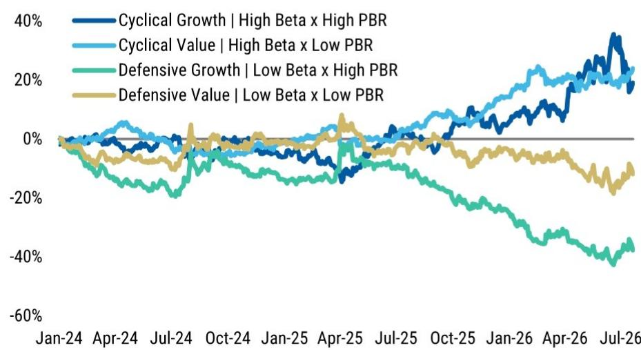
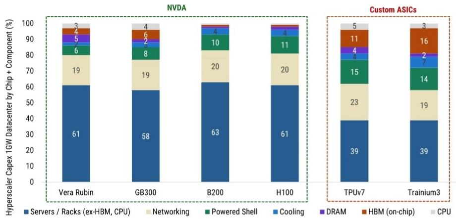
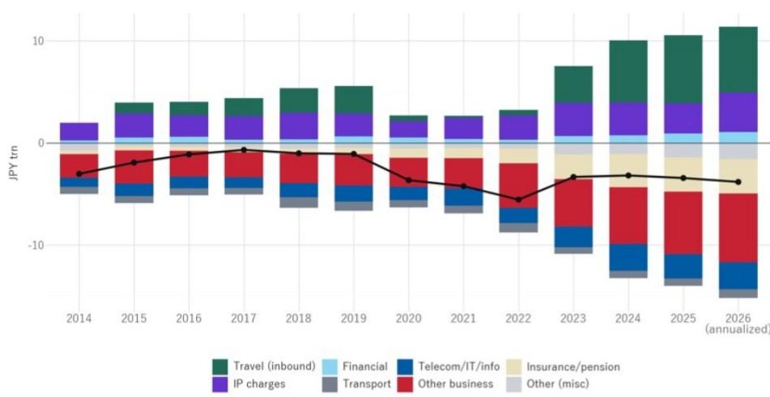

# 日本财报季需要双重策略：AI再轮动与周期价值追赶需并行

日本市场在本财报季最关键的动态，并非AI动能是否会回归，而是当动能回归时，资金将如何在市场中重新分配。某全球研究机构的日本策略团队认为，传统的“AI与非AI”或“成长与价值”的二元划分可能会误导观察者。相反，基准情形是：资金同时回流AI相关公司，并追赶落后的周期价值股。这并非折中预测，而是基于特定矛盾得出的结构性结论：美国大型科技公司的资本支出计划远高于市场共识预期，但日本AI相关公司已承载较高预期，限制了其超预期的空间。结果是，市场奖励的是选择性，而非板块层面的押注。

该机构的美国互联网团队预测，大型科技公司2027年资本支出总额约为1.2万亿美元，较市场共识的0.9万亿美元高出约30%。到2028年，差距扩大至约40%，其估计为1.4万亿美元，而共识为1.0万亿美元。从历史看，共识估计会向这些更积极的预测靠拢。这对日本市场的直接影响是：若美国大型科技公司确认积极的支出计划，全球资金将回流AI相关公司。但策略师提醒，这种轮动不会是所有AI公司的统一重估。原因在于盈利修正数据。

## 周期成长股预期高企，财报事件带来不对称下行风险

AI相关板块的盈利修正指数已大幅上升，表明市场已将对全年预测的强劲一季度进展和上调指引的预期计入价格。对于周期成长股，尤其是与AI相关的公司，财报公布前后的风险回报比已不如周期早期。即使报告数字表面不弱，若未能超越市场的高预期，也可能引发大幅回调。该机构以安川电机为例：尽管其调整后贝塔值约为1.59，但在7月10日财报公布后的交易日，其股价下跌14.3%，跑输东证指数13.7%。五个交易日内，跌幅扩大至26.6%，跑输幅度达24.4%。

这并非孤立事件。它反映了一个更广泛的模式：高预期公司在结果仅符合而非超越共识时，面临放大后的下行风险。策略师强调，问题并非AI相关公司基本面恶化，而是股价已跑在基本面之前。对于关注周期成长的观察者，关键问题不再是AI需求是否真实，而是任何单一公司能否提供足够的上行空间来证明其当前估值合理。容错空间已显著收窄。

## 周期价值股预期较低，限制下行空间并创造重估潜力

对比机会在于那些被AI行情抛在后面的周期价值股。该机构分析显示，自3月以来，周期成长股与周期价值股之间的表现差距已显著扩大。然而，许多周期价值股的盈利增长前景与成长股相当。差异在于股价中蕴含的预期。周期价值股在2026财年每股盈利增长方面位列东证指数成分股前50%，在市场贝塔值方面位列前30%，但其市净率分布处于第10至第50百分位。它们具备盈利增长和市场敏感性，但缺乏创造下行风险的溢价估值。

策略师认为，市场对这些股票的预期较低，限制了财报事件前后的下行风险。若周期价值公司交出超预期的成绩，它们可能同时受益于盈利上修和估值重估。电阻制造商KOA最近的财报提供了早期信号，表明这一动态已在发生。该机构覆盖分析师对报告结果和上调指引均持正面看法。除了公司自身故事，关键启示在于：AI服务器中使用的电阻需求正在扩大，而自疫情以来经历长期库存调整的工业设备需求，可能正进入全面复苏阶段。这表明AI资本支出的益处正开始从半导体和数据中心纯概念股，扩展到价值链的上游和相邻领域，包括电子元件和工业设备。

## AI利润池的扩大转变了周期价值的研究逻辑

KOA的例子不仅是公司层面的数据点。它代表了AI投资如何通过日本经济流动的更广泛结构性转变。该机构的美国信贷策略团队指出，未来AI基础设施的融资预计将从数据中心外壳建设转向服务器、芯片、计算和能源基础设施（包括燃气轮机），这些合计约占数据中心总成本的60%。随着资本支出构成演变，受益于AI投资的公司范围也在扩大。生产数据中心建设和运营所需的组件、材料和设备的公司，即使不是纯AI概念股，也有望受益。

利润池的扩大，是使AI轮动与周期价值追赶同时发生的机制。在该机构的基准情形下，美国大型科技公司积极的资本支出计划推动全球资金回流AI相关公司。但高企的增长预期限制了日本AI相关公司的上行空间，因此资金从纯AI概念股扩展到那些受益于AI投资但预期仍低的周期价值股。结果是，动量因子重新有效，但并非集中、单向地流入与之前相同的公司。选择性成为超额收益的主要驱动力。

## 财报季的决策框架：三种情景，一个核心矛盾

该机构策略师为财报季列出了三种情景，每种对组合配置都有不同启示。基准情形是：美国大型科技公司维持积极的资本支出计划，全球资金回流AI相关公司，同时落后的周期价值股追赶。在此情景下，动量因子重新有效，但日本AI相关公司的高盈利预期阻止了统一的上行。第二种情景是：AI相关公司明显超越市场高预期，导致资金重新集中流入AI公司。此时，周期成长股表现更优，周期价值股的重估被推迟，尤其是在宏观不确定性增加的情况下。第三种情景是转向避险：AI相关公司未能跨越更高的盈利门槛，地缘风险加剧。此时，高贝塔AI相关公司的头寸平仓可能加速动量反转。

所有三种情景的核心矛盾相同：AI投资的可持续性毋庸置疑，但其收益的分配方式才是关键。策略师认为，市场方向最重要的决定因素将是美国大型科技公司公布的资本支出计划。若这些计划确认了该机构美国互联网团队预测的积极前景，资金回流AI的可能性很大。但日本AI相关公司能上涨多少，取决于它们超越已高企预期的能力。对于周期价值股，门槛较低，重估潜力更高。

## 信贷担忧上升，但未否定资本支出逻辑

一个潜在的复杂因素是，美国大型科技公司的信用利差正在扩大。自6月以来，由于其他大型公司连续大规模发债、大型科技公司财报前融资以及标普下调甲骨文评级，信用利差已走阔。6月以来发行的大额交易在二级市场的利差高于发行时，表明美国信贷读者的情绪开始转变。该机构策略师承认，随着资本支出扩张，信贷担忧正在上升，但他们不认为这是放弃积极资本支出预测的理由。即使资本支出前景正确，对信用风险和利润率压力的担忧也不会消失。然而，共识向该机构预测收敛的历史模式表明，市场这次可能遵循相同轨迹，市场预测未能充分反映资本支出各组成部分（包括内存价格和数据中心建设成本）的成本上升。

信用利差扩大带来了不确定性，但并未改变AI投资的基本方向。策略师指出，未来融资重点预计将从数据中心外壳转向服务器、芯片、计算和能源基础设施。资本支出构成的这种转变，实际上可能使更广泛的日本公司受益，尤其是那些在AI行情中被忽视的工业和电子元件板块。

## 财报日历为逻辑提供实时检验

未来两周，日本、美国、韩国和台湾的主要AI相关公司将公布财报。该机构策略师强调，这些结果及市场反应，不仅将为日本AI相关公司的方向提供重要启示，也有助于评估落后周期价值股的重估潜力。若AI相关公司交出强劲成绩但未能上涨，将确认预期已充分定价。若周期价值股交出超预期成绩并上涨，将确认AI利润池的扩大正在进行。这两种结果的结合，将验证双重策略的基准情形。

该机构的筛选方法识别了周期成长和周期价值类别中的具体公司。周期成长股包括建筑、化工、电器和机械行业的公司，具有高市净率和强劲动量。周期价值股包括相同行业但市净率较低、动量较弱的公司，表明它们已被AI行情抛在后面。关键洞察是，两组公司盈利增长前景相似，但盈利门槛差异显著。对于周期成长股，门槛高；对于周期价值股，门槛低。

## 战略启示：不要在AI和价值之间做选择，而要区分预期与基本面

这一分析的核心信息是，财报季需要一个比简单板块押注更细致的框架。只关注AI相关公司的观察者，可能陷入高预期陷阱——即使业绩扎实，也未必能带来正回报。完全忽视AI的观察者，则可能错过由大型科技公司积极资本支出计划引发的动量轮动。最优方法是同时关注估值合理的AI相关公司，以及预期低、有重估潜力的周期价值股。

该机构策略师并非认为所有周期价值股都会同等受益。他们关注那些在AI行情中被过度抛售、股价相对于基本面和公允价值的折价已扩大的公司。他们也提醒，银行股和内需股近期的一些韧性，可能反映了从下跌的AI相关公司转向防御性轮动，若AI股在美国大型科技公司资本支出公布后反弹，这些资金流可能逆转。结构性重估与防御性轮动之间的区分至关重要。

## 财报季将检验基准情形是否成立

未来几周将决定AI轮动与周期价值追赶同时发生的基准情形是否成立。若美国大型科技公司确认积极的资本支出计划，日本AI相关公司温和上涨，同时周期价值股也上涨，则逻辑得到验证。若AI相关公司因强劲财报而飙升，周期价值股继续落后，则第二种情景成立。若两组公司因地缘冲击或财报失望而下跌，则避险情景占主导。

该机构策略师已清晰阐述了其基准情形。KOA的财报和信用利差扩大提供了早期信号，但完整图景将在未来两周财报公布后浮现。目前，最重要的结论是：市场并未提供在AI和价值之间的简单选择。它提供了一个区分预期与基本面的机会，并据此进行布局。

*仅供参考。部分内容可能基于源材料通过AI辅助生成、翻译、总结或编辑，可能存在遗漏或错误。请独立核实。本文不构成任何专业建议。*

仅供参考。部分内容可能基于源材料通过AI辅助生成、翻译、总结或编辑，可能存在遗漏或错误。请独立核实。本文不构成任何专业建议。

