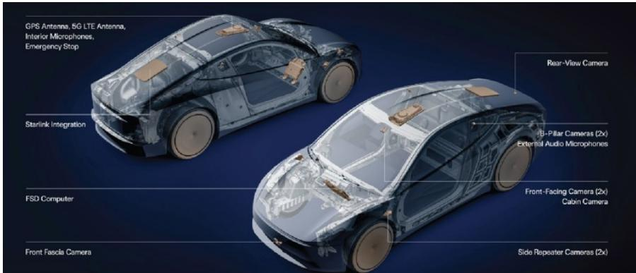

# MS：SpaceX-Starlink与特斯拉机器人集群通信整合

在2026年第二季度财报沟通中，特斯拉确认Starlink正在被集成到Cybercab中，并计划逐步推广至所有在Starlink覆盖区域内的特斯拉车辆。这一决策的直接理由是：蜂窝网络覆盖存在持续缺口，自动驾驶车辆可能在通信“盲区”陷入失联状态。MS分析师Adam Jonas团队在7月24日发布的报告中指出，这一整合动作不仅是产品层面的技术升级，更揭示了SpaceX估值框架中一个被低估的变量——机器人作为Starlink客户群体的规模潜力。

报告的核心判断是：机器人将在两个维度上影响SpaceX的长期估值。其一，在Starlink的长期用户预测中，机器人将成为单一最大的客户群体；其二，机器人所代表的终端市场，可能是企业AI业务中价值最高、规模最大的应用场景。这一判断将Cybercab与Starlink的整合从“解决通信盲区”的技术问题，提升为理解SpaceX业务结构变化的观察入口。

## 1. 机器人即服务市场到2050年潜在规模约75万亿美元

报告给出了一个长期测算框架：到2050年，机器人即服务（RaaS）的潜在市场规模约为75万亿美元，其中包含约25万亿美元的原设备市场，以及约50万亿美元的下游周边服务。这一数字的规模本身，构成了理解SpaceX估值逻辑的背景。

在MS的模型里，自动驾驶出租车是移动卫星连接最直接、最早期的采用场景。即使主要依赖地面5G网络，关键通信网络基础设施（包括运输网络）仍然需要冗余和弹性。Starlink提供的正是这种冗余连接能力——高带宽、低延迟，同时能为乘客提供一致的宽带体验。

> **KC评论：** 75万亿美元是一个远期估算，其意义不在于数字本身是否精确，而在于它给出了一个数量级参照。当报告说“机器人是Starlink最大客户群体”时，背后对应的是这样一个量级的终端市场。读者需要关注的是这个逻辑链条，而非具体数字。

## 2. 自动驾驶车辆Starlink渗透率峰值预计为2040年的40%

报告给出了具体的渗透率路径：到2035年，Starlink来自自动驾驶车辆的收入预计达到60亿美元；到2040年，这一数字上升至310亿美元。对应的车辆连接数量是8300万辆，渗透率峰值为40%。

这一预测隐含了一个前提：并非所有自动驾驶车辆都需要卫星连接。城市核心区的蜂窝网络覆盖已经足够，Starlink的价值主要体现在覆盖盲区。但报告认为，对于关键网络基础设施而言，“冗余”本身就是一种刚需——即使大部分时间用不上，一旦需要，它必须存在。

## 3. 机器人客户群已超出自动驾驶出租车范畴

报告在Starlink的用户预测中，纳入了多个其他机器人客户类型：大型和小型无人机、电动垂直起降飞行器（eVTOL）、工业机器人、人形机器人等。这意味着，Cybercab只是机器人接入Starlink的第一个案例，而非最后一个。

从估值方法看，MS对SpaceX采用分部加总估值，其中企业AI业务估值占比最高，但报告同时对该业务执行不确定性给予了50%的估值折扣。机器人作为企业AI的终端应用场景，其商业化节奏和规模，将直接影响这一折扣是否能够收窄。

报告也列出了上行和节奏变化不确定性。上行方面包括Starship复用进度加快、Starlink容量增长超预期、企业AI货币化加速等；节奏变化方面则包括Starship复用节奏变化、Starlink用户增长不及预期、企业AI货币化偏弱、资本开支超预期、融资需求增加等。这些不确定性因素构成。

For informational purposes only. Portions may be generated,translated,summarized,or edited with AI assistance based on source materials and may contain omissions or errors. Please verify independently. This is not investment,legal,tax,accounting,or other professional advice.

For informational purposes only. Portions may be generated,translated,summarized,or edited with AI assistance based on source materials and may contain omissions or errors. Please verify independently. This is not investment,legal,tax,accounting,or other professional advice.

