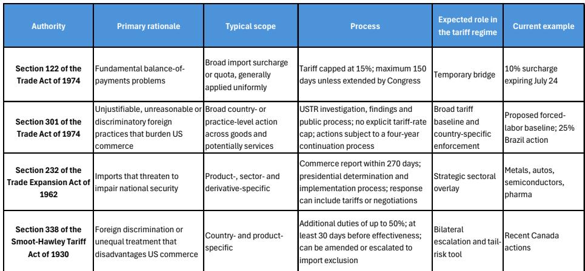
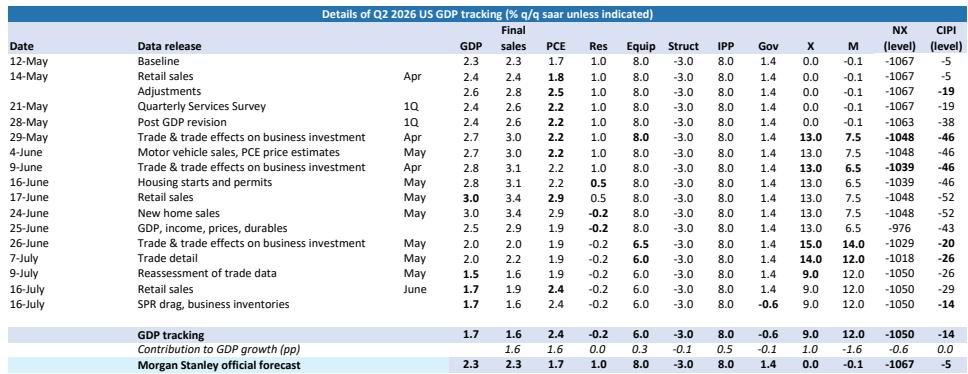
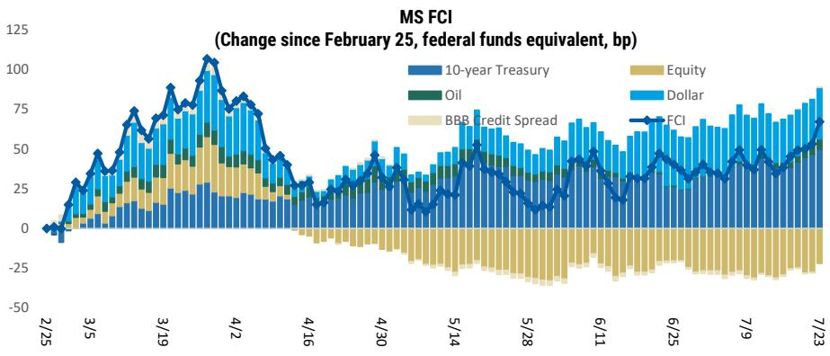

# MS：美国宏观环境周报-7月FOMC会议与耐心立场

7月FOMC会议前夕，MS发布最新美国宏观环境周报，核心判断是美联储将继续保持现有政策。报告认为，近期就业和通胀数据已为“耐心”立场提供了足够支撑，但油价反弹、中东局势变化以及新关税框架的落地，正在重塑利率和贸易政策的不确定性分布。

报告预计，联邦产品利率目标区间在7月会议将维持在3.50-3.75%，且这一水平可能延续至年底。6月非农就业仅增加5.7万人，前几个月数据也被下修，失业率稳定在4.2%。时薪同比增速降至3.5%，劳动力市场过热的担忧明显缓解。通胀方面，6月CPI环比下降0.4%，核心CPI持平。报告将这一结果归因于三个因素的同时作用：能源价格回落、关税传导效应结束以及住房通胀减弱。其中，核心商品价格自2月以来已不再反映关税传导，报告估算这意味着约60-70个基点的进一步价格变化空间。

> **KC评论：** 报告对“关税传导结束”的判断值得关注。如果企业已经完成价格调整，后续核心商品通胀的不确定性将显著下降。这与市场普遍关注的油价不确定性形成对照——通胀节奏变化的主要驱动力可能来自商品端，而非能源端。

报告同时列出了政策不确定性的四个来源：美联储可能认为双重使命的不确定性分布偏向紧缩；中东局势变化推高油价，通过第二轮效应抬升核心通胀；AI相关资本支出推高自然利率，使货币政策不再具有限制性；以及新任主席Warsh可能采取比预期更谨慎的反应函数。报告认为这些不确定性不可忽视，但基准情形仍是保持现有政策。

## 关税框架切换：从临时桥梁到规则化体系

7月24日，依据《1974年贸易法》第122条实施的10%临时附加关税到期。报告认为，这并非关税悬崖，而是一次制度性切换。新的关税框架将由第301条和第232条共同构成。美国贸易代表办公室已在强迫劳动相关调查中提出10-12.5%的关税建议，并完成了公开听证；商务部则有多项第232条调查正在进行，涵盖机器人、工业机械、医疗产品、风力涡轮机、无人机系统和多晶硅。

报告预计，到年底法定有效关税率将收敛至约10%。第301条将提供广泛的国别税率底线，第232条则针对战略性和资本密集型商品提供行业性叠加。与IEEPA/第122条框架相比，新框架需要调查、裁定和正式实施流程，但不受150天法定日落限制，因此法律和展期不确定性更低，但实施不确定性并未减少。

## 北美供应链面临新的不确定性

美国决定不在7月1日审议中续签USMCA，虽未改变协议效力，但将审查流程转为年度机制。更值得关注的是，美国依据《1930年斯穆特-霍利关税法》第338条，对加拿大近200亿美元商品加征50%关税，自8月19日起生效，且涵盖USMCA合规商品。报告估算，若该关税落地，将使整体关税率提高约0.2个百分点。虽然这一幅度不足以改变年底基线预测，但第338条作为一种快速、高税率、国别特定的工具，且无固定日落条款，显著扩大了北美供应链未来可能面临的不确定性范围。

## 资金条件收紧与石油库存不确定性

报告使用FRB/US模型构建的资金条件指数显示，自2月28日中东冲突升级以来，资金条件收紧幅度相当于联邦产品利率上调约67个基点。其中，美元走强和10年期美债回报表现上升是主要驱动因素。自6月FOMC会议以来，资金条件进一步收紧约50个基点，其中30个基点发生在过去一周。

石油方面，美国战略石油储备已降至约3.11亿桶，为1984年4月以来最低。报告指出，若按近期每月约3000万桶的消耗速度，库存将在2027年2月底接近约7000万桶的操作性最低水平。中东局势再度变化后，现货原油价格已明显回升，重新引发市场对通胀的担忧。

报告对关税收入的追踪显示，3至5月美国有效关税率平均为6.8%，低于年底预计的9-10%。关税退税规模也在上升，反映出进口商在关税政策频繁变动中面临的操作复杂性。报告认为，新框架下关税结构将更加规则化，但行业覆盖、豁免、双边协议、退税节奏和进口结构仍将导致实际征收率与法定税率之间存在差异。

For informational purposes only. Portions may be generated,translated,summarized,or edited with AI assistance based on source materials and may contain omissions or errors. Please verify independently. This is not investment,legal,tax,accounting,or other professional advice.

For informational purposes only. Portions may be generated,translated,summarized,or edited with AI assistance based on source materials and may contain omissions or errors. Please verify independently. This is not investment,legal,tax,accounting,or other professional advice.

