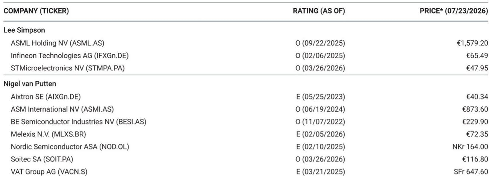

# MS：研究主题与行业变化观察

英特尔在2026年第二季度财报电话会议上宣布上调全年资本支出预期至超过200亿美元，这一数字显著高于年初市场预期。MS随即发布报告，分析了这一变化对欧洲半导体设备商ASML和ASMI的具体影响。报告的核心判断是：英特尔将增量资本支出的主要部分投向先进制程工具采购，ASML和ASMI将成为这一轮研究最直接的受益方。

英特尔在电话会议中明确表示，得益于前几年的研究，公司在空间和洁净室产能方面已处于有利位置，因此增量资本支出将主要流向工具设备。2026年设备支出预计较2025年增长40%，研究重点集中在Intel 3、18A和18A-P节点的前端工具，公司正在“积极锁定工具采购订单”。此外，英特尔已在上一季度加大对Intel 14A节点的研究，为2027年的不确定性降低和2028年的量产做准备。公司预计2027年资本支出将“显著高于2026年水平”，MS分析师Joe Moore给出的预测是300亿美元。

## 1. ASMI在英特尔先进节点中的可寻址市场显著扩大

MS估算，英特尔历来是ASMI超过10%的客户。根据该机构自2022年起的详细建模，英特尔曾占ASMI收入的18%，近期这一比例约为11%。报告特别指出，英特尔将研究重心转向18A和14A节点，对ASMI尤为有利。以14A节点与Intel 3节点对比，ASMI每千片晶圆产能的可寻址市场高出约40%，这一差距与台积电3nm与A14节点的关系类似。英特尔加大先进节点研究，意味着ASMI的单位产能设备价值量将明显提升。

> **KC评论：** 这里的关键不是英特尔增加了多少资本支出总额，而是支出结构的变化。英特尔将资金从厂房建设转向工具采购，且集中在14A等更先进的节点，直接拉高了ASMI每台设备的平均售价和可寻址市场。这是收入弹性最大的部分。

## 2. ASML的低NA EUV出货量预期面临上调不确定性

MS此前模型仅假设2026年向英特尔交付1台低NA EUV光刻机，2027年增至6台。但英特尔14A节点提前推进，使分析师认为2026年英特尔对低NA EUV的需求可能达到2至4台。尽管该机构未因此调整ASML的出货量预测——理由是这可能已接近ASML的交付能力上限——但更高的需求确认了ASML提价的能力。报告认为，随着出货量爬坡，ASML生产效率将提升，叠加定价改善，这支持公司近期利润率改善。

## 3. 设备研究节奏与节点路线图形成正向循环

英特尔此次上调资本支出并非孤立事件。从Intel 3到18A、18A-P再到14A，每一代节点的工具研究都在加速。英特尔在14A节点上已开始为2027年不确定性降低做准备，这意味着设备订单的确认周期比市场此前预期的更早。MS认为，这种“提前锁定采购订单”的策略，不仅为设备商提供了更长的交付窗口，也减少了需求波动的不确定性。对于ASML和ASMI而言，英特尔的研究节奏从“按年规划”转向“按节点锁定”，有助于收入可见度的提升。

这份报告提供了一个观察框架：当一家大型IDM将资本支出从基建转向工具，且集中在先进节点时，设备商的可寻址市场并非线性增长，而是因节点复杂度提升而呈现阶梯式扩张。读者需要关注的不仅是资本支出的相对数字，更是支出结构与节点路线图的匹配程度。

For informational purposes only. Portions may be generated,translated,summarized,or edited with AI assistance based on source materials and may contain omissions or errors. Please verify independently. This is not investment,legal,tax,accounting,or other professional advice.

