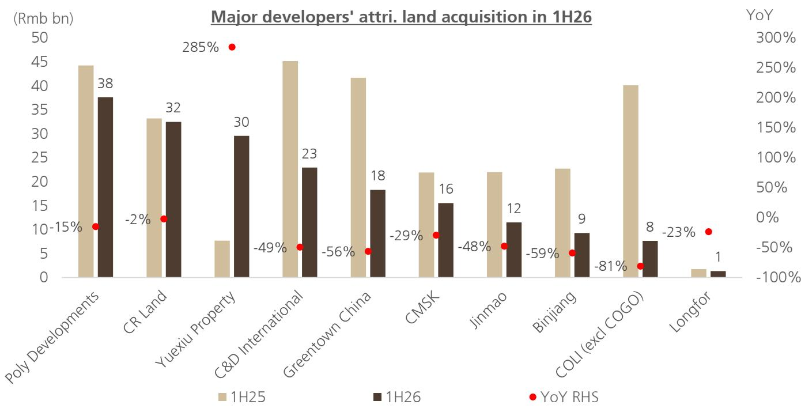

<table><tr><td>China</td></tr><tr><td>Real Estate</td></tr></table>

# China Property and Property Management 1H26 results preview: Look through the earnings

## Developers: booking decline and margin pressure

We estimate Chinese developers' 1H26 earnings to decline by 26% YoY due to a decline in revenue booking and margin pressure. Earnings divergence among developers remains, depending on 1) investment property portfolio, 2) disposal gains, and 3) impairment. Among developers, we expect the best performer is CR Land with 1H26 earnings flattish YoY supported by disposal gains, followed by C&D International (-8% YoY), COLI (-10% YoY), Seazen (-16% YoY). (See Figure 2 for details). We revise down C&D International, Longfor, Jinmao, Greentown China, Seazen and Yuexiu Property's 2026-2028E earnings on the back of this 1H26 earnings preview.

## Managers: Residential property management pressure remains

For CR Mixc, we expect +10% earnings growth in 1H26E, based on 8% same mall retail sales growth, and accelerated expansions of third-party mall management contracts, whilst we expect its property management business to remain largely stable. Excluding CR Mixc, we expect residential property managers under our coverage to decline by 1% YoY, vs 0%/-1% in 1H25/FY25, due to property management (PM) margin pressure, weaker cash collection, terminated GFA and slower value-added services (VAS) growth. We forecast Greentown Service to outperform at 13% YoY earnings growth, followed by Poly Property Services (+5%), Onewo (-5%), Country Garden Services (-8%), and COPH (-15%). We lower COPH 2026-2028E earnings by 23-31%.

## Our view on property developers and managers

We suggest investors look through 2026E earnings as they mainly reflect 2025 presales where property prices declined by 15% during the year. We remain positive on developers as early signs show improvement, eg 1) tier 1 cities' property prices have stabilized in 1H26 with declining listing, 2) tier 2 cities' property price YoY decline narrowed vs 2025, with slower listing growth, and 3) rental prices in tier 1 cities have stabilized. On residential property managers (excluding CR Mixc), we remain conservative due to declining industry completion and given that vacant property remains an issue for managers' cash collection and margin.

## Valuation and stock implications

COLI and CR Land remain our top picks among developers, and CR Mixc remains our preferred name among property managers, due to market share gain and dividend yield support (2026E dividend yield at 5.6%). We cut our PT of COPH by 29% to HK\$3.90, based on 9x 2027E PE. We also cut our PT of Greentown China by 13% to HK\$13.00, based on 7x normalized earnings; and cut our PT of Seazen by 30% to HK\$2.30, based on a 42% NAV discount.

Figure 1: PT and earnings estimates change

<table><tr><td rowspan="2">Company</td><td rowspan="2">Shr pr(LCY/shr)</td><td rowspan="2">Mkt cap(USD bn)</td><td colspan="3">Rating</td><td colspan="4">Price target(LCY/share)</td><td colspan="2">Earnings estimateNew vs Old</td><td colspan="2">P/BV</td><td colspan="2">PE</td><td colspan="2">Dividend Yield</td></tr><tr><td>New</td><td>Old</td><td>Chg</td><td>New</td><td>Old</td><td>Chg</td><td>% upside</td><td>2026E</td><td>2027E</td><td>2026E</td><td>2027E</td><td>2026E</td><td>2027E</td><td>2026E</td><td>2026E</td></tr><tr><td>COPH</td><td>3.6</td><td>1.5</td><td>Neutral</td><td>Neutral</td><td></td><td>3.90</td><td>5.50</td><td>-29%</td><td>9%</td><td>-23%</td><td>-29%</td><td>1.54</td><td>1.40</td><td>8.1</td><td>8.5</td><td>5.8%</td><td>6.0%</td></tr><tr><td>Greentown China</td><td>7.5</td><td>2.4</td><td>Buy</td><td>Buy</td><td></td><td>13.00</td><td>15.00</td><td>-13%</td><td>74%</td><td>-94%</td><td>-65%</td><td>0.46</td><td>0.46</td><td>241.0</td><td>17.2</td><td>0.0%</td><td>6.8%</td></tr><tr><td>Seazen</td><td>1.5</td><td>1.3</td><td>Buy</td><td>Buy</td><td></td><td>2.30</td><td>3.30</td><td>-30%</td><td>58%</td><td>-55%</td><td>-61%</td><td>0.19</td><td>0.19</td><td>17.6</td><td>16.2</td><td>0.0%</td><td>0.0%</td></tr><tr><td>C&amp;D International</td><td>15.0</td><td>4.3</td><td>Buy</td><td>Buy</td><td></td><td>21.00</td><td>21.00</td><td>0%</td><td>40%</td><td>-18%</td><td>-29%</td><td>0.97</td><td>0.97</td><td>10.1</td><td>9.6</td><td>5.9%</td><td>7.2%</td></tr><tr><td>Jinmao</td><td>1.4</td><td>2.4</td><td>Buy</td><td>Buy</td><td></td><td>2.30</td><td>2.30</td><td>0%</td><td>65%</td><td>0%</td><td>-43%</td><td>0.42</td><td>0.42</td><td>19.8</td><td>19.6</td><td>1.9%</td><td>3.4%</td></tr><tr><td>Longfor</td><td>6.8</td><td>6.1</td><td>Neutral</td><td>Neutral</td><td></td><td>10.20</td><td>10.20</td><td>0%</td><td>50%</td><td>0%</td><td>-248%</td><td>0.26</td><td>0.26</td><td>NA</td><td>NA</td><td>0.0%</td><td>0.7%</td></tr><tr><td>Yuexiu Property</td><td>3.7</td><td>1.9</td><td>Neutral</td><td>Neutral</td><td></td><td>4.40</td><td>4.40</td><td>0%</td><td>20%</td><td>-78%</td><td>-71%</td><td>0.23</td><td>0.23</td><td>74.6</td><td>43.6</td><td>2.5%</td><td>3.2%</td></tr><tr><td>Simple Average</td><td></td><td></td><td></td><td></td><td></td><td></td><td></td><td>-10%</td><td>45%</td><td>-38%</td><td>-78%</td><td>0.58</td><td>0.56</td><td>61.9</td><td>19.1</td><td>2.3%</td><td>3.9%</td></tr></table>

Source: company data, UBSe. Date as of 23 July 2026. NA is due to negative earnings estimates of Longfor in 2026-27E.

John Lam, CFA

Analyst

john-za.lam@ubs.com

+852-2971 6358

Vera Gong, CFA

Analyst

vera.gong@ubs.com

+852-2971 8950

Mark Leung

Analyst

mark.leung@ubs.com

+852-2971 8636

Ben Ho

Associate Analyst

ben.ho@ubs.com

+852-3712 2819

## Developers' 1H26 earnings preview

On average, we expect developers' 1H26 earnings to decrease 26% YoY, compared to an 18% decline in 1H25 and a 41% decline in FY2025. For developers' 1H26 earnings, we expect CRL to outperform with core profit stable YoY, as lower booking contribution and inventory impairment are largely offset by a one-off disposal gain from the mall spin-off in 1H26. For the remaining other developers we cover, we expect declining DP bookings and inventory impairment to continue weighing on earnings. We forecast earnings declines of 8% YoY for C&D International, followed by COLI (-9%), Seazen (-16%), Jinmao (-19%), Poly Developments (-47%), CMSK (-60%), Greentown China (-73%), Yuexiu Property (-93%) and Longfor (-96%).

Against this earnings pressure backdrop, developers remain cautious on land investment. In 1H26, ten major developers' land acquisitions declined by 18% YoY, on average (Figure 3). Developers' newly acquired saleable resources over contract sales ratio was 0.54x, on average (Figure 4). Looking ahead, we think land acquisition shrinkage may negatively impact developers' contract sales in 2H26.

Figure 2: Chinese developers' 1H26 earnings preview

<table><tr><td>Company</td><td colspan="2">Mkt cap</td><td colspan="2">Price</td><td colspan="2">Share performance</td><td colspan="3">1H26 earnings UBSe</td><td>Remarks on 1H26 earnings growth</td><td colspan="2">Earnings (YoY)</td></tr><tr><td></td><td>(US$ bn)</td><td>(LC)</td><td>Rating</td><td>PT</td><td>Past 1M</td><td>YTD</td><td>Revenue YoY</td><td>Earnings (Rmb mn)</td><td>YoY</td><td>(UBSe)</td><td>1H25A</td><td>2025A</td></tr><tr><td colspan="13">Developers</td></tr><tr><td>CR Land</td><td>30.8</td><td>33.84</td><td>Buy</td><td>45.00</td><td>11%</td><td>24%</td><td>-15%</td><td>9,963</td><td>0%</td><td>We expect CR Land&#x27;s DP revenue and margin to decline due to booking decline and inventory impairment. While, overall core profit is expected to be flat YoY, supported by disposal gain and IP segment growth</td><td>-7%</td><td>-11%</td></tr><tr><td>COLI</td><td>18.9</td><td>13.51</td><td>Buy</td><td>25.00</td><td>4%</td><td>10%</td><td>0%</td><td>7,946</td><td>-9%</td><td>We expect COLI core profit to decline 9% YoY due to DP margin decline, while DP booking is largely flat YoY</td><td>-17%</td><td>-17%</td></tr><tr><td>CMSK</td><td>9.4</td><td>7.05</td><td>Buy</td><td>12.00</td><td>1%</td><td>18%</td><td>0%</td><td>575</td><td>-60%</td><td>CMSK announced a profit warning of net profit decline of 55-65% YoY and EPS decline of 50-64% YoY</td><td>27%</td><td>-78%</td></tr><tr><td>Poly Developments</td><td>9.1</td><td>5.14</td><td>Neutral</td><td>6.60</td><td>4%</td><td>16%</td><td>-23%</td><td>1,448</td><td>-47%</td><td>We expect Poly earnings to decline 47% YoY, due to booking and margin decline</td><td>-63%</td><td>-79%</td></tr><tr><td>Longfor</td><td>6.1</td><td>6.79</td><td>Neutral</td><td>10.20</td><td>7%</td><td>21%</td><td>-23%</td><td>58</td><td>-96%</td><td>We expect Longfor earnings to decline 96% YoY due to continued deterioration of DP booking margin, and slow down of IP segment growth</td><td>-71%</td><td>-124%</td></tr><tr><td>C&amp;D International</td><td>4.3</td><td>14.96</td><td>Buy</td><td>21.00</td><td>17%</td><td>-4%</td><td>-42%</td><td>837</td><td>-8%</td><td>We expect C&amp;D earnings to decrease 8% YoY due to booking decline, which is partially offset by margin improvement and profit from JV assoc</td><td>12%</td><td>-25%</td></tr><tr><td>Jinmao</td><td>2.4</td><td>1.39</td><td>Buy</td><td>2.30</td><td>6%</td><td>15%</td><td>-7%</td><td>646</td><td>-19%</td><td>We expect Jinmao revenue to decrease 13% YoY, and earnings (excl. PCS interests) to decline 19% YoY due to margin decline</td><td>-26%</td><td>-28%</td></tr><tr><td>Greentown China</td><td>2.4</td><td>7.47</td><td>Buy</td><td>15.00</td><td>10%</td><td>12%</td><td>-23%</td><td>57</td><td>-73%</td><td>We expect Greentown earnings to decline 73% YoY due to booking decline and inventory impairment</td><td>-90%</td><td>-96%</td></tr><tr><td>Yuexiu Property</td><td>1.9</td><td>3.66</td><td>Neutral</td><td>4.40</td><td>2%</td><td>-8%</td><td>-20%</td><td>75</td><td>-93%</td><td>Yuexiu announced a profit warning of core profit decline of 90-95% YoY to Rmb50-100mn</td><td>-13%</td><td>-99%</td></tr><tr><td>Seazen</td><td>1.3</td><td>1.46</td><td>Buy</td><td>3.30</td><td>2%</td><td>29%</td><td>-29%</td><td>641</td><td>-16%</td><td>We expect Seazen core profit to fall 16% YoY, due to drag from DP and slower IP segment growth</td><td>-27%</td><td>-40%</td></tr><tr><td>Weighted average</td><td></td><td></td><td></td><td></td><td>7%</td><td>5%</td><td>-13%</td><td></td><td>-26%</td><td></td><td>-18%</td><td>-41%</td></tr></table>

Source: UBS estimates, company data. Note: Ranked by market cap. DP = development properties. IP = investment properties. Price is as of 23 July 2026. CMSK and Yuexiu's estimates are using their profit warning alert data.

Figure 3: Major developers' land acquisitions decreased by 18% YoY in 1H26, on average  
  
Source: Company data, UBS estimates. Note: Ranked by 1H26 land acquisition value. Yuexiu Property includes Horse Field land parcel.

Figure 4: As of 1H26, major developers' newly acquired saleable resources over contract sales ratio is 0.54, on average  
1H26 land acquisition vs contract sales, attributable basis (Rmb bn)  
  
Source: Company data, UBS estimates. Note: Ranked by land acquisition over sales ratio. Yuexiu Property includes Horse Field land parcel.

## Managers' 1H26 earnings preview

For 1H26 earnings, we expect property managers under our coverage to deliver weighted-average earnings growth of 4% YoY, slowing from 8% in 1H25 and 6% in FY25. The deceleration is primarily driven by declining property management (PM) margins, lower cash collection rates, as well as slower growth and margin compression in value-added services (VAS).

Among the major property managers, we expect Greentown Service to outperform, with earnings growth of 13% YoY, supported by double-digit PM revenue growth and a 0.5ppt improvement in PM margin. We expect CR Mixc's earnings to increase 10% YoY, driven by 15% YoY growth in commercial segment revenue and a 1ppt margin improvement, while earnings from its residential segment are expected to remain broadly flat YoY. Among the remaining residential managers, we forecast Poly Property Services to deliver 5% YoY earnings growth, broadly in line with company guidance, followed by Onewo (-5%), Country Garden Services (-8%), and China Overseas Property Holdings (COPH) (-15%).

Figure 5: Chinese property managers' 1H26 earnings preview

<table><tr><td rowspan="2">Company</td><td rowspan="2">Mkt cap (US$ bn)</td><td rowspan="2">Price (LC)</td><td rowspan="2">Rating</td><td colspan="2">Share performance</td><td colspan="3">1H26 earnings UBSe</td><td rowspan="2">Remarks on 1H26 earnings growth (UBSe)</td><td colspan="2">Earnings (YoY)</td></tr><tr><td>Past 1M</td><td>YTD</td><td>Revenue YoY</td><td>Earnings (Rmb mn)</td><td>YoY</td><td>1H25A</td><td>2025A</td></tr><tr><td colspan="12">Managers</td></tr><tr><td>CR Mixc</td><td>11.2</td><td>38.36</td><td>Buy</td><td>0%</td><td>-11%</td><td>6%</td><td>2,217</td><td>10%</td><td>We expect CR Mixc core profit to increase 10% YoY driven by 15% YoY commercial segment revenue growth and operating leverage improvement, whilst partially offset by flat residential segment</td><td>14%</td><td>13%</td></tr><tr><td>Onewo</td><td>2.6</td><td>17.46</td><td>Neutral</td><td>1%</td><td>-5%</td><td>4%</td><td>1,255</td><td>-5%</td><td>We expect Onewo revenue moderated to 4% YoY due to decline in VAS and AloT business, and core profit to decrease 5% dragged by PM margin decline. We expect company to cut dividends due to profit decline</td><td>11%</td><td>1%</td></tr><tr><td>CG Services</td><td>2.4</td><td>5.49</td><td>Sell</td><td>5%</td><td>-9%</td><td>8%</td><td>1,436</td><td>-8%</td><td>We expect CGS revenue to grow 8% YoY, whilst net profit to fall 8% due to margin decline</td><td>-31%</td><td>-17%</td></tr><tr><td>Poly Property Services</td><td>2.0</td><td>28.18</td><td>Neutral</td><td>4%</td><td>-12%</td><td>5%</td><td>935</td><td>5%</td><td>We expect Poly Property Services earnings to grow 5% YoY driven by double digit PM growth, while partially offset by margin decline, in line with previous guidance</td><td>5%</td><td>5%</td></tr><tr><td>Greentown Service</td><td>1.7</td><td>4.16</td><td>Buy</td><td>0%</td><td>-11%</td><td>7%</td><td>693</td><td>13%</td><td>We expect Greentown Service revenue to grow 7% YoY driven by double digit PM growth, and net profit to increase 13% due to margin and SG&amp;A improvement, in line with previous guidance</td><td>21%</td><td>12%</td></tr><tr><td>COPH</td><td>1.5</td><td>3.56</td><td>Neutral</td><td>3%</td><td>-21%</td><td>4%</td><td>652</td><td>-15%</td><td>We expect COPH earnings to decrease 15% YoY due to PM growth slowdown, VAS revenue decrease and margin decline</td><td>4%</td><td>-10%</td></tr><tr><td>Average</td><td></td><td></td><td></td><td>1%</td><td>-11%</td><td>6%</td><td></td><td>4%</td><td></td><td>8%</td><td>6%</td></tr></table>

Source: UBS estimates, company data. Note: Ranked by market cap. VAS=value-added services. PM= property management. Priced as of 23 July 2026.

## Price Target and Earnings Estimates Changes

C&D International: We cut our 2026-28E revenue forecasts by 12-18% on lower DP bookings. In addition, we increase our SG&A expense assumptions to reflect higher inventory impairment provisions, as we expect the company will continue to prioritize inventory destocking in 2026-27. Consequently, we cut 2026-28E earnings by 18-29%. Our estimates are now 15-18% below consensus.

Figure 6: Earnings estimates changes - C&D International

<table><tr><td></td><td colspan="4">New forecasts</td><td colspan="3">Old forecasts</td><td colspan="3">Consensus</td></tr><tr><td>(Rmb m)</td><td>2025A</td><td>2026E</td><td>2027E</td><td>2028E</td><td>2026E</td><td>2027E</td><td>2028E</td><td>2026F</td><td>2027F</td><td>2028F</td></tr><tr><td>Contract sales</td><td>91,575</td><td>91,575</td><td>91,575</td><td>91,575</td><td>91,575</td><td>91,575</td><td>91,575</td><td></td><td></td><td></td></tr><tr><td>Revenue</td><td>136,789</td><td>105,305</td><td>102,852</td><td>97,718</td><td>127,853</td><td>117,416</td><td>111,402</td><td>118,722</td><td>113,696</td><td>115,510</td></tr><tr><td>Gross profit</td><td>19,006</td><td>14,743</td><td>15,428</td><td>16,123</td><td>17,765</td><td>18,076</td><td>18,821</td><td>16,739</td><td>16,965</td><td>17,780</td></tr><tr><td>GPM (%)</td><td>13.9%</td><td>14.0%</td><td>15.0%</td><td>16.5%</td><td>13.9%</td><td>15.4%</td><td>16.9%</td><td>14.1%</td><td>14.9%</td><td>15.4%</td></tr><tr><td>Net profit (excl. PCS)</td><td>3,183</td><td>2,928</td><td>3,227</td><td>3,790</td><td>3,566</td><td>4,520</td><td>4,802</td><td>3,483</td><td>3,955</td><td>4,441</td></tr><tr><td>DPS (HK$)</td><td>0.90</td><td>0.73</td><td>0.77</td><td>0.86</td><td>0.89</td><td>1.07</td><td>1.09</td><td>0.81</td><td>0.90</td><td>0.99</td></tr><tr><td>Payout ratio (%)</td><td>57%</td><td>57%</td><td>57%</td><td>57%</td><td>57%</td><td>57%</td><td>57%</td><td>51%</td><td>51%</td><td>52%</td></tr><tr><td>Revenue YoY</td><td>-4%</td><td>-23%</td><td>-2%</td><td>-5%</td><td>-7%</td><td>-8%</td><td>-5%</td><td>-13%</td><td>-4%</td><td>2%</td></tr><tr><td>Gross profit YoY</td><td>0%</td><td>-22%</td><td>5%</td><td>5%</td><td>-7%</td><td>2%</td><td>4%</td><td>-12%</td><td>1%</td><td>5%</td></tr><tr><td>Net profit (excl. PCS) YoY</td><td>-25%</td><td>-8%</td><td>10%</td><td>17%</td><td>12%</td><td>27%</td><td>6%</td><td>9%</td><td>14%</td><td>12%</td></tr><tr><td>vs</td><td colspan="4">New vs Old</td><td colspan="6">New vs Consensus</td></tr><tr><td>Revenue</td><td>-17.6%</td><td>-12.4%</td><td>-12.3%</td><td>-11.3%</td><td>-9.5%</td><td>-15.4%</td><td></td><td></td><td></td><td></td></tr><tr><td>Gross profit</td><td>-17.0%</td><td>-14.6%</td><td>-14.3%</td><td>-11.9%</td><td>-9.1%</td><td>-9.3%</td><td></td><td></td><td></td><td></td></tr><tr><td>Net profit (excl. PCS)</td><td>-17.9%</td><td>-28.6%</td><td>-21.1%</td><td>-15.9%</td><td>-18.4%</td><td>-14.7%</td><td></td><td></td><td></td><td></td></tr><tr><td>DPS (HK$)</td><td>-17.9%</td><td>-28.6%</td><td>-21.1%</td><td>-9.9%</td><td>-14.9%</td><td>-13.5%</td><td></td><td></td><td></td><td></td></tr></table>

Source: company data, UBS estimates, Visible Alpha.

China Overseas Property Holdings (COPH): Given the weaker outlook for the residential PM business, we reduce our 2026-28E revenue forecasts by 0-4% and roll forward our model to incorporate 2025 actual results. We also cut our 2026-28E gross margin assumptions by 2.7-3.2ppt, reflecting 1) lower PM margins on weaker cash collection, and 2) VAS margin compression amid softer consumption and service demand. As a result, we lower our 2026E/27E/28E earnings forecasts by 23%/29%/31%, respectively. Our revised estimates are now 12-23% below consensus. Accordingly, we cut our price target by 29% to HK\$3.90 (from HK\$5.50), broadly in line with our earnings revisions. Our new price target is based on an unchanged target PE multiple of 9x 2027E earnings.

Figure 7: Earnings estimates changes - COPH

<table><tr><td></td><td colspan="4">New</td><td colspan="3">Old</td><td colspan="3">New vs old</td></tr><tr><td>Rmb mn</td><td>2025A</td><td>2026E</td><td>2027E</td><td>2028E</td><td>2026E</td><td>2027E</td><td>2028E</td><td>2026E</td><td>2027E</td><td>2028E</td></tr><tr><td>GFA under mgmt (mn sqm)</td><td>478</td><td>500</td><td>523</td><td>547</td><td>478</td><td>501</td><td>524</td><td>4%</td><td>4%</td><td>5%</td></tr><tr><td>Total turnover</td><td>14,960</td><td>15,001</td><td>15,069</td><td>15,650</td><td>14,966</td><td>15,577</td><td>16,247</td><td>0%</td><td>-3%</td><td>-4%</td></tr><tr><td>Total turnover YoY</td><td>6%</td><td>0%</td><td>0%</td><td>4%</td><td>4%</td><td>4%</td><td>4%</td><td></td><td></td><td></td></tr><tr><td>Gross profit</td><td>2,247</td><td>2,006</td><td>1,919</td><td>1,967</td><td>2,403</td><td>2,479</td><td>2,570</td><td>-17%</td><td>-23%</td><td>-23%</td></tr><tr><td>Gross profit YoY</td><td>-4%</td><td>-11%</td><td>-4%</td><td>3%</td><td>2%</td><td>3%</td><td>4%</td><td></td><td></td><td></td></tr><tr><td>GPM</td><td>15.0%</td><td>13.4%</td><td>12.7%</td><td>12.6%</td><td>16.1%</td><td>15.9%</td><td>15.8%</td><td>-2.7ppt</td><td>-3.2ppt</td><td>-3.2ppt</td></tr><tr><td>Property management</td><td>14.3%</td><td>12.8%</td><td>12.3%</td><td>12.2%</td><td>15.8%</td><td>15.6%</td><td>15.5%</td><td>-3.0ppt</td><td>-3.4ppt</td><td>-3.4ppt</td></tr><tr><td>Value-added services</td><td>17.5%</td><td>15.5%</td><td>14.5%</td><td>14.2%</td><td>17.3%</td><td>17.1%</td><td>17.1%</td><td>-1.7ppt</td><td>-2.6ppt</td><td>-2.8ppt</td></tr><tr><td>Car parking spaces trading</td><td>24.3%</td><td>22.3%</td><td>20.3%</td><td>20.3%</td><td>20.5%</td><td>20.5%</td><td>20.5%</td><td>1.8ppt</td><td>-0.2ppt</td><td>-0.2ppt</td></tr><tr
