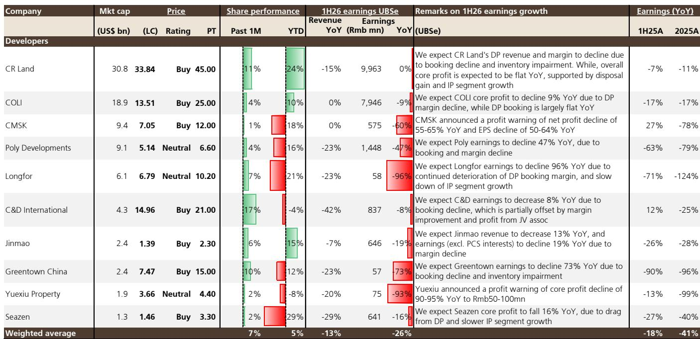
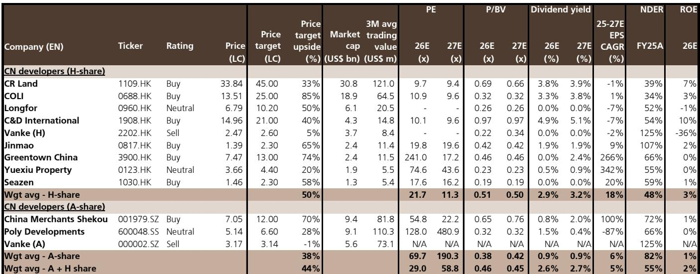
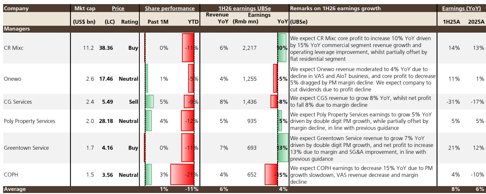

# 中国房地产企业盈利变化：回顾过去，展望稳定

从表面数据看，数字确实引人关注。受覆盖的中国开发商预计2026年上半年加权平均盈利同比下降26%，较2025年上半年18%的降幅有所扩大。对于不包括华润万象生活的住宅物业管理公司，预计盈利同比下降1%，较上一期的持平表现有所下滑。然而，这些反映过去的数据——主要体现了2025年预售（当年房价下降15%）带来的收入和利润影响——并非当前配置方向的恰当参考。当前，对精选开发商的关注点不应放在已报告的盈利上，而应放在一二线城市出现的早期稳定信号上，这些城市的挂牌量正在减少，价格跌幅正在收窄。对于住宅物业管理公司而言，来自竣工量下降和空置物业的不利因素是结构性的，而非周期性的，需要持续保持谨慎。

这两个板块之间的分化是2026年下半年的核心战略观察点。拥有投资物业组合、处置收益选择权以及审慎土地收购的开发商，有望从盈利数据尚未反映的需求复苏中受益。相比之下，住宅物业管理公司面临经营环境持续变化，短期内需求回升难以迅速扭转。市场已对这一分化进行定价：华润置地2026年预期股息回报表现……了解这些机制背后的逻辑，对于当前任何机构配置中国房地产而言都至关重要。

## 开发商盈利分化并非随机——直接映射到资产组合构成与处置灵活性

26%的加权平均盈利下降背后隐藏着巨大的分化，这揭示了一个清晰的战略图景。华润置地预计2026年上半年盈利同比持平，得益于其商场分拆带来的一次性处置收益，抵消了开发物业入账减少和存货减值的影响。中国海外发展（COLI）作为表现第二好的公司，预计仅下降9%，开发物业入账基本同比持平，尽管利润率有所压缩。而在另一端，龙湖集团预计盈利下降96%，越秀地产下降93%，绿城中国下降73%。这种模式并非随意。表现较好的公司有两个共同特征：拥有可产生经常性收入的可观投资物业组合，以及有能力产生处置收益或合营企业利润，以缓冲开发物业的疲软。华润置地的商场组合和中国海外发展的审慎资产负债表是结构性优势，而非一次性因素。龙湖集团尽管在投资物业方面拥有强大的历史品牌，但其商业板块增长放缓，同时开发物业利润率也在恶化——这种双重压力在此次盈利预览之前市场尚未完全定价。

含义很明确。读者应将此次盈利预览视为对哪些商业模式在调整期具有真正盈利韧性的确认，而非对未来回报的预测。华润置地和中国海外发展已证明，多元化的收入基础和稳健的资产负债表能够吸收开发物业每年15%的价格下跌。缺乏这些缓冲的开发商——无论过去的增长率或市场份额如何——都可能面临持续的盈利不及预期，因为存货减值准备将继续增加。

## 土地收购收缩为下半年带来自我强化的销售约束

2026年上半年，十大开发商土地收购量同比下降18%，新收购可售资源与合同销售额的比率平均降至0.54倍。这不仅仅是防御姿态；这是一个将限制未来收入的战略选择。当开发商每销售一单位货币仅收购不到一单位货币的可售资源时，他们实际上是在缩减未来的项目储备。0.54倍的比率意味着，每100港元的合同销售额中，开发商仅补充了54港元的未来可售库存。随着时间的推移，即使需求稳定，这也将机械地减少2026年下半年及以后的合同销售量。

这为读者创造了一个反直觉的动态。今天保护资产负债表的极度保守——削减土地购买、优先去库存、囤积现金——将在明天抑制收入增长。今天在土地收购方面最为积极的开发商，只要在定价和位置上保持纪律，可能会以更强的市场地位脱颖而出。数据显示出显著的分化：华润置地和中国海外发展保持了相对较高的收购与销售比率，而龙湖集团和越秀地产等则大幅回撤。下一周期的赢家将是那些利用当前低谷来获取份额的公司，而不仅仅是那些勉强生存的公司。

## 住宅物业管理公司面临需求复苏无法解决的结构性挑战

不包括华润万象生活，受覆盖的住宅物业管理公司预计2026年上半年盈利同比下降1%，而2025年上半年为0%，2025财年为-1%。这种恶化由三个叠加因素驱动：物业管理利润率压缩、现金收款率减弱，以及增值服务增长放缓且利润率压缩。但最重要的结构性问题在于行业竣工率下降。竣工单位减少意味着新的管理合同减少，而现有的空置物业库存——已售出但未入住的单位——造成了持续的现金收款问题。物业管理公司无法从空置单位收取服务费，且在不违反合同义务的情况下，难以轻易降低服务水平以匹配较低的收入。

该板块内部的分化具有启发性。绿城服务预计实现13%的盈利增长，得益于两位数的物业管理收入增长和0.5个百分点的利润率改善。华润万象生活因其商业聚焦而被单独分类，预计在15%的商业收入增长和运营杠杆作用下增长10%。但纯粹的住宅物业管理公司——万物云下降5%，碧桂园服务下降8%，中海物业下降15%——均在下滑。共同点是住宅物业管理作为主要盈利驱动因素，通过定价或效率提升来抵消数量下降的能力有限。

对于读者而言，结论是住宅物业管理作为一个板块，在中国已不再是结构性增长故事。它是一个在收缩行业中的现金流管理业务。相对少见的例外是拥有显著商业敞口的公司，如华润万象生活，或具有独特运营优势的公司，如绿城服务的利润率改善故事。其余公司则面临多年盈利下滑，中海物业2026-2028年盈利预测下调23-31%的情况很可能在整个板块重演。

## 当前周期下开发商与物业管理公司配置的决策框架

合适的配置框架并非在开发商和物业管理公司之间进行二元选择，而是基于盈利驱动因素和周期定位的三方区分。第一类是拥有投资物业组合和处置收益选择权的开发商。以华润置地和中国海外发展为首的这些公司，提供了周期性复苏敞口和结构性盈利缓冲的组合。其开发物业盈利在2026年仍将面临压力，但投资物业收入提供了底线，处置收益则提供了上行选择权。第二类是商业聚焦的物业管理公司，如华润万象生活，受益于同店零售额增长8%以及第三方管理合同加速扩张。其盈利与消费相关，而非建设，且不受影响住宅物业管理公司的结构性挑战。第三类是住宅物业管理公司，应被视为困境中的现金流博弈，而非增长型投资。盈利在下降，现金收款在恶化，竣工项目储备在缩减。对此板块的任何配置都应相应调整规模，重点关注那些拥有净现金头寸且能够在盈利压力下维持或增加股息的公司。

市场已在验证这一框架。华润置地和中国海外发展仍是首选开发商，2026年预期股息回报表现5.6%提供了底线。华润万象生活是首选的物业管理公司，受益于商业物业管理市场份额增长以及同样具有吸引力的回报表现。中海物业……基于7倍正常化盈利，目标价下调至13.00港元。这一调整并非关于暂时性失误；它反映了在竣工量降低、利润率降低的环境下对盈利能力的结构性重新评估。

## 一二线城市的早期周期信号是相对少见值得透过2026年盈利展望的理由

此次盈利预览本质上是回顾性的。2026年上半年的业绩主要反映了2025年的预售情况，当时房价下跌了15%。但三个早期周期信号表明，开发商的低谷可能已经过去。首先，2026年上半年一线城市房价已趋稳，得益于挂牌量减少，卖家退出疲软市场。其次，二线城市价格跌幅较2025年同比收窄，挂牌增长放缓。第三，一线城市租金价格已趋稳，这支撑了对华润置地和中国海外发展等开发商至关重要的投资物业板块。

这些信号尚不足以断言全面复苏，但足以证明应透过当前盈利来看待。关键风险在于土地收购收缩将抑制2026年下半年的销售量，从而抑制复苏。但对于持有12至18个月投资期限的读者而言，方向比水平更重要。拥有投资物业缓冲、强劲资产负债表和审慎土地收购的开发商，有望受益于盈利数据尚未反映的稳定。相比之下，住宅物业管理公司面临的结构性挑战独立于需求周期。这种区分并非细微，对投资组合的影响是明确的。

*仅供参考。部分内容可能基于源材料通过AI辅助生成、翻译、总结或编辑，可能存在遗漏或错误。请独立核实。本文不构成投资、法律、税务、会计或其他专业建议。*

仅供参考。部分内容可能基于源材料通过AI辅助生成、翻译、总结或编辑，可能存在遗漏或错误。请独立核实。本文不构成投资、法律、税务、会计或其他专业建议。

