# 每周观察：燃气轮机/发动机——产能建设与市场需求

我们更新了燃气轮机供应模型，预计2030年供应量从之前的135GW调整为146GW。其中约44%面向表后市场，该领域产能过剩风险最为突出。2030年后关于ENR EBITA增长的讨论将持续，但年底前存在催化剂路径。

## 核心要点

在GEV最新产能扩张后，燃气轮机供应重新成为关注焦点。我们也看到新进入者如FTAI通过订单获得市场验证。

我们将燃气轮机/电力解决方案供应模型更新为2030年146GW（此前为135GW）。更新内容涵盖GEV、ERock和Cummins。

我们将此分为：1）中大型涡轮机；2）表后市场（小型涡轮机、往复式发动机、燃料电池）。我们认为表后市场产能过剩风险较高，2030年供应量达64GW。

■ ENR的产能预留少于GEV，因此ENR再次扩产的可能性较低。行业价格趋势也指向2030年燃气轮机利润率的提升。

西门子能源：我们维持积极看法，基于1）第三季度燃气轮机订单的上行风险，2）新目标对2030年预估的上行压力，3）估值合理。

图表1：我们将2030年电力解决方案（燃气轮机/主电源）单循环产能预估上调至146GW（此前为135GW）。下图展示了这146GW的新分类，包括中大型公用事业级涡轮机、小型涡轮机、往复式发动机和燃料电池。我们认为至少有约64GW的产能面向"表后"数据中心市场（小型燃气轮机、往复式发动机和燃料电池）。这是我们看到供应过剩风险最大的领域。

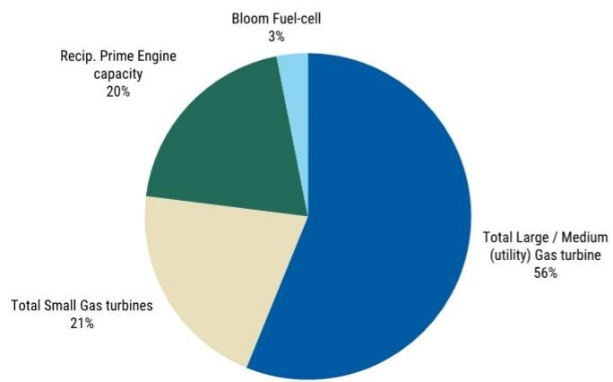  
来源：MS – 燃气轮机和电力解决方案供应模型

<table><tr><td colspan="2">Max R Yates</td></tr><tr><td colspan="2">股票分析师</td></tr><tr><td>Max.Yates@morganstanley.com</td><td>+44 20 7425-1917</td></tr><tr><td colspan="2">Sara Chemello</td></tr><tr><td colspan="2">研究助理</td></tr><tr><td>Sara.Chemello@morganstanley.com</td><td>+44 20 7425-2931</td></tr><tr><td colspan="2">Harry Stephenson</td></tr><tr><td colspan="2">研究助理</td></tr><tr><td>Harry.Stephenson@morganstanley.com</td><td>+44 20 7425-0859</td></tr><tr><td colspan="2">Sam Crean</td></tr><tr><td colspan="2">研究助理</td></tr><tr><td>Sam.Crean@morganstanley.com</td><td>+44 20 7677-1983</td></tr></table>

## 工业品

欧洲
行业观点：中性

MS与报告中涉及的公司有业务往来。因此，读者应注意，该公司可能存在影响MS客观性的利益冲突。读者应将MS视为其决策的参考因素之一。

分析师认证及其他重要披露信息，请参阅本报告末尾的披露部分。

+= 非美国关联公司雇用的分析师未在FINRA注册，可能不是会员的关联人士，且可能不受FINRA关于与主题公司沟通、公开露面以及研究分析师账户持有证券交易的限制。

背景：自6月初我们发布关于电力解决方案供需的初步观点以来，我们收到了大量读者对此话题的反馈。最近，本周GEV（由David Arcaro覆盖）在其2Q26业绩中宣布进一步增加25%的大型燃气轮机产能，尽管部分产能将用于服务其未来十年的装机基础。这也源于GEV 2Q26电力订单价值弹性较高以上，且公司燃气轮机客户的承诺（图表7）已延伸至2031年。此次产能扩张被视为对西门子能源的负面消息，并引发其是否会在今年晚些时候也做出产能回应的疑问（我们在另一份报告中讨论过）。简单来说，GEV年底客户承诺125GW，是其未来30GW产能的约4倍。ENR年底客户承诺90-100GW（联合循环），是其现有2030年产能计划的约3倍。我们认为，基于西门子能源的可见度，他们在FY26业绩时不太可能像GEV那样进行新一轮产能扩张。

西门子能源：新阶段还是旧周期。我们认为市场对"2026年订单峰值"这一关键讨论存在误解。我们此前曾指出，西门子能源可能经历一个"消化期"，市场关注点从"订单超预期"转向潜在的利润率上行和每股收益增长。这一情况已经发生，但并非我们近期报告的重点，我们也不认为这是该股票的主要讨论点。相反，我们更关注燃气和电网领域供需紧张状况的缓解，首先是表后解决方案的交货时间缩短，随后是中大型涡轮机。随着时间的推移，这可能对2030年代的EBIT利润率产生影响，在此之前，很可能引发关于评估这些股票时应采用何种终端利润率的讨论。

作为参考，西门子能源燃气轮机新设备和电网技术业务的2030年EBITA利润率预计将达到约25%的较高水平，而此前这些部门的周期性峰值约为15%。我们强调的主要风险是，2030年至2035年间集团EBITA增长可能受到燃气新设备和电网利润率调整的制约，从而抵消燃气服务后市场的持续EBITA增长。需要明确的是，我们讨论的不是利润率崩溃。而是考虑一种情景，即到2035年燃气OE和电网EBIT利润率约为20%（仍高于此前峰值水平），这足以使西门子能源集团EBITA在2030年至2035年间增长非常有限。我们认为，这才是对西门子能源2030年估值倍数构成压力的因素，而非关于2026年"订单峰值"的讨论。虽然如此远期的预测本身具有不确定性，但我们经常对市场在历史上高度周期性的行业中，对10年后的EBITA预估所表现出的确信程度感到惊讶。

更新2030年燃气轮机和电力解决方案产能模型：2030年供应量现为146GW（此前为135GW）。我们在图表2中更新了电力解决方案模型，主要新增内容包括1）GEV的6GW产能增加，2）加入ERock，3）在Cummins签署供应协议后增加1GW。在此次模型迭代中，我们将电力解决方案分组，如图表1所示。实际上，我们认为中大型涡轮机更适合公用事业级应用，到2030年该领域供应量为82GW。我们将其与燃气轮机的长期市场需求进行对比，如图表3所示。虽然我们可能处于电力需求增长的新范式，但回顾过去25年的燃气轮机订单历史，这一供应水平将高于过去25年中除2000、2001、2007、2025和2026年以外的所有年份的订单水平。对于中大型涡轮机，供需存在变数，包括有多少数据中心使用过渡电源转向大型燃气轮机。GEV在其2Q26电话会议中提到了这一趋势。底线：我们认为，虽然供应在增加，但中大型燃气轮机市场是否供应过剩尚不明确。

## 小型涡轮机、往复式发动机和燃料电池的总供应量为64GW，均面向"美国表后数据中心"市场

这是我们持续看到产能过剩风险较高的领域，因此我们维持对Wartsila的谨慎看法（参见我们的报告）。我们继续认为，这一设备供应水平与美国数据中心建设量不匹配。如果到2030年美国每年新增50GW数据中心，其中约15GW接入电网，则剩余35GW为表后需求。会存在一定冗余，但部分需求也将由比特币矿工满足。我们难以将最终新增量与产能进行匹配，除非数据中心年新增量持续增长至2030年代后期。或者，2030年的新增量需要远高于50GW，我们认为这不太可能，考虑到许可、劳动力以及建设成本等方面的限制。

我们经常被问及为何在这个周期阶段仍在增加产能。我们看到各公司在产能方面有两种策略。对于像GEV这样的大型涡轮机制造商，决策由客户承诺的广泛可见性驱动，同时也基于数据中心电力需求最终将由大型燃气轮机满足的信念（无论是替代过渡解决方案——如发动机——还是数据中心接入电网后）。对于某些替代解决方案提供商（如往复式发动机），我们认为这些扩张的资本支出需求相对较低，因此这些投资的回报具有吸引力。我们继续认为，对于发动机制造商而言，即使机会不会永久持续，这些产能扩张的经济性也是合理的。

本周我们还看到了燃气轮机定价（GEV）和积压订单利润率（Wartsila）的重要进展。我们在图表4中展示了GE Vernova新电力订单的定价，该数据随2Q26业绩披露。本季度受到产品组合的有利影响（航空衍生涡轮机占比高），但总体而言，GEV的评论指出2026年新订单总定价同比增长46%（且是2024年水平的两倍以上）。我们在图表5中显示，GEV报告的数据与我们嵌入西门子能源预测中的差距正在扩大。2025年，西门子能源的订单价格按每千瓦计算比GEV低24%，我们的预测显示这一差距在2026年将扩大至27%。底线：尽管我们对长期利润率存在一些担忧，但目前看来，随着更高价格的产能预留转化为订单，订单价格仍在上涨。对西门子能源的主要影响是，燃气服务利润率将在2030年升至高于我们（25%）或市场共识（24.2%）预测的水平。我们将在11月11日西门子能源发布新的2030年目标以及积压订单利润率年度披露时，关注这一点的相关信息。对于Wartsila，该公司披露其能源新设备积压订单利润率自2025年初以来已提高500个基点。然而，这并未改变我们对Wartsila 2028年盈利能力的看法，我们仍然认为与西门子能源等燃气轮机同行相比，Wartsila的空间较小。

新进入者继续获得市场对其解决方案的验证（FTAI）。如果你建设，他们就会来。本周我们在FTAI（由Kristine Liwag覆盖）身上看到了这一点，该公司获得了14.8亿美元的电力订单（详见我们北美团队的解读）。我们此前也在报告中讨论过Cummins和Hyundai进入表后市场对Wartsila构成的风险。本质上，我们仍然看到那些交货时间更短的设备供应商在赢得新订单解决方案方面具有优势，即使它们在主电源领域的业绩记录较少。关于不同规模和类型解决方案对数据中心的成本竞争力存在持续讨论，最新的平准化电力成本更新来自Bloomberg New Energy Finance（图表8）。然而，我们仍然认为交货时间是行业决策的关键驱动因素，在此方面，我们看到一些表后解决方案提供商，如CAT和Cummins（均由Angel Castillo覆盖），具有优势。

西门子能源的估值。我们继续认为估值合理，年底前的近期关注点将围绕：1）鉴于GEV的业绩，西门子能源在3Q26财年业绩中燃气服务订单可能超预期（ENR于8月4日公布）；2）中期利润率潜力；3）新订单的强劲定价评论。基于此，我们认为当前12.4倍2028年EV/EBITA的估值，较GEV折价50%，是合理的。此外，我们预计市场共识预估将继续上调，受持续强劲的定价（燃气服务收入）和可能的新集团利润率区间19-21%的推动。

图表2：我们更新了燃气轮机和电力解决方案（主电源）供应模型。我们将2030年预估供应量上调至146GW（此前为135GW）。上调的主要驱动因素是1）GE Vernova产能增加，2）ERock加入发动机类别，3）Cummins在获得订单后增加1GW产能。在图表1中，我们展示了146GW在中大型（公用事业级涡轮机）和更适合表后主电源的解决方案（小型涡轮机、往复式发动机和燃料电池）之间的分类。

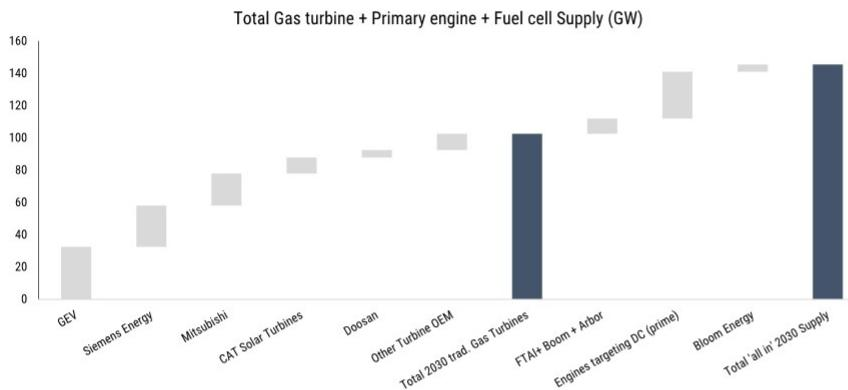  
来源：MS – 燃气轮机和电力解决方案供应模型

图表3：燃气轮机订单（需求）的长期历史——1980-2026年平均每年42GW。与此相比，我们认为"中大型"公用事业级燃气轮机产能正在增加至约82GW。虽然我们处于新的电力增长范式，且我们看到"煤/油转气"的趋势，但该市场是否会在未来十年持续供应不足尚不明确。

  
来源：McCoy

图表4：GEV燃气轮机订单定价（美元/千瓦）。GEV在2Q26的新订单定价非常强劲（受产品组合影响），但总体而言，管理层评论暗示2026年新订单定价将比2025年同比增长46%。GEV 2026年新订单的平均每千瓦价格也将比2024年高出100%以上。

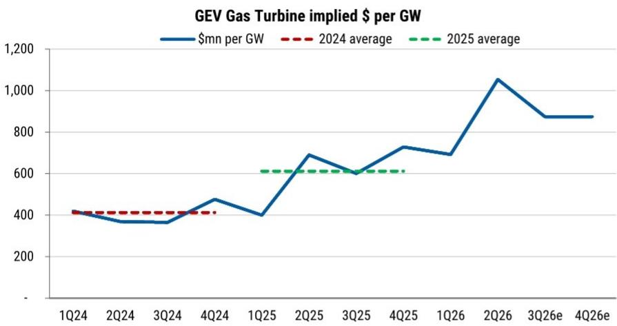  
来源：公司数据

图表5：西门子能源2025年和2026年订单定价与GEV对比。我们估计2025年ENR新订单定价按每千瓦计算比GEV低22%。我们的预测（和市场共识）可能对2026年新订单的价格贡献过于保守。GEV的定价将同比增长43%，而我们仅嵌入西门子能源新订单34%的价格增长。  
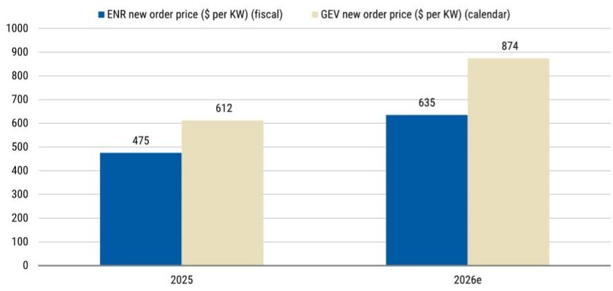  
来源：公司数据，MS预估

图表6：ENR vs GEV vs Wartsila燃气服务利润率。GEV EBITDA利润率持续环比上升。我们注意到ENR的利润率受2H26季节性因素影响。基于积压订单利润率提升，我们认为西门子能源2030年燃气服务EBIT利润率可能落在25%-30%区间。

GEV vs. ENR - 燃气总承诺量（GW）  
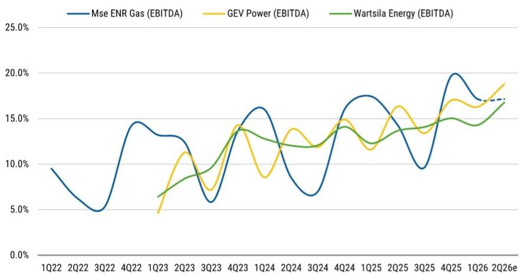  
来源：公司数据，MS

图表7：GEV和ENR"客户承诺"（积压订单加产能预留）。GEV当前产能为20GW，到2030年将增至30GW。他们预计2026年底客户承诺为125GW（即未来产能30GW的4倍）。西门子能源相对于产能的客户承诺较低，但确定订单（积压订单）占比更高。西门子能源预计2026年底"客户承诺"为90-100GW，而未来（联合循环）产能为30GW（即约3倍未来产能）。

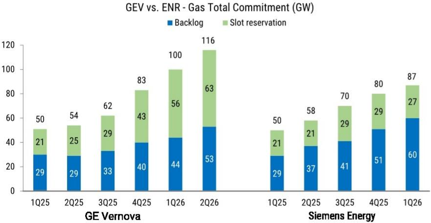  
来源：公司数据

图表8：为500MW数据中心供电的燃气发电厂平准化电力成本。Wartsila展示了一张Bloomberg New Energy Finance的图表，显示对于500MW数据中心，发动机现在"略微"比涡轮机更具成本竞争力。也就是说，他们也承认其他解决方案（如燃料电池）仍在赢得订单，因为客户的优先事项仍然是通电时间和不同解决方案的相对交货时间。Wartsila现已预订至2029年，我们认为这将导致未来12个月能源订单减少，因为其一些竞争对手正在快速增加产能。

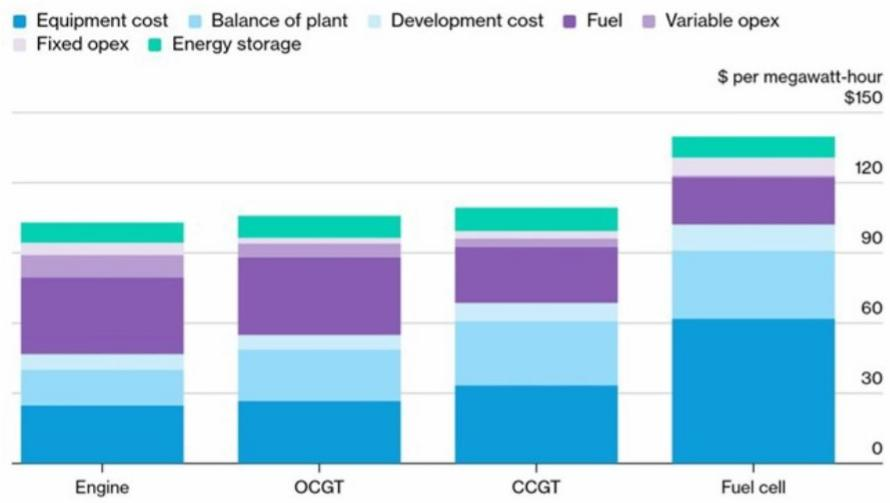  
来源：Bloomberg New Energy Finance

图表9：2028年EV/EBITDA。ENR再次以较GEV约50%的显著折价交易。  
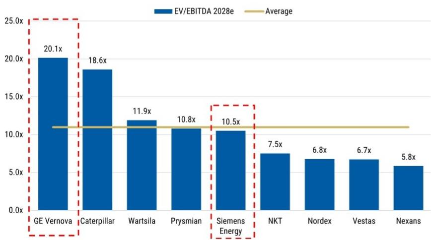  
来源：Visible Alpha，MS

图表10：MS 2026年关键股票观点。  
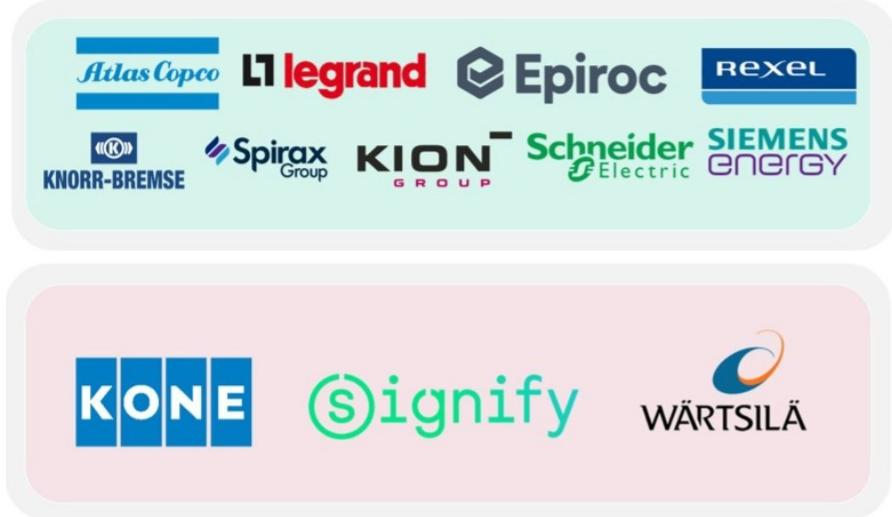  
来源：MS

图表11：工业品估值 vs 10年平均水平（图表左侧的股票更"贵"，其EV/EBIT相对于10年平均水平的溢价更高）。ABB似乎受到"到达即完成"效应的影响，我们认为Prysmian也面临此风险。我们认为Knorr Bremse、Kion和Spirax的估值风险回报偏正面。

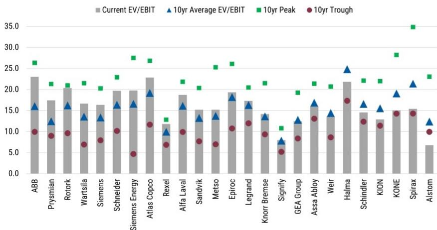  
来源：Refinitiv，MS。数据截至2026年7月22日收盘。

## 仪表盘

图表12：工业品：2026年年初至今表现  
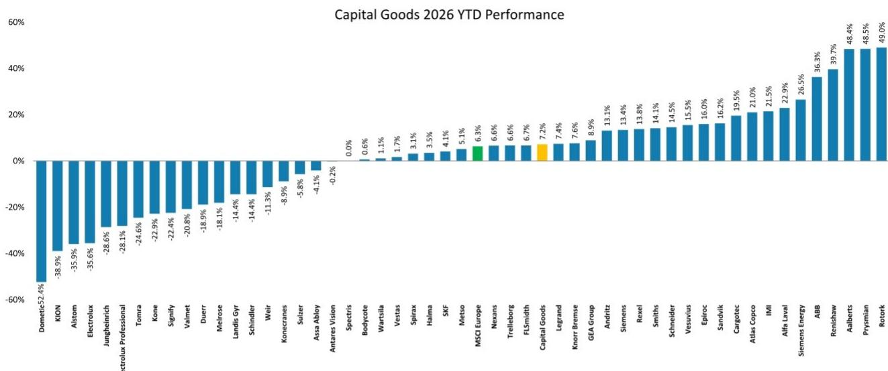  
来源：Datastream，MS

图表13：行业表现  
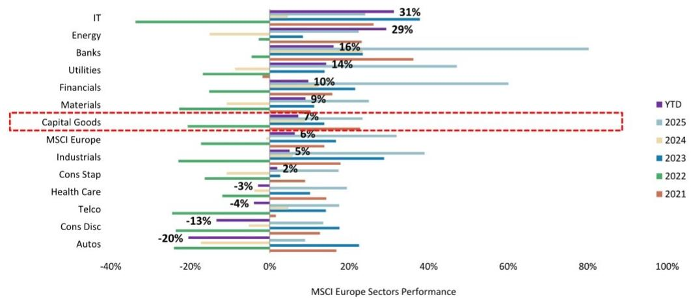  
来源：Refinitiv，MS

图表14：MSCGi  
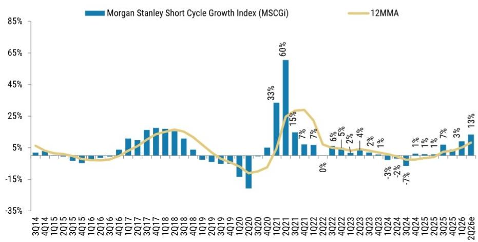

图表15：工业品：相对市盈率  
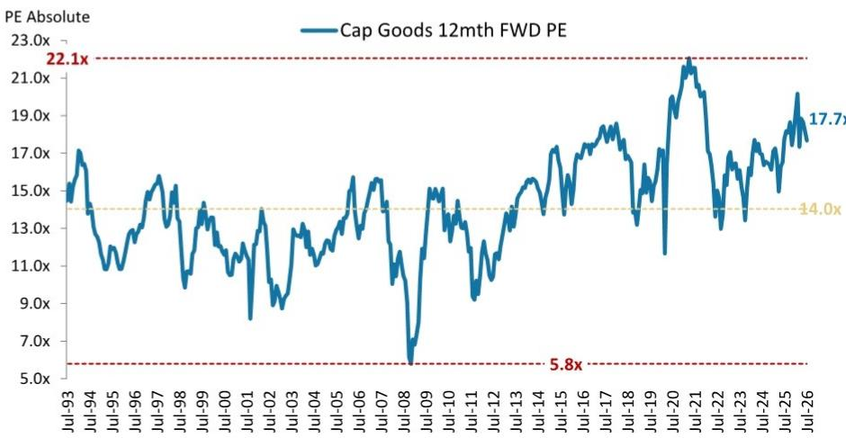  
来源：Refinitiv，公司数据，MS预估（e）

图表16：工业品：市盈率溢价 vs MSCI欧洲  
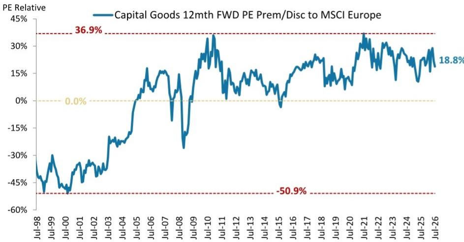  
来源：Refinitiv，MS  
来源：Refinitiv，MS

图表17：优质股 vs 周期股  
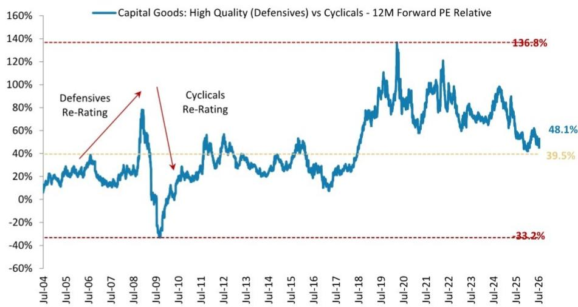  
来源：Datastream，MS

图表11：优质股溢价 vs 欧洲制造业PMI  
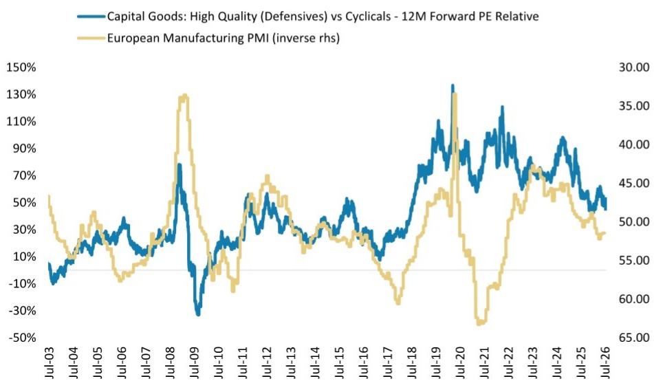

图表18：全球PMI  
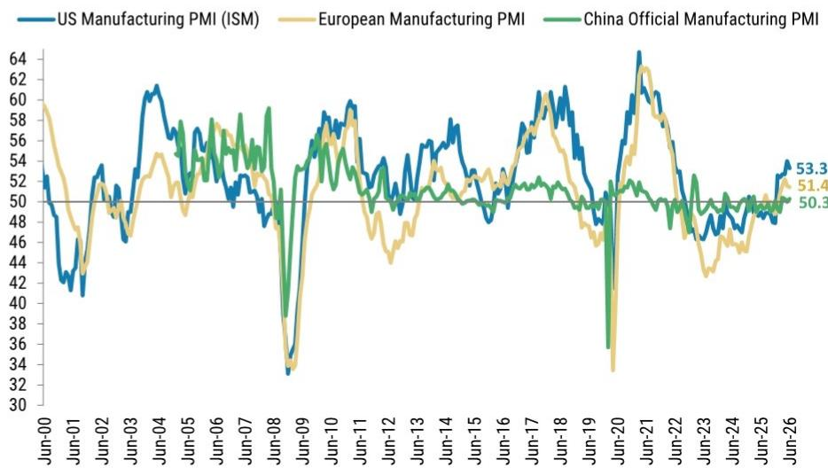  
来源：Refinitiv，MS  
来源：Markit，ISM，MS

图表19：美国ISM：新订单 vs 生产  
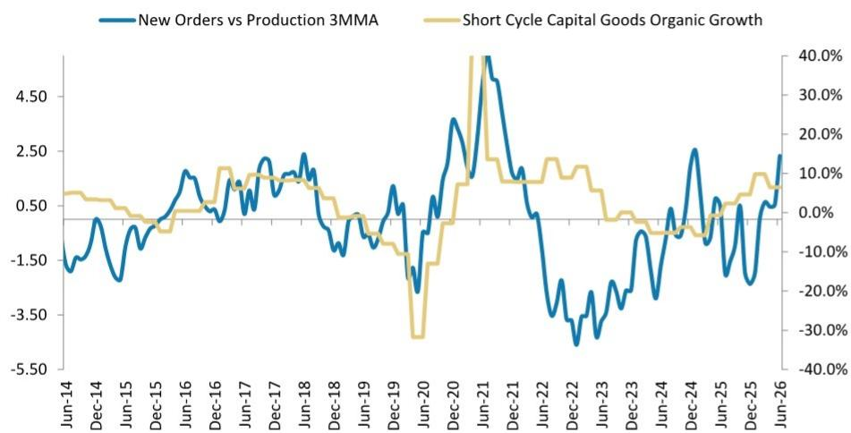  
来源：ISM，公司数据，MS

图表20：经济意外指数  
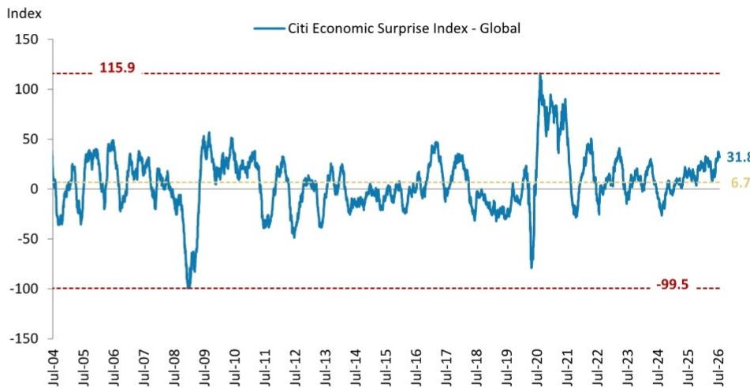  
来源：Bloomberg，MS

## 比较风险回报

图表21：工业品 – 风险回报

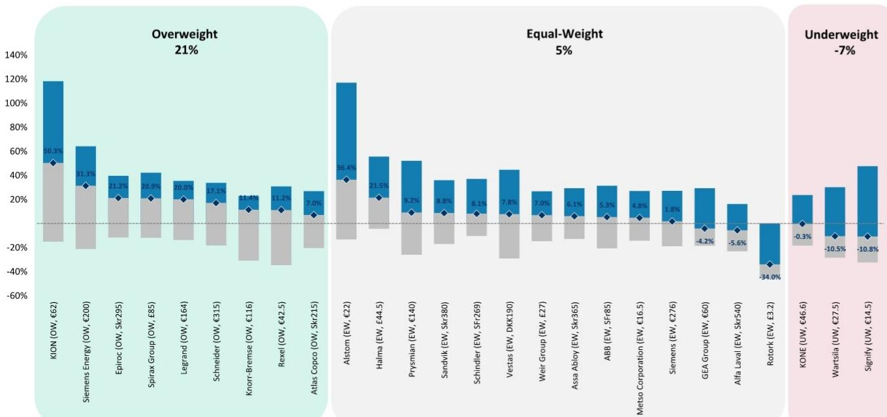  
来源：Refinitiv（股价数据），MS预估。数据截至2026年7月22日。

## 估值数据

图表22：MS工业品覆盖范围

<table><tr><td rowspan="2"></td><td>货币</td><td>MS</td><td>股价</td><td>MS</td><td>上行/</td><td>市值</td><td colspan="3">市盈率</td><td colspan="3">EV/销售额</td><td colspan="3">EV/EBITDA</td><td colspan="3">EV/EBITA</td><td colspan="3">股息率（%）</td><td colspan="3">自由现金流回报表现（%）</td><td colspan="3">相对SXNP</td><td colspan="3">相对SXNP（欧元）</td><td></td><td></td></tr><tr><td>评级</td><td></td><td>目标价</td><td>下行</td><td>欧元（十亿）</td><td>2026e</td><td>2027e</td><td>2028e</td><td>2026e</td><td>2027e</td><td>2028e</td><td>2026e</td><td>2027e</td><td>2028e</td><td>2026e</td><td>2027e</td><td>2028e</td><td>2026e</td><td>2027e</td><td>2028e</td><td>2026e</td><td>2027e</td><td>2028e</td><td>1个月</td><td>3个月</td><td>6个月</td><td>12个月</td><td>1个月</td><td>3个月</td><td>6个月</td><td>12个月</td></tr><tr><td colspan="32">电气设备</td><td></td></tr><tr><td>ABB</td><td>CHF</td><td>E</td><td>80.7</td><td>85.0</td><td>5.3%</td><td>158.7</td><td>31.5</td><td>26.8</td><td>23.2</td><td>4.7</td><td>4.1</td><td>3.7</td><td>20.5</td><td>17.6</td><td>15.3</td><td>22.8</td><td>19.6</td><td>16.9</td><td>1.8%</td><td>2.1%</td><td>2.4%</td><td>2.9%</td><td>3.4%</td><td>3.9%</td><td>-7.8%</td><td>1.6%</td><td>33.1%</td><td>43.2%</td><td>-8.3%</td><td>0.4%</td><td>32.9%</td><td>43.6%</td></tr><tr><td>Alstom</td><td>EUR</td><td>E</td><td>16.1</td><td>22.0</td><td>36.4%</td><td>7.9</td><td>8.6</td><td>7.2</td><td>5.9</td><td>0.4</td><td>0.4</td><td>0.3</td><td>5.4</td><td>4.2</td><td>3.2</td><td>nm</td><td>nm</td><td>nm</td><td>0.0%</td><td>0.0%</td><td>0.0%</td><td>7.0%</td><td>10.0%</td><td>13.0%</td><td>0.6%</td><td>-8.8%</td><td>-41.6%</td><td>-36.6%</td><td>0.6%</td><td>-8.8%</td><td>-41.6%</td><td>-36.6%</td></tr><tr><td>Legrand</td><td>EUR</td><td>O</td><td>136.7</td><td>164.0</td><td>20.0%</td><td>36.3</td><td>22.5</td><td>19.9</td><td>17.9</td><td>3.7</td><td>3.3</td><td>3.1</td><td>15.7</td><td>13.8</td><td>12.4</td><td>17.9</td><td>15.8</td><td>14.2</td><td>2.1%</td><td>2.4%</td><td>2.7%</td><td>4.5%</td><td>5.4%</td><td>5.8%</td><td>-10.2%</td><td>-12.3%</td><td>6.4%</td><td>-2.1%</td><td>-10.2%</td><td>-12.3%</td><td>6.4%</td><td>-2.1%</td></tr><tr><td>Prysmian</td><td>EUR</td><td>E</td><td>128.3</td><td>140.0</td><td>9.2%</td><td>36.7</td><td>24.3</td><td>17.6</td><td>15.3</td><td>1.8</td><td>1.5</td><td>1.4</td><td>13.2</td><td>10.1</td><td>8.6</td><td>17.4</td><td>12.7</td><td>10.7</td><td>0.8%</td><td>1.0%</td><td>1.2%</td><td>3.6%</td><td>4.5%</td><td>5.6%</td><td>-16.0%</td><td>2.2%</td><td>30.2%</td><td>90.3%</td><td>-16.0%</td><td>2.2%</td><td>30.2%</td><td>90.3%</td></tr><tr><td>Rexel</td><td>EUR</td><td>O</td><td>38.2</td><td>42.5</td><td>11.2%</td><td>11.3</td><td>17.3</td><td>13.9</td><td>12.3</td><td>0.8</td><td>0.7</td><td>0.6</td><td>9.1</td><td>8.0</td><td>7.2</td><td>12.0</td><td>10.4</td><td>9.3</td><td>2.9%</td><td>3.2%</td><td>3.6%</td><td>4.0%</td><td>5.2%</td><td>6.9%</td><td>0.7%</td><td>4.9%</td><td>5.8%</td><td>33.3%</td><td>0.7%</td><td>4.9%</td><td>5.8%</td><td>33.3%</td></tr><tr><td>Schneider</td><td>EUR</td><td>O</td><td>269.0</td><td>315.0</td><td>17.1%</td><td>157.1</td><td>26.0</td><td>22.3</td><td>19.4</td><td>3.8</td><td>3.4</td><td>3.1</td><td>18.7</td><td>16.0</td><td>13.6</td><td>20.5</td><td>17.6</td><td>14.9</td><td>1.7%</td><td>2.0%</td><td>2.3%</td><td>3.3%</td><td>4.0%</td><td>4.6%</td><td>-7.0%</td><td>-5.4%</td><td>14.2%</td><td>2.6%</td><td>-7.0%</td><td>-5.4%</td><td>14.2%</td><td>2.6%</td></tr><tr><td>Siemens</td><td>EUR</td><td>E</td><td>271.3</td><td>276.0</td><td>1.8%</td><td>210.2</td><td>23.7</td><td>19.2</td><td>16.7</td><td>2.8</td><td>2.5</td><td>2.3</td><td>16.0</td><td>13.2</td><td>11.4</td><td>19.3</td><td>15.5</td><td>13.2</td><td>2.1%</td><td>2.3%</td><td>2.4%</td><td>4.3%</td><td>4.9%</td><td>5.7%</td><td>-1.7%</td><td>8.6%</td><td>2.6%</td><td>9.7%</td><td>-1.7%</td><td>8.6%</td><td>2.6%</td><td>9.7%</td></tr><tr><td>Siemens Energy</td><td>EUR</td><td>O</td><td>152.3</td><td>200.0</td><td>31.3%</td><td>110.7</td><td>35.0</td><td>24.3</td><td>17.9</td><td>2.9</td><td>2.4</td><td>2.1</td><td>NM</td><td>NM</td><td>NM</td><td>25.0</td><td>17.0</td><td>12.3</td><td>1.4%</td><td>2.0%</td><td>2.7%</td><td>6.4%</td><td>6.3%</td><td>6.9%</td><td>-8.8%</td><td>-18.2%</td><td>8.3%</td><td>53.9%</td><td>-8.8%</td><td>-18.2%</td><td>8.3%</td><td>53.9%</td></tr><tr><td>Signify</td><td>EUR</td><td>U</td><td>16.3</td><td>14.5</td><td>-10.8%</td><td>2.4</td><td>8.9</td><td>8.5</td><td>7.6</td><td>0.6</td><td>0.6</td><td>0.5</td><td>5.4</td><td>5.0</td><td>4.5</td><td>7.6</td><td>6.9</td><td>6.2</td><td>5.1%</td><td>5.4%</td><td>6.0%</td><td>14.8%</td><td>14.2%</td><td>15.3%</td><td>-21.2%</td><td>-19.5%</td><td>-26.2%</td><td>-42.7%</td><td>-21.2%</td><td>-19.5%</td><td>-26.2%</td><td>-42.7%</td></tr><tr><td>Vestas</td><td>DKK</td><td>E</td><td>176.3</td><td>190.0</td><td>7.8%</td><td>23.8</td><td>NM</td><td>NM</td><td>NM</td><td>1.0</td><td>1.0</td><td>0.9</td><td>8.2</td><td>6.8</td><td>5.9</td><td>14.0</td><td>11.0</td><td>9.3</td><td>1.1%</td><td>1.4%</td><td>1.6%</td><td>4.4%</td><td>3.4%</td><td>6.2%</td><td>-3.2%</td><td>-11.5%</td><td>-4.6%</td><td>34.7%</td><td>-3.2%</td><td>-11.6%</td><td>-4.6%</td><td>34.4%</td></tr><tr><td colspan="32">英国工程公司</td><td></td></tr><tr><td>Halma</td><td>GBp</td><td>E</td><td>36.6</td><td>44.5</td><td>21.5%</td><td>16.3</td><td>28.6</td><td>25.2</td><td>NM</td><td>4.9</td><td>4.3</td><td>3.9</td><td>19.7</td><td>17.4</td><td>15.6</td><td>21.7</td><td>18.9</td><td>16.9</td><td>0.9%</td><td>1.1%</td><td>1.2%</td><td>3.1%</td><td>3.5%</td><td>4.0%</td><td>-6.6%</td><td>-21.4%</td><td>-3.4%</td><td>0.7%</td><td>-5.6%</td><td>-20.1%</td><td>-1.4%</td><td>2.8%</td></tr><tr><td>Rotork</td><td>GBp</td><td>E</td><td>4.9</td><td>3.2</td><td>-34.0%</td><td>4.7</td><td>27.1</td><td>24.6</td><td>22.4</td><td>5.0</td><td>4.5</td><td>4.1</td><td>22.0</td><td>18.2</td><td>16.4</td><td>24.3</td><td>19.8</td><td>17.7</td><td>1.8%</td><td>2.3%</td><td>2.6%</td><td>3.7%</td><td>4.0%</td><td>4.1%</td><td>56.7%</td><td>42.0%</td><td>36.7%</td><td>37.3%</td><td>58.3%</td><td>44.3%</td><td>39.6%</td><td>40.0%</td></tr><tr><td>Spirax Group</td><td>GBp</td><td>O</td><td>70.3</td><td>85.0</
