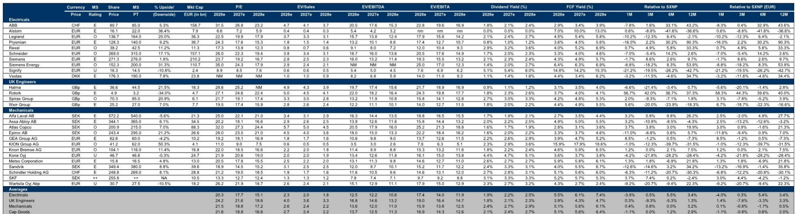
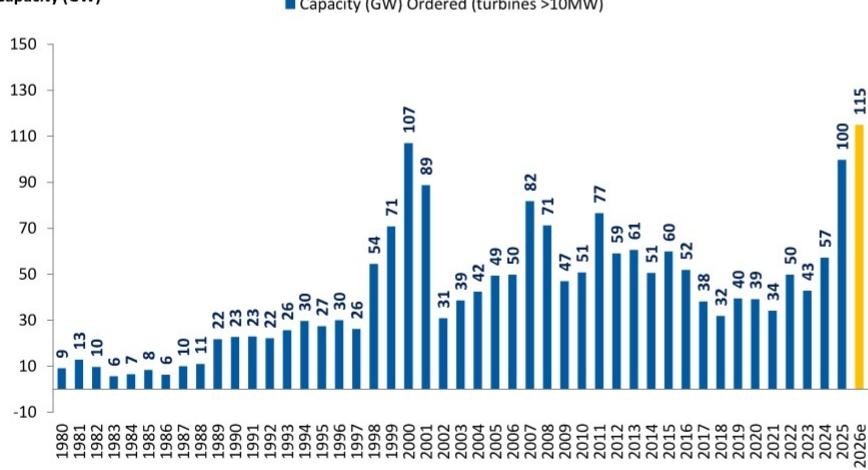

# MS：研究主题与行业变化观察

MS在最新发布的燃气轮机周度报告中，将2030年全球燃气轮机及电力解决方案供应量预测从135GW上调至146GW。这一调整主要来自GE Vernova的产能扩张、ERock的加入以及康明斯新增的1GW供应协议。报告同时首次将146GW供应量拆分为公用事业级中大型涡轮机（82GW）和面向数据中心表后市场的小型涡轮机、往复式发动机及燃料电池（64GW）两个板块。该机构认为，表后市场面临更高的供应过剩不确定性，而中大型涡轮机市场的供需平衡则相对复杂。

## 1. 表后市场64GW供应量与数据中心实际需求存在差距

报告指出，64GW的表后市场供应量主要面向美国数据中心市场。MS测算，如果到2030年美国每年新增50GW数据中心容量，其中约15GW接入电网，剩余35GW为表后需求。即便考虑一定冗余和比特币矿机的使用，64GW的供应量仍难以被完全消化，除非数据中心年新增量持续增长至2030年代中后期，或年新增量远超50GW——而后者受制于许可、劳动力和建设成本等约束，可能性较低。

> **KC评论：** 报告将供应量按应用场景拆分，而非简单加总。表后市场的过剩不确定性并非来自总量判断，而是来自“供应增速远超数据中心实际建设节奏”这一结构性错配。往复式发动机等解决方案的产能扩张资本开支较低，即使市场不会永久持续，厂商仍有宏观环境动力扩产。

## 2. GE Vernova与西门子能源的产能扩张逻辑不同

GE Vernova近期宣布再增加25%的大型燃气轮机产能，其2026年底客户承诺已达125GW，约为其未来30GW产能的4倍。西门子能源的客户承诺为90-100GW（联合循环），约为其现有产能规划的3倍。报告认为，基于西门子能源的订单可见度，其在2026财年业绩发布时不太可能像GE Vernova那样进行新一轮产能扩张。两家公司的产能决策差异，根源在于客户承诺覆盖率的差距，而非对市场前景判断的根本分歧。

## 3. 订单定价持续走强，西门子能源2030年服务利润率可能高于预期

GE Vernova在2026年第二季度披露的新订单定价显示，受产品组合影响（航空衍生型涡轮机占比高），整体新订单定价同比增长46%，较2024年水平弹性较高以上。报告估算，西门子能源2025年新订单定价（按每千瓦美元计）已比GE Vernova低24%，2026年这一差距可能扩大至27%。这意味着市场对西门子能源的利润率预测可能偏保守。报告认为，随着高价订单转化为收入，西门子能源2030年燃气服务EBIT利润率可能落在25%-30%区间，高于当前MS预测的25%和共识预期的24.2%。11月西门子能源发布新的2030年目标时，这一差距有望得到部分验证。

## 4. 新进入者凭借交付周期优势获得订单验证

报告观察到，FTAI近期获得14.8亿美元电力订单，康明斯和现代也进入表后市场。尽管不同解决方案的平准化电力成本存在差异，但报告认为，交付周期仍是当前数据中心客户决策的核心因素。部分表后解决方案提供商（如卡特彼勒和康明斯）在交付周期上具有优势，即使它们在主力电源领域的业绩记录较短。瓦锡兰的订单已排至2029年，未来12个月新增能源订单可能减少，而竞争对手正在快速扩产。

## 5. 西门子能源估值相对GE Vernova存在约50%折价

报告指出，西门子能源当前对应2028年EV/EBITA为12.4倍，较GE Vernova折价约50%。近期的关注点包括：8月4日发布的2026财年第三季度业绩中燃气服务订单可能超预期、中期利润率潜力以及新订单定价的强劲表现。报告预计，随着定价持续走强和潜在的新集团利润率区间（19-21%）公布，市场共识预测仍有上调空间。

> **KC评论：** 报告对西门子能源的核心担忧并非2026年订单见顶，而是2030年后燃气新设备和电网业务利润率从25%高点回落至20%左右（仍高于此前周期峰值），导致集团EBITA在2030-2035年间增长有限。这一远期利润率预期，而非短期订单节奏，才是当前压制估值的真正变量。

For informational purposes only. Portions may be generated,translated,summarized,or edited with AI assistance based on source materials and may contain omissions or errors. Please verify independently. This is not investment,legal,tax,accounting,or other professional advice.

