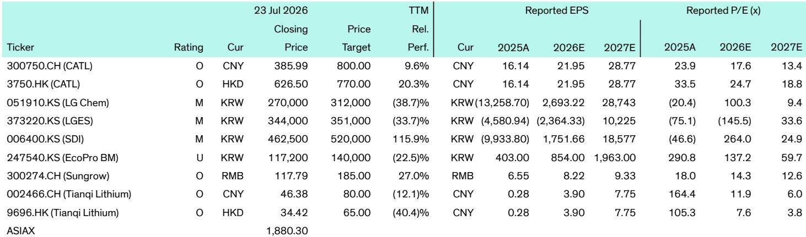
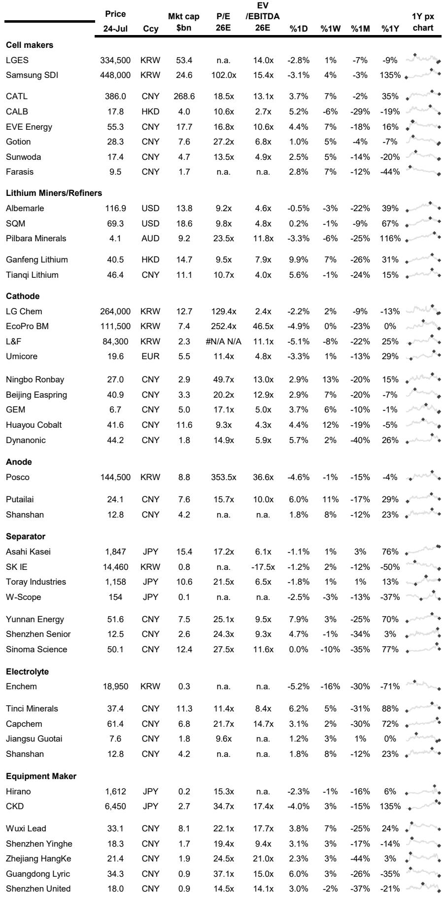

# 全球电池产业已超越电池本身——正演变为战略性基础设施博弈

电池产业已跨越了一个许多市场参与者尚未充分认识的门槛。它不再仅仅是关于电动汽车普及或锂资源价格的故事。2026年7月27日那一周发生的一系列事件，共同揭示了一个结构性转变：电池供应链正被主权产业政策、人工智能驱动的电力需求以及技术差异化竞争所重塑，这种竞争正在将市场分割为不同的区域和应用特定生态系统。一家全球性研究机构对该周的观察报告显示，最具影响力的动向并非孤立的电池化学突破，而是企业和政府如何将电池作为能源安全、电网韧性以及供应链自主可控的工具。

审视一下资本流动的广泛范围。布鲁克菲尔德同意以70亿美元从黑石集团收购Aypa Power，这是对由AI数据中心需求驱动的储能基础设施的一次布局。中国从主权债券中专门拨出33亿美元用于新能源重型卡车。为AI数据中心提供光互连产品的Innolight，正寻求在香港进行80亿美元的上市，这将是该市七年来规模最大的IPO。这些都不是传统意义上的电池企业故事。它们是由电池赋能的基础设施故事。

其含义十分清晰。电池产业正从以规模和成本降低为特征的成长阶段，过渡到以战略定位、监管合规以及更广泛的能源与数字系统整合为特征的成熟阶段。赢家将不是那些生产最便宜电芯的公司，而是那些能够在电池技术嵌入贸易争端、电网规划乃至数据中心架构的世界中游刃有余的公司。

## 专利诉讼与监管合规正成为北美市场的主要竞争护城河

先进电池技术领域竞争升级的最直接信号，来自LG新能源决定向美国国际贸易委员会和联邦法院对中国电池制造商亿纬锂能提起专利侵权诉讼。该案涉及五项专利，包括与圆柱电池和无极耳设计相关的技术，LGES正寻求阻止使用这些技术的产品在美国的进口和销售。

这并非一起常规的知识产权纠纷。它反映了一种深思熟虑的策略，即利用ITC作为竞争武器，而在这个市场上，中国电池制造商正通过激进定价和规模优势获取份额。ITC有权发布排除令，在边境阻止整个产品类别。一个成功的案件不仅会带来许可费收入，更会在中国以外最大的电池市场为竞争对手的产品线设置结构性进入壁垒。

与此同时，韩国材料公司Pino正筹集高达1.6万亿韩元以扩大其LFP正极业务，同时减持中国中伟股份持有的股权。其明确目标是满足潜在的美国电池采购和“外国关注实体”要求。这是一个清晰的例子，说明监管架构如何在规则最终确定之前就重塑供应链所有权。那些能够预先将自己定位为所有权结构上“非中国”的公司，无论其技术是否更优，都将在北美市场获得商业优势。

战略要点在于，知识产权和公司所有权结构如今与制造规模同等重要。一家能够生产有竞争力电池电芯，但无法应对美国专利或外国实体法规的公司，将会发现自己被排除在最有利可图的市场细分领域之外。

## 储能不再是可再生能源的附属品——正成为主要的电网基础设施资产

布鲁克菲尔德以70亿美元从黑石集团收购Aypa Power，是一笔具有里程碑意义的交易，它重新定义了读者应如何看待储能。Aypa在北美运营和开发电池储能及混合可再生能源项目，拥有6.5吉瓦的运营和签约容量，以及超过20吉瓦的在建项目。该交易使Aypa的股权估值约为30亿美元。

关键洞察不在于估值倍数，而在于买方及其动机。布鲁克菲尔德是一家主要的基础设施读者，而非清洁能源基金。此次收购的驱动力是“来自AI数据中心、电网现代化以及可再生能源整合带来的电力需求增长”。这是一个结构性需求故事，而非政策补贴故事。储能正被作为一项提供可靠性、灵活性和容量的电网资产来估值——这些服务历来由天然气调峰电厂和输电线路提供。

这对电池产业的影响是深远的。储能正从使可再生能源更高比例接入的成本中心，转变为支持数据中心增长和电网韧性的利润中心。这改变了电池制造商的价值主张。电网级储能客户将优先考虑循环寿命、安全性和系统集成能力，而非初始电芯成本。能够提供如宁德时代Tener电池那样15000次循环的钠离子系统，或长时储能解决方案的公司，正在为一个以25-30年全生命周期成本为衡量标准的市场进行布局。

这也解释了为何中国新的可再生能源发展规划明确目标，到2030年可再生能源支撑的储能满足20%的峰值电力需求，是当前水平的两倍。中国政府不仅是在建设可再生能源产能，更是在强制要求储能作为电网可靠性工具。

## 钠离子电池竞赛真实存在，且正通过商业协议而非实验室突破赢得胜利

当周新闻中最被低估的进展是钠离子电池商业化的加速。宁德时代与东欧开发商Solarpro签署了2吉瓦时的钠离子储能协议，部署中东欧首个大规模钠离子储能项目。这紧随该月早些时候在欧洲的另一项重大钠离子交易。LG新能源宣布，将在2026年底前在其梧仓工厂建立一条钠离子电池母线，目标是在2027年为长时储能应用提供客户概念验证项目。

这些并非研究公告，而是商业承诺。宁德时代的Tener钠离子系统提供高达15000次循环和25-30年的使用寿命，并具备优异的低温性能。LGES正利用其专有的Advanced Z-Stacking制造工艺，实现比竞品钠离子技术更高的能量密度和更长的循环寿命。

其战略意义在于，钠离子已不再是固定式储能领域LFP的理论替代品。它正成为一个在特定应用中具有商业可行性的产品——即循环寿命和安全性比能量密度更重要的长时电网储能。这导致了电池市场的分化。锂离子将继续主导电动汽车和消费电子产品。钠离子将在固定式储能领域占据越来越大的份额，尤其是在欧洲和中国等电网级部署正在加速的地区。

竞争层面的含义是，宁德时代正在巩固其作为全球最多元化电池技术公司的地位。它可以为电动汽车提供锂离子电池，为储能提供钠离子电池，并通过与国投电力合作2.4吉瓦的雅砻江二期水电项目，投资于水力发电。这种能力的广度创造了一种纯电池制造商难以匹敌的结构性优势。

## 固态电池竞赛正演变为多技术、多区域的竞争，而非单一赢家通吃的局面

当周的固态电池进展揭示了一个按技术路径和地域分化的市场。韩国的EcoPro BM宣布，其硫化物基固态电解质技术已通过主要电池制造商的资格测试，最早商业量产预计在2027年。日本的住友化学正将一种与京都大学和鸟取大学合作开发的卤化物基固态电解质商业化，该技术旨在更易于制造并与现有锂离子生产基础设施兼容。印度的Anupam Rasayan与西班牙固态开发商Basquevolt签署了价值3亿美元的特种材料意向书。

模式很清晰。不存在单一的主导固态化学体系。硫化物基电解质在性能上领先，但面临制造和稳定性挑战。卤化物基电解质提供制造兼容性，但可能在离子电导率上落后。每种路径对供应链、制造设备和成本结构都有不同的影响。

对市场参与者和行业参与者的战略含义是，固态电池不会作为一个单一的颠覆性事件到来。它们将逐步在多个应用中涌现，从高端电动汽车和特种应用开始，然后随着制造规模和成本改善而扩展。受益的公司不一定是那些实验室性能最好的，而是那些能够展示规模化可制造性，并与汽车制造商和电池制造商建立合作关系的公司。

EcoPro BM的进展尤其值得注意，因为它已通过“主要电池制造商”的资格测试，表明该技术正从实验室验证走向工业评估。2027年量产的时间线与行业共识一致，即固态电池将在2027-2029年间开始出现在商用车辆中，但直到2030年代才会达到有意义的市场份额。

## 决策框架：如何在分化的市场中评估电池供应链相关研究

本周的发展表明，电池产业已不能再作为一个单一、同质的市场来分析。研究人员和策略制定者需要一个能够解释区域分化、技术差异化和应用特定要求的框架。基于本周新闻中的证据，以下决策框架是合适的。

首先，评估区域敞口和监管风险。北美正成为一个专利诉讼和外国实体合规市场。拥有强大知识产权组合和非中国所有权结构的公司具有结构性优势。欧洲正成为一个本地化市场，天能国际和宁德时代等中国公司正在那里建设组装设施，以符合欧盟法规并抓住不断增长的储能需求。中国仍然是规模和成本领导者，但国内竞争激烈，出口市场正变得更加受限。

其次，按应用评估技术定位。对于电动汽车电池，LFP和高镍NMC将保持主导地位，固态电池将在2027年后进入高端细分市场。对于电网储能，钠离子正成为长时应用领域LFP的可行替代品，循环寿命和系统集成变得比电芯成本更重要。对于重型卡车，中国专门的政府资金和充电基础设施部署正在创造一个有利于换电和高循环寿命化学体系的独特市场。

第三，考虑垂直整合和生态系统广度。宁德时代对水力发电的投资、其钠离子储能协议以及换电合作伙伴关系，展示了一种控制能源价值链多个节点的策略。纯电芯制造商可能面临利润率压缩，因为客户要求包含系统设计、软件和生命周期服务的集成解决方案。

最后，关注固态电池时间线，但不要过度投入早期炒作。本周报告的资格测试和试点规模评估是真实的进展，但商业量产仍需数年时间。近期的赢家将是那些能够为特定应用优化现有锂离子和钠离子化学体系的公司，而非那些押注单一下一代技术突破的公司。

## 最具影响力的发展可能是AI基础设施与储能需求的融合

Innolight 80亿美元的上市和布鲁克菲尔德-Aypa收购案表面上毫不相关。一个是关于AI数据中心的光互连产品，另一个是关于电网级电池储能。但它们被一个单一的因果链连接起来：AI数据中心需要大量可靠的电力，而这种电力需求正推动着对储能作为电网基础设施资产的需求。

布鲁克菲尔德收购案明确将“来自AI数据中心的电力需求增长”列为驱动因素。Innolight的核心业务是为AI数据中心网络供应高速光收发器。这种融合并非巧合。AI计算基础设施的建设正在催生一个平行的储能基础设施建设来支持它。

这具有超越电池产业本身的影响。它表明储能的价值链正在从传统的公用事业和可再生能源客户扩展到科技公司和数据中心运营商。这些客户有不同的要求——他们优先考虑正常运行时间、可靠性和部署速度，而非最低成本。他们也愿意为国内供应链和监管合规支付溢价。

认识到这一转变并将自身定位为AI基础设施建设合作伙伴的电池公司，将获得比那些仅在商品化电芯定价上竞争的公司更高利润、更稳定的收入流。本周的新闻表明，这一机会已在大型交易中被定价，战略定位的窗口正在收窄。

*仅供参考。部分内容可能基于源材料通过AI辅助生成、翻译、总结或编辑，可能存在遗漏或错误。请独立核实。本文不构成任何专业建议。*

仅供参考。部分内容可能基于源材料通过AI辅助生成、翻译、总结或编辑，可能存在遗漏或错误。请独立核实。本文不构成任何专业建议。

