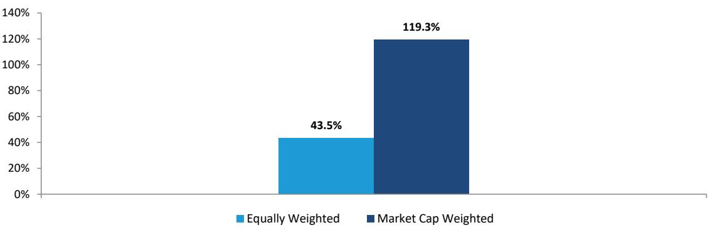
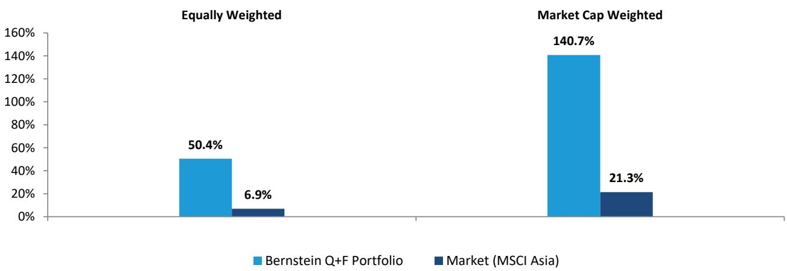
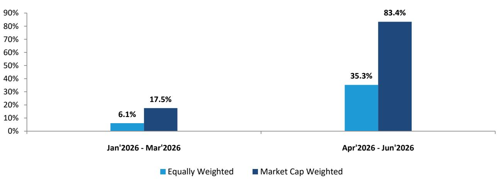
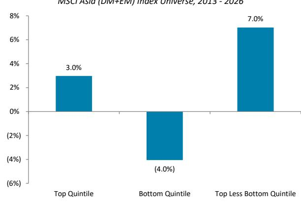
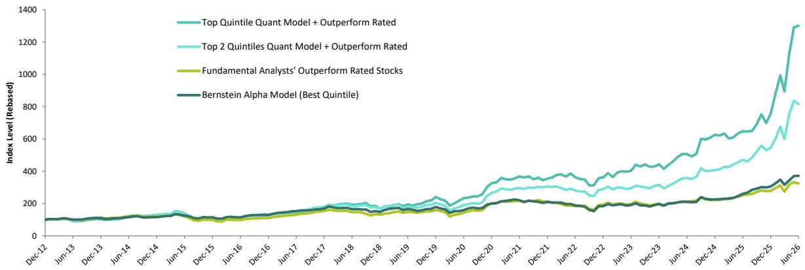
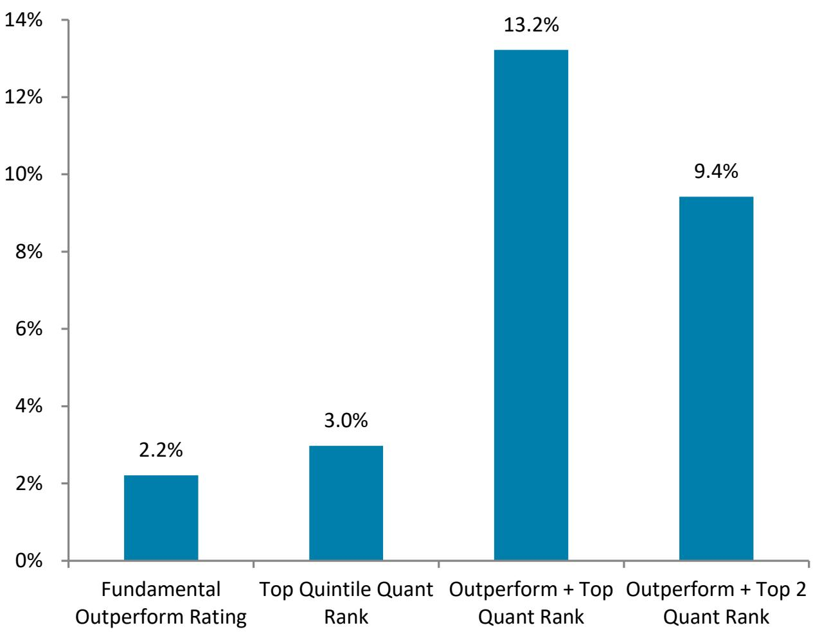
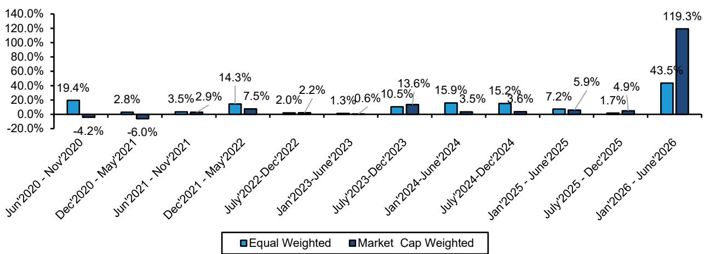

# Asia Quantitative Strategy

# Asia Quant + Fundamental Portfolio: 17 selections for 2H26

Rupal Agarwal
+65 6326 7641
rupal.agarwal@bernsteinsg.com

Neil Beveridge, Ph.D.
+852 2123 2648
neil.beveridge@bernsteinsg.com

David Dai, CFA
+852 2918 5704
david.dai@bernsteinsg.com

Jay Huang, Ph.D.
+852 2123 2631
jay.huang@bernsteinsg.com

Mark Li
+852 2123 2645
mark.li@bernsteinsg.com

Qingyuan Lin, Ph.D.
+852 2123 2654
qingyuan.lin@bernsteinsg.com

Miki Sogi, Ph.D.
+81 3 6777 6991
miki.sogi@bernsteinsg.com

Alex Wang, CFA
+852 2123 2613
alex.wang@bernsteinsg.com

Robin Zhu
+852 2123 2659
robin.zhu@bernsteinsg.com

Cheng Zhang, CFA, CQF
+852 2123 2636
cheng.zhang@bernsteinsg.com

This report examines the advantages of combining quantitative and fundamental research approaches in the Asia Pacific region, highlighting 17 companies across 5 sectors (with a notable concentration in Technology) that present interesting characteristics for two reasons: 1) they rank highly on a quantitative basis, and 2) they are companies where our Bernstein analysts hold a constructive view. Specifically, the selected companies need to be in the best two quintiles of the Bernstein Alpha Model while also having an "Outperform" rating from our fundamental analyst covering the company.

Our previous Quant + Fundamental portfolio showed relative results compared to the MSCI Asia benchmark of 43.5% on an equal-weighted basis and 119.3% on a market capitalization-weighted basis in 1H26 (Exhibit 1-Exhibit 3).

The Bernstein Alpha Model has demonstrated effectiveness in distinguishing different outcomes across Asia over the long term. Over the last 20 years, the best quintile showed a relative annualized difference of 6.1% with an information ratio of 1.35 (Exhibit 4). Since 2013, companies in the MSCI Asia Pacific universe that rank in the best quintile of our quant model generated +7.0% annualized returns relative to the worst quintile (Exhibit 5).

We find that both quant and fundamental approaches to company selection each add value to the research process in different ways (Exhibit 7), and disciplined strategies combining the two techniques have produced results that differ from either method alone. In Asia, using our analysts' recommendations as a proxy for a fundamental approach and our Bernstein Alpha Model as the quantitative input, we found that companies that were attractive on both counts showed relative performance of +13.2% per year since 2013. However, the number of Asian companies that are rated Outperform and are in Q1 of the Alpha Model is limited. To allow for a larger portfolio size we also include the second highest quintile. Including Q1 and Q2 ranked companies in the Quant + Fundamental portfolio generated 9.4% pa since 2013 (Exhibit 8). Consistency of the blended approach has been notable - all 12 portfolios we have published since 2020 (every 6 months) have shown relative performance on an equal-weighted basis, and 10 out of those have shown relative performance on a cap-weighted basis (Exhibit 9).

The 17 companies that meet the criteria as of Jul 2026 are: SAMSUNG ELECTRONICS CO (005930 KS), SAMSUNG ELECTRONICS PREF(005935 KS), SK HYNIX (000660 KS), NAURA TECH GRP (002371 C2), PIOTECH A (688072 C1), ADV MICRO-FABRIC (688012 C1), MONTAGE TECH A (HK-C) (688008 C1), SUNNY OPTICAL TECH (2382 HK), LUXSHARE PREC A (HK-C) (002475 C2), JD.COM (HK) (9618 HK), IBIDEN CO (4062 JP), TOKYO ELECTRON (8035 JP), ADVANTEST CORP (6857 JP), KEYENCE CORP (6861 JP), DAIICHI SANKYO CO (4568 JP), CAPCOM CO (9697 JP), SANTOS (STO AU). (Exhibit 10)

The key reasons why each company is attractive on a quantitative basis are shown in Exhibit 11 and a summary of our analysts' perspectives on each name follows. We will continue to review the Quant + Fundamental Asia portfolio twice a year, tracking and reporting on the performance and portfolio changes.

9618.HK estimate is Adjusted EPS; 9618.HK valuation is Adjusted P/E (x); 6861.JP base year is 2026;

## BERNSTEIN TICKER TABLE

<table><tr><td rowspan="2">Ticker</td><td rowspan="2">Rating</td><td colspan="4">24 Jul 2026</td><td rowspan="2">TTMRel.</td><td colspan="4">Reported EPS</td><td colspan="3">Reported P/E (x)</td></tr><tr><td>Cur</td><td>Closing Price</td><td>Price Target</td><td>Target Perf.</td><td>Cur</td><td>2025A</td><td>2026E</td><td>2027E</td><td>2025A</td><td>2026E</td><td>2027E</td></tr><tr><td>9618.HK (JD)</td><td>O</td><td>HKD</td><td>118.10</td><td>155.00</td><td>(38.6)%</td><td>HKD</td><td>10.46</td><td>13.84</td><td>18.16</td><td>11.3</td><td>8.5</td><td>6.5</td><td></td></tr><tr><td>000660.KS (SK hynix)</td><td>O</td><td>KRW</td><td>1,781,000</td><td>3,300,000</td><td>533.7%</td><td>KRW</td><td>60,341</td><td>395,677</td><td>568,862</td><td>29.5</td><td>4.5</td><td>3.1</td><td></td></tr><tr><td>005930.KS (SEC- Samsung)</td><td>O</td><td>KRW</td><td>252,500</td><td>440,000</td><td>255.4%</td><td>KRW</td><td>6,611.53</td><td>48,393</td><td>77,273</td><td>38.2</td><td>5.2</td><td>3.3</td><td></td></tr><tr><td>005935.KS (SEC-Pref - Samsung)</td><td>O</td><td>KRW</td><td>177,100</td><td>374,000</td><td>196.6%</td><td>KRW</td><td>6,611.53</td><td>48,393</td><td>77,273</td><td>26.8</td><td>3.7</td><td>2.3</td><td></td></tr><tr><td>8035.JP (Tokyo Electron)</td><td>O</td><td>JPY</td><td>62,660</td><td>59,200</td><td>86.2%</td><td>JPY</td><td>1,250.88</td><td>1,504.14</td><td>1,848.77</td><td>50.1</td><td>41.7</td><td>33.9</td><td></td></tr><tr><td>6857.JP (Advantest)</td><td>O</td><td>JPY</td><td>28,945</td><td>39,200</td><td>117.9%</td><td>JPY</td><td>514.52</td><td>735.65</td><td>870.09</td><td>56.3</td><td>39.3</td><td>33.3</td><td></td></tr><tr><td>4062.JP (Ibiden)</td><td>O</td><td>JPY</td><td>17,370</td><td>23,900</td><td>418.9%</td><td>JPY</td><td>214.91</td><td>259.64</td><td>411.19</td><td>80.8</td><td>66.9</td><td>42.2</td><td></td></tr><tr><td>4568.JP (Daiichi Sankyo)</td><td>O</td><td>JPY</td><td>2,799.50</td><td>4,500.00</td><td>(61.1)%</td><td>JPY</td><td>140.37</td><td>152.26</td><td>216.35</td><td>19.9</td><td>18.4</td><td>12.9</td><td></td></tr><tr><td>002371.CH (NAURA)</td><td>O</td><td>CNY</td><td>757.00</td><td>680.00</td><td>96.4%</td><td>CNY</td><td>5.66</td><td>10.22</td><td>16.41</td><td>133.7</td><td>74.1</td><td>46.1</td><td></td></tr><tr><td>688072.CH (Piotech)</td><td>O</td><td>CNY</td><td>791.00</td><td>580.00</td><td>320.2%</td><td>CNY</td><td>3.32</td><td>8.12</td><td>12.40</td><td>238.3</td><td>97.4</td><td>63.8</td><td></td></tr><tr><td>002475.CH ( Luxshare )</td><td>O</td><td>CNY</td><td>60.59</td><td>86.00</td><td>32.8%</td><td>CNY</td><td>2.26</td><td>2.66</td><td>3.45</td><td>26.8</td><td>22.7</td><td>17.6</td><td></td></tr><tr><td>6861.JP (Keyence)</td><td>O</td><td>JPY</td><td>71,820</td><td>86,000</td><td>(17.0)%</td><td>JPY</td><td>1,835.63</td><td>2,248.48</td><td>2,494.78</td><td>39.1</td><td>31.9</td><td>28.8</td><td></td></tr><tr><td>688008.CH (Montage)</td><td>O</td><td>CNY</td><td>233.66</td><td>400.00</td><td>152.0%</td><td>CNY</td><td>1.97</td><td>3.21</td><td>5.68</td><td>118.6</td><td>72.9</td><td>41.2</td><td></td></tr><tr><td>2382.HK (Sunny Optical)</td><td>O</td><td>HKD</td><td>58.35</td><td>94.00</td><td>(51.3)%</td><td>CNY</td><td>4.25</td><td>3.44</td><td>4.52</td><td>11.9</td><td>14.6</td><td>11.2</td><td></td></tr><tr><td>STO.AU (Santos)</td><td>O</td><td>AUD</td><td>7.97</td><td>8.90</td><td>(23.7)%</td><td>USD</td><td>0.25</td><td>0.68</td><td>0.58</td><td>22.1</td><td>8.1</td><td>9.6</td><td></td></tr><tr><td>9697.JP (Capcom)</td><td>O</td><td>JPY</td><td>3,364.00</td><td>4,600.00</td><td>(63.1)%</td><td>JPY</td><td>115.85</td><td>130.50</td><td>153.47</td><td>29.0</td><td>25.8</td><td>21.9</td><td></td></tr><tr><td>688012.CH (AMEC)</td><td>O</td><td>CNY</td><td>388.50</td><td>500.00</td><td>163.7%</td><td>CNY</td><td>3.40</td><td>4.95</td><td>7.18</td><td>114.3</td><td>78.6</td><td>54.1</td><td></td></tr><tr><td></td><td></td><td></td><td>--</td><td></td><td></td><td></td><td></td><td></td><td></td><td></td><td></td><td></td><td></td></tr><tr><td>ASIAX</td><td></td><td></td><td>1,880.30</td><td></td><td></td><td></td><td></td><td></td><td></td><td></td><td></td><td></td><td></td></tr><tr><td>JPL</td><td></td><td></td><td>2,608.59</td><td></td><td></td><td></td><td></td><td></td><td></td><td></td><td></td><td></td><td></td></tr></table>

O - Outperform, M - Market-Perform, U - Underperform, NR - Not Rated, CS - Coverage Suspended

Source: Bloomberg, Bernstein estimates and analysis.

## RESEARCH IMPLICATIONS

SK hynix: We rate SK hynix Outperform with target price to KRW 3,300,000.
Samsung: We rate Samsung Outperform with target price to KRW 440,000.
Capcom: We rate Capcom Outperform with target price of ¥4,600.00.
Tokyo Electron: We rate Tokyo Electron Outperform with target price of ¥59,200.
Advantest: We rate Advantest Outperform with target price of ¥39,200.
Ibiden: We rate Ibiden Outperform with target price of ¥23,900.
JD: We rate JD Outperform with target price of HKD 155.00
Luxshare Precision: We rate Luxshare Precision Outperform, with target price of CNY 86.00.
Sunny Optical Technology: We rate Sunny Optical Outperform with a HK\$94.00price target.
Piotech: We rate Piotech Outperform with price target CNY580.00.
Daiichi Sankyo: We rate Daiichi Outperform with target price of 4,500.00 JPY
NAURA: We rate Naura Outperform with target price of CNY 680.00.
AMEC: We rate AMEC Outperform with target price of CNY 500.

Montage Technology: We rate Montage Technology Outperform with target price of CNY 400.00.

Keyence: We rate Keyence Outperform with target price of ¥86,000

Santos: We rate Santos Outperform with target price of AUD8.90.

## DETAILS

## WHY COMBINE QUANTITATIVE AND FUNDAMENTAL RESEARCH?

Quantitative and fundamental approaches to company selection can each add value to the research process, but an integrated and disciplined strategy combining the two methods can produce different results than either method alone. While this makes intuitive sense, it can be difficult to study because fundamental research is subjective and virtually impossible to replicate. Fundamental analysts can and do come to different conclusions on a given company with essentially the same information at the same time. In this study, we use our Bernstein sell-side analysts' recommendations as a proxy for the fundamental approach.

The Bernstein Alpha Model has been effective in differentiating outcomes across Asia. Over the last 20 years, the best quintile showed a relative difference of 6.1% with an information ratio of 1.35 (Exhibit 4). Since 2013, companies in the MSCI Asia Pacific universe that rank in the best quintile of our quant model generated +7.0% annualized returns relative to the worst quintile (Exhibit 5).

The Bernstein Alpha Model calculates the relative expected return of each company over the next twelve months using three components: company selection, industry/sector rotation, and risk regimes. The company selection and industry/sector rotation components include factors meant to assess each company's valuation, capital use, earnings quality, profitability, growth and momentum characteristics. Our Risk Aversion Signal combines indicators like bond yield spreads, commodity price changes, and consumer sentiment with market-cap concentration, valuation dispersion, options skew and the volatility curve to assess whether participants will be highly risk-averse, risk seeking or neutral over the next three months.

A note about Emerging Markets: The Asia Pacific company universe spans both developed and emerging markets, and we have distinct models for each to capture the different dynamics of each market. One example to highlight is in our Risk Aversion Signals (RAS). In developed markets, risk-off sentiment is manifest as a flight to quality or a rotation into defensive exposures like the low volatility factor. However, in the EM space, we see that high-risk-aversion can often manifest itself through a flight out of EM entirely, and rotation into DM. Within emerging markets, we observe a flight to liquidity during risk-off moves. Given these changes we needed to construct an EM specific risk regime switching model to accommodate these key differences in how participants react to risk. We start with our global developed markets RAS indicator and then add some EM specific factors such as the change in EM valuation dispersion, change in market cap concentration and the coefficient of variation of moving average spreads. The current US and global risk aversion signal is suggesting neutral risk environment for the next 3 months.

For more details about how these models are built, and the differences between how DM companies and EM companies are assessed, please see our model construction reports at the following links: Bernstein Alpha Model - Developed Markets and Bernstein Alpha Model - Emerging Markets.

EXHIBIT 1: Our last Bernstein Quant + Fundamental portfolio showed relative performance of 43.5% on an equally-weighted basis and 119.3% on a cap-weighted basis in the six months since publication

Performance: Bernstein Quant+Fundamental Asia\*  
Portfolio performance relative to MSCI Asia  
Cumulative Total Return: Jan 2026 to Jun 2026

  
MSCI Asia includes companies from Asia (DM + EM) and Japan
Source: FactSet, MSCI, Bernstein analysis  
Performance: Quant + Fundamental Asia
Portfolio vs. MSCI Asia
Cumulative Total Return: Jan 2026 to Jun 2026

EXHIBIT 2: On absolute basis, our last Q+F portfolio for 1H26, generated 50.4% eq-wtd returns and 140.7% cap-wtd returns between Jan 2026-Jun 2026

  
MSCI Asia includes companies from Asia (DM + EM) and Japan
Source: Factset, MSCI, Bernstein analysis

EXHIBIT 3: Splitting the performance by quarter: The cap-wtd. portfolio showed different results compared to equal-weighted portfolio in both 1Q26 and 2Q26

Performance: Bernstein Quant+Fundamental Asia\* Portfolio performance relative to MSCI Asia Cumulative Total Return Split by Quarter: Jan 2026 to Jun 2026

  
MSCI Asia has companies from Asia (DM+EM) and Japan  
MSCI Asia includes companies from Asia (DM + EM) and Japan
Source: Factset, MSCI, Bernstein analysis

EXHIBIT 4: The Bernstein Alpha Model has a long-term track record in the Asia Pacific Region

<table><tr><td rowspan="2" colspan="2"></td><td>1-Month Forward</td><td>3-Month Forward</td><td>12-Month Forward</td></tr><tr><td colspan="3">Average Annualized returns</td></tr><tr><td rowspan="5">Average Annualized returns</td><td>Past 1 year</td><td>15.7%</td><td>8.7%</td><td>2.5%</td></tr><tr><td>Past 5 year</td><td>6.1%</td><td>3.4%</td><td>2.8%</td></tr><tr><td>Past 10 year</td><td>4.6%</td><td>3.0%</td><td>1.4%</td></tr><tr><td>Past 20 year</td><td>6.1%</td><td>5.3%</td><td>3.9%</td></tr><tr><td>Entire History</td><td>7.3%</td><td>6.7%</td><td>5.8%</td></tr><tr><td></td><td colspan="4">Information Ratio</td></tr><tr><td rowspan="5">Information Ratio</td><td>Past 1 year</td><td>2.85</td><td>2.15</td><td>0.74</td></tr><tr><td>Past 5 year</td><td>1.18</td><td>0.69</td><td>0.94</td></tr><tr><td>Past 10 year</td><td>0.98</td><td>0.67</td><td>0.39</td></tr><tr><td>Past 20 year</td><td>1.35</td><td>1.02</td><td>0.58</td></tr><tr><td>Entire History</td><td>1.09</td><td>0.82</td><td>0.55</td></tr><tr><td></td><td colspan="4">Historical % period Outperforming</td></tr><tr><td rowspan="5">Historical % period Outperforming</td><td>Past 1 year</td><td>83%</td><td>85%</td><td>77%</td></tr><tr><td>Past 5 year</td><td>60%</td><td>67%</td><td>84%</td></tr><tr><td>Past 10 year</td><td>61%</td><td>69%</td><td>68%</td></tr><tr><td>Past 20 year</td><td>65%</td><td>71%</td><td>73%</td></tr><tr><td>Entire History</td><td>65%</td><td>71%</td><td>77%</td></tr></table>

Source: Factset, MSCI, Bernstein Analysis  
EXHIBIT 5: Since 2013 the best quintile of the Bernstein Alpha Model showed a relative difference of 7.0%pa compared to the worst quintile  
Asia: Bernstein Global Alpha Model Performance
Annualized Relative Return (USD)
MSCI Asia (DM+EM) Index Universe, 2013 - 2026

  
Source: Factset, MSCI, Bernstein analysis

The combination of companies that are attractive on both a quantitative and fundamental basis shows different characteristics than either strategy alone. The Quant + Fundamental portfolio produced a 13.2% annualized relative result since 2013. While the intersection of top quintile Alpha Model companies and outperform-rated names produced the highest returns, sometimes this list is very short. Therefore, we expanded our quant list to the top two quintiles so that we can have a larger and more diversified portfolio that also shows interesting characteristics in our back tests (Exhibit 6). We will continue to review the Quant + Fundamental Asia portfolio every six months, tracking and reporting on the performance and portfolio changes.

EXHIBIT 6: Performance of the combination of companies that are attractive on both quantitative and fundamental basis shows different characteristics than either strategy alone

Asia: Performance of Various Quant and Fundamental Strategies
In Comparison to MSCI AC Asia Pacific Index
Asia (DM + EM), Total Return (USD), January 2013 - 2026

  
Source: FactSet, MSCI, Bernstein analysis

Some approaches are strictly fundamental or quantitative operations, but many others combine the two strategies in diverse ways with varying degrees of success. There are many methods of blending quantitative and fundamental analysis in research, but we believe the best systems are those that respect the strengths and weaknesses of each approach. While quantitative research is more objective, consistent, disciplined, and more easily testable and applicable to large sets of companies, it is also likely too reliant on the past. Quantitative models generally do not forecast exceptions or inflection points well due to their heavy reliance on trailing data and averages. They do, however, tell you what characteristics tend to be associated with certain outcomes for large baskets of companies consistently and without emotion. They score all the companies all the time, and they are cost-effective. Fundamental research is subjective and can be more susceptible to behavioral biases, but a fundamental analyst can be more creative and imaginative than any quant process. They can see possibilities, opportunities and exceptions that are impossible to model. However, fundamental research is difficult to replicate and back-test, and it is more expensive to cover a large number of companies on a fundamental vs. a quantitative basis. Exhibit 7 compares some of the strengths and weaknesses of using quantitative models versus fundamental research.

EXHIBIT 7: There are both pros and cons to quantitative and fundamental disciplines
Quantitative Models Fundamental Analysis

<table><tr><td>Consistent and disciplined</td><td>Creative and imaginative</td></tr><tr><td>Easily testable</td><td>Difficult to reproduce</td></tr><tr><td>Applicable to large sets of companies</td><td>Labor intensive, applies deeper knowledge to narrower universe</td></tr><tr><td>Objective</td><td>Subjective</td></tr><tr><td>Focuses on the power of historical relationships and averages</td><td>Can determine when the past is less relevant and identify exceptions or inflection points</td></tr><tr><td>Can adjust forecasts continuously</td><td>Infrequent forecast changes</td></tr><tr><td>Evenly distributed forecasts that can be easily ranked</td><td>Recommendations can be uneven (few underperforms)</td></tr><tr><td>Can lead to spurious assumptions</td><td>Can be susceptible to behavioral biases</td></tr><tr><td>Largely used to forecast returns</td><td>More focus on forecasting earnings and fundamentals</td></tr></table>

Source: Bernstein Analysis

In order to quantify the synergies of integrating these two disciplines, we look at a simple combination of fundamental forecasts and quantitative model rankings. We observe that when both fundamental research and the quantitative model agree (defined in this analysis as a company having Outperform rating by Bernstein analysts and ranking in the top quintile of the Bernstein Alpha Model), the results are different from when only one of the inputs is positive. Since 2013, when our Asia fundamental coverage became substantial, the blended quant+fundamental portfolio (top quintile of alpha model+outperform rating by Bernstein analyst) has delivered 13.2% annualized relative result. Even when extending the portfolio to include top two quintiles of the alpha model and picking the names which are rated outperform, the relative result has been 9.4% annualized which is different from the individual approaches. (Exhibit 8)

EXHIBIT 8: When fundamental and quant inputs agree, results show different characteristics

Asia: Performance of Fundamental Outperform Rating Combined with Quant Top Rank

Annualized Return Relative to MSCI AC Asia Pacific Index, Total Return (USD), 2013 - 2026

  
Source: MSCI, FactSet, Bernstein analysis

EXHIBIT 9: Bernstein Quant + Fundamental (relative to benchmark) – Since first published in 2020, all 12 published portfolios have shown consistent relative performance on eq-wtd. basis while on cap-wtd. basis, the record has been 10 out of 12

Performance: Bernstein Quant+Fundamental Asia\* Portfolio performance relative to MSCI Asia

  
Benchmark=MSCI Asia which consists of companies from EM + DM Asia including Japan  
Source: Factset, MSCI, Bernstein analysis

## WHICH COMPANIES ARE OF INTEREST NOW ON BOTH A QUANTITATIVE AND FUNDAMENTAL BASIS?

Our methodology for running the Quant + Fundamental portfolios in the Asia Pacific region is slightly different from in the U.S. and European versions in that we eliminate the criterion that selected companies have to also be uncrowded based on the Bernstein Crowding Model. While we believe it's important to monitor crowding risks in all regions, given the smaller Bernstein analyst coverage universe in Asia we found that we would be left with an extremely concentrated portfolio if we included a third constraint related to crowding on top of the first two parameters.

[Exhibit 10] lists 17 companies in our Asia Pacific fundamental coverage universe that are currently rated Outperform and that also rank in the best two quintiles of the Bernstein Alpha Model. The main reasons why the companies have favorable rankings in the Bernstein Alpha Model are listed in Exhibit 11. Then the rest of this note details the key reasons why the analysts find these companies interesting on a fundamental basis and includes links to relevant reports on these names.

EXHIBIT 10: Asia Q+F: 17 companies for 2H

<table><tr><td>Ticker</td><td>Company</td><td>Market Cap (USD Mil)</td><td>Analyst Rating</td><td>Analyst</td><td>Global Alpha Model Quintile (1=Best)</td><td>Crowding Model Decile (1=Most Crowded)</td><td>Sector</td><td>Geography</td></tr><tr><td>STO AU</td><td>SANTOS</td><td>15,967</td><td>O</td><td>Beveridge, Neil</td><td>1</td><td>3</td><td>Energy</td><td>Australia</td></tr><tr><td>8035 JP</td><td>TOKYO ELECTRON</td><td>213,610</td><td>O</td><td>Dai, David</td><td>1</td><td>7</td><td>Technology</td><td>Japan</td></tr><tr><td>6857 JP</td><td>ADVANTEST CORP</td><td>130,973</td><td>O</td><td>Dai, David</td><td>1</td><td>6</td><td>Technology</td><td>Japan</td></tr><tr><td>4062 JP</td><td>IBIDEN CO</td><td>40,969</td><td>O</td><td>Dai, David</td><td>1</td><td>1</td><td>Technology</td><td>Japan</td></tr><tr><td>6861 JP</td><td>KEYENCE CORP</td><td>121,419</td><td>O</td><td>Huang, Jay</td><td>1</td><td>10</td><td>Technology</td><td>Japan</td></tr><tr><td>005930 KS</td><td>SAMSUNG ELECTRONICS CO</td><td>1,172,105</td><td>O</td><td>Li, Mark</td><td>1</td><td>3</td><td>Technology</td><td>South Korea</td></tr><tr><td>005935 KS</td><td>SAMSUNG ELECTRONICS PREF</td><td>1,172,105</td><td>O</td><td>Li, Mark</td><td>1</td><td>3</td><td>Technology</td><td>South Korea</td></tr><tr><td>000660 KS</td><td>SK HYNIX</td><td>1,001,916</td><td>O</td><td>Li, Mark</td><td>1</td><td>3</td><td>Technology</td><td>South Korea</td></tr><
