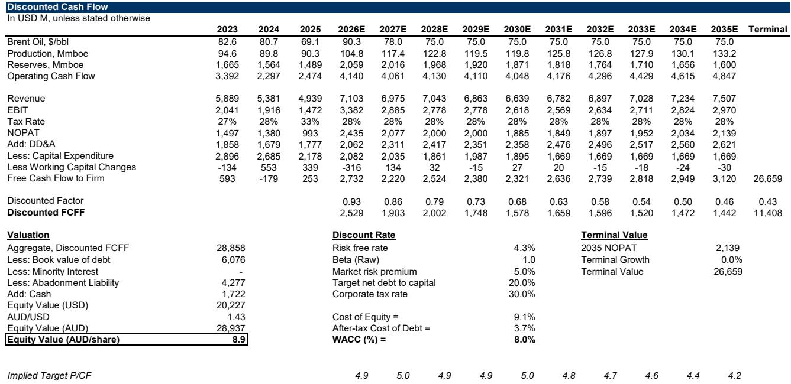
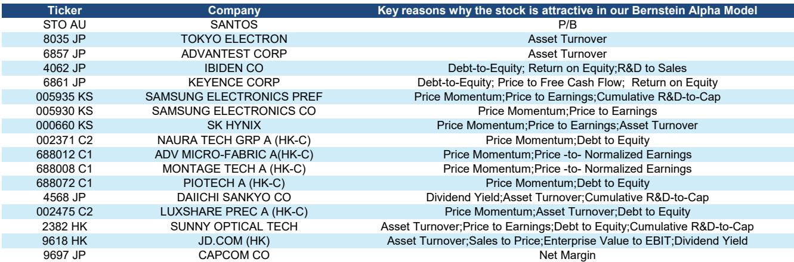
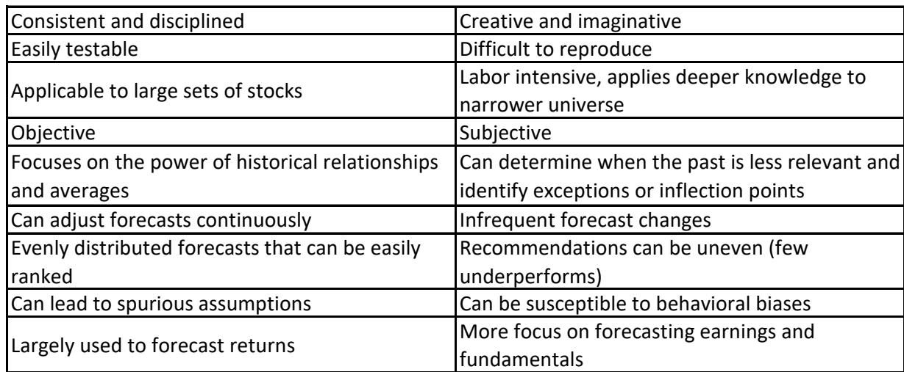

# Bernstein：亚洲量化与基本面组合-17只2H26精选标的

一份来自Bernstein的研究报告，试图回答一个长期困扰机构读者的问题：量化模型与基本面研究，哪一种选股方法更有效？该机构的结论是，两者结合的效果显著优于单一方法。报告以2026年7月为观察节点，筛选出17只在量化排名和基本面评级上同时靠前的亚洲公司，并回溯了这一组合策略的历史表现。

报告的核心证据来自其构建的“量化+基本面”组合的历史回测。自2013年以来，同时进入BernsteinAlpha模型最优两个五分位、且被该机构分析师给予“跑赢”评级的公司，年化超额回报达到9.4%。如果将条件收紧至仅取最优五分位，年化超额回报进一步升至13.2%。这一结果并非理论推演——该机构自2020年起每半年发布一次实盘组合，截至2026年6月，全部12期组合在等权重口径下均跑赢MSCI亚洲指数，市值加权口径下也有10期跑赢。

**KC评论：** 13.2%的年化超额回报在量化策略回测中并不罕见，但该报告的可信之处在于，它提供了自2020年以来连续12期实盘组合的跟踪记录。读者可以关注的是，这一策略在市值加权口径下仍有两次未能跑赢基准，说明策略的稳定性并非相对，但长期胜率确实较高。

## 1. 量化模型在亚洲市场长期有效，最优五分位年化超额6.1%

BernsteinAlpha模型在亚洲市场的有效性有较长历史数据支撑。过去20年，该模型最优五分位组合相对基准的年化超额回报为6.1%，信息比率1.35。自2013年以来，最优五分位与最差五分位之间的年化回报差为7.0%。模型包含三个维度：公司选择、行业/板块轮动和不确定性偏好信号。值得注意的是，该模型对新兴市场和发达市场使用了不同的不确定性偏好信号构建方式——在发达市场，不确定性规避表现为资金流入低波动等防御性因子；而在新兴市场，不确定性规避往往表现为资金直接流出新兴市场、回流发达市场，同时在新兴市场内部出现向流动性更好的标的迁移的现象。

## 2. 量化与基本面结合策略的历史回测表现优于单一方法

报告将Bernstein分析师的评级作为基本面选股的代理变量，与量化模型排名进行交叉验证。结果显示，同时被两者看好的公司，其表现优于仅被其中一方看好的公司。这一结论在逻辑上并不意外，但报告提供了具体的量化证据：自2013年以来，仅靠量化模型最优五分位的年化超额回报约为7.0%，仅靠分析师“跑赢”评级的组合表现也较为有限，而两者交集组合的年化超额回报则显著提升至13.2%以上。报告认为，量化模型的优势在于客观、一致和纪律性，而基本面研究的优势在于对商业模式、管理层质量和行业拐点的深度判断，两者互补而非替代。

## 3. 最新组合以科技股为主，覆盖半导体、消费电子、游戏和能源

截至2026年7月，入选的17只公司分布在五个行业，但科技股占据主导地位。具体包括：韩国三星电子（普通股和优先股）、SK海力士；中国相关市场的北方华创、中微公司、拓荆科技、澜起科技、立讯精密；相关市场的小米集团（报告原文为JD.COM，但根据上下文应为京东）、舜宇光学科技；日本的揖斐电、东京电子、爱德万测试、基恩士、第一三共、卡普空；以及澳大利亚的桑托斯。报告对每只公司均提供了量化排名靠前的原因摘要以及基本面分析师的看多逻辑。该组合将每半年调整一次，并持续跟踪报告表现。

> **KC评论：** 17只公司中，半导体相关标的超过半数，这反映了当前亚洲市场量化因子与基本面共识在半导体产业链上的高度重合。读者可以留意的是，该组合中既包含三星、SK海力士这类存储龙头，也包含北方华创、中微公司等中国半导体设备企业，以及东京电子、爱德万测试等日本设备与测试公司，覆盖了从设备到制造再到封测的多个环节。这种配置本身也暗示了该机构对亚洲半导体产业链整体景气度的判断。

## 4. 量化模型的不确定性偏好信号当前指向中性环境

报告特别指出，其构建的全球及美国不确定性偏好信号目前显示未来三个月处于中性不确定性环境。这一判断基于对债券利差、大宗商品价格变化、消费者信心、市值集中度、估值离散度、期权偏斜和波动率曲线等多个指标的综合评估。在中性环境下，量化模型的因子表现通常更为均衡，既不会过度偏向防御性因子，也不会过度偏向进攻性因子。这对于采用量化与基本面结合策略的读者而言，意味着当前可能是一个相对适合执行该策略的窗口期，但报告并未就此给出明确的研究交流。

For informational purposes only. Portions may be generated,translated,summarized,or edited with AI assistance based on source materials and may contain omissions or errors. Please verify independently. This is not investment,legal,tax,accounting,or other professional advice.

For informational purposes only. Portions may be generated,translated,summarized,or edited with AI assistance based on source materials and may contain omissions or errors. Please verify independently. This is not investment,legal,tax,accounting,or other professional advice.

