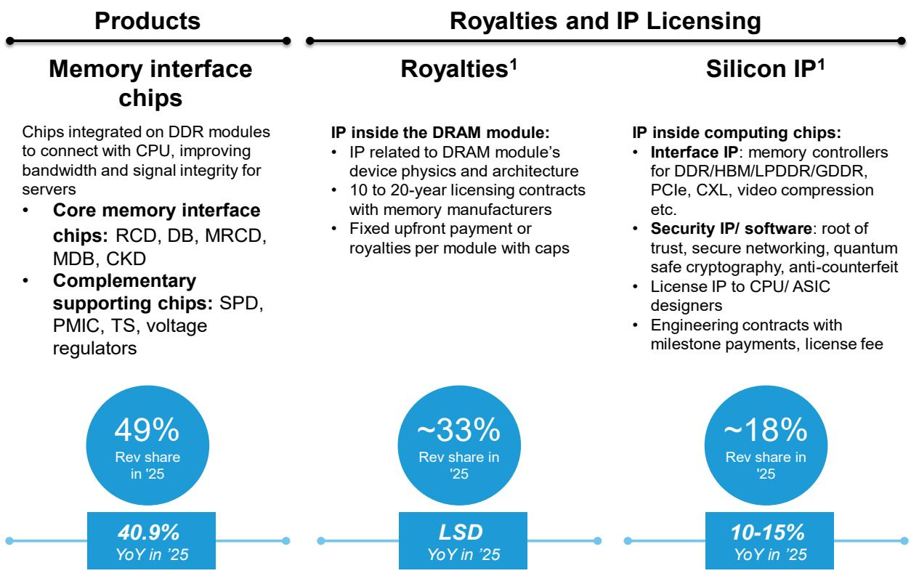
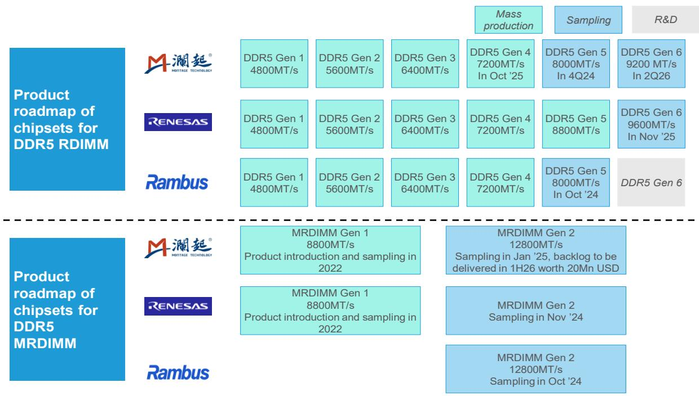
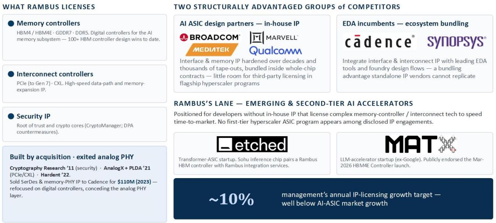

# Bernstein：中国半导体-全球内存接口芯片-竞争格局深度分析

全球内存接口芯片市场正进入一个结构性扩张阶段。Bernstein在最新发布的深度报告中，将这一市场的2030年规模预期上调至约200亿美元，对应2025至2030年间约65%的年复合增长率。驱动这一增长的核心力量来自三个相互叠加的因素：服务器CPU出货量的持续上升、单颗CPU搭载的DIMM模组数量增加，以及MRDIMM升级带来的单模组接口芯片价值量跃升——MRDIMM模组中的接口硅含量约为传统RDIMM的10倍。

报告认为，到2030年，MRDIMM中的MRCD和MDB芯片将贡献整个市场73%的规模。即便在服务器CPU出货量和MRDIMM渗透率的保守情景下，2030年市场仍可达到约80亿美元，节奏变化不确定性受到充分保护。

在这一快速扩张的市场中，三家头部供应商——澜起科技、瑞萨电子和Rambus——合计占据了2024年核心内存接口芯片市场90%以上的份额。Rambus以约21%的份额位列第三。报告指出，Rambus正受益于三个与AI相关的增长引擎：内存接口芯片受益于代理型AI推动的服务器CPU复兴，DRAM专利许可收入与内存技术迁移挂钩，计算芯片IP授权则受益于AI ASIC设计需求的增长。

> **KC评论：** Bernstein对TAM的测算包含了一个关键假设——MRDIMM渗透率在2030年达到25%至30%。这一数字是决定200亿美元规模能否实现的核心变量，也是读者评估三家供应商增长空间时最值得关注的参数。

## 1. 历史诉讼关系构成市场份额的结构性上限

Rambus的历史对其当前竞争地位产生了深远影响。报告详细回溯了该公司自2000年起与DRAM制造商之间长达二十年的专利诉讼历程，包括对英飞凌、SK海力士、美光的诉讼，以及美国联邦贸易委员会的反垄断调查。这些诉讼最终在2010至2013年间转化为与三星、SK海力士和美光的长期许可协议，奠定了其专利许可收入的基础。

但Bernstein认为，这段历史也构成了Rambus在内存接口芯片市场的结构性约束。DRAM制造商同时是内存接口芯片的客户和联合验证伙伴，它们倾向于与具有深度合作信任关系的供应商合作。报告指出，Rambus与存储器制造商之间“微妙的关系”可能限制其获得主导地位的能力。双源采购的行业惯例自然将份额向两家竞争对手倾斜。

在MRDIMM领域，Rambus选择了跳过第一代产品，直接进入第二代。这意味着其当前在MRDIMM接口芯片中的份额几乎可以忽略不计。报告模型显示，Rambus在MRDIMM接口芯片组的份额将从2026年的2%逐步上升至2030年的18%，这一假设已保守地将其长期份额设定为低于其在RDIMM中的份额。但报告同时强调，这一份额增长路径面临竞争格局和客户关系的双重约束。

## 2. 研发投入强度与收入增速的不匹配制约运营杠杆释放

Rambus的业务组合覆盖了内存接口芯片、内存控制器、互连IP、安全技术以及多个终端市场的应用。这种广泛的技术组合使其年度研发支出比澜起科技高出约40%至50%，而后者的技术组合更为聚焦。

报告认为，这种研发投入强度与收入增速之间的不匹配是理解Rambus财务表现的关键。由于前述竞争约束限制了收入增长，Rambus每单位研发支出产生的收入低于澜起科技。这意味着其运营杠杆的释放将更为渐进，净利润增速也将慢于澜起科技。

从业务结构看，Rambus的产品线（内存接口芯片）贡献了2025年49%的收入，同比增长40.9%，是公司最大且增长最快的板块。专利许可收入约占33%，增速仅为低个位数。计算芯片IP授权贡献了约18%的收入，管理层指引增速为10%至15%。报告指出，许可业务虽然利润率极高且具有经常性，但其增长受到合同结构的固有约束。

> **KC评论：** Bernstein对Rambus研发效率的分析揭示了一个容易被忽略的对比维度。澜起科技更集中的技术组合意味着其研发投入能更直接地转化为收入增长，而Rambus的广泛布局虽然扩大了可触达市场，但在当前竞争格局下，这一策略的回报效率可能低于市场预期。

## 3. 市场定价已反映增长差异，但行业贝塔仍提供支撑

报告指出，市场已对Rambus与澜起科技之间的增长差异进行了定价。Rambus相对于澜起科技的交易折价，反映了市场对其较慢收入和盈利增长的预期。但Bernstein同时强调，一家能够受益于65%行业复合增长率的企业，仍然是一个有吸引力的增长资产。

在具体产品布局上，Rambus正在推进“全芯片组”战略。管理层表示，客户在高速运行下越来越倾向于从单一供应商采购整个芯片组以确保互操作性。Rambus自2022年起通过内部开发补齐了此前在配套支持芯片上的缺口，目前可为RDIMM和MRDIMM提供完整的内部芯片组。管理层预计，到2026年底，配套支持芯片将贡献中双位数的收入占比。此外，Rambus目前是SOCAMM2接口芯片的相对少见供应商，在新型插槽领域占据先发位置。

这些产品层面的进展，叠加行业TAM的高速扩张，构成了Rambus增长故事的基本面支撑。但报告的核心判断仍然清晰：在竞争格局和客户关系的双重约束下，Rambus的增长速度将慢于澜起科技，这一差异已部分反映在当前的市场定价中。

For informational purposes only. Portions may be generated,translated,summarized,or edited with AI assistance based on source materials and may contain omissions or errors. Please verify independently. This is not investment,legal,tax,accounting,or other professional advice.

For informational purposes only. Portions may be generated,translated,summarized,or edited with AI assistance based on source materials and may contain omissions or errors. Please verify independently. This is not investment,legal,tax,accounting,or other professional advice.

