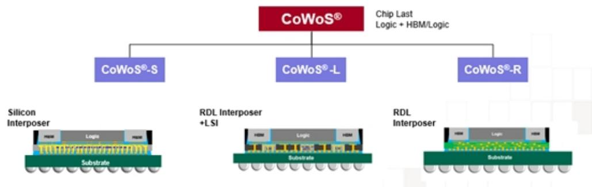
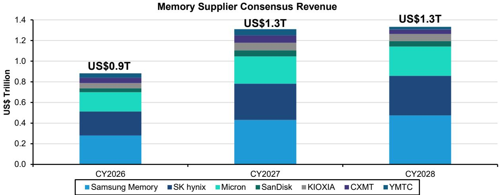
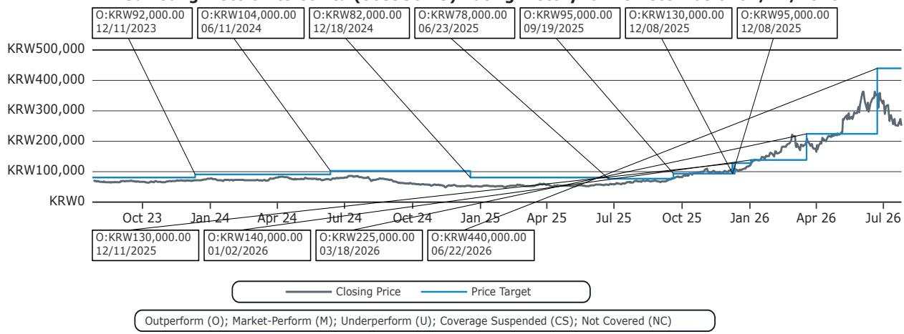
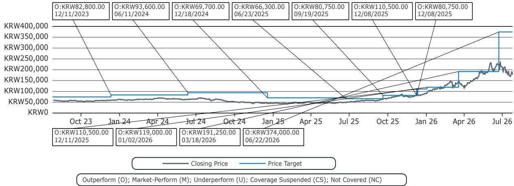
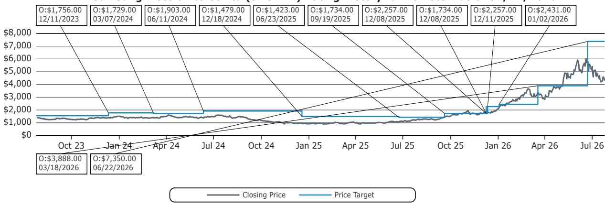
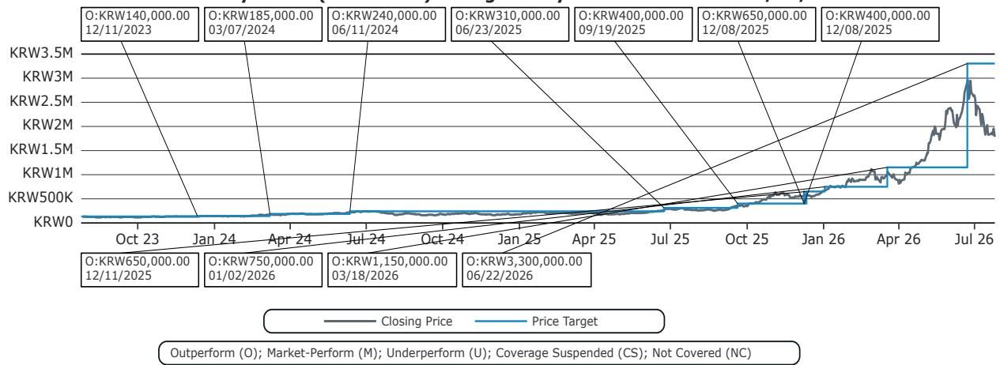
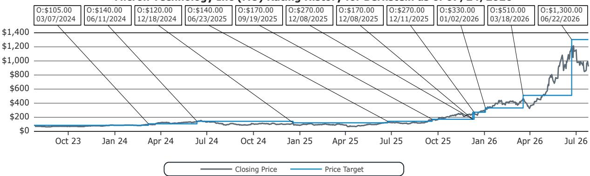
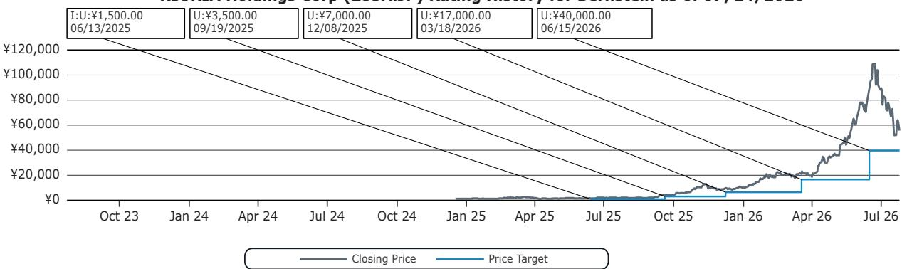
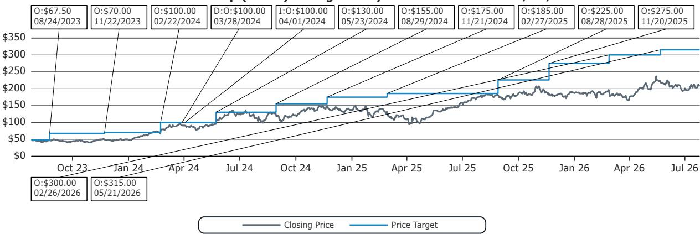
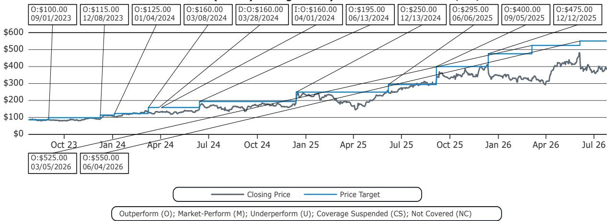

# Global Memory: Observations on Strategic Partnerships

Mark Li
+852 2123 2645
mark.li@bernsteinsg.com

Stacy A. Rasgon, Ph.D.
+1 213 559 5917
stacy.rasgon@bernsteinsg.com

Edward Hou, CFA
+852 2123 2623
edward.hou@bernsteinsg.com

Yipin Cai, CFA
+852 2123 2669
yipin.cai@bernsteinsg.com

Alrick Shaw
+1 917 344 8454
alrick.shaw@bernsteinsg.com

Arpad von Nemes
+1 917 344 8461
arpad.vonnemes@bernsteinsg.com

Eva Zhang
+1 212 845 7839
eva.zhang@bernsteinsg.com

At the AI Summit held by the Korean government in San Francisco on Friday, Samsung, SK hynix, NVIDIA & Broadcom announced partnerships (press release from Samsung, SK hynix, NVIDIA) on memory, foundry & AI data centers.

SK hynix & NVIDIA signed letters of intent & provided details to what was announced on July 7 (link & link), including US\$500B+ for the size of the partnership spanning memory & a 2GW Vera Rubin DSX AI Factory planned to be online for SK Telecom in 2027. We note the memory partnership includes long-term technical developments & stable supply of next-gen AI memory (HBM4 & later?) to enable SK hynix to "expand the foundation for growth." We also note that SK Group reportedly (link & link) will additionally collaborate with other global tech companies for memory supply worth US\$250B over the next 5 years.

Samsung & Broadcom signed a MOU on US\$200B worth of memory (including HBM) & foundry service over the next 5 years through 2030. The foundry service will focus on 2nm & below for products such as Wireless Broadband Communications solutions (but how about AI ASIC?) as well as 2.3D (Exhibit 1, Exhibit 2) (Cube-E & -R, similar to TSMC CoWoS-L and -R) & 2.5D (Cube-S, similar to TSMC CoWoS-S) advanced packaging technology for "AI & networking" silicon.

We think this underscores the importance of memory in AI. We believe the announced amounts are more for memory and indicate the need for NVIDIA & Broadcom to secure memory supply. And though we can't precisely quantify the impact of the announcements, to help observers put them into context we note the consensus expects overall memory annual revenues to be c. US\$1.3T in both 2027 & 2028 (Exhibit 3).

The impact on TSMC should be negligible. We note that the announcement is unclear on if Broadcom will produce AI ASIC at Samsung for wafer or advanced packaging. In any case as there is a queue of demand waiting for TSMC's capacity, we don't think a share loss, if any, to Samsung or Intel, will affect TSMC's foreseeable earnings.

We remain constructive on memory & find the recent pullback a point of interest. We find memory is more important to AI than logic semiconductors and are thus positive on demand. We however note the long-term considerations from China in NAND and thus rate KIOXIA Underperform. The considerations are much lower in DRAM as China eventually will find it difficult to compete in DRAM market without EUV. We thus rate Samsung, SK hynix and Micron Outperform.

And these deals may help to address supply considerations for NVDA and AVGO given both have guided for strong AI growth going forward (NVDA at ~\$1T across CY25-27 suggestive of close to \$500B next year, and AVGO at \$100B+ next year). We rate both companies Outperform.

## BERNSTEIN TICKER TABLE

<table><tr><td rowspan="3">Ticker</td><td rowspan="3">Rating</td><td colspan="4">24 Jul 2026</td><td rowspan="2">TTMRel.</td><td colspan="4">Reported EPS</td><td colspan="3">Reported P/E (x)</td></tr><tr><td></td><td rowspan="2">ClosingPrice</td><td rowspan="2">PriceTarget</td><td rowspan="2">Perf.</td><td></td><td></td><td></td><td></td><td></td><td></td><td></td></tr><tr><td>Cur</td><td>Cur</td><td>2025A</td><td>2026E</td><td>2027E</td><td>2025A</td><td>2026E</td><td>2027E</td><td></td></tr><tr><td>005930.KS (SEC- Samsung)</td><td>O</td><td>KRW</td><td>252,500</td><td>440,000</td><td>256.0%</td><td>KRW</td><td>6,611.53</td><td>48,393</td><td>77,273</td><td>38.2</td><td>5.2</td><td>3.3</td><td></td></tr><tr><td>005935.KS (SEC-Pref - Samsung)</td><td>O</td><td>KRW</td><td>177,100</td><td>374,000</td><td>198.4%</td><td>KRW</td><td>6,611.53</td><td>48,393</td><td>77,273</td><td>26.8</td><td>3.7</td><td>2.3</td><td></td></tr><tr><td>SMSN.LI (Samsung)</td><td>O</td><td>USD</td><td>4,296.00</td><td>7,350.00</td><td>233.0%</td><td>USD</td><td>116.15</td><td>812.39</td><td>1,290.80</td><td>37.0</td><td>5.3</td><td>3.3</td><td></td></tr><tr><td>000660.KS (SK hynix)</td><td>O</td><td>KRW</td><td>1,781,000</td><td>3,300,000</td><td>542.4%</td><td>KRW</td><td>60,341</td><td>395,677</td><td>568,862</td><td>29.5</td><td>4.5</td><td>3.1</td><td></td></tr><tr><td>MU (Micron)</td><td>O</td><td>USD</td><td>920.95</td><td>1,300.00</td><td>707.8%</td><td>USD</td><td>8.29</td><td>67.39</td><td>158.99</td><td>111.1</td><td>13.7</td><td>5.8</td><td></td></tr><tr><td>285A.JP (KIOXIA)</td><td>U</td><td>JPY</td><td>56,010</td><td>40,000</td><td>2152.4%</td><td>JPY</td><td>1,014.00</td><td>10,013</td><td>9,656.84</td><td>55.2</td><td>5.6</td><td>5.8</td><td></td></tr><tr><td>NVDA (NVIDIA)</td><td>O</td><td>USD</td><td>206.84</td><td>315.00</td><td>2.6%</td><td>USD</td><td>4.77</td><td>9.19</td><td>12.52</td><td>43.3</td><td>22.5</td><td>16.5</td><td></td></tr><tr><td>AVGO (Broadcom)</td><td>O</td><td>USD</td><td>381.92</td><td>550.00</td><td>15.8%</td><td>USD</td><td>6.82</td><td>11.60</td><td>18.69</td><td>56.0</td><td>32.9</td><td>20.4</td><td></td></tr><tr><td>ASIAX</td><td></td><td></td><td>1,880.30</td><td></td><td></td><td></td><td></td><td></td><td></td><td></td><td></td><td></td><td></td></tr><tr><td>EM</td><td></td><td></td><td>1,745.51</td><td></td><td></td><td></td><td></td><td></td><td></td><td></td><td></td><td></td><td></td></tr><tr><td>SPX</td><td></td><td></td><td>7,411.98</td><td></td><td></td><td></td><td></td><td></td><td></td><td></td><td></td><td></td><td></td></tr></table>

O - Outperform, M - Market-Perform, U - Underperform, NR - Not Rated, CS - Coverage Suspended
MU, NVDA, AVGO estimate is Adjusted EPS; MU, NVDA, AVGO valuation is Adjusted P/E (x); NVDA base year is 2026;
Source: Bloomberg, Bernstein estimates and analysis.

## OBSERVATIONS

Samsung Electronics: We rate Samsung Electronics Outperform with price target of KRW 440,000.

SK hynix : We rate SK hynix Outperform with price target of KRW 3,300,000.

NVDA (Outperform, \$315 PT): The datacenter opportunity is substantial, and still early, with material upside still possible.

AVGO (Outperform, \$550 PT): A strong 2026 AI trajectory seems set to accelerate into 2027 and beyond, bolstered by software, cash deployment, and margins & FCF.

## DETAILS

EXHIBIT 1: Samsung 2.5D Cube-S is similar to TSMC CoWoS-S, and 2.3D Cube-E & -R are similar to TSMC CoWoS-L & -R, respectively.  
  
Source: Samsung, Bernstein analysis

EXHIBIT 2: TSMC offers three variants of CoWoS.  
  
Source: TSMC, Bernstein analysis

EXHIBIT 3: Consensus memory industry to generate c. US\$1.3T annual revenue in both 2027 & 2028.  
  
Note: CXMT & YMTC revenue is based on Bernstein estimates  
Source: Company reports, Bloomberg, Bernstein estimates and analysis

## I. REQUIRED DISCLOSURES

References to "Bernstein" or the "Firm" in these disclosures relate to the following entities: Bernstein Institutional Services LLC (April 1, 2024 onwards), Bernstein & Co., LLC (pre April 1, 2024), Bernstein Autonomous LLP, BSG France S.A. (April 1, 2024 onwards), Bernstein (Hong Kong) Limited 盛博香港有限公司, Bernstein (Canada) Limited, Bernstein (India) Private Limited (SEBI registration no. INH000006378), Bernstein (Singapore) Private Limited, Bernstein Japan KK (サンフォード・C・バーンスタイン株式会社) and analysts employed by SG Africa Technologies & Services to produce Bernstein under a Global Services Agreement in place between Bernstein and SG.

Bernstein is part of a joint venture between SG (SG) and AllianceBernstein, L.P. (AB). Unless specifically noted otherwise, for purposes of these disclosures, references to Bernstein's "affiliates" relate to both SG and AB and their respective affiliates.

## VALUATION METHODOLOGY

## Samsung Electronics Co Ltd

We value Samsung Electronics with 6.2x of forward 5Q-8Q EPS of KRW71,172 and arrive at price target of KRW 440,000 for its common shares, KRW374,000 for preferred shares, and US\$7,350 for GDR.

## SK Hynix Inc

We value SK hynix with 6.2x of forward 5Q-8Q EPS of KRW536,158 and arrive at price target of KRW3,300,000.

## Micron Technology Inc

We value Micron with 7.7x of forward 5Q-8Q EPS of US\$169.8 and arrive at price target of US\$1,300.

## KIOXIA Holdings Corp

We value KIOXIA with 4.1x of 1-year forward EPS of ¥9,810 and arrive at price target of ¥40,000.

## NVIDIA Corp

We apply a ~25x multiple to our FY28 (CY27) non-GAAP EPS estimate of \$12.52 and set our price target at \$315.

## Broadcom Inc

For AVGO, we apply a ~25x multiple to the average of our FY2027/28 pro-forma EPS estimate (\$22.17) equating to a \$550 price target.

## RISKS

## Samsung Electronics Co Ltd

The biggest downside risk to our target price is an earlier end of favorable pricing environment, which can be a result of weaker demand or higher supply. Sentiment and hence the valuation rewarded by observers is also a risk. China's progress in memory, especially in NAND, is a downside risk too.

## SK Hynix Inc

The biggest downside risk to our target price is an earlier end of favorable pricing environment, which can be a result of weaker demand or higher supply. Sentiment and hence the valuation rewarded by observers is also a risk. China's progress in memory, especially in NAND, is a downside risk too.

## Micron Technology Inc

The biggest downside risk to our target price is an earlier end of favorable pricing environment, which can be a result of weaker demand or higher supply. Sentiment and hence the valuation rewarded by observers is also a risk. China's progress in memory, especially in NAND, is a downside risk too.

## KIOXIA Holdings Corp

Upside risk to our target price include 1) stronger than expected NAND demand growth, which likely would lead to better NAND pricing and hence company earnings, 2) favorable policy support from Japanese government such as capex subsidies, and 3) better than expected cost reduction

## NVIDIA Corp

Downside risks to our price target include potential for lumpiness in near-term business trends, slower than expected revenue growth in key end markets (impacting the stock's multiple and reducing opex leverage), risk of competitors pressuring share or pricing, customers migrating to internal silicon, and/or regulatory risks around technology exports.

## Broadcom Inc

Downside risks to our price target on AVGO include unexpected AI weakness or air pocket, share and/or socket losses at key customers, failure to execute on targeted merger synergies, lack of cash return, and unexpected changes to top management.

## RATINGS DEFINITIONS, BENCHMARKS AND DISTRIBUTION

## EQUITY RATINGS DEFINITIONS

## Bernstein brand

The Bernstein brand rates stocks based on forecasts of relative performance for the next 12 months versus the S&P 500 for stocks listed on the U.S. and Canadian exchanges, versus the Bloomberg Europe Developed Markets Large and Mid Cap Price Return Index EUR (EDME) for stocks listed on the European exchanges and emerging markets exchanges outside of the Asia Pacific region, versus the Bloomberg Japan Large and Mid Cap Price Return Index USD (JPL) for stocks listed on the Japanese exchanges, and versus the Bloomberg Asia ex-Japan Large and Mid Cap Price Return Index (ASIAX) for stocks listed on the Asian (ex-Japan) exchanges -unless otherwise specified.

The Bernstein brand has three categories of ratings:

\- Outperform: Stock will outpace the market index by more than 15 pp

• Market-Perform: Stock will perform in line with the market index to within +/-15 pp

• Underperform: Stock will trail the performance of the market index by more than 15 pp

Coverage Suspended: Coverage of a company under the Bernstein brand has been suspended. Ratings and price targets are suspended temporarily, are no longer current, and should therefore not be relied upon.

Not Rated: A rating assigned when the stock cannot be accurately valued, or the performance of the company accurately predicted, at the present time. The covering analyst may continue to publish research reports on the company to update observers on events and developments.

Not Covered (NC) denotes companies that are not under coverage.

Bernstein brand stock ratings are based on a 12-month time horizon.

## Autonomous brand – common stocks

The Autonomous brand rates common stocks as indicated below. As our benchmarks we use the Bloomberg Europe 600 Financials Price Return Index (E600BK) and Bloomberg Europe Dev Mkt Financials Large and Mid Cap Price Ret Index EUR (EDMFI) index for developed European banks and Payments, the Bloomberg Europe 600 Insurance Price Return Index (E600IN) for European insurers, the S&P 500 and S&P Financials for US banks and Payments coverage, S5LIFE for US Insurance, the S&P Insurance Select Industry (SPSIINS) for US Non-Life Insurers coverage, the Bloomberg Emerging Markets Financials Large, Mid and Small Cap Price Return Index (EMLSF) for emerging market banks and insurers and Payments, and the Bloomberg Japan Financials Large & Mid Cap Price Return Index (JPFILM) for Japanese Financials. Ratings are stated relative to the sector (not the market).

The Autonomous brand has three categories of common stock ratings:

\- Outperform (OP): Stock will outpace the relevant index by more than 10 pp

\- Neutral (N): Stock will perform in line with the market index to within +/-10 pp

• Underperform (UP): Stock will trail the performance of the relevant index by more than 10 pp

Coverage Suspended: Coverage of a company under the Autonomous research brand has been suspended. Ratings and price targets are suspended temporarily, are no longer current, and should therefore not be relied upon.

Not Rated: A rating assigned when the stock cannot be accurately valued, or the performance of the company accurately predicted, at the present time. The covering analyst may continue to publish research reports on the company to update observers on events and developments.

Those denoted as 'Feature' (e.g., Feature Outperform FOP, Feature Under Outperform FUP) are our core ideas.

Not Covered (NC) denotes companies that are not under coverage.

Autonomous brand common stock ratings are based on a 12-month time horizon.

## Autonomous brand – preferred stocks

The Autonomous brand has three categories of preferred stock ratings:

\- Outperform (OP): The total return of the preferred instrument is expected to outperform preferred securities of other issuers operating in similar sectors or rating categories over the next six months.

\- Neutral (N): The total return of the preferred instrument is expected to perform in line with preferred securities of other issuers operating in similar sectors or rating categories over the next six months.

\- Underperform (UP): The total return of the preferred instrument is expected to underperform preferred securities of other issuers operating in similar sectors or rating categories over the next six months.

Autonomous preferred stock ratings are based on a 6-month time horizon.

## AUTONOMOUS CREDIT RESEARCH

Where this report contains investment recommendations for credit instruments, as defined in article 3(1)(35) of the Market Abuse Regulation, the information below is presented to comply with its disclosure requirements.

The report may also include reference(s) to published opinions by other Autonomous or Bernstein analysts covering the equity securities of the issuer(s) referenced herein. Please note an investment recommendation for credit instruments published by the author(s) of this report may differ from the published view of the analyst covering equity securities for the issuer(s) contained in this report and vice versa.

## CREDIT RATINGS DEFINITIONS

The Autonomous brand has three categories of credit ratings:

\- Credit Outperform (C-OP): The total return of the Reference Credit Instrument is expected to outperform the credit spread of bonds of other issuers operating in similar sectors or rating categories over the next six months.

\- Credit Neutral (C-N): The total return of the Reference Credit Instrument is expected to perform in line with the credit spread of bonds of other issuers operating in similar sectors or rating categories over the next six months.

\- Credit Underperform (C-UP): The total return of the Reference Credit Instrument is expected to underperform the credit spread of bonds of other issuers operating in similar sectors or rating categories over the next six months.

Autonomous credit ratings are based on a 6-month time horizon.

A list of all investment recommendations produced by the author(s) of this report alongside credit ratings history are available upon request.

It is at the sole discretion of the Firm as to when to initiate, update and cease research coverage. The Firm has established, maintains and relies on information barriers to control the flow of information contained in one or more areas (i.e. the private side) within the Firm, and into other areas, units, groups or affiliates (i.e. public side) of the Firm

## DISTRIBUTION OF EQUITY RATINGS/INVESTMENT BANKING SERVICES

<table><tr><td>Equity Rating</td><td>Market Abuse Regulation (MAR) and FINRA Rating Category</td><td>Global Rating Distribution</td><td>Investment Banking Relationships*</td></tr><tr><td>Outperform</td><td>BUY</td><td>51.2%</td><td>15.3%</td></tr><tr><td>Market-Perform (Bernstein Brand) Neutral (Autonomous Brand)</td><td>HOLD</td><td>35.8%</td><td>16.2%</td></tr><tr><td>Underperform</td><td>SELL</td><td>13.1%</td><td>13.6%</td></tr></table>

\* These figures represent the percentage of companies within each equity rating category for which affiliates of Bernstein have provided investment banking services within the previous 12 months.
As of June 30, 2026. All figures are updated quarterly.

## PRICE CHARTS / RATINGS AND PRICE TARGET HISTORY

Prior to April 1, 2024, Bernstein & Co., LLC. issued the ratings and price target information in the graph(s) below for the following companies: NVIDIA Corp and Broadcom Inc.

Samsung Electronics Co Ltd (005930.KS) Rating History for Bernstein as of 07/24/2026  

Samsung Electronics Co Ltd (005935.KS) Rating History for Bernstein as of 07/24/2026  

Samsung Electronics Co Ltd (SMSN.LI) Rating History for Bernstein as of 07/24/2026  

SK Hynix Inc (000660.KS) Rating History for Bernstein as of 07/24/2026  

Micron Technology Inc (MU) Rating History for Bernstein as of 07/24/2026  
  
Outperform (O); Market-Perform (M); Underperform (U); Coverage Suspended (CS); Not Covered (NC)

KIOXIA Holdings Corp (285A.JP) Rating History for Bernstein as of 07/24/2026  
  
Outperform (O); Market-Perform (M); Underperform (U); Coverage Suspended (CS); Not Covered (NC)

NVIDIA Corp (NVDA) Rating History for Bernstein as of 07/24/2026  
  
Outperform (O); Market-Perform (M); Underperform (U); Coverage Suspended (CS); Not Covered (NC)

Broadcom Inc (AVGO) Rating History for Bernstein as of 07/24/2026  
  
All price target and closing price data in the chart(s) above are denominated in the currency noted in the Ticker Table of this report.

## CONFLICTS OF INTEREST

All statements in this report attributable to Gartner represent Bernstein's interpretation of data, research opinion or viewpoints published as part of a syndicated subscription service by Gartner, Inc., and have not been reviewed by Gartner. Each Gartner publication speaks as of its original publication date (and not as of the date of this report). The opinions expressed in Gartner publications are not representations of fact, and are subject to change without notice.

Stacy A. Rasgon maintains long positions in various crypto currencies.

SG and/or its affiliates beneficially own 0.5% or more of [the total issued share capital/any class of common equity securities] with a net [long/short] position of: Micron Technology Inc and KIOXIA Holdings Corp.

SG and/or its affiliates beneficially own 1% or more of a class of common equity securities of the following company: KIOXIA Holdings Corp.

Bernstein Autonomous LLP or BSG France SA, beneficially, has either a net long or short position of 0.5% or more of the total issued share capital of a class of common equity securities of the following MiFID eligible securities: Broadcom Inc.

Bernstein has received compensation for non-investment banking securities-related products or services in the previous twelve months from the following clients: Samsung Electronics Co Ltd and NVIDIA Corp.

Bernstein and/or affiliates have received compensation for non-investment banking securities-related products or services in the previous twelve months from the following clients: Samsung Electronics Co Ltd, SK Hynix Inc and KIOXIA Holdings Corp.

Certain affiliates of Bernstein act as market maker or liquidity provider in the debt securities of: SK Hynix Inc, KIOXIA Holdings Corp, NVIDIA Corp and Broadcom Inc.

Certain affiliates of Bernstein act as market maker or liquidity provider in the equities securities of: Micron Technology Inc, NVIDIA Corp and Broadcom Inc.

## OTHER MATTERS

The legal entity(ies) employing the analyst(s) listed in this report, and their location, can be determined by the country code of their phone number, as follows:

+1 Bernstein Institutional Services LLC; New York, New York, USA

+44 Bernstein Autonomous LLP; London UK

+212 SG Africa Technologies & Services; Casablanca, Morocco

+33 BSG France S.A.; Paris, France

+34 BSG France S.A.; Madrid, Spain

+41 Bernstein Autonomous LLP; Geneva, Switzerland

+49 BSG France S.A.; Frankfurt, Germany

+91 Bernstein (India) Private Limited; Mumbai, India

+852 Bernstein (Hong Kong) Limited 盛博香港有限公司; Hong Kong, China

+65 Bernstein (Singapore) Private Limited; Singapore

+81 Bernstein Japan KK; Tokyo, Japan

Where this report has been prepared by research analyst(s) employed by a non-US affiliate, such analyst(s), is/are (unless otherwise expressly noted below) not registered as associated persons of Bernstein Institutional Services LLC or any other SEC-registered broker-dealer and are not licensed or qualified as research analysts with FINRA. Accordingly, such analyst(s) may not be subject to FINRA's restrictions regarding (among other things) communications by research analysts with a subject company, interactions between research analysts and investment banking personnel, participation by research analysts in solicitation and marketing activities relating to investment banking transactions, public appearances by research analysts, and trading securities held by a research analyst account.

Where this report has been prepared by research analyst(s) employed by SG Africa Technologies & Services (part of the SG group of companies), it has been prepared on behalf of a Bernstein company under a Global Services Agreement in place between Bernstein and SG.

## CERTIFICATION

Each research analyst listed in this report, who is primarily responsible for the preparation of the content of this report, certifies that all of the views expressed in this publication accurately reflect that analyst's personal views about any and all of the subject securities or issuers and that no part of that analyst's compensation was, is, or will be, directly or indirectly, related to the specific recommendations or views in this publication.

## II. ADDITIONAL GLOBAL CONFLICT DISCLOSURES

It is at the sole discretion of the Firm as to when to initiate, update and cease research coverage. The Firm has established, maintains and relies on information barriers to control the flow of information contained in one or more areas (i.e., the private side) within the Firm, and into other areas, units, groups or affiliates (i.e., public side) of the Firm.

## III. OTHER IMPORTANT INFORMATION AND DISCLOSURES

Separate branding is maintained for "Bernstein" and "Autonomous" research products.

\- Bernstein produces a number of different types of research products including, among others, fundamental analysis and quantitative analysis under both the "Autonomous" and "Bernstein" brands. Recommendations contained within one type of research product may differ from recommendations contained within other types of research products, whether as a result of differing time horizons, methodologies or otherwise. Furthermore, views or recommendations within a research product issued under one brand may differ from views or recommendations under the same type of research product issued under the other brand. The Research Ratings System for the two brands and other information related to those Rating Systems are included in the previous section.

\- Autonomous operates as a separate business unit within the following entities: Bernstein Institutional Services LLC, Bernstein Autonomous LLP, Bernstein (Hong Kong) Limited 盛博香港有限公司 and Bernstein (India) Private Limited. For information relating to "Autonomous" branded products (including certain Sales materials) please visit: www.autonomous.com. For information relating to Bernstein branded products please visit: www.bernsteinresearch.com.

Analysts are compensated based on aggregate contributions to the research franchise as measured by account penetration, productivity and proactivity of ideas. No analysts are compensated based on performance in, or contributions to, generating investment banking revenues.

This report has been produced by an independent analyst as defined in Article 3 (1)(34)(i) of EU 596/2014 Market Abuse Regulation ("MAR") and the same article of MAR as it forms part of United Kingdom domestic law by virtue of the European Union (Withdrawal) Act 2018.

To our readers in the United States: Bernstein Institutional Services LLC, a broker-dealer registered with the U.S. Securities and Exchange Commission ("SEC") and a member of the U.S. Financial Industry Regulatory Authority, Inc. ("FINRA") is distributing this publication in the United States and accepts responsibility for its contents. Where this material contains an analysis of debt product(s), such material is intended only for institutional investors and is not subject to the US independence and disclosure standards applicable to debt research prepared for retail investors.

Bernstein Institutional Services LLC may act as principal for its own account or as agent for another person (including an affiliate) in sales or purchases of any security which is a subject of this report. This report does not purport to meet the objectives or needs of any specific individuals, entities or accounts.

To our readers in Canada: If this publication pertains to a Canadian domiciled company, it is being distributed in Canada by Bernstein (Canada) Limited, which is licensed and regulated by the Canadian Investment Regulatory Organization. If the publication pertains to a non-Canadian domiciled company, it is being distributed by Bernstein Institutional Services LLC, which is licensed and regulated by both the SEC and FINRA, into Canada under the International Dealers Exemption.

This document may not be passed onto any person in Canada unless that person qualifies as "permitted client" as defined in Section 1.1 of NI 31-103.

To our readers in Brazil: This report has been prepared by Bernstein Institutional Services LLC, and Banco BTG Pactual S.A. ("BTG") is responsible for the distribution of this report in Brazil.

To readers in the United Kingdom: This publication has been issued or approved for issue in the United Kingdom by Bernstein Autonomous LLP, authorised and regulated by the Financial Conduct Authority and located at 60 London Wall, London EC2M 5SH, +44 (0)20-7170-5000. Registered in England & Wales No OC343985.

This document is for distribution only to persons who (i) have professional experience in matters relating to investments falling within Article 19(5) of the Financial Services and Markets Act 2000 (Financial Promotion) Order 2005 (as amended, the "Financial Promotion Order"), (ii) are persons falling within Article 49(2)(a) to (d) ("high net worth companies, unincorporated associations, etc.") of the Financial Promotion Order, (iii) are outside the United Kingdom, or (iv) are persons to whom an invitation or inducement to engage in investment activity (within the meaning of section 21 of the FSMA) in connection with the issue or sale of any securities may otherwise lawfully be communicated or caused to be communicated (all such persons together being referred to as "relevant persons"). This document is directed only at relevant persons and must not be acted on or relied on by persons who are not relevant persons. Any investment or investment activity to which this document relates is available only to relevant persons and will be engaged in only with relevant persons.

To our readers in the member states of the EEA: This publication is being distributed by BSG France SA, which is authorised and regulated by the Autorité de Contrôle Prudentiel et de Résolution (ACPR) and Autorité des Marchés Financiers (AMF).

To our readers in Hong Kong: This publication is being distributed in Hong Kong by Bernstein (Hong Kong) Limited 盛博香港有限公司, which is licensed and regulated by the Hong Kong Securities and Futures Commission (Central Entity No. AXC846) to carry out Type 4 (Advising on Securities) regulated activities and subject to the licensing conditions mentioned in the SFC Public Register (https://www.sfc.hk/publicregWeb/corp/AXC846/details)). This publication is solely for professional investors, as defined in the Securities and Futures Ordinance (Cap. 571). The purpose of this report is solely to provide an analysis of the issuers referred to in this report and is not intended for any purpose contrary to the laws
