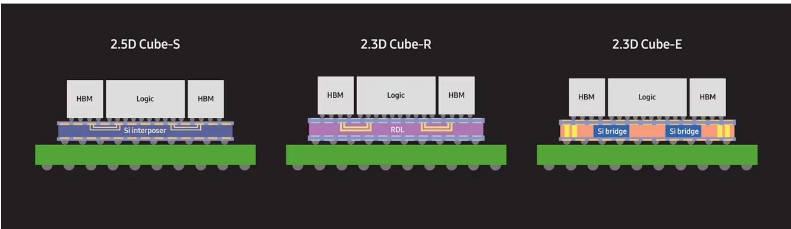

# NVIDIA与Broadcom的7500亿美元存储协议揭示战略现实：AI瓶颈已从算力转向存储供应

在韩国政府于旧金山举办的AI峰会上，最引人注目的公告并非新的芯片架构或模型效率突破，而是一系列供应协议——这些协议合计承诺超过7500亿美元用于单一组件类别：存储。SK海力士与NVIDIA签署了意向书，正式确立了一项价值超过5000亿美元的合作伙伴关系，涵盖下一代AI存储以及计划于2027年建成的2GW Vera Rubin DSX AI工厂。此外，三星与Broadcom签署了一份谅解备忘录，涉及至2030年价值2000亿美元的存储与代工服务。这些并非探索性备忘录，而是具有约束力的战略承诺，将AI基础设施建设从以算力为中心的竞赛重新定义为受存储约束的竞赛。对于观察者而言，其含义明确：控制先进存储供应的公司，而不仅仅是GPU设计公司，将在下一轮AI资本支出周期中占据最不对称的优势。

这些协议的规模要求重新评估市场对存储公司的估值方式。共识预测显示，整个存储行业在2027年和2028年的年收入约为1.3万亿美元。NVIDIA-SK海力士与Broadcom-三星协议的总面值接近7500亿美元——超过多年期行业预测收入的一半。这种集中度前所未有。这表明，AI硅片的两大买家正在预先锁定供应，而非依赖现货市场。将存储视为大宗商品输入的时代已经结束。存储已成为一种战略资产类别，定价权正果断地向拥有技术和能力提供HBM4及更先进产品的供应商转移。

## 这些供应协议的规模表明，存储而非逻辑芯片，是AI基础设施中的约束条件

这一算术关系简单明了，但在围绕AI半导体投资的叙述中常被忽视。NVIDIA预计2025至2027日历年的数据中心累计收入约为1万亿美元，这意味着仅下一年就将接近5000亿美元。Broadcom预计明年AI收入将超过1000亿美元。为实现这些目标，两家公司都需要获得高带宽存储的保障，而不仅仅是台积电的晶圆启动量。5000亿美元的SK海力士合作伙伴关系和2000亿美元的三星协议，本质上是对供应瓶颈的保险——否则该瓶颈将限制收入增长。市场一直关注台积电能否生产足够的CoWoS中介层。真正的问题是存储行业能否生产足够的HBM堆栈来填充这些中介层。基于这些承诺，答案是买家不愿将此事交由运气决定。

## 三星的代工与先进封装策略直接挑战台积电的主导地位，但短期内对台积电的影响微乎其微

三星-Broadcom的谅解备忘录包括专注于2纳米及以下工艺的无线宽带通信解决方案代工服务，以及三星的2.3D Cube-E和Cube-R封装技术——直接对标台积电的CoWoS-L和CoWoS-R——以及2.5D Cube-S，对标CoWoS-S。其战略意图明确：三星正将自己定位为AI硅片领域台积电的全栈替代方案，而不仅仅是存储供应商。Broadcom作为定制AI ASIC最重要的设计商之一，正在实现制造基地的多元化。然而，短期内对台积电的影响应微乎其微。等待台积电产能的需求队列很长，任何向三星或英特尔的市场份额流失都需要数年时间才能显现，且仅影响边际晶圆。台积电的盈利轨迹由AI硅片的相对数量驱动，而非Broadcom是否将其部分ASIC生产分配给三星。更重要的解读是，三星的封装路线图现已足够可信，能够吸引Broadcom这样规模的合作伙伴，这验证了先进封装正成为独立利润中心，而不仅仅是逻辑制造的辅助功能。

## 存储-逻辑不对称性有利于DRAM供应商而非NAND供应商，EUV光刻的结构性壁垒保护DRAM免受中国竞争

当分析从需求侧转向存储内部的竞争动态时，出现了一个关键区别。来自中国供应商的长期威胁在NAND领域是真实的，因为其资本密集度和工艺复杂性较低。纯NAND制造商KIOXIA在Bernstein分析中正是由于这一脆弱性而被评为“报告观点”。在DRAM领域，情况则不同。先进DRAM的生产，特别是驱动AI工作负载的高带宽存储，需要极紫外光刻技术。中国的国内DRAM行业在无法获得EUV设备的情况下将难以竞争，这些设备仍受出口管制，且在可预见的未来不太可能大规模可用。这为三星、SK海力士和美光创造了一道在NAND领域不存在的结构性护城河。这种不对称性对组合构建至关重要：观察者可以“报告观点”DRAM相关公司，确信竞争格局将保持稳定，而NAND相关公司则面临随着中国产能上线而恶化的定价环境。

## 观察者的决策框架：评估AI组合中存储敞口的三个维度

第一个维度是技术代际。在AI时代，并非所有存储都生而平等。HBM4及其后续产品将享有溢价定价和多年供应协议，而传统DRAM和NAND将保持商品化。在HBM4开发中领先的公司——SK海力士拥有最明确的领先地位，其次是三星和美光——将占据大部分价值。第二个维度是垂直整合。三星将存储与代工和封装捆绑的能力为超大规模企业和ASIC设计商创造了独特的价值主张，但也带来了多方面的执行风险。SK海力士更专注于存储本身，价值主张更简单，但捕获辅助收入的能力较弱。第三个维度是地理和监管风险。峰会上宣布的存储供应协议明确与韩国本土生产挂钩，Vera Rubin AI工厂计划于2027年在SK Telecom建设。观察者应评估其存储敞口是否集中在拥有稳定出口管制制度和政府支持半导体基础设施的司法管辖区。拥有多元化制造布局的公司，如美光在美国和日本的晶圆厂，提供了对纯韩国公司所不具备的地缘政治风险对冲。

## 近期存储类公司的回调创造了入场点，其合理性基于结构性需求转变，而非周期性复苏

Bernstein分析将三星、SK海力士和美光均评为“报告观点”，并指出近期回调是一个良好的入场点。这并非基于周期性存储定价从低迷中复苏的判断。这是一个结构性论点：AI工作负载每计算单元消耗的存储量远超传统数据中心工作负载，且随着模型规模增长和推理成为主导工作负载，这一比例只会增加。已宣布的7500亿美元合作伙伴关系以硬性承诺验证了这一论点。风险不在于需求，而在于执行。SK海力士能否足够快地提升HBM4产量以满足NVIDIA的2027年时间表？三星能否同时交付2纳米良率和有竞争力的封装？这些都是合理的担忧，但它们是执行风险，而非需求风险。对于那些相信AI基础设施支出将在未来三年内以每年50%或更高速度持续增长的观察者而言，存储类公司比逻辑类公司更纯粹地体现了这一论点，因为存储产能更难快速增加，且供应商基础更为集中。

*仅供参考。部分内容可能基于源材料通过AI辅助生成、翻译、总结或编辑，可能存在遗漏或错误。请独立核实。本文不构成研究、法律、税务、会计或其他专业建议。*

仅供参考。部分内容可能基于源材料通过AI辅助生成、翻译、总结或编辑，可能存在遗漏或错误。请独立核实。本文不构成研究、法律、税务、会计或其他专业建议。

