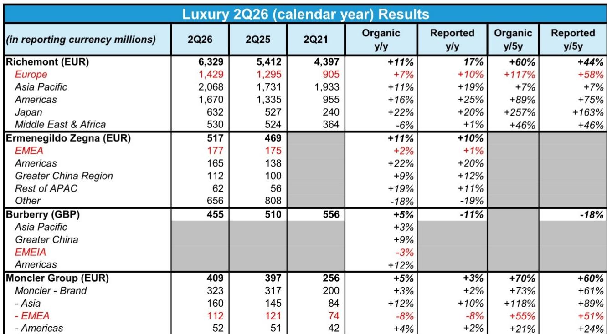
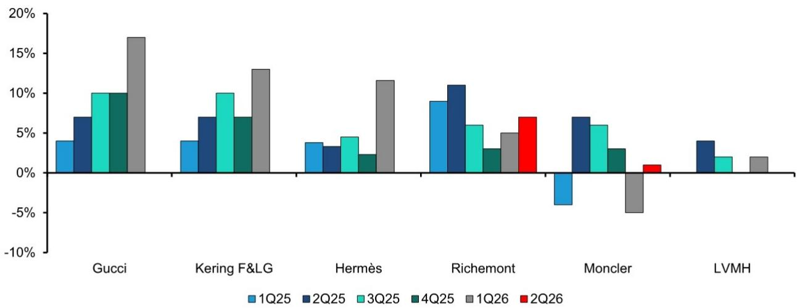
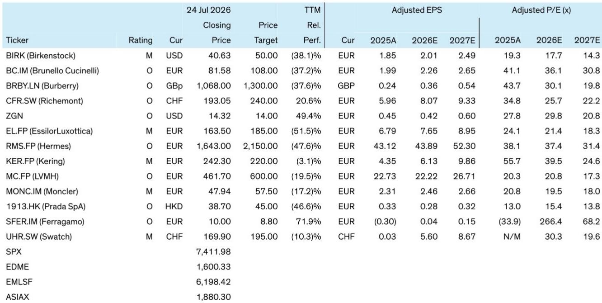

# The Three-Factor Framework That Determines Which Luxury Brands Will Survive the Asian Tourist Shift in Europe

The situation in the Middle East has affected the most important demand channel for European luxury retail: Asian tourist flows. Yet the first-half 2026 earnings season reveals a stark divergence. Richemont posted 7% organic growth in Europe. Moncler saw its EMEA revenue decline 8%. Burberry reported that strong American tourist demand in Europe could not offset weaker traffic from Asia. These are not random outcomes. They are the predictable result of three structural factors that every observer should understand before making any allocation decisions in luxury equities.

The mechanism is precise. Asian tourist flows into Europe have been disrupted by the conflict in the Middle East, which has made cross-continental travel more difficult for Chinese and other Asian nationals. But the impact on any given luxury brand depends on its specific exposure to three variables: the proportion of revenue derived from Chinese nationals shopping abroad, the size of the price gap between China and France, and the degree to which American tourist spending can act as a counterweight. Brands that score poorly on all three are being affected. Brands that score well are proving resilient. The market has not yet fully priced this dispersion.

This is not a temporary blip. The structural drivers of Chinese outbound tourism are shifting, and the Middle East conflict has accelerated a reconfiguration of global luxury demand that was already underway. Those who treat this as a short-term challenge will miss the opportunity to reposition for a new equilibrium. Those who apply the three-factor framework will identify which brands have genuine structural protection and which are merely enjoying a temporary reprieve from American spending that may not persist.

## Richemont and Moncler Represent the Two Extremes of Tourist Sensitivity, and the Gap Reflects Fundamental Business Model Differences

The contrast between Richemont and Moncler in the first half of 2026 is not about execution quality or brand heat. It is about the structural composition of their customer bases and pricing strategies. Richemont's jewellery brands, Cartier and Van Cleef & Arpels, derive an estimated 20-25% of revenue from Chinese nationals. Moncler's main brand is estimated at 35-40%. That difference alone explains a significant portion of the performance gap, but it is only the beginning.

Price gaps between China and France compound the exposure. For Moncler, the same product sells for roughly 30% less in France than in China. The soft luxury average is approximately 20%. Hard luxury brands like Richemont's jewellery houses maintain even smaller gaps because of their global pricing strategy. When Asian tourists cannot travel to Europe, the incentive to shift purchasing to domestic markets or alternative destinations like Japan is far stronger for Moncler customers than for Richemont customers. The wider the price gap, the more economic incentive exists for consumers to wait for travel rather than buying at home, and the more revenue is lost when travel is disrupted.

The third factor—American tourist spending—creates an additional asymmetry. Richemont has benefited from strong jewellery demand in the United States, which has likely supported American tourist spending in Europe. Moncler's brand awareness in the Americas remains a work in progress, limiting any potential offset from American travelers. Seasonality adds another layer: Moncler's winter-weight outerwear is less attractive to tourists traveling in warmer months, even as the brand has attempted to build its spring-summer offering.

The implication is clear. When observers see a luxury brand reporting weak European performance, they must ask whether the weakness is structural or cyclical. Moncler's weakness is structural in the sense that its business model is more vulnerable to the specific disruption of Asian tourist flows. Even successful product innovation in spring-summer categories cannot overcome the arithmetic of high Chinese exposure, wide price gaps, and limited American offset.

## Hermès Faces the Same Structural Vulnerabilities as Moncler but Has a Critical Attenuating Factor That May Drive Sequential Improvement

Hermès presents a more nuanced case that reveals the importance of the third factor. The company carries significant exposure to Chinese nationals, estimated at approximately 40% of revenue. Its regional price gaps are among the widest in luxury, exceeding 30% on a limited sample of comparable products. In the first quarter of 2026, Hermès revealed that tourists represent up to 50% of revenues in France, using this disclosure to explain weak performance. By every measure of the first two factors, Hermès looks as vulnerable as Moncler.

Yet the company has indicated that slightly better tourist trends may provide sequential support in France during the second quarter of 2026. The difference is likely American tourist spending. Hermès benefits from significant dynamism in the Americas, and some of that demand appears to be overflowing into European stores as American travelers visit Paris and other European capitals. Moncler lacks this offset because its brand penetration in the United States is still developing.

This creates a critical distinction for observers. Moncler's vulnerability is compounded by the absence of any compensating factor. Hermès's vulnerability is partially offset by American tourist demand, which may prove sustainable given the strength of the US consumer and the enduring appeal of Paris as a destination for American travelers. The sequential improvement Hermès has signaled is not a recovery in Chinese tourist flows. It is a rotation of demand from one nationality to another.

The strategic lesson is that no single factor determines a brand's fate. Observers must evaluate all three variables simultaneously. A brand with high Chinese exposure and wide price gaps can still perform adequately if it has strong American tourist demand. A brand with moderate exposure but no offset can face challenges. The framework is not a simple ranking. It is a multivariate assessment that produces different outcomes depending on the combination of factors.

## Soft Luxury Brands Face Milder Challenges Than Moncler, but the Dispersion Within the Category Is Wide and Predictable

The soft luxury category—leather goods, ready-to-wear, and accessories from houses like LVMH and Kering—occupies a middle ground that many observers may misinterpret as uniform safety. The analysis suggests that soft luxury names should face milder tourist challenges than Moncler, particularly those with lower exposure to Chinese nationals shopping abroad. Kering and LVMH, for example, have more diversified customer bases that reduce their sensitivity to any single tourist flow.

But the category is not homogeneous. Brands with higher Chinese exposure and wider price gaps will still feel pressure, even if the magnitude is less severe than for Moncler. The key variable within soft luxury is the degree of American tourist offset. Brands that have strong brand equity in the United States and a loyal American customer base will benefit from the same rotation that is helping Hermès. Brands that are more dependent on Asian tourism will face challenges.

This dispersion creates both risk and opportunity. Those who treat all soft luxury names as equivalent are making a mistake. The three-factor framework can differentiate between them. A brand with 25% Chinese exposure, a 15% price gap, and strong American demand is in a fundamentally different position than a brand with 35% Chinese exposure, a 25% price gap, and weak American demand. The first may report stable European revenues. The second may disappoint.

The broader implication for portfolio construction is that luxury research in the current environment requires granular analysis. Aggregate category trends are misleading. The dispersion within categories is larger than the dispersion between them. Those who rely on top-down views about the luxury sector will miss the most important opportunities and risks.

## A Decision Framework for Evaluating Any Luxury Brand's Tourist Vulnerability

Observers can apply a structured framework to assess any luxury brand's exposure to the current tourist disruption. The framework has three dimensions, each with a specific threshold that determines the brand's vulnerability.

The first dimension is Chinese national exposure. Brands with exposure above 30% are in the higher-risk zone. Those between 20% and 30% face moderate risk. Those below 20% are relatively insulated. This is not simply about revenue from China. It is specifically about revenue from Chinese nationals shopping outside of China, which is the channel most directly disrupted by travel restrictions and geopolitical tensions.

The second dimension is the price gap between China and France. A gap exceeding 25% creates strong economic incentive for consumers to wait for travel rather than purchasing domestically. Gaps between 15% and 25% create moderate incentive. Gaps below 15% reduce the incentive significantly. Hard luxury brands tend to have smaller gaps because of global pricing strategies. Soft luxury and outerwear brands tend to have larger gaps because of regional pricing discretion.

The third dimension is the potential offset from American tourist spending. This is the most difficult to quantify but the most important for identifying sequential improvement. Brands with strong brand awareness in the United States, a growing American customer base, and a product offering that appeals to American travelers will benefit from the rotation of demand. Brands that are still building their American presence will not.

The framework produces four distinct scenarios. Brands with high Chinese exposure, wide price gaps, and weak American offset are in a more challenging zone. Brands with high Chinese exposure, wide price gaps, and strong American offset may see sequential improvement. Brands with moderate Chinese exposure, moderate price gaps, and moderate American offset are in a balanced position. Brands with low Chinese exposure, narrow price gaps, and strong American offset are best positioned.

Observers should map every luxury holding onto this framework and adjust positions accordingly. The market has not fully priced the dispersion because the disruption is still unfolding and earnings reports are providing only partial data. The framework allows observers to anticipate results before they are reported.

## The Situation in the Middle East Has Accelerated a Structural Reconfiguration That Will Outlast Any Ceasefire

The temptation is to view the current disruption as temporary. If the Middle East conflict resolves, Asian tourist flows will resume, and the three-factor framework will become less relevant. This assumption is dangerous because it ignores the structural changes that were already underway before the conflict began.

Chinese outbound tourism was already shifting before the current situation. The post-pandemic recovery in Chinese travel has been slower and more fragmented than many expected. Domestic luxury consumption in China has been growing, reducing the incentive for Chinese consumers to travel abroad for shopping. Japanese luxury retail has been capturing share from European destinations because of favorable exchange rates and proximity. These trends were visible in the data before the Middle East conflict added another layer of disruption.

The conflict has accelerated these shifts by making European travel more difficult and less attractive for Asian consumers. Even if the situation resolves quickly, the behavioral changes it has induced may persist. Consumers who have shifted their purchasing to domestic channels or alternative destinations may not immediately return to European stores. The convenience of buying at home, combined with narrowing price gaps in some categories, may permanently reduce the share of Chinese luxury spending that flows through European retail.

The implication for luxury brands is that they cannot simply wait for the disruption to pass. They must adapt their business models to a world in which Asian tourist flows to Europe are structurally different than they were before the pandemic and the conflict. This means investing in domestic Chinese retail, building direct relationships with Chinese consumers regardless of where they shop, and diversifying their tourist base to reduce dependence on any single nationality.

Brands that make these adjustments will emerge stronger. Brands that wait for a return to the old normal will find themselves permanently disadvantaged. The three-factor framework is not just a tool for navigating the current quarter. It is a lens for understanding which brands have the strategic flexibility to adapt to a reconfiguring global luxury landscape.

*For informational purposes only. Portions may be generated, translated, summarized, or edited with AI assistance based on source materials and may contain omissions or errors. Please verify independently. This is not professional advice.*

For informational purposes only. Portions may be generated, translated, summarized, or edited with AI assistance based on source materials and may contain omissions or errors. Please verify independently. This is not professional advice.

