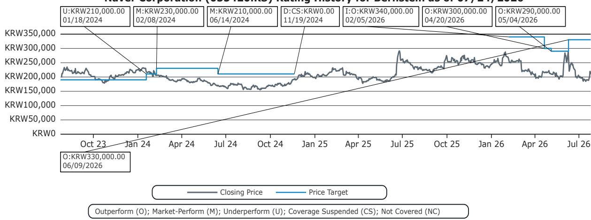
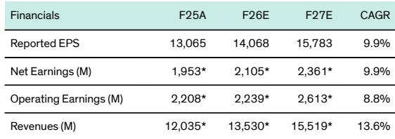
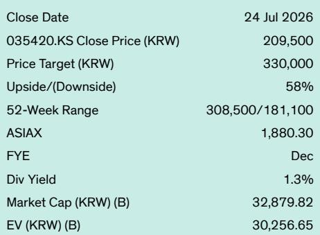

# Bernstein：Naver与英伟达-供应商成为股东

2026年7月27日，Naver披露其董事会批准向英伟达定向增发约720万股普通股，发行价为每股204,500韩元，募资约1.5万亿韩元（约10亿美元）。这笔交易将使英伟达持有Naver增发后约5%的股份，成为其战略股东之一。Bernstein在当日发布的快评中认为，这一动作的意义远超财务研究本身——它标志着AI基础设施的融资与协作模式正在发生结构性变化。

> **KC评论：** 英伟达从一个芯片供应商变成平台股东，意味着它不再只是卖算力，而是有更强的动机去确保Naver的AI工厂有足够的芯片供应、基础设施部署顺利，并帮助吸引生态伙伴。这种利益绑定，比单纯的客户关系更紧密。

## 1. 英伟达入股是对Naver AI工厂战略的验证

Bernstein分析师指出，英伟达成为Naver股东，是对Naver AI工厂战略的“战略验证”。此前市场对Naver AI工厂最大的争议在于执行和融资能力，而非战略方向本身。英伟达的股权研究，直接降低了市场对Naver在需求可见性、硬件采购和长期生态支持方面的不确定性感知。

报告特别提到，就在7月24日，Naver、英伟达和Brookfield已宣布计划共同研究千兆瓦级、多租户AI云基础设施，以支持韩国和美国下一代AI公司。英伟达的入股，使这一合作从概念走向执行。

## 2. 新融资模式：从单一资产负债表到伙伴驱动的“新云”结构

Bernstein此前在研报中提出，Naver的AI工厂不太可能仅靠自身资产负债表融资。更可能的方式是类似“新云”结构：基础设施读者提供资本，芯片供应商支持计算部署，模型提供商贡献智能，而Naver作为整个堆栈的协调者居中运作。

英伟达的股权研究，使这一判断从理论变为现实。报告认为，这应该会改善Naver的融资可信度，使其未来更容易通过特殊目的载体和外部资本筹集资金，尤其是考虑到Naver的长期野心可能需要数百亿美元的基础设施研究。

## 3. 对市场定价框架的影响：不确定性折价可能收窄

从估值角度看，Naver在公告前的收盘价为209,500韩元，隐含约58%的上行空间。报告给出的估值基于DCF模型，假设WACC为12%，终端增长率2%，对应一年远期市盈率约20倍。

英伟达入股后，市场对Naver AI工厂执行不确定性的重新定价，可能成为估值修复的重要催化剂。报告认为，英伟达作为战略股东，应该使未来的SPV融资和外部资本筹集更容易，这直接降低了Naver在AI基础设施研究上的资金不确定性。

> **KC评论：** 读者此前对Naver AI工厂的最大疑虑是“能不能融到钱、能不能执行”，而不是“方向对不对”。英伟达的入股相当于给这个疑虑打了一个补丁——芯片巨头愿意拿真金白银背书，后续融资的难度和成本都可能下降。

## 4. 可复用的观察框架：AI基础设施正变成“团队运动”

Bernstein在报告结尾总结了一个值得关注的趋势：AI基础设施正日益变成一项“团队运动”。当全球芯片供应商通过股权方式与平台公司绑定，AI工厂的融资、建设和运营模式正在从传统的客户-供应商关系，演变为一个资本、算力和需求更紧密对齐的共享生态系统。

对于观察这一领域的读者来说，可以关注以下信号：芯片厂商是否开始更频繁地以股东身份参与下游AI基础设施建设；平台公司是否在融资结构中引入更多战略读者而非纯财务读者；以及这种模式是否会在韩国以外的市场被复制。这些信号比单笔交易的金额更能说明产业结构的长期变化。

---

For informational purposes only. Portions may be generated,translated,summarized,or edited with AI assistance based on source materials and may contain omissions or errors. Please verify independently. This is not investment,legal,tax,accounting,or other professional advice.

