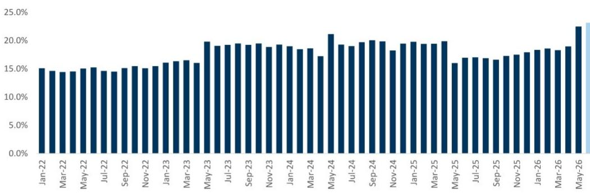
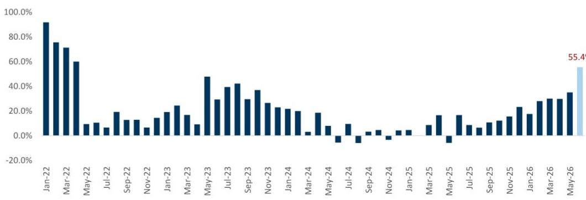
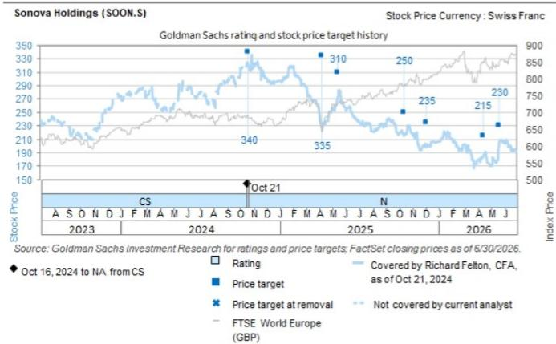

# GS：美国退伍军人事务部（VA）2026年6月助听器采购数据于上周末公

美国退伍军人事务部（VA）2026年6月助听器采购数据于上周末公布，其中一组数字值得关注。Oticon品牌在VA渠道的价值份额从2026年4月（Zeal产品上市前）的18.9%升至6月的23.1%，两个月内累计增加420个基点。这一份额爬坡速度显著快于行业近年其他主要新品发布——Oticon此前一代产品Intent在2024年4月至6月期间仅贡献了210个基点的份额增长，而Sonova的Infinio Sphere和GN Resound的Vivia同期分别只带来70和60个基点。

VA渠道是美国助听器市场的重要风向标，其数据能较早反映品牌竞争格局的变化。GS这份报告的核心判断是：Oticon Zeal的上市正在重塑助听器市场的竞争态势，且这一趋势可能才刚刚开始。

## 1. 整体市场增长在6月加速，为季度收尾提供支撑

VA渠道2026年6月助听器整体销量同比增长5%，销售额增长13.8%，均较此前月份有所提速。整个第二季度来看，行业销量同比基本持平（三个月平均-0.5%），但销售额增长13.5%，反映出产品均价和结构升级仍在持续。报告特别指出，定制式助听器（Custom Hearing Aid）类别在VA渠道的价值占比已从2025年6月的约15%升至2026年6月的约22%，这一变化与Demant和Sonova最新一代ITE产品的技术能力跃升有关。

> **KC评论：** 定制式助听器占比快速提升，意味着行业增长逻辑正在从“卖更多”转向“卖更贵、更隐蔽”。这对产品定价能力和渠道结构都会产生连锁影响。

## 2. Oticon Zeal的份额爬坡速度创近年新高

将Oticon Zeal的表现与行业其他主要新品横向对比，差异明显。Oticon Intent在2024年4月至6月期间为Oticon带来210个基点的份额增长；Sonova Phonak的Infinio Sphere在2025年4月至6月期间贡献70个基点；GN Resound的Vivia同期贡献60个基点。而Zeal在相同时间窗口内实现了420个基点——几乎是前者的两倍。

具体到6月单月数据，Oticon在VA渠道的销量同比增长27.2%，销售额增长55.4%，均远超行业平均水平。其价值份额达到23.1%，创下历史新高。

## 3. Phonak份额承压，定制式类别成为关键战场

Sonova旗下的Phonak品牌在6月仍维持了50.8%的销量份额和51.2%的价值份额，但环比5月均有所下滑。报告特别指出，Phonak在定制式助听器类别中出现了明显的份额流失，时间点恰好与Zeal上市重合。这意味着Zeal的竞争冲击并非均匀分布，而是集中在了定制式这一高价值细分领域。

GN Resound在6月销量同比下降8.6%，但销售额增长11.7%，份额略有回升。Starkey则出现了销量和销售额的双位数下滑。

## 4. VA渠道单一贡献已可量化，后续影响值得跟踪

GS估算，仅VA渠道一个客户，就将在2026年第二季度为Demant贡献约240个基点的助听器有机增长。这一数字本身并不大，但它反映的是Zeal在单一渠道、两个月内的表现。考虑到VA渠道的采购周期和产品替换节奏，后续几个季度的数据将更完整地揭示Zeal的市场渗透深度。

报告同时指出，定制式助听器技术能力的跃升，结合其隐蔽的外形设计，有可能扩大助听器的整体可寻址市场。如果这一判断成立，那么Zeal带来的就不仅是份额再分配，而是市场蛋糕本身的扩大。

For informational purposes only. Portions may be generated,translated,summarized,or edited with AI assistance based on source materials and may contain omissions or errors. Please verify independently. This is not investment,legal,tax,accounting,or other professional advice.

For informational purposes only. Portions may be generated,translated,summarized,or edited with AI assistance based on source materials and may contain omissions or errors. Please verify independently. This is not investment,legal,tax,accounting,or other professional advice.

