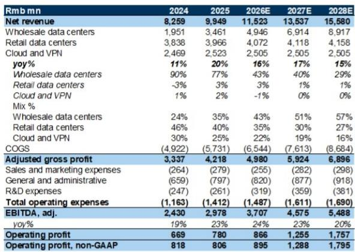
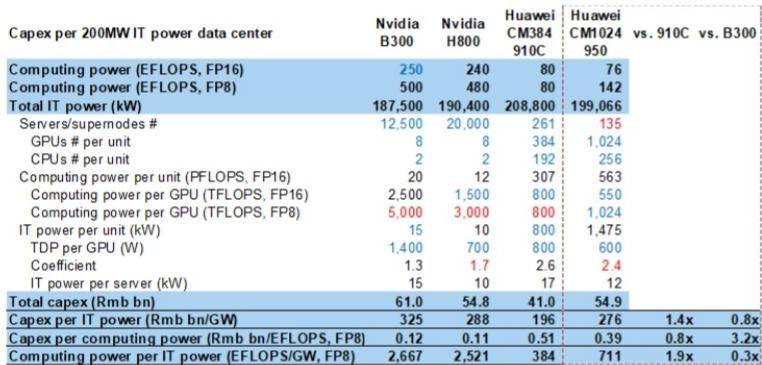
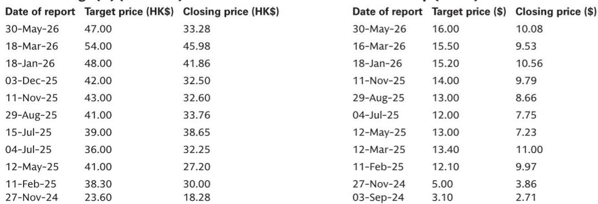

# GS：月度与季度数据变化观察

中国数据中心行业在2026年上半年经历了一个增速节奏变化的季度。根据GS最新发布的2Q26预览报告，全国智能算力新增约595 EFLOPS（FP16），折合约0.7GW的AI相关并网容量，低于2025年下半年的802 EFLOPS增量，与2025年上半年H20出口管制生效时的水平相当。这一节奏变化主要受芯片供应收紧影响，包括国产和进口芯片均面临交付瓶颈。

但报告同时指出，节奏变化更多是供给侧的阶段性约束，而非需求走弱。中国AI开源模型在推理效率上的持续突破——以DeepSeek和Xiaomi MiMo为代表——正在推动token份额扩张，并进一步拉动数据中心需求。智谱已启动1GW级别数据中心的建设，成为这一趋势的注脚。GS将2026年中国数据中心并网需求预测下调至约3GW，但维持2025-2028年20%的复合增长率判断，预计总容量从2025年的16GW增至2028年的27GW。

## 1. 国产硬件系统正在缩小与先进进口芯片的差距

华为Atlas 950 SuperPoD计划于2026年下半年出货，阿里巴巴平头哥凌骏真武M890 SuperPoD已上线并兼容Qwen3.8。GS估算，Atlas 950 SuperPoD每GW的计算能力和token吞吐量相比前代Atlas 910C SuperPoD可提升约一倍，与英伟达B300的差距从910C时代的1/8缩小至1/4。但代价是每单位算力的资本开支约为B300的3.2倍。

这一对比揭示了一个关键权衡：国产替代在性能追赶上取得实质进展，但成本效率仍是短板。对于数据中心运营商而言，这意味着未来2-3年的基础设施研究决策将不得不在算力密度、芯片可获得性和资本效率之间做更精细的平衡。

> **KC评论：** GS的测算表（Exhibit 5）提供了一个可复用的框架：将200MW数据中心按不同芯片方案拆解为总资本开支、每GW资本开支和每EFLOPS资本开支三个维度。读者可以据此判断，在芯片供应受限的窗口期，哪种配置方案对自身业务最有利。

## 2. GPU即服务现货价格弹性较高，长期合同价格反应滞后

芯片供应收紧叠加AI训练与推理需求的持续旺盛，已传导至GPU租赁市场。GS观察到，英伟达H100服务器的月度现货价格从2026年初的约5万元人民币弹性较高至近期的约10万元人民币。但长期合同价格的调整幅度可能远小于现货市场。

这一分化意味着，拥有存量GPU资源的数据中心运营商在短期内有较强的定价弹性，但长期合同的定价机制可能无法充分反映芯片稀缺性。相关市场相关公司——如盛弘股份、立达信——已发布强劲的初步业绩，但GS未对这些公司进行覆盖。

## 3. 主要运营商二季度并网节奏承压，但订单储备仍具支撑

GS对万国数据和世纪互联的2Q26预测均反映了并网节奏节奏变化的影响。万国数据二季度收入预计环比下降约9%至30.73亿元，调整后EBITDA环比下降约31%至13.39亿元。世纪互联二季度收入预计为27.7亿元，为全年同比增速的底部。两家公司的并网转化率——即当期并网量占四个季度前订单积压的比例——均出现季度性回落。

但报告强调，这些是节奏问题而非趋势逆转。万国数据管理层在1Q26业绩会上对上半年500MW潜在订单量的积极表态已被市场定价，市场将关注7-8月的订单更新。世纪互联方面，其与宁德时代的战略合作以及海外扩张计划可能在业绩会上获得更多细节，新的大额订单可能成为正面催化剂。

## 4. 2026年并网需求中智能算力占比过半，第三方数据中心份额持续扩大

GS估算，2026年中国数据中心约3GW的并网需求中，超过50%来自智能计算需求，超过80%由第三方数据中心运营商承接。这一结构特征意味着，第三方数据中心运营商——尤其是具备大规模AI数据中心交付能力的公司——将更直接受益于AI算力需求的增长。

在相关市场标的中，GS首选润泽科技，理由包括丰富的容量储备、全栈AI数据中心能力（2026年上半年将投运中国首个200MW、10万芯片级数据中心）、强大的客户关系以及多元化的低成本融资能力。对数据港更新公司观点，对光环新网更新公司观点。

---

For informational purposes only. Portions may be generated,translated,summarized,or edited with AI assistance based on source materials and may contain omissions or errors. Please verify independently. This is not investment,legal,tax,accounting,or other professional advice.

For informational purposes only. Portions may be generated,translated,summarized,or edited with AI assistance based on source materials and may contain omissions or errors. Please verify independently. This is not investment,legal,tax,accounting,or other professional advice.

