## Europe Multi-Industry China Trade Tracker and what it foretells for European Capital Goods

In our China Import/Export Tracker, we examine 43 specific capital goods product categories relevant to our coverage. We monitor for signs of competitive dynamics for our companies at a granular, product level. While Europe still leads in exports of capital goods within our tracked products, accounting for 43% of global volumes, its share has decreased from 54% in 2005 (Exhibit 5). Meanwhile, China is steadily increasing its export presence in the global marketplace, gaining 16pp of market share, from 7% in 2005 to 24% in 2025. While most of this share has been captured in Emerging Markets, this presents increased competition for our covered companies. Europe's relative size in the global exports market, vs. China, is the highest in commercial vehicle engines, dairy machinery and rail brakes; however, China has made the fastest gains exactly in those areas over the last five years (Exhibit 3).

Inside, we analyze the latest trends product by product, both over the long run and over the last few months. We also look at trade defense investigations initiated in Europe. In this edition, we also include a competitive landscape in terms of patents filed, which shows China has been the top patent filer, overtaking Europe in 2025.

Daniela Costa
+44 20 7774-8354
daniela.costa@gs.com
GS International

Ope Otaniyi
+44 20 7051 6955
ope.otaniyi@gs.com
GS International

Aayush Kandpal

Christian Hinderaker, CFA
+44 20 7774-7366
christian.hinderaker@gs.com
GS International

Hollie Cooper
+44 20 7051-0956
hollie.cooper@gs.com
GS International

Meihan Yang +44 20 7051-6601 meihan.x.yang@gs.com
GS International

Ines Lefranc

+44 20 7051-8710 ines.lefranc@gs.com
GS International

Aditya Agarwal

+1 212 934-7448

aditya.a.agarwal@gs.com

GS India SPL

Susmita Saha

+1 332 245-7701

susmita.saha@gs.com

GS India SPL

+1 212 934-9821

aayush.kandpal@gs.com

GS India SPL

GS does and seeks to do business with companies covered in its research reports. As a result, investors should be aware that the firm may have a conflict of interest that could affect the objectivity of this report. Investors should consider this report as only a single factor in making their investment decision. For Reg AC certification and other important disclosures, see the Disclosure Appendix, or go to www.gs.com/research/hedge.html. Analysts employed by non-US affiliates are not registered/qualified as research analysts with FINRA in the U.S.

Looking broadly at China's headline export data for June 2026 specifically, export growth accelerated sharply and was above consensus expectation +27% yoy (vs. +19.4% in May) on the back of AI-related products and automobiles. By region, China's exports growth to the EU accelerated substantially +18.5% yoy (vs. +7.6% in May), albeit the trend was also matched by imports growth from the EU also rising +9.2% yoy (vs. -1.3% in May). China's exports to the US increased 13.9% yoy (vs. 35.4% in May), while imports from the US increased 25.9% yoy (vs. 20.4% in May). See our economists' note here. For our 43 product categories, we have seen better exports and imports performance out of China. In the latest granular data by category for June 2026 (all metrics are 3m rolling and exclude Russia for comparability), global export values continued to move higher, and the pace of growth has accelerated, with rising momentum at +15.4% yoy in aggregate for the categories we track (vs. +9.6% in May); similarly, import values growth accelerated, increasing +13.4% yoy (vs. +13.2% in May). By product, most categories displayed a growth trend in exports, with the top-5 yoy Chinese export growth categories being Tungsten (powders and tools; refer to the product section for more analysis on this) (>>+100%, Sandvik, Weir, FLSmidth), fibre cable (+58%, Prysmian), marine engines (+75%, Wartsila), heat pumps (+60%, Nibe) and LCV (+60%, Traton); see Exhibit 19. The pace of change in imports has been more balanced, with the largest yoy Chinese import declines in cranes (-51%, Konecranes), heat pumps (-37%, NIBE, Ariston, Carel), coffee machines (-36%, De' Longhi), basins and toilets (-34%, Geberit) and air pumps (-26%, Atlas Copco); see Exhibit 20.

In terms of exports to regions for the products we track, the June data shows a meaningful yoy increase in Chinese exports to Europe for cranes (>>+100%), fibre cables (>>+100%) and industrial robots, while Chinese exports were down the most in basins and toilets (-51%), steel pipes and dairy machinery (-23%, GEA, Alfa Laval); see Exhibit 21. In the US, where market trends are still likely to be materially impacted by the fluid tariff situation, China's most material export value yoy growth came in tungsten (powders and tools) (>>+100%), fibre cable (>>+100%) and switchgear (>>+100%, ABB, Legrand, Schneider Electric, Siemens); Chinese exports were down the most in commercial vehicle engines (-95%), aluminium wire (-65%, Prysmian, Nexans, NKT) and cranes (-63%, Konecranes); see Exhibit 22.

In terms of trade balance (net exports) for the products we track, LTM compared to FY15, we see the highest growth in trade balance in food equipment ( >>100% , GEA, Alfa Laval), excavators ( >>100% , CNH, Sandvik, Volvo) and heat exchangers ( >>100% , Alfa Laval); see Exhibit 23. For L3M compared to the same period last year, the highest trade balance growth is seen in Tungsten (powders and tools) ( >+100% ), fibre cable ( >+100% ) and ultrasonic scanning apparatus ( +61% , Siemens); see Exhibit 24.

The European Commission initiated 33 new trade defense investigations in 2024, marking a considerable increase versus 2023 (12 new investigations) and a historical 10Y average of 14 (Exhibit 256). Definitive trade defense measures currently in force may have reached over 200 in 2025 (Exhibit 25). These new investigations and measures span a variety of products related to our capital goods coverage, including mobile cranes, welding wire, tyres, steel products, copper tubes, aluminum flat rolled products and optical fibre cables (Exhibit 26).

What is new in this edition?

New Product category - coffee machines (De' Longhi) has been added.

And for a recap of the long-run trends...

China’s reliance on European capital goods product imports in the 43 categories we track has not changed much over the last decade, but the exports of these products to Europe have grown faster than to RoW, albeit from a significantly lower base. Looking at LTM data vs. a decade ago, we look to assess the level of Chinese competition by comparing Chinese exports’ value growth vs. imports’ value slowdown. As seen in Exhibit 1, this has been most noticeable for LED lighting (Signify), excavators (CNH, Sandvik, Volvo), heat pumps (NIBE, Ariston, Carel), heavy duty trucks (HDT - Daimler, Traton, Volvo), tractors (CNH) and copper wire (Prysmian, Nexans, NKT). The share of China’s exports to Europe in the last decade vs. to other regions has grown the most for rail (Alstom, Siemens), construction equipment (excavators and shovel loaders), LED lighting, and ultrasonic scanning apparatus (Siemens); see Exhibit 16.; while in the L12M (Exhibit 17), we have seen the most step-up in industrial robots, LCV (Traton), ultrasonic scanning apparatus (Siemens), rail and bearings (SKF).

In terms of the shift in wallet share of exports globally, comparing 2025 to 2019, China has gained share in most of the product categories, while at the same time, Europe has been losing. LCV, shovel loaders (CNH, Volvo), HDT, cranes (Konecranes) and marine engines (Wartsila) are the categories where Europe has lost the most wallet share vs. China gaining in global export markets, with basins and toilets (Geberit) the only category where Europe's wallet share has increased and China's has decreased; see Exhibit 2.

## What we are reading from China trade in capital goods

Exhibit 1: LED lighting, excavators and heat pumps have shown the most growth in Chinese exports globally (ex Russia) and greatest slowdown in imports over the last decade
Snapshot of competitive intensity - China  
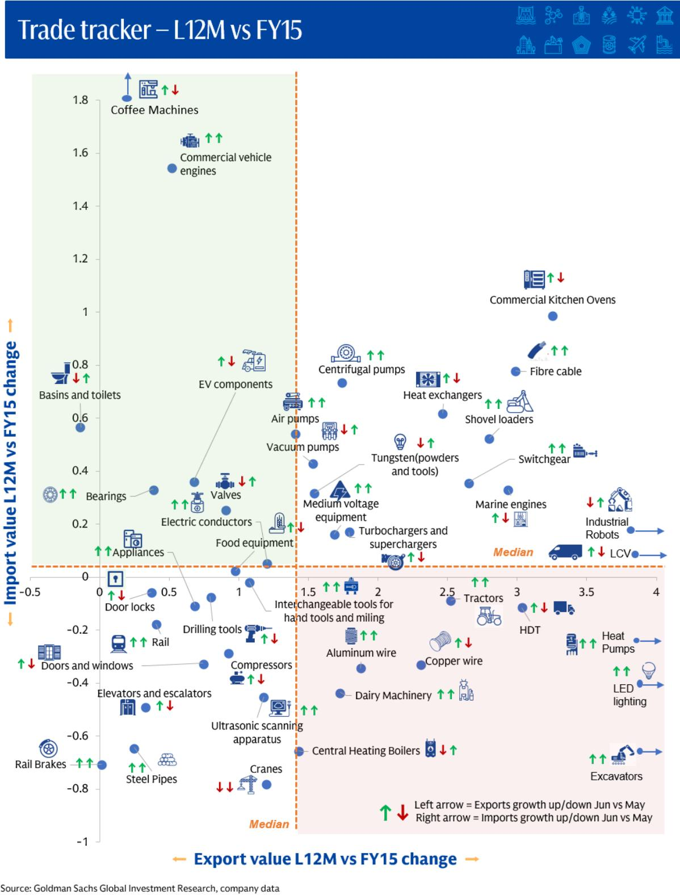  
Source: GS Global Investment Research, company data

Source: General Administration of Customs People's Republic of China, Data compiled by GS Global Investment Research

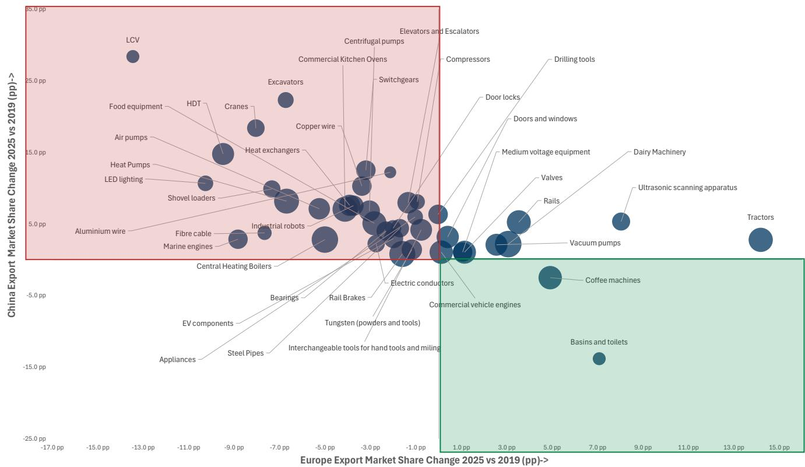  
Size of bubble = Europe Export Market Share, 2025  
Source: International Trade Centre, data compiled by GS Global Investment Research

Exhibit 3: Engines, dairy machinery and rail brakes are the areas where Europe is most dominant vs. China in global exports markets, but the gap has been decreasing
Snapshot of competitive intensity - Global, Europe/China market share  
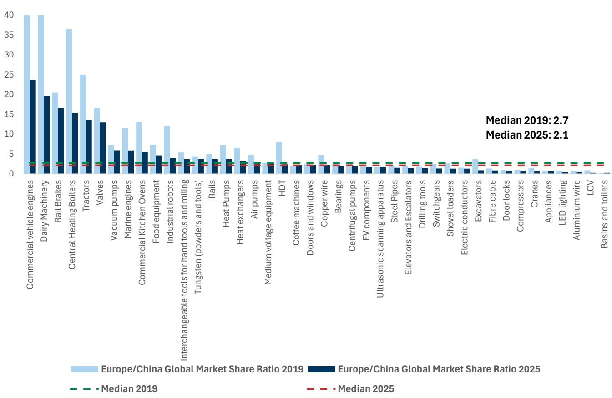  
Source: International Trade Centre, Data compiled by GS Global Investment Research

c.16pp vs. Europe c.-12pp)

Exhibit 4: China net exports to Europe have expanded significantly and regained the rising trend post covid highs

China's trade balance (net export) with Europe for 43 cap goods categories, million $ - 12m rolling

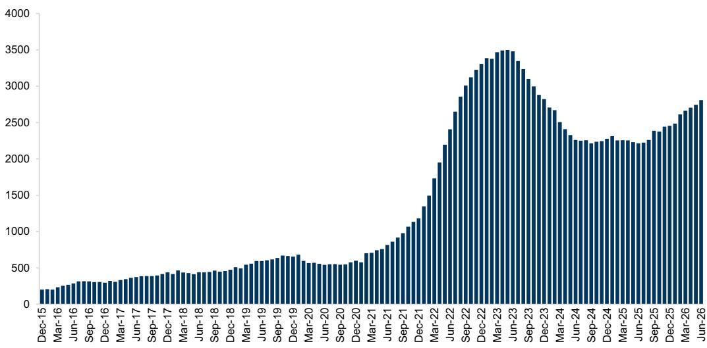  
■ China Trade Balance Europe - 43 cap goods categories million $ (12m rolling)  
Source: General Administration of Customs People's Republic of China, Data compiled by GS Global Investment Research  
Market share in global export volumes for 42 capital goods product categories by region (%)
Cap Goods Categories Share of Exports (%)

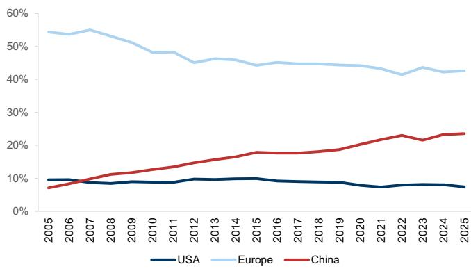  
Source: International Trade Centre, Data compiled by GS Global Investment Research

Exhibit 6: China has surpassed Europe in 3 of the 9 categories of capital goods in terms of patents filed. Patents filed by Europe and China, 2026 LTM vs. 2015

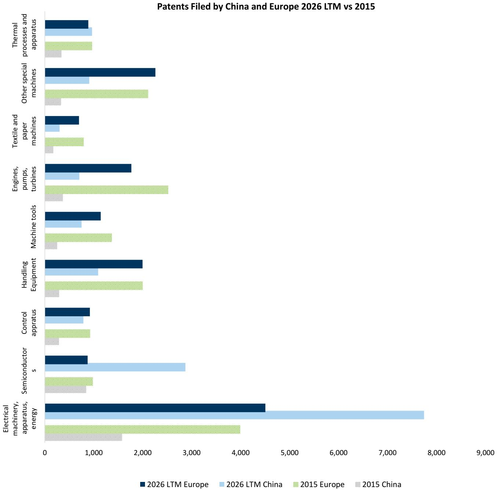

Exhibit 8: China is now filling significantly more patents in electrical equipment than Europe
Electrical machinery, apparatus, energy patents for China, Europe, US  
Exhibit 7: China surpassed Europe for patent filing in 2025, driven by electrical machinery, apparatus, energy
Cap Goods patents for China, Europe, US  
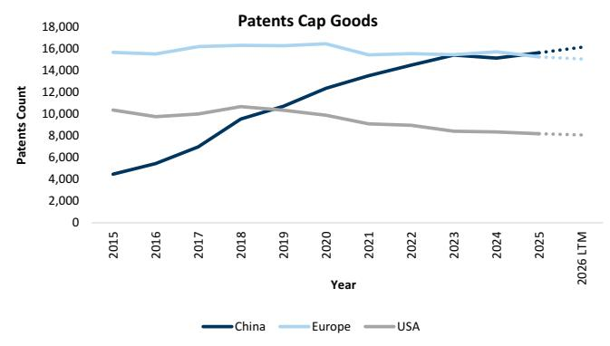  
Source: WIPO, Data compiled by GS Global Investment Research

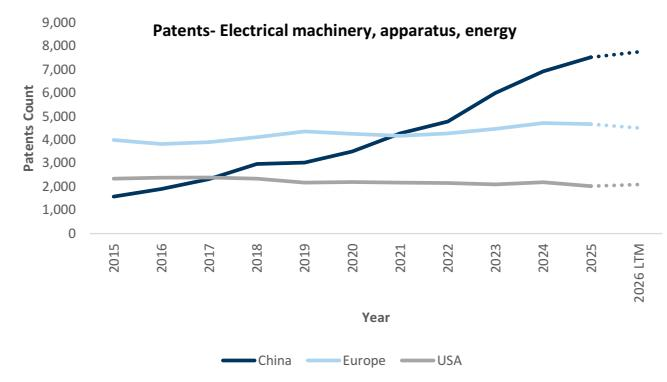  
Source: WIPO, Data compiled by GS Global Investment Research

Exhibit 9: Heat pumps, coffee machines and turbochargers are where China has been more focused on exporting to Europe
China's export Share to Europe over China total exports by category  
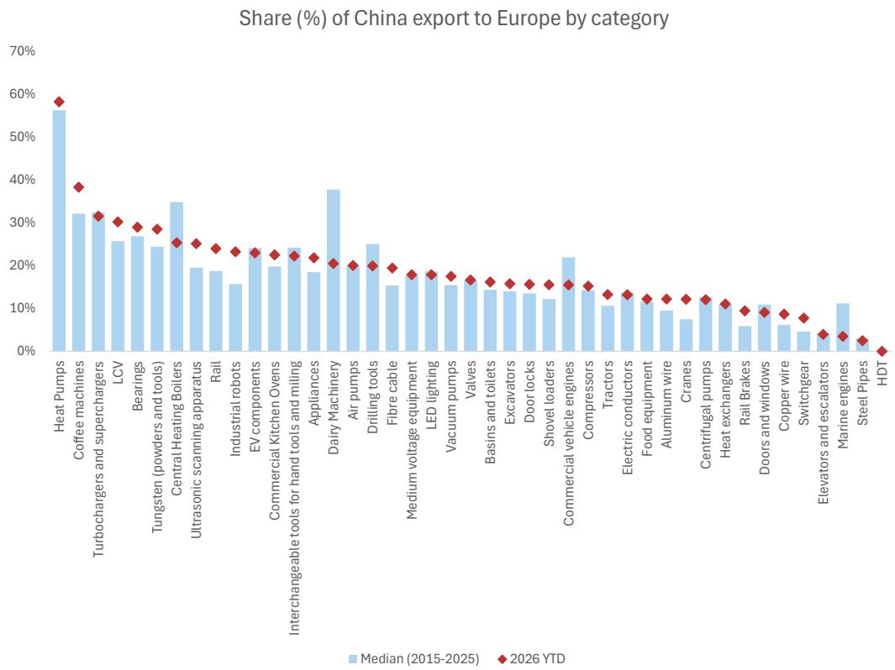  
Source: International Trade Centre, data compiled by GS Global Investment Research

Exhibit 10: Over the last three months, tungsten, fibre cable and marine engines are seeing the most growth in China exports while basins and toilets, dairy machinery and steel pipes are showing a slowdown in exports
China Exports L3M yoy across months

<table><tr><td>Categories</td><td>Exports Rank Jun-26</td><td>Exports L3M yoy as of Jun-26</td><td>Exports Rank Apr-26</td><td>Exports L3M yoy as of Apr-26</td></tr><tr><td>Tungsten (powders and tools)</td><td>1</td><td>233%</td><td>1</td><td>153%</td></tr><tr><td>Fibre cable</td><td>2</td><td>111%</td><td>5</td><td>58%</td></tr><tr><td>Marine engines</td><td>3</td><td>75%</td><td>2</td><td>134%</td></tr><tr><td>Heat Pumps</td><td>4</td><td>60%</td><td>4</td><td>59%</td></tr><tr><td>LCV</td><td>5</td><td>60%</td><td>3</td><td>60%</td></tr><tr><td>Copper wire</td><td>6</td><td>45%</td><td>11</td><td>37%</td></tr><tr><td>Tractors</td><td>7</td><td>42%</td><td>14</td><td>27%</td></tr><tr><td>Excavators</td><td>8</td><td>35%</td><td>12</td><td>35%</td></tr><tr><td>Medium voltage equipment</td><td>9</td><td>34%</td><td>7</td><td>41%</td></tr><tr><td>Shovel loaders</td><td>10</td><td>31%</td><td>13</td><td>30%</td></tr><tr><td>Drilling tools</td><td>11</td><td>30%</td><td>20</td><td>22%</td></tr><tr><td>Electric conductors</td><td>12</td><td>30%</td><td>15</td><td>27%</td></tr><tr><td>Ultrasonic scanning apparatus</td><td>13</td><td>30%</td><td>16</td><td>26%</td></tr><tr><td>Interchangeable tools for hand tools and miling</td><td>14</td><td>30%</td><td>19</td><td>23%</td></tr><tr><td>Industrial robots</td><td>15</td><td>28%</td><td>6</td><td>47%</td></tr><tr><td>Central Heating Boilers</td><td>16</td><td>27%</td><td>10</td><td>38%</td></tr><tr><td>HDT</td><td>17</td><td>21%</td><td>8</td><td>39%</td></tr><tr><td>Rail Brakes</td><td>18</td><td>19%</td><td>38</td><td>-3%</td></tr><tr><td>Heat exchangers</td><td>19</td><td>19%</td><td>27</td><td>10%</td></tr><tr><td>Switchgear</td><td>20</td><td>17%</td><td>28</td><td>8%</td></tr><tr><td>Aluminum wire</td><td>21</td><td>15%</td><td>21</td><td>15%</td></tr><tr><td>Doors and windows</td><td>22</td><td>14%</td><td>25</td><td>14%</td></tr><tr><td>Cranes</td><td>23</td><td>13%</td><td>9</td><td>38%</td></tr><tr><td>Valves</td><td>24</td><td>12%</td><td>23</td><td>14%</td></tr><tr><td>Turbochargers and superchargers</td><td>25</td><td>11%</td><td>22</td><td>14%</td></tr><tr><td>Commercial Kitchen Ovens</td><td>26</td><td>11%</td><td>31</td><td>7%</td></tr><tr><td>Coffee machines</td><td>27</td><td>10%</td><td>35</td><td>3%</td></tr><tr><td>Food equipment</td><td>28</td><td>9%</td><td>32</td><td>7%</td></tr><tr><td>Centrifugal pumps</td><td>29</td><td>9%</td><td>24</td><td>14%</td></tr><tr><td>Elevators and escalators</td><td>30</td><td>9%</td><td>34</td><td>5%</td></tr><tr><td>Commercial vehicle engines</td><td>31</td><td>7%</td><td>42</td><td>-17%</td></tr><tr><td>Bearings</td><td>32</td><td>5%</td><td>33</td><td>7%</td></tr><tr><td>EV components</td><td>33</td><td>5%</td><td>26</td><td>11%</td></tr><tr><td>Air pumps</td><td>34</td><td>1%</td><td>29</td><td>8%</td></tr><tr><td>Appliances</td><td>35</td><td>0%</td><td>41</td><td>-7%</td></tr><tr><td>Door locks</td><td>36</td><td>-1%</td><td>36</td><td>2%</td></tr><tr><td>Vacuum pumps</td><td>37</td><td>-2%</td><td>30</td><td>8%</td></tr><tr><td>Compressors</td><td>38</td><td>-3%</td><td>39</td><td>-3%</td></tr><tr><td>LED lighting</td><td>39</td><td>-5%</td><td>40</td><td>-4%</td></tr><tr><td>Rail</td><td>40</td><td>-6%</td><td>17</td><td>26%</td></tr><tr><td>Steel Pipes</td><td>41</td><td>-10%</td><td>37</td><td>-1%</td></tr><tr><td>Dairy Machinery</td><td>42</td><td>-14%</td><td>18</td><td>25%</td></tr><tr><td>Basins and toilets</td><td>43</td><td>-61%</td><td>43</td><td>-33%</td></tr></table>

Source: General Administration of Customs People's Republic of China, data compiled by GS Global Investment Research

Exhibit 11: Over the last three months, tractors, LCV and fibre cable are seeing the most growth in China imports while cranes, heat pumps and coffee machines are showing a slowdown in imports
China Imports L3M yoy across months

<table><tr><td>Categories</td><td>Imports Rank Jun-26</td><td>Imports L3M yoy as of Jun-26</td><td>Imports Rank Apr-26</td><td>Imports L3M yoy as of Apr-26</td></tr><tr><td>Tractors</td><td>1</td><td>141%</td><td>6</td><td>25%</td></tr><tr><td>LCV</td><td>2</td><td>97%</td><td>1</td><td>311%</td></tr><tr><td>Fibre cable</td><td>3</td><td>70%</td><td>2</td><td>57%</td></tr><tr><td>Elevators and escalators</td><td>4</td><td>65%</td><td>9</td><td>22%</td></tr><tr><td>Electric conductors</td><td>5</td><td>46%</td><td>5</td><td>25%</td></tr><tr><td>Tungsten (powders and tools)</td><td>6</td><td>44%</td><td>7</td><td>25%</td></tr><tr><td>Heat exchangers</td><td>7</td><td>41%</td><td>3</td><td>45%</td></tr><tr><td>Aluminum wire</td><td>8</td><td>40%</td><td>37</td><td>-25%</td></tr><tr><td>Copper wire</td><td>9</td><td>37%</td><td>13</td><td>12%</td></tr><tr><td>Centrifugal pumps</td><td>10</td><td>26%</td><td>17</td><td>10%</td></tr><tr><td>LED lighting</td><td>11</td><td>26%</td><td>24</td><td>2%</td></tr><tr><td>Drilling tools</td><td>12</td><td>23%</td><td>14</td><td>12%</td></tr><tr><td>Medium voltage equipment</td><td>13</td><td>21%</td><td>8</td><td>24%</td></tr><tr><td>Interchangeable tools for hand tools and milling</td><td>14</td><td>18%</td><td>16</td><td>11%</td></tr><tr><td>Rail</td><td>15</td><td>16%</td><td>27</td><td>1%</td></tr><tr><td>Industrial robots</td><td>16</td><td>15%</td><td>10</td><td>21%</td></tr><tr><td>Door locks</td><td>17</td><td>14%</td><td>20</td><td>6%</td></tr><tr><td>Valves</td><td>18</td><td>13%</td><td>25</td><td>1%</td></tr><tr><td>Bearings</td><td>19</td><td>10%</td><td>15</td><td>12%</td></tr><tr><td>Steel Pipes</td><td>20</td><td>9%</td><td>36</td><td>-23%</td></tr><tr><td>Dairy Machinery</td><td>21</td><td>8%</td><td>40</td><td>-40%</td></tr><tr><td>Central Heating Boilers</td><td>22</td><td>5%</td><td>19</td><td>8%</td></tr><tr><td>Compressors</td><td>23</td><td>5%</td><td>22</td><td>2%</td></tr><tr><td>Turbochargers and superchargers</td><td>24</td><td>4%</td><td>4</td><td>43%</td></tr><tr><td>EV components</td><td>25</td><td>3%</td><td>23</td><td>2%</td></tr><tr><td>Switchgear</td><td>26</td><td>-1%</td><td>21</td><td>2%</td></tr><tr><td>Shovel loaders</td><td>27</td><td>-2%</td><td>41</td><td>-42%</td></tr><tr><td>Ultrasonic scanning apparatus</td><td>28</td><td>-3%</td><td>12</td><td>15%</td></tr><tr><td>Food equipment</td><td>29</td><td>-5%</td><td>28</td><td>-3%</td></tr><tr><td>Vacuum pumps</td><td>30</td><td>-6%</td><td>29</td><td>-5%</td></tr><tr><td>Rail Brakes</td><td>31</td><td>-7%</td><td>26</td><td>1%</td></tr><tr><td>Marine engines</td><td>32</td><td>-9%</td><td>18</td><td>9%</td></tr><tr><td>Commercial Kitchen Ovens</td><td>33</td><td>-9%</td><td>38</td><td>-25%</td></tr><tr><td>HDT</td><td>34</td><td>-10%</td><td>34</td><td>-17%</td></tr><tr><td>Appliances</td><td>35</td><td>-17%</td><td>33</td><td>-17%</td></tr><tr><td>Doors and windows</td><td>36</td><td>-22%</td><td>31</td><td>-11%</td></tr><tr><td>Excavators</td><td>37</td><td>-23%</td><td>35</td><td>-18%</td></tr><tr><td>Commercial vehicle engines</td><td>38</td><td>-24%</td><td>11</td><td>21%</td></tr><tr><td>Air pumps</td><td>39</td><td>-26%</td><td>30</td><td>-10%</td></tr><tr><td>Basins and toilets</td><td>40</td><td>-34%</td><td>32</td><td>-13%</td></tr><tr><td>Coffee machines</td><td>41</td><td>-36%</td><td>39</td><td>-25%</td></tr><tr><td>Heat Pumps</td><td>42</td><td>-37%</td><td>42</td><td>-65%</td></tr><tr><td>Cranes</td><td>43</td><td>-51%</td><td>43</td><td>-92%</td></tr></table>

Source: General Administration of Customs People's Republic of China, Data compiled by GS Global Investment Research

## Exhibit 12: While most China exports are to RoW, its share of exports to Europe has already exceeded that to the US pre-pandemic

Share of region within China exports, 3m rolling, %  
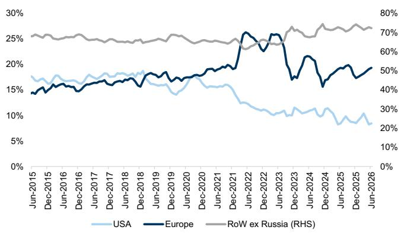  
Source: International Trade Centre, GS Global Investment Research

Exhibit 13: Pricing in China has turned more positive...
China PPI  
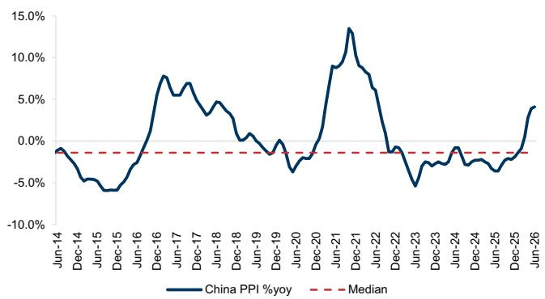  
Source: Datastream

Exhibit 14: ...but capacity utilization in manufacturing is still low
China Manufacturing Capacity Utilization  
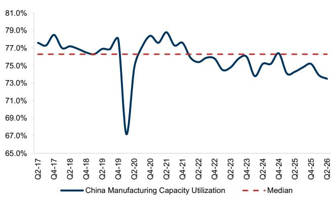  
Source: Haver Analytics

Exhibit 15: List of 43 product categories tracked and read-across companies incl. their sales exposure to divisions including those products (based on latest disclosure available)

<table><tr><td>Categories</td><td>Read across companies incl. their sales exposure</td></tr><tr><td>Air pumps</td><td>Atlas Copco (17%)</td></tr><tr><td>Aluminium wire</td><td>Prysmian (46%), Nexans (36%), NKT (15%)</td></tr><tr><td>Appliances</td><td>Electrolux (100%), SEB (100%)</td></tr><tr><td>Basins and toilets</td><td>Geberit (67%)</td></tr><tr><td>Bearings</td><td>SKF (100%)</td></tr><tr><td>Central Heating Boilers</td><td>Ariston (22%), NIBE (3%)</td></tr><tr><td>Centrifugal pumps</td><td>Atlas Copco (17%), Weir Group (36%)</td></tr><tr><td>Coffee machines</td><td>De&#x27; Longhi (70%)</td></tr><tr><td>Commercial kitchen ovens</td><td>Rational (100%)</td></tr><tr><td>Commercial vehicle engines</td><td>Daimler (100%), Traton (100%), Volvo (72%)</td></tr><tr><td>Compressors</td><td>Atlas Copco (46%)</td></tr><tr><td>Copper wire</td><td>Prysmian (46%), Nexans (51%), NKT (78%)</td></tr><tr><td>Cranes</td><td>Konecranes (100%)</td></tr><tr><td>Dairy Machinery</td><td>GEA (32%), Alfa Laval (17%)</td></tr><tr><td>Door locks</td><td>Assa Abloy (100%)</td></tr><tr><td>Doors and windows</td><td>Assa Abloy (100%)</td></tr><tr><td>Drilling tools</td><td>Epiroc (8%), Sandvik (9%)</td></tr><tr><td>Electric conductors</td><td>Prysmian (100%), Nexans (100%), NKT (100%)</td></tr><tr><td>Elevators and escalators</td><td>Kone (100%), Schindler (100%)</td></tr><tr><td>EV components</td><td></td></tr><tr><td>Excavators</td><td>CNH (16%), Sandvik (9%), Volvo (17%)</td></tr><tr><td>Fibre cable</td><td>Prysmian (8%)</td></tr><tr><td>Food equipment</td><td>GEA (27%), Alfa Laval (20%)</td></tr><tr><td>HDT</td><td>Daimler (55%), Traton (76%), Volvo (61%)</td></tr><tr><td>Heat exchangers</td><td>Alfa Laval (29%)</td></tr><tr><td>Heat pumps</td><td>NIBE (36%), Ariston (13%), Carel (8%)</td></tr><tr><td>Industrial robots</td><td></td></tr><tr><td>Interchangeable tools for hand tools, milling and turning</td><td>Sandvik (36%)</td></tr><tr><td>LCV</td><td>Traton (10%)</td></tr><tr><td>LED lighting</td><td>Signify (93%)</td></tr><tr><td>Marine engines</td><td>Wartsila (51%)</td></tr><tr><td>Medium voltage equipment</td><td>ABB (6%), Schneider Electric (13%), Siemens (12%)</td></tr><tr><td>Rail Brakes</td><td>Knorr Bremse (37%)</td></tr><tr><td>Rail</td><td>Alstom (100%), Siemens (16%)</td></tr><tr><td>Shovel loaders</td><td>CNH (16%), Volvo (17%)</td></tr><tr><td>Steel Pipes</td><td></td></tr><tr><td>Switchgear</td><td>ABB (52%), Schneider Electric (83%), Siemens (29%)</td></tr><tr><td>Tractors</td><td>CNH (68%)</td></tr><tr><td>Tungsten (powders and tools)</td><td>Sandvik (4%); Weir (2-3%); FLS (1-2%); Epiroc (&lt;1%); Metso (&lt;1%)</td></tr><tr><td>Turbochargers and superchargers</td><td>Accelleron (57%)</td></tr><tr><td>Ultrasonic scanning apparatus</td><td>Siemens (30%)</td></tr><tr><td>Vacuum pumps</td><td>Atlas Copco (22%)</td></tr><tr><td>Valves</td><td>IMI (44%), VAT Group (81%), Indutrade (14%)</td></tr><tr><td colspan="2">Note: Sales exposure as of FY25</td></tr></table>

Note: Sales exposure as of FY2025

Source: Company data, GS Global Investment Research

Exhibit 16: In the past decade, China's share of exports to the US has fallen -7.3 pp, while its share of exports to the EU has risen 2.3 pp and to Russia up 2.3 pp with RoW accounting for the remainder 2.8 pp of the gain Change of regional weight in Chinese exports in pp

<table><tr><td>Change in regional weight of Chinese exports (L12M vs FY15, pp) Ranked by largest positive change in Europe</td><td>USA</td><td>Europe</td><td>Russia</td><td>RoW ex Russia</td></tr><tr><td>Rail</td><td>-19.0</td><td>18.3</td><td>0.3</td><td>0.4</td></tr><tr><td>Shovel loaders</td><td>3.9</td><td>11.0</td><td>0.9</td><td>-15.8</td></tr><tr><td>LED lighting</td><td>17.0</td><td>10.6</td><td>0.8</td><td>-28.4</td></tr><tr><td>Ultrasonic
