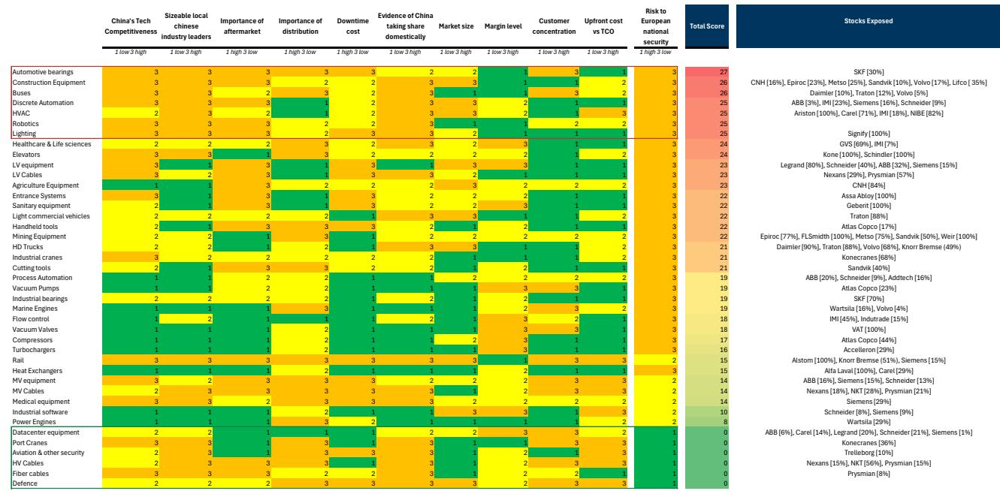
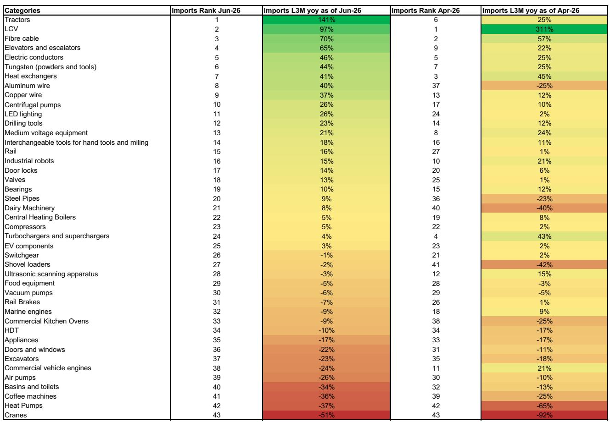
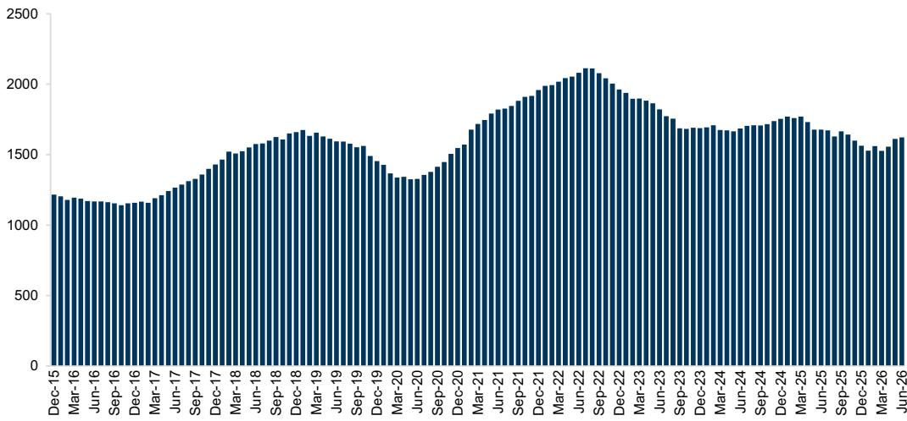

# 中国资本品出口增长正在重塑欧洲工业企业的竞争格局

欧洲资本品行业正面临一个结构性转变，这一变化已不能再被简单视为周期性或新兴市场现象。对43个产品类别的细致分析显示，中国在全球资本品出口中的份额已从2005年的7%上升至2025年的24%，增长了16个百分点；而同期欧洲的份额则从54%下降至43%。这并非渐进式的侵蚀，而是一场集中式的推进，且恰恰发生在欧洲企业历史上最具优势的产品类别中。

2026年6月的数据进一步印证了这一趋势。在追踪的类别中，中国出口的三个月滚动同比增速从5月的9.6%加快至15.4%。这种增长并非良性的广泛扩张，而是集中在与欧洲领先企业直接竞争的产品上。钨粉及工具同比增长超过100%，光纤电缆增长111%，船用发动机增长75%，热泵增长60%。这些并非大宗商品，而是欧洲企业长期享有溢价定价和技术领先地位的工程产品。

欧洲的应对措施体现在贸易防御活动中。欧盟委员会在2024年发起了33项新的贸易防御调查，是过去十年平均水平14项的两倍多，到2025年生效的最终措施可能已超过200项。这些调查涵盖移动起重机、焊丝、轮胎、钢铁产品、铜管、铝轧制产品和光纤电缆。调查数量的增加表明，竞争压力正同时波及多个子行业。

这里的论点并非欧洲资本品企业正面临迫在眉睫的崩溃，而是支撑其商业模式的战略假设——即中国在低端数量上竞争，而欧洲拥有高端技术和品牌信任——正逐季变得不再成立。专利数据清晰地表明了这一点：2025年，中国在资本品专利总量上超越欧洲，主要由电机、装置和能源专利驱动。欧洲在多个类别中仍保持领先，但趋势已十分明确。

## 欧洲最具优势的出口类别，也是中国增长最快的领域

竞争威胁并非均匀分布。它恰恰集中在欧洲相对于中国出口市场份额最高的类别中。商用车发动机、乳制品机械和铁路制动器是欧洲在全球出口市场中相对于中国拥有最大份额优势的三个类别。然而，这些也是过去五年中国份额增长最快的类别。

这一模式之所以重要，是因为它削弱了欧洲工业企业传统的防御逻辑：即其核心产品线技术过于复杂、过于依赖关系或资本密集度过高，以至于中国竞争对手难以挑战。数据表明并非如此。在最近三个月期间，中国商用车发动机出口同比增长7%，从两个月前17%的下降中恢复。中国乳制品机械出口在6月同比下降14%，但此前4月曾录得25%的增长，显示出波动性而非结构性衰退。在铁路制动器这一欧洲工程被视为顶尖的细分领域，中国出口在6月同比增长19%，而4月为下降3%。

对欧洲管理团队而言，这一含义令人不安：那些产生最高利润率和最可防御竞争地位的类别，恰恰是中国竞争对手投资最积极的领域。贸易防御措施可能会减缓市场份额流失的速度，但无法逆转背后的投资趋势。

## 中国出口增长不再局限于新兴市场；欧洲已成为直接目标

十年前，标准叙事认为中国资本品出口主要流向发展中经济体，在那里价格敏感度超过品牌偏好。这一叙事已不再得到数据支持。中国对欧洲的追踪资本品出口增长速度已超过对世界其他地区的出口，尽管其基数要低得多。

2026年6月的数据揭示了特定产品类别中中国对欧洲出口的激增。起重机同比增长超过100%。光纤电缆增长超过100%。工业机器人也显示出显著增长。与此同时，中国对欧洲出口下降最明显的类别是盆和马桶、钢管和乳制品机械。这一模式表明，中国并非简单地向欧洲倾销通用产品，而是瞄准了那些已建立起制造规模和技术能力的特定类别。

美国市场由于关税政策仍不确定，呈现出不同模式。中国对美出口增长最快的类别是钨粉及工具、光纤电缆和开关设备，均同比增长超过100%。但中国对美商用车发动机出口下降95%，铝线下降65%，起重机下降63%。美国与欧洲进口模式的差异表明，中国出口战略正在适应关税制度，而非被其抵消。

对于欧洲资本品企业而言，战略含义是它们不能仅依靠地域多元化来逃避中国竞争。竞争现已出现在它们的本土市场。

## 专利数据揭示中国正在为下一波竞争奠定技术基础

分析中最具前瞻性的指标是专利数据。中国在资本品专利总量上已超越欧洲，主要由电机、装置和能源专利驱动。在追踪的九个资本品类别中，有三个类别中国在最近十二个月期间的专利申请数量已超过2015年同期的欧洲。

专利并非商业竞争力的完美指标。许多专利从未转化为适销产品。但趋势的规模和方向难以忽视。中国在电机领域的专利活动尤其重要，因为这一类别支撑着工业设备电气化、可再生能源基础设施和更广泛的能源转型。欧洲企业已将自己定位为这些领域的领导者，但专利数据表明技术差距正在缩小。

竞争风险并非中国企业会立即生产出更优越的产品，而是它们将在欧洲企业产生大量销量和利润的中端市场缩小质量差距。当这种情况发生时，欧洲企业将面临选择：要么在价格上竞争，这会侵蚀利润率；要么进一步退守高端细分市场，这会限制增长。两种选择都不具吸引力。

## 欧洲资本品高管的决策框架

本分析中的数据可转化为战略决策的实用框架。高管应沿两个维度评估每个产品类别：该类别中中国出口的增长率，以及欧洲当前的出口市场份额水平。这形成了四个战略象限。

第一象限包括中国出口增长率高且欧洲市场份额高的类别。这些是直接受到攻击的类别。商用车发动机、乳制品机械和铁路制动器属于此类。建议的应对措施是加速对专有技术的投资，通过服务合同和售后支持深化客户关系，并在法律可行的情况下寻求贸易防御措施。这些类别的价格竞争可能会加剧，保持利润率需要非价格差异化。

第二象限包括中国出口增长率高但欧洲市场份额低的类别。这些是欧洲已失去优势的类别。LED照明、热泵和挖掘机是例子。这里的战略问题是坚守剩余阵地还是退出。如果该类别对公司的长期战略至关重要，则可能需要投资于成本降低和供应链本地化。如果不是，有管理的退出或与中国竞争对手合作可能是价值最大化的路径。

第三象限涵盖中国出口增长率低但欧洲市场份额高的类别。这些是欧洲仍占主导地位且中国威胁尚未显现的类别。工业机器人、轴承和阀门可能符合这一描述。风险在于自满。专利数据表明中国企业正在这些领域建设能力，当前出口增长的缺失并不能保证未来的安全。建议的方法是密切监测专利趋势和产能投资，并主动加强竞争护城河。

第四象限包括中国出口增长率低且欧洲市场份额也低的类别。这些是双方均未占据主导地位的类别。咖啡机、家电和门锁是例子。战略重点应是评估该类别是否独立于中国竞争而提供有吸引力的利润率和增长前景。如果是，则可能值得选择性投资。如果不是，资源分配应倾向于更具防御性的类别。

## 贸易防御应对是必要的，但还不够

欧盟委员会将贸易防御调查从每年14项增加到2024年的33项，代表了一项有意义的政策回应。到2025年生效的最终措施可能已超过200项，涵盖广泛的资本品产品。这些措施可以通过提高中国进口商品的成本并为欧洲企业提供调整时间来提供临时缓解。

但贸易防御不是战略。它是一种拖延战术。中国企业已展现出适应关税壁垒的能力，方式包括将生产转移到第三国、升级产品规格或接受较低利润率以维持市场份额。专利数据表明，竞争挑战根植于对技术和制造能力的长期投资，而非短期贸易行为。

依赖贸易保护作为主要应对措施的欧洲企业，会发现市场份额流失得更慢，但仍在流失。能够蓬勃发展的企业，是那些利用贸易措施提供的喘息空间来重组成本基础、加速创新周期并深化与客户运营整合的公司。

全球资本品市场的结构性转变并非预测。这是二十年贸易数据确立的事实。欧洲的份额下降了11个百分点。中国的份额上升了17个百分点。专利管道表明，未来十年将更像过去十年，而非回归历史常态。将这一变化视为周期性挑战或可通过关税解决的政治问题的欧洲资本品高管，正在犯战略错误。竞争是结构性的，是技术驱动的，并且已经进入他们的本土市场。

*仅供参考。部分内容可能基于源材料通过AI辅助生成、翻译、总结或编辑，可能存在遗漏或错误。请独立核实。本文不构成专业建议。*

仅供参考。部分内容可能基于源材料通过AI辅助生成、翻译、总结或编辑，可能存在遗漏或错误。请独立核实。本文不构成专业建议。

