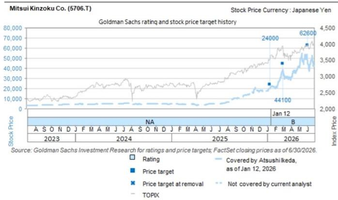
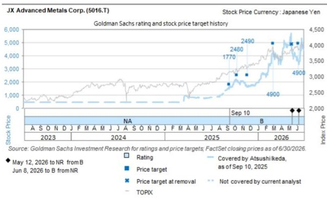
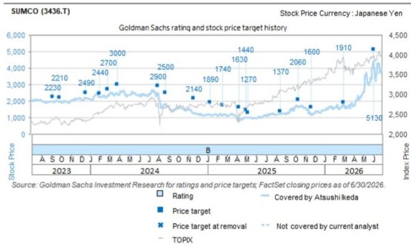

# Investor Sentiment in Japanese Electronic Materials Is Shifting from Broad AI Enthusiasm to Company-Specific Catalysts,and the Discrepancy Between Consensus Pessimism and Fundamental Reality Creates the Most Compelling Opportunities

In late July,a global investment bank research team met with approximately 55 investors across Hong Kong and Singapore over eight days to discuss Japanese chemical and materials companies. The timing was deliberate but also revealing:the third week of July was marked by high stock market volatility,driven by growing concerns over the outlook for AI demand and shifts in the competitive landscape. Yet despite the noise,investor interest in semiconductor and AI-related materials remained remarkably high. The tension between macro anxiety and micro conviction defined the conversations.

What emerged from these meetings was not a uniform view but a fragmented landscape of sentiment. For every stock that generated intense debate,there was a clear divide between what the consensus believed and what the underlying business fundamentals suggested. In several cases,the market appeared to have built a narrative that was at odds with the actual competitive dynamics,capacity timelines,and pricing power of individual companies. The stocks that attracted the most discussion were Nitto Boseki,JX Advanced Metals,Mitsui Kinzoku,SUMCO,and Resonac. All carry 报告观点s from the research team,yet the reasons for investor skepticism varied sharply across the group.

This disconnection between investor perception and company reality is not a market inefficiency to be exploited casually. It is a structural feature of how the semiconductor materials supply chain is evolving. The winners in this cycle will not be determined by which companies have the largest exposure to AI demand,but by which ones can execute on capacity expansion ahead of competitors,secure pricing power through proprietary technology,and communicate their medium-term earnings trajectory clearly enough to reset investor expectations. The following analysis examines each of these five names through the lens of where the market is wrong and what catalysts could close the gap.

## Nitto Boseki Faces a Consensus Negative Bias That Overstates Competitive Erosion in T-Glass,While Capacity Expansion Announcements and Price Revisions Could Act as Powerful Catalysts

Nitto Boseki has been one of the most polarizing names in the Japanese materials space over the past three months. The research team's impression from investor discussions was that many had been shorting or underweighting the stock,driven by a deteriorating supply-demand balance for its flagship T-glass product and what appeared to be relatively high valuations. The bearish consensus rests on a specific thesis:that new market entrants in Taiwan,Japan,and mainland China are ramping up production of both low thermal expansion glass and low dielectric glass,and that this will erode Nitto Boseki's competitive advantage.

The research team's view challenges this narrative on a critical point of timing. While new entrants are indeed investing,the actual adoption of their products has been significantly delayed. The company's competitive advantage in T-glass,according to the analysis,will remain intact for the time being. This is not a minor disagreement. If the market is pricing in a rapid erosion of market share that has not materialized and will not materialize in the near term,then the stock is discounting risk that does not yet exist. The catalysts that could force a repricing include an announcement of additional capacity expansion for T-glass,price revisions that demonstrate pricing power,and strong earnings from NER glass cloth for PCBs. Each of these would directly contradict the prevailing bearish narrative.

The implication for investors is straightforward:the consensus has built a negative bias that may be correct in the long run but is premature in its timing. The gap between perception and reality in T-glass creates a window where the stock could re-rate upward as the company delivers evidence of sustained competitive advantage.

## Mitsui Kinzoku's VSP Market Share Concerns Are Overdone,and the Market Is Ignoring MicroThin,Which Could Be the True Profit Driver

Mitsui Kinzoku presents an even starker example of investor bias. Previously,the research team had observed that many investors held a positive view of the company. During the recent meetings,however,pessimistic views were generally more prevalent. The source of concern was specific:delays in capacity expansion for VSP,combined with competitors' capacity expansions,had led investors to worry about a decline in market share.

The research team and the company itself consider these concerns overdone and far removed from reality. But what is more striking is what was not discussed. Despite the intense focus on VSP,there was almost no discussion regarding MicroThin,a product that forms the core of the copper foil business's profits. MicroThin is a category where the company holds a very high market share and could achieve high profit growth. The research team interprets this omission as evidence that investors have developed a pessimistic bias centered entirely on VSP,to the exclusion of other value drivers.

This is a classic case of the market fixating on a single data point while ignoring the broader portfolio. MicroThin's potential to generate high profit growth,combined with the company's dominant market share,suggests that even if VSP faces competitive pressure,the overall earnings trajectory could remain strong. The catalyst that could reset investor expectations is an announcement of a capacity expansion plan for VSP. But the real opportunity may lie in the market's eventual recognition of MicroThin's contribution to profits,which is currently being overlooked entirely.

## JX Advanced Metals' InP Substrate Pricing Strategy Remains the Key Unknown,and Capacity Expansion of 10x Has Not Yet Been Priced for Its Second-Pillar Potential

Investor interest in JX Advanced Metals was concentrated on InP substrates,and for good reason. The company has already announced a capacity expansion of approximately 10 times,which signals an aggressive bet on future demand. Yet the research team observed that the pricing strategy for InP substrates remains largely unknown,and a few investors expressed concerns about capacity expansions by Chinese competitors.

The critical insight here is that the market is treating InP substrates as an uncertain venture,when in fact the company's broader business already has a clear profit driver in semiconductor sputtering targets. If management provides explanations at future briefings regarding medium- to long-term earnings growth strategies,including long-term agreements,investor expectations could rise significantly. The research team expects first-quarter results to be strong,which could serve as an initial catalyst.

The strategic question is whether InP substrates can become a second pillar alongside sputtering targets. A 10x capacity expansion is not a marginal investment;it is a declaration of intent. The market is currently pricing in execution risk and competitive threat,but if the company can demonstrate pricing power through long-term agreements,the revenue and profit contribution from InP substrates could transform the investment case. The upcoming results briefing will be the first opportunity to test this thesis.

## SUMCO's 300mm Wafer Supply-Demand Tightening in 2027 Is a Real Catalyst,but Asian Investors Are Too Focused on Near-Term Inventory Overhang

SUMCO generated the most mixed views among Asian investors,in contrast to US investors who generally held positive views. The bearish case is straightforward:high inventory levels and the supply-demand gap resulting from past investments by various companies mean that wafer supply-demand conditions will take time to tighten. This makes it difficult to implement substantial price hikes in long-term agreements. A fair number of investors also expressed the view that the stock does not look undervalued from a valuation perspective.

The research team's constructive stance is based on a longer time horizon. The analysis projects that the 300mm supply-demand balance will tighten considerably in 2027,driven by the broadening of AI demand and the impact of dual-wafer usage. Price increases associated with long-term agreements are expected from 2028. This is a multi-year thesis,not a near-term trade.

The tension between Asian and US investor views highlights a fundamental question about time horizon. Asian investors,influenced by semiconductor sentiment at the time of the meetings,appear to be discounting the 2027 tightening as too distant to matter. But in a cyclical industry like semiconductor wafers,the seeds of the next upcycle are planted during the downcycle. If the research team's supply-demand model is correct,the market is currently pricing SUMCO at a level that does not reflect the tightening that is already baked into the capacity and demand trajectory. The risk is that investors wait for confirmation of tightening before re-rating the stock,by which point the most attractive entry point will have passed.

## Resonac's Consensus EPS Estimates Are Too Low by Over 20%,and a 15x P/E on 2027 Earnings Implies Significant Undervaluation for a Core AI Back-End Materials Holding

Resonac generated a notable amount of feedback suggesting that the stock does not look undervalued based on consensus estimates. The research team's analysis directly contradicts this view. For fiscal year ending December 2027,the team expects earnings to beat the consensus EPS estimate by slightly over 20%. At a P/E of around 15 times that level,the stock suggests significant undervaluation.

The rationale is not based on aggressive assumptions. Resonac covers many of the key areas in AI semiconductor back-end processes,and the potential of new packaging-related materials such as organic interposers positions it as an attractive core holding in back-end materials. The research team noted that almost no investors held concerns regarding the company's fundamentals,even though there were questions about the negative impact of glass cores on earnings. The skepticism is purely about valuation,not about business quality.

This is a critical distinction. If the consensus EPS estimates are too low by over 20%,then the current valuation multiple is being applied to an earnings base that understates the company's true earning power. A 15x P/E on depressed consensus estimates is not the same as a 15x P/E on achievable earnings. When the market eventually recognizes the earnings upside,the stock could re-rate on both higher earnings and a higher multiple. The combination of earnings beat potential and valuation discount makes Resonac one of the most asymmetric opportunities in the group.

## The Decision Framework:How to Navigate the Gap Between Sentiment and Fundamentals in Japanese Electronic Materials

For investors considering exposure to Japanese electronic materials,the findings from these investor meetings suggest a structured approach. First,identify where consensus sentiment is most negative and test whether the underlying thesis is supported by actual competitive dynamics and capacity timelines. Nitto Boseki and Mitsui Kinzoku both exhibit this pattern,where bearish narratives are either premature or incomplete. Second,focus on companies where the market is ignoring a key profit driver. Mitsui Kinzoku's MicroThin and JX Advanced Metals' InP substrates both fall into this category,offering upside that is not reflected in current valuations. Third,distinguish between near-term headwinds and medium-term catalysts. SUMCO's inventory overhang is real,but the 2027 tightening is a structural shift that the market is not pricing. Fourth,verify whether consensus earnings estimates are achievable or too conservative. Resonac's 20% earnings beat potential suggests that the valuation floor is lower than it appears.

The common thread across all five names is that the market is systematically underestimating the pricing power and competitive durability of Japanese electronic materials companies. This is not a coincidence. The semiconductor supply chain is undergoing a structural transformation as AI demand broadens and dual-wafer usage becomes more common. Companies that can execute on capacity expansion,maintain proprietary technology advantages,and secure long-term agreements will emerge stronger. The current volatility,driven by macro concerns and short-term sentiment,has created a disconnect that will likely close as catalysts materialize. The investors who can look past the consensus bias and focus on the underlying fundamentals will be best positioned to capture the re-rating.

*For informational purposes only. Portions may be generated,translated,summarized,or edited with AI assistance based on source materials and may contain omissions or errors. Please verify independently. This is not investment,legal,tax,accounting,or other professional advice.*

For informational purposes only. Portions may be generated,translated,summarized,or edited with AI assistance based on source materials and may contain omissions or errors. Please verify independently. This is not investment,legal,tax,accounting,or other professional advice.
