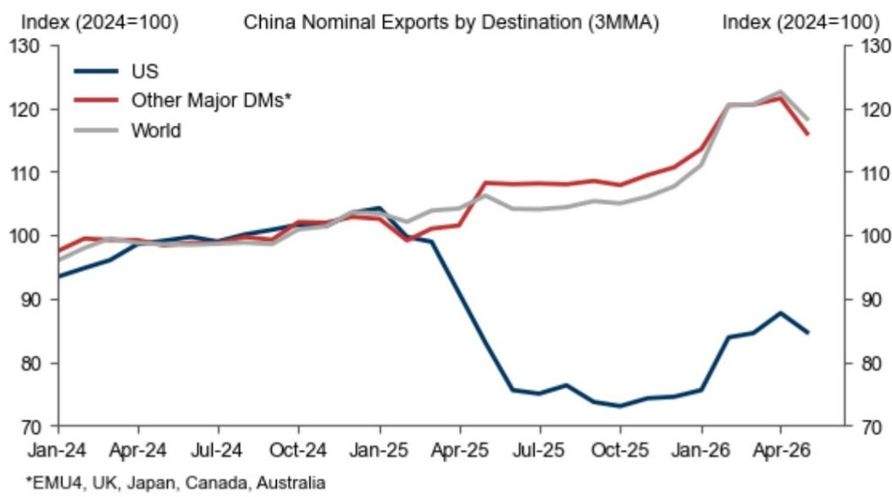
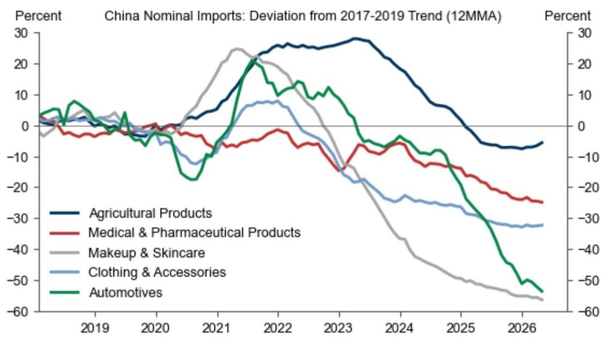
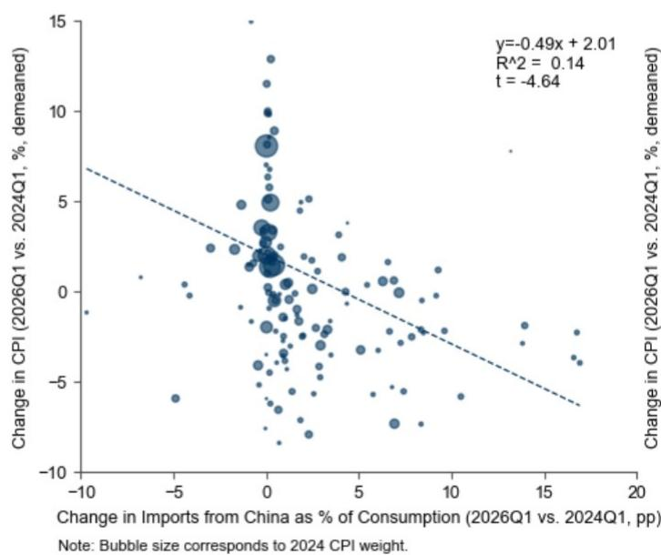
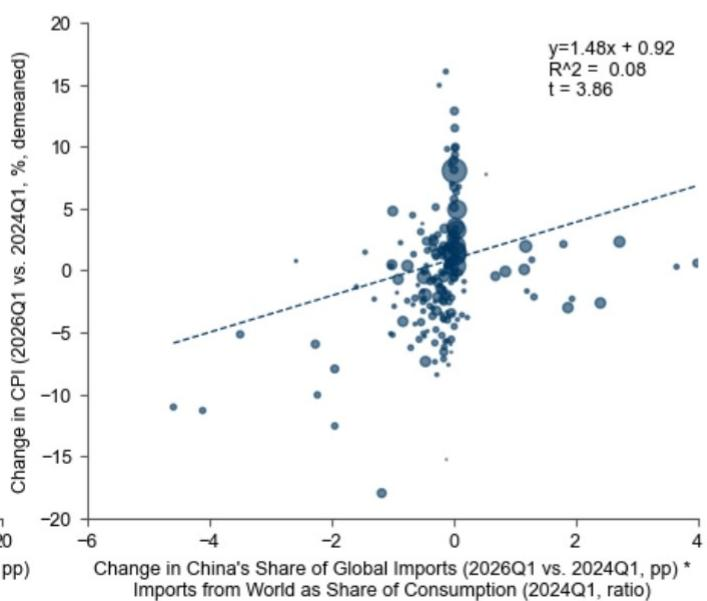

# 全球宏观观察：中国出口增长与进口变化对全球价格的影响

自疫情以来，中国对非美国发达市场的出口增长迅速，这既反映了贸易流向从美国的重新分配，也体现了整体出口的强劲表现。与此同时，在提升自给自足能力的推动下，中国从世界其他地区的进口有所回落。在本篇全球宏观观察中，我们将探讨这些贸易格局变化如何影响价格水平。

利用统一的跨国贸易-价格关联数据，我们发现，自2024年以来，中国对其他国家的出口每增加1个百分点（占接收国总消费的比重），商品价格将下降0.5%。平均而言，我们估计这一渠道迄今已使非美国发达市场的商品价格降低了0.6%。

使用同一组数据，我们发现，对于一个完全依赖进口的国家-产品组合，中国在该产品全球进口中的份额每下降1个百分点，价格将下降1.3%。这一渠道意味着对已实现商品价格产生约0.1%的温和额外影响。

综合来看，我们的分析表明，过去两年中，这些动态变化已使非美国发达市场的商品价格降低了0.7%——对应发达市场年度整体和核心价格水平0.1-0.2个百分点的拖累——其中日本（1.1%）和欧元区（1.0%）的影响更大。我们预计这些影响将持续累积，既因为已实现的贸易变化需要时间完全传导至消费价格，也因为我们的中国研究团队预计经常账户盈余将继续扩大。

## 中国出口增长、进口变化与全球价格走势

自疫情以来，中国对非美国发达市场的出口增长迅速，而中国从世界其他地区的进口则在提升自给自足能力的推动下有所回落。我们此前曾指出，中国商品供应的增加应对发达市场产生显著的价格下行影响，尤其是在欧洲（正如我们的欧洲研究团队所强调的）。在本篇全球宏观观察中，我们将探讨这些贸易格局变化迄今如何影响价格水平。

图表1显示，自2024年以来，中国对非美国发达市场的名义出口增长了约20%，而对美国的出口则在持续的贸易紧张局势中大幅下降。虽然对其它发达市场出口增长的一部分可能反映了贸易重新分配，但尽管美国需求回落，整体出口增长依然强劲。

图表1：尽管美国需求回落，中国总出口仍快速增长  
  
来源：Haver Analytics，GS全球投资研究

除了中国出口的快速增长外，中国从其他国家的进口在多种产品上均低于疫情前趋势（图表2），这反映了中国政策制定者持续推动提升自给自足能力。

图表2：中国进口增长低于疫情前趋势  
  
来源：Haver Analytics，GS全球投资研究

这些贸易变化应通过两个渠道对发达市场价格产生下行影响。首先，中国出口增加应直接增加供应并降低接收国的消费价格。其次，中国对世界其他地区进口需求的降低应释放全球商品市场的供应，提供额外的价格下行影响。我们此前对文献的回顾表明，平均而言，外国商品供应每增加1%（占国内商品总需求的比重），消费价格将下降0.8%。

为评估这些动态迄今已发挥多大作用，我们构建了一个将价格与贸易数据联系起来的跨国数据。我们分两步将6位协调制度（HS）级别的贸易数据映射到3位COICOP（按目的划分的个人消费分类）级别的商品价格类别。首先，我们使用联合国统计司（UNSD）的转换表将贸易数据转换为欧盟统计局（Eurostat）的按活动划分的产品分类（CPA）。其次，我们应用欧盟统计局的衔接矩阵将CPA级别的进口分配到COICOP消费类别。在不按COICOP报告价格数据的国家，我们使用最接近的可用类比构建统一的价格衡量指标。

利用这一数据，我们通过将中国进口渗透率（定义为中国出口占接收国总消费的比重）与今年第一季度已报告详细贸易数据的主要非美国经济体的价格联系起来，量化第一个渠道的影响。图表3左侧的汇总散点图（控制了国家固定效应）显示，中国进口渗透率与商品价格之间存在负相关且统计显著的关系。2024年第一季度至2026年第一季度期间，中国进口渗透率每增加1个百分点，同期价格将下降0.5%。

我们使用同一组数据估算第二个渠道。这次我们关注的变量是中国对特定产品的进口需求变化（占全球进口需求的百分比）与发达市场国家-产品层面的全球进口敞口（占总消费的比重）之间的交互作用。图表3右侧显示，大多数国家-产品组合的中国全球进口需求份额变化（按总体进口敞口缩放）较小且略微为负。然而，较大的变化通常已转化为直观的价格变动，国外进口需求与其他主要经济体价格之间存在正相关且统计显著的关系。汇总散点图中的斜率系数表明，对于一个完全依赖进口的国家-产品组合，中国全球进口需求份额每下降1个百分点，价格将下降1.3%。

图表3：中国出口增加和进口减少均与发达市场价格下降相关  

  
来源：UN Comtrade，UNSD，Eurostat，Haver Analytics，GS全球投资研究

将汇总回归结果与已实现的贸易数据相结合表明，过去两年中，中国贸易格局的变化平均使商品价格降低了0.7%（图表4），对应发达市场年度整体和核心价格水平0.1-0.2个百分点的拖累。影响主要来自中国出口增加，平均使商品价格降低0.6%，而中国进口减少带来约0.1%的温和额外影响。影响在欧元区最大（1.0%），主要因为中国进口渗透率在欧洲市场更高；在日本（1.1%），中国对日本进口需求的减弱产生了稍大的影响。相比之下，加拿大的影响较小（0.2%），因为中国进口渗透率上升幅度较小。

图表4：过去两年中，中国贸易格局变化使非美国发达市场价格降低0.7%

  
来源：GS全球投资研究

我们预计这些影响将持续累积，既因为已实现的贸易变化可能尚未完全反映在消费价格中，也因为我们的中国研究团队预计经常账户盈余将继续扩大。尽管我们对价格前景相对温和的主要判断依据是国内供需大体平衡，但这些中国贸易动态是另一个原因，表明主要发达市场的价格水平在未来几年很可能回归接近目标水平。
